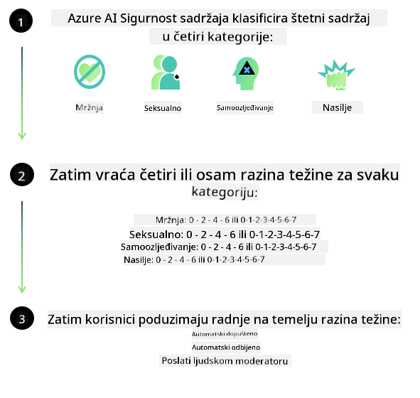

<!--
CO_OP_TRANSLATOR_METADATA:
{
  "original_hash": "c8273672cc57df2be675407a1383aaf0",
  "translation_date": "2025-07-16T17:54:05+00:00",
  "source_file": "md/01.Introduction/01/01.AISafety.md",
  "language_code": "hr"
}
-->
# Sigurnost AI-ja za Phi modele  
Obitelj Phi modela razvijena je u skladu s [Microsoft Responsible AI Standard](https://query.prod.cms.rt.microsoft.com/cms/api/am/binary/RE5cmFl), što je skup zahtjeva na razini cijele tvrtke temeljen na sljedećih šest načela: odgovornost, transparentnost, pravičnost, pouzdanost i sigurnost, privatnost i sigurnost te uključivost, koji čine [Microsoftova načela odgovornog AI-ja](https://www.microsoft.com/ai/responsible-ai).

Kao i kod prethodnih Phi modela, usvojen je višeslojni pristup procjeni sigurnosti i sigurnosnoj obradi nakon treniranja, uz dodatne mjere koje uzimaju u obzir višelingvalne sposobnosti ovog izdanja. Naš pristup treniranju sigurnosti i evaluacijama, uključujući testiranje na više jezika i u različitim kategorijama rizika, opisan je u [Phi Safety Post-Training Paper](https://arxiv.org/abs/2407.13833). Iako Phi modeli imaju koristi od ovog pristupa, programeri bi trebali primjenjivati najbolje prakse odgovornog AI-ja, uključujući mapiranje, mjerenje i ublažavanje rizika povezanih s njihovim specifičnim slučajem uporabe te kulturnim i jezičnim kontekstom.

## Najbolje prakse

Kao i drugi modeli, obitelj Phi modela može se potencijalno ponašati na načine koji su nepravedni, nepouzdani ili uvredljivi.

Neki od ograničavajućih ponašanja SLM i LLM modela na koja treba obratiti pažnju uključuju:

- **Kvaliteta usluge:** Phi modeli su primarno trenirani na tekstu na engleskom jeziku. Jezici osim engleskog imat će lošije performanse. Varijante engleskog jezika koje su slabije zastupljene u podacima za treniranje mogu imati lošije rezultate u usporedbi sa standardnim američkim engleskim.
- **Predstavljanje šteta i održavanje stereotipa:** Ovi modeli mogu prekomjerno ili nedovoljno predstavljati određene skupine ljudi, izbrisati zastupljenost nekih skupina ili ojačati ponižavajuće ili negativne stereotipe. Unatoč sigurnosnoj obradi nakon treniranja, ove ograničenosti mogu i dalje postojati zbog različitih razina zastupljenosti različitih skupina ili učestalosti primjera negativnih stereotipa u podacima za treniranje koji odražavaju stvarne obrasce i društvene pristranosti.
- **Neprimjereni ili uvredljivi sadržaj:** Ovi modeli mogu generirati i druge vrste neprimjerenog ili uvredljivog sadržaja, što može učiniti njihovu primjenu neprimjerenom u osjetljivim kontekstima bez dodatnih mjera ublažavanja specifičnih za slučaj uporabe.
- **Pouzdanost informacija:** Jezični modeli mogu generirati besmislene sadržaje ili izmišljati informacije koje mogu zvučati uvjerljivo, ali su netočne ili zastarjele.
- **Ograničen opseg za kod:** Većina podataka za treniranje Phi-3 modela temelji se na Pythonu i koristi uobičajene pakete poput "typing, math, random, collections, datetime, itertools". Ako model generira Python skripte koje koriste druge pakete ili skripte na drugim jezicima, snažno preporučujemo korisnicima da ručno provjere sve upotrebe API-ja.

Programeri bi trebali primjenjivati najbolje prakse odgovornog AI-ja i odgovorni su za osiguravanje da specifični slučaj uporabe bude u skladu s relevantnim zakonima i propisima (npr. privatnost, trgovina itd.).

## Razmatranja odgovornog AI-ja

Kao i drugi jezični modeli, Phi serija modela može se potencijalno ponašati na načine koji su nepravedni, nepouzdani ili uvredljivi. Neki od ograničavajućih ponašanja na koja treba obratiti pažnju uključuju:

**Kvaliteta usluge:** Phi modeli su primarno trenirani na tekstu na engleskom jeziku. Jezici osim engleskog imat će lošije performanse. Varijante engleskog jezika koje su slabije zastupljene u podacima za treniranje mogu imati lošije rezultate u usporedbi sa standardnim američkim engleskim.

**Predstavljanje šteta i održavanje stereotipa:** Ovi modeli mogu prekomjerno ili nedovoljno predstavljati određene skupine ljudi, izbrisati zastupljenost nekih skupina ili ojačati ponižavajuće ili negativne stereotipe. Unatoč sigurnosnoj obradi nakon treniranja, ove ograničenosti mogu i dalje postojati zbog različitih razina zastupljenosti različitih skupina ili učestalosti primjera negativnih stereotipa u podacima za treniranje koji odražavaju stvarne obrasce i društvene pristranosti.

**Neprimjereni ili uvredljivi sadržaj:** Ovi modeli mogu generirati i druge vrste neprimjerenog ili uvredljivog sadržaja, što može učiniti njihovu primjenu neprimjerenom u osjetljivim kontekstima bez dodatnih mjera ublažavanja specifičnih za slučaj uporabe.  
Pouzdanost informacija: Jezični modeli mogu generirati besmislene sadržaje ili izmišljati informacije koje mogu zvučati uvjerljivo, ali su netočne ili zastarjele.

**Ograničen opseg za kod:** Većina podataka za treniranje Phi-3 modela temelji se na Pythonu i koristi uobičajene pakete poput "typing, math, random, collections, datetime, itertools". Ako model generira Python skripte koje koriste druge pakete ili skripte na drugim jezicima, snažno preporučujemo korisnicima da ručno provjere sve upotrebe API-ja.

Programeri bi trebali primjenjivati najbolje prakse odgovornog AI-ja i odgovorni su za osiguravanje da specifični slučaj uporabe bude u skladu s relevantnim zakonima i propisima (npr. privatnost, trgovina itd.). Važna područja za razmatranje uključuju:

**Dodjela:** Modeli možda nisu prikladni za scenarije koji bi mogli imati značajan utjecaj na pravni status ili dodjelu resursa ili životnih prilika (npr. stanovanje, zapošljavanje, kredit itd.) bez dodatnih procjena i tehnika uklanjanja pristranosti.

**Scenariji visokog rizika:** Programeri bi trebali procijeniti prikladnost korištenja modela u scenarijima visokog rizika gdje nepravedni, nepouzdani ili uvredljivi rezultati mogu biti iznimno skupi ili dovesti do štete. To uključuje davanje savjeta u osjetljivim ili stručnim područjima gdje su točnost i pouzdanost ključni (npr. pravni ili zdravstveni savjeti). Dodatne mjere zaštite trebaju se implementirati na razini aplikacije prema kontekstu primjene.

**Dezinformacije:** Modeli mogu proizvoditi netočne informacije. Programeri bi trebali slijediti najbolje prakse transparentnosti i obavijestiti krajnje korisnike da komuniciraju s AI sustavom. Na razini aplikacije, programeri mogu izgraditi mehanizme povratnih informacija i procese za utemeljenje odgovora na specifične, kontekstualne informacije slučaja uporabe, tehniku poznatu kao Retrieval Augmented Generation (RAG).

**Generiranje štetnog sadržaja:** Programeri bi trebali procijeniti rezultate u njihovom kontekstu i koristiti dostupne sigurnosne klasifikatore ili prilagođena rješenja prikladna za njihov slučaj uporabe.

**Nepravilna uporaba:** Moguće su i druge vrste zloupotrebe poput prijevara, neželjene pošte ili proizvodnje zlonamjernog softvera, te programeri trebaju osigurati da njihove aplikacije ne krše važeće zakone i propise.

### Fino podešavanje i sigurnost AI sadržaja

Nakon fino podešavanja modela, toplo preporučujemo korištenje mjera [Azure AI Content Safety](https://learn.microsoft.com/azure/ai-services/content-safety/overview) za nadzor sadržaja koji modeli generiraju, prepoznavanje i blokiranje potencijalnih rizika, prijetnji i problema s kvalitetom.

[Azure AI Content Safety](https://learn.microsoft.com/azure/ai-services/content-safety/overview) podržava i tekstualni i slikovni sadržaj. Može se implementirati u oblaku, u izoliranim kontejnerima te na edge/ugrađenim uređajima.

## Pregled Azure AI Content Safety

Azure AI Content Safety nije rješenje koje odgovara svima; može se prilagoditi kako bi se uskladilo s politikama pojedinih tvrtki. Osim toga, njegovi višelingvalni modeli omogućuju razumijevanje više jezika istovremeno.

- **Azure AI Content Safety**  
- **Microsoft Developer**  
- **5 videa**

Azure AI Content Safety servis detektira štetni sadržaj generiran od strane korisnika i AI-ja u aplikacijama i uslugama. Uključuje tekstualne i slikovne API-je koji omogućuju prepoznavanje štetnog ili neprimjerenog materijala.

[AI Content Safety Playlist](https://www.youtube.com/playlist?list=PLlrxD0HtieHjaQ9bJjyp1T7FeCbmVcPkQ)

**Odricanje od odgovornosti**:  
Ovaj dokument je preveden korištenjem AI usluge za prevođenje [Co-op Translator](https://github.com/Azure/co-op-translator). Iako težimo točnosti, imajte na umu da automatski prijevodi mogu sadržavati pogreške ili netočnosti. Izvorni dokument na izvornom jeziku treba smatrati autoritativnim izvorom. Za kritične informacije preporučuje se profesionalni ljudski prijevod. Ne snosimo odgovornost za bilo kakva nesporazuma ili pogrešna tumačenja koja proizlaze iz korištenja ovog prijevoda.