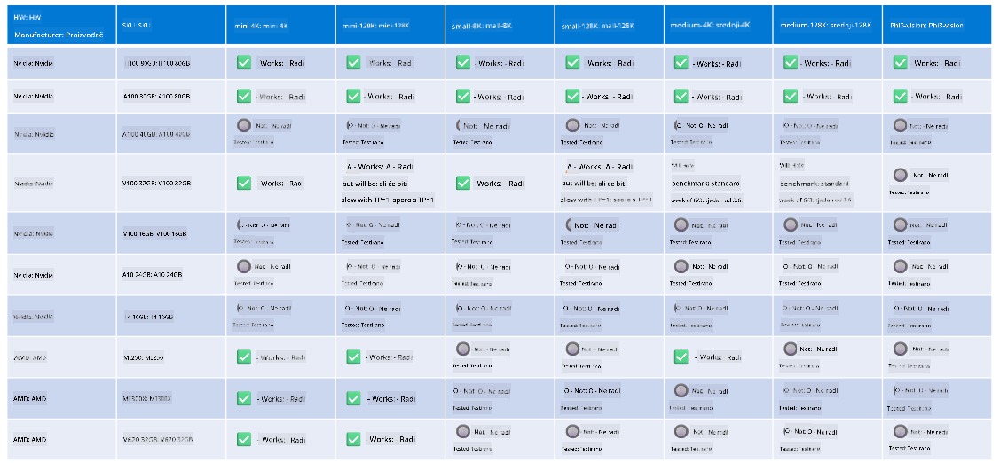

<!--
CO_OP_TRANSLATOR_METADATA:
{
  "original_hash": "8cdc17ce0f10535da30b53d23fe1a795",
  "translation_date": "2025-05-09T07:54:43+00:00",
  "source_file": "md/01.Introduction/01/01.Hardwaresupport.md",
  "language_code": "hr"
}
-->
# Phi Hardverska Podrška

Microsoft Phi je optimiziran za ONNX Runtime i podržava Windows DirectML. Dobro radi na različitim vrstama hardvera, uključujući GPU-ove, CPU-ove pa čak i mobilne uređaje.

## Hardver uređaja  
Konkretno, podržani hardver uključuje:

- GPU SKU: RTX 4090 (DirectML)  
- GPU SKU: 1 A100 80GB (CUDA)  
- CPU SKU: Standard F64s v2 (64 vCPU-a, 128 GiB memorije)

## Mobilni SKU

- Android - Samsung Galaxy S21  
- Apple iPhone 14 ili noviji s A16/A17 procesorom

## Specifikacija Phi hardvera

- Minimalna potrebna konfiguracija.  
- Windows: GPU s podrškom za DirectX 12 i najmanje 4GB ukupne RAM memorije

CUDA: NVIDIA GPU s Compute Capability >= 7.02



## Pokretanje onnxruntime na više GPU-ova

Trenutno dostupni Phi ONNX modeli podržavaju samo 1 GPU. Moguće je podržati multi-GPU za Phi model, ali ORT s 2 GPU-a ne jamči da će imati veću propusnost u odnosu na 2 instance ort-a. Za najnovije informacije pogledajte [ONNX Runtime](https://onnxruntime.ai/).

Na [Build 2024 the GenAI ONNX Team](https://youtu.be/WLW4SE8M9i8?si=EtG04UwDvcjunyfC) najavili su da su omogućili multi-instance umjesto multi-GPU za Phi modele.

Trenutno vam to omogućuje pokretanje jedne onnxruntime ili onnxruntime-genai instance s varijablom okruženja CUDA_VISIBLE_DEVICES na sljedeći način.

```Python
CUDA_VISIBLE_DEVICES=0 python infer.py
CUDA_VISIBLE_DEVICES=1 python infer.py
```

Slobodno istražite Phi dalje na [Azure AI Foundry](https://ai.azure.com)

**Odricanje od odgovornosti**:  
Ovaj dokument preveden je pomoću AI prevoditeljskog servisa [Co-op Translator](https://github.com/Azure/co-op-translator). Iako nastojimo postići točnost, imajte na umu da automatski prijevodi mogu sadržavati pogreške ili netočnosti. Izvorni dokument na izvornom jeziku treba smatrati autoritativnim izvorom. Za važne informacije preporučuje se profesionalni ljudski prijevod. Ne odgovaramo za bilo kakve nesporazume ili pogrešna tumačenja koja proizlaze iz korištenja ovog prijevoda.