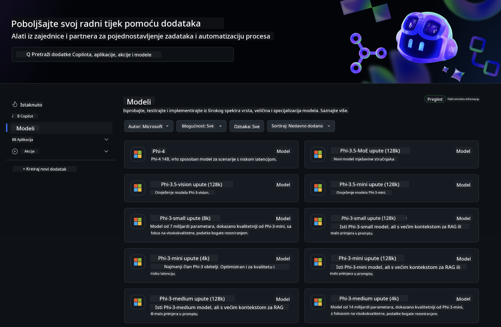
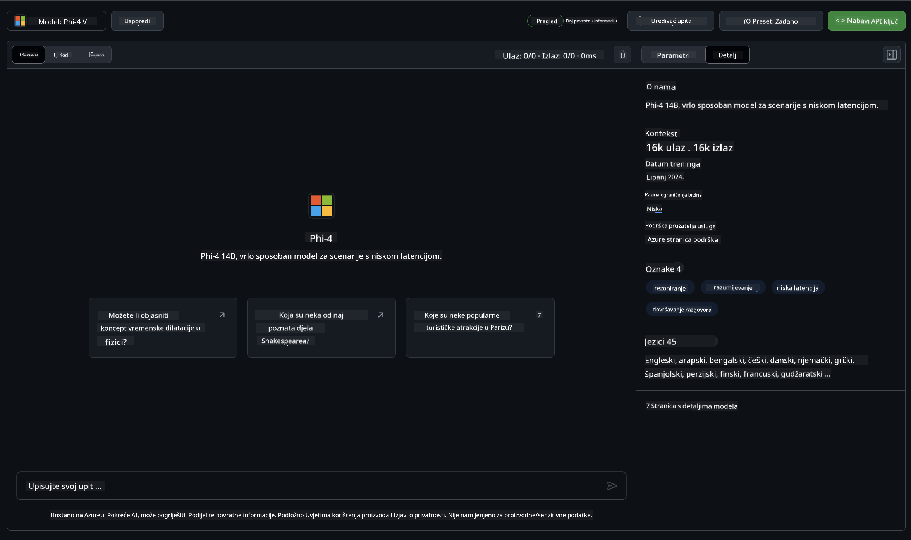
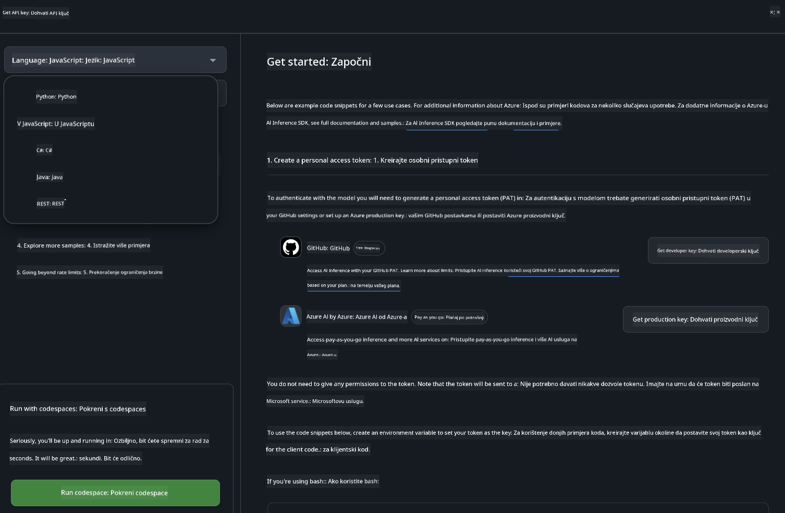
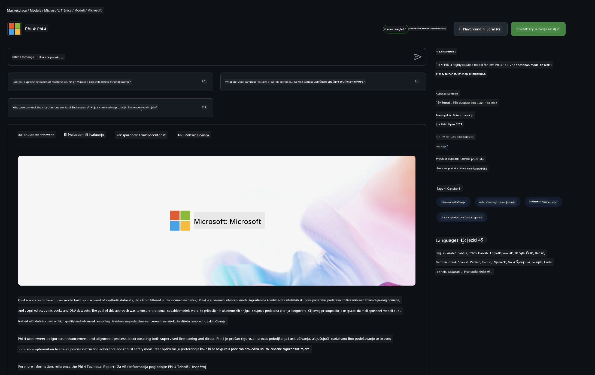

<!--
CO_OP_TRANSLATOR_METADATA:
{
  "original_hash": "fb67a08b9fc911a10ed58081fadef416",
  "translation_date": "2025-05-09T09:01:09+00:00",
  "source_file": "md/01.Introduction/02/02.GitHubModel.md",
  "language_code": "hr"
}
-->
## Phi obitelj u GitHub Models

Dobrodošli u [GitHub Models](https://github.com/marketplace/models)! Sve je spremno i čekamo da istražite AI modele smještene na Azure AI.



Za više informacija o modelima dostupnim na GitHub Models, pogledajte [GitHub Model Marketplace](https://github.com/marketplace/models)

## Dostupni modeli

Svaki model ima svoj prostor za isprobavanje i primjere koda



### Phi obitelj u GitHub Model katalogu

- [Phi-4](https://github.com/marketplace/models/azureml/Phi-4)

- [Phi-3.5-MoE instruct (128k)](https://github.com/marketplace/models/azureml/Phi-3-5-MoE-instruct)

- [Phi-3.5-vision instruct (128k)](https://github.com/marketplace/models/azureml/Phi-3-5-vision-instruct)

- [Phi-3.5-mini instruct (128k)](https://github.com/marketplace/models/azureml/Phi-3-5-mini-instruct)

- [Phi-3-Medium-128k-Instruct](https://github.com/marketplace/models/azureml/Phi-3-medium-128k-instruct)

- [Phi-3-medium-4k-instruct](https://github.com/marketplace/models/azureml/Phi-3-medium-4k-instruct)

- [Phi-3-mini-128k-instruct](https://github.com/marketplace/models/azureml/Phi-3-mini-128k-instruct)

- [Phi-3-mini-4k-instruct](https://github.com/marketplace/models/azureml/Phi-3-mini-4k-instruct)

- [Phi-3-small-128k-instruct](https://github.com/marketplace/models/azureml/Phi-3-small-128k-instruct)

- [Phi-3-small-8k-instruct](https://github.com/marketplace/models/azureml/Phi-3-small-8k-instruct)

## Početak rada

Postoji nekoliko osnovnih primjera spremnih za pokretanje. Možete ih pronaći u direktoriju samples. Ako želite odmah prijeći na svoj omiljeni jezik, primjere možete pronaći u sljedećim jezicima:

- Python
- JavaScript
- C#
- Java
- cURL

Također postoji posvećeno Codespaces okruženje za pokretanje primjera i modela.



## Primjer koda

Ispod su primjeri koda za nekoliko slučajeva upotrebe. Za dodatne informacije o Azure AI Inference SDK, pogledajte kompletnu dokumentaciju i primjere.

## Postavljanje

1. Kreirajte osobni pristupni token  
Ne morate davati nikakve posebne dozvole tokenu. Imajte na umu da će token biti poslan Microsoftovoj usluzi.

Za korištenje donjih primjera koda, kreirajte varijablu okruženja i postavite svoj token kao ključ za klijentski kod.

Ako koristite bash:  
```
export GITHUB_TOKEN="<your-github-token-goes-here>"
```  
Ako koristite powershell:  

```
$Env:GITHUB_TOKEN="<your-github-token-goes-here>"
```

Ako koristite Windows command prompt:  

```
set GITHUB_TOKEN=<your-github-token-goes-here>
```

## Python primjer

### Instalirajte ovisnosti  
Instalirajte Azure AI Inference SDK koristeći pip (potrebno: Python >=3.8):

```
pip install azure-ai-inference
```  
### Pokrenite osnovni primjer koda

Ovaj primjer pokazuje osnovni poziv chat completion API-ja. Koristi GitHub AI model inference endpoint i vaš GitHub token. Poziv je sinkron.

```python
import os
from azure.ai.inference import ChatCompletionsClient
from azure.ai.inference.models import SystemMessage, UserMessage
from azure.core.credentials import AzureKeyCredential

endpoint = "https://models.inference.ai.azure.com"
model_name = "Phi-4"
token = os.environ["GITHUB_TOKEN"]

client = ChatCompletionsClient(
    endpoint=endpoint,
    credential=AzureKeyCredential(token),
)

response = client.complete(
    messages=[
        UserMessage(content="I have $20,000 in my savings account, where I receive a 4% profit per year and payments twice a year. Can you please tell me how long it will take for me to become a millionaire? Also, can you please explain the math step by step as if you were explaining it to an uneducated person?"),
    ],
    temperature=0.4,
    top_p=1.0,
    max_tokens=2048,
    model=model_name
)

print(response.choices[0].message.content)
```

### Pokrenite višekratni razgovor

Ovaj primjer pokazuje višekratni razgovor s chat completion API-jem. Kada koristite model za chat aplikaciju, trebate upravljati poviješću razgovora i slati najnovije poruke modelu.

```
import os
from azure.ai.inference import ChatCompletionsClient
from azure.ai.inference.models import AssistantMessage, SystemMessage, UserMessage
from azure.core.credentials import AzureKeyCredential

token = os.environ["GITHUB_TOKEN"]
endpoint = "https://models.inference.ai.azure.com"
# Replace Model_Name
model_name = "Phi-4"

client = ChatCompletionsClient(
    endpoint=endpoint,
    credential=AzureKeyCredential(token),
)

messages = [
    SystemMessage(content="You are a helpful assistant."),
    UserMessage(content="What is the capital of France?"),
    AssistantMessage(content="The capital of France is Paris."),
    UserMessage(content="What about Spain?"),
]

response = client.complete(messages=messages, model=model_name)

print(response.choices[0].message.content)
```

### Strimirajte izlaz

Za bolje korisničko iskustvo, poželjet ćete strimirati odgovor modela tako da se prvi token pojavi što prije i izbjegnete čekanje na duge odgovore.

```
import os
from azure.ai.inference import ChatCompletionsClient
from azure.ai.inference.models import SystemMessage, UserMessage
from azure.core.credentials import AzureKeyCredential

token = os.environ["GITHUB_TOKEN"]
endpoint = "https://models.inference.ai.azure.com"
# Replace Model_Name
model_name = "Phi-4"

client = ChatCompletionsClient(
    endpoint=endpoint,
    credential=AzureKeyCredential(token),
)

response = client.complete(
    stream=True,
    messages=[
        SystemMessage(content="You are a helpful assistant."),
        UserMessage(content="Give me 5 good reasons why I should exercise every day."),
    ],
    model=model_name,
)

for update in response:
    if update.choices:
        print(update.choices[0].delta.content or "", end="")

client.close()
```

## BESPLATNA upotreba i ograničenja za GitHub Models



[Ograničenja brzine za playground i besplatnu upotrebu API-ja](https://docs.github.com/en/github-models/prototyping-with-ai-models#rate-limits) namijenjena su da vam pomognu eksperimentirati s modelima i prototipirati vašu AI aplikaciju. Za korištenje izvan tih ograničenja, i za skaliranje vaše aplikacije, morate osigurati resurse iz Azure računa i autentificirati se preko njega umjesto preko vašeg GitHub osobnog pristupnog tokena. Ne morate mijenjati ništa drugo u svom kodu. Koristite ovaj link da saznate kako prijeći besplatna ograničenja u Azure AI.

### Napomene

Imajte na umu da kada komunicirate s modelom, eksperimentirate s AI, pa su moguće pogreške u sadržaju.

Funkcionalnost podliježe različitim ograničenjima (uključujući zahtjeve po minuti, zahtjeve po danu, tokene po zahtjevu i istovremene zahtjeve) i nije namijenjena za produkcijsku upotrebu.

GitHub Models koristi Azure AI Content Safety. Ti filtri se ne mogu isključiti kao dio iskustva GitHub Models. Ako odlučite koristiti modele putem plaćene usluge, molimo vas da konfigurirate svoje filtre sadržaja prema vašim potrebama.

Ova usluga je podložna GitHub Pre-release uvjetima.

**Odricanje od odgovornosti**:  
Ovaj dokument je preveden pomoću AI usluge za prevođenje [Co-op Translator](https://github.com/Azure/co-op-translator). Iako težimo točnosti, imajte na umu da automatski prijevodi mogu sadržavati pogreške ili netočnosti. Izvorni dokument na izvornom jeziku treba smatrati autoritativnim izvorom. Za važne informacije preporučuje se profesionalni ljudski prijevod. Nismo odgovorni za bilo kakva nesporazuma ili pogrešna tumačenja koja proizlaze iz korištenja ovog prijevoda.