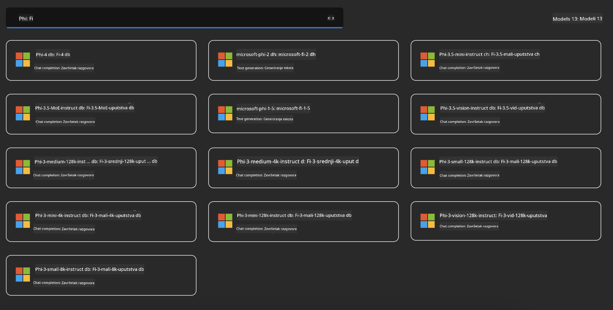
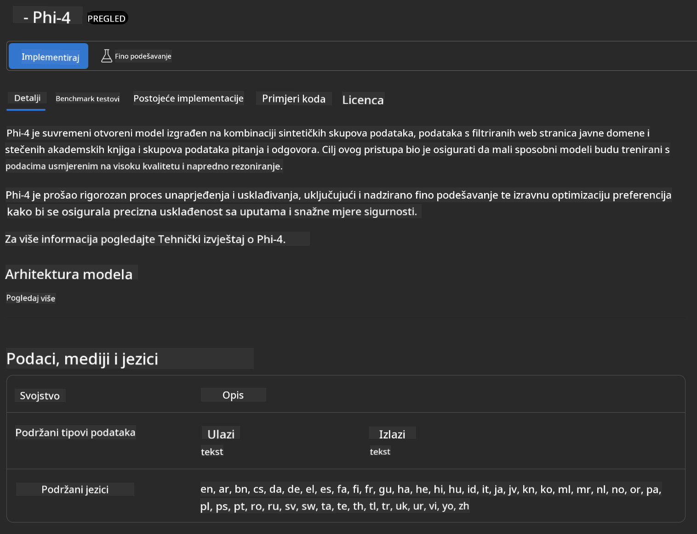
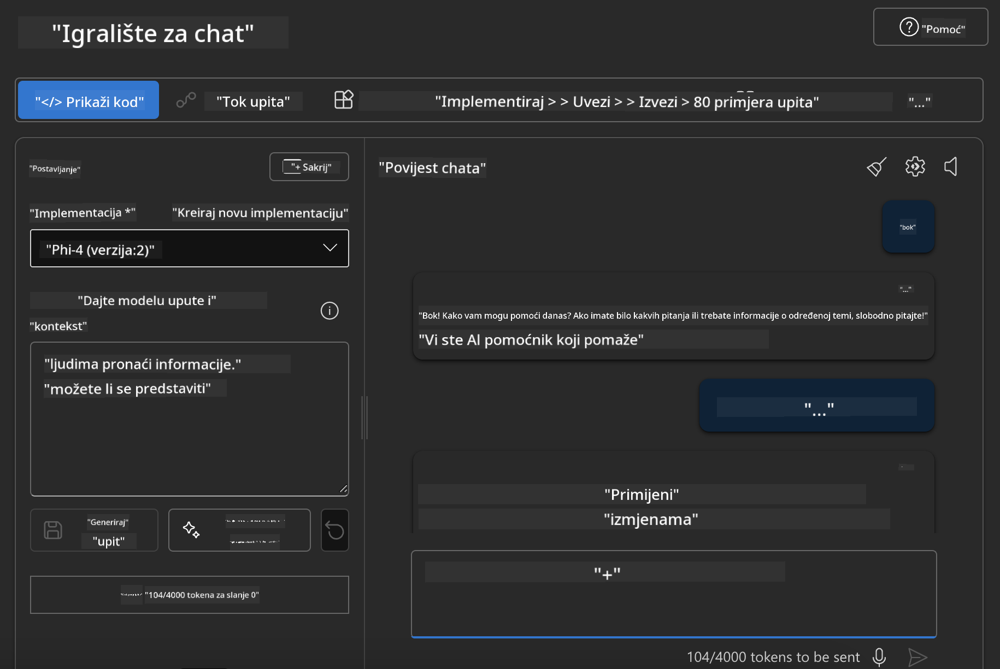

<!--
CO_OP_TRANSLATOR_METADATA:
{
  "original_hash": "3ae21dc5554e888defbe57946ee995ee",
  "translation_date": "2025-05-09T09:10:40+00:00",
  "source_file": "md/01.Introduction/02/03.AzureAIFoundry.md",
  "language_code": "hr"
}
-->
## Phi Family u Azure AI Foundry

[Azure AI Foundry](https://ai.azure.com) je pouzdana platforma koja omogućuje developerima da potiču inovacije i oblikuju budućnost s AI-jem na siguran, zaštićen i odgovoran način.

[Azure AI Foundry](https://ai.azure.com) je dizajnirana za developere kako bi:

- Izgradili generativne AI aplikacije na platformi razine poduzeća.
- Istraživali, gradili, testirali i implementirali koristeći najsuvremenije AI alate i ML modele, utemeljene na odgovornim AI praksama.
- Suradnja s timom tijekom cijelog životnog ciklusa razvoja aplikacije.

Uz Azure AI Foundry, možete istražiti širok spektar modela, usluga i mogućnosti te započeti izgradnju AI aplikacija koje najbolje odgovaraju vašim ciljevima. Platforma Azure AI Foundry olakšava skalabilnost za pretvaranje prototipova u potpuno funkcionalne proizvodne aplikacije. Kontinuirano praćenje i usavršavanje podržavaju dugoročni uspjeh.


Osim korištenja Azure AOAI Service u Azure AI Foundry, također možete koristiti modele trećih strana u Azure AI Foundry Model Catalogu. Ovo je dobar izbor ako želite koristiti Azure AI Foundry kao svoju AI platformu za rješenja.

Modeli Phi Family se mogu brzo implementirati putem Model Cataloga u Azure AI Foundry

[Microsoft Phi Models in Azure AI Foundry Models](https://ai.azure.com/explore/models/?selectedCollection=phi)



### **Implementacija Phi-4 u Azure AI Foundry**



### **Testiranje Phi-4 u Azure AI Foundry Playground**



### **Pokretanje Python koda za pozivanje Azure AI Foundry Phi-4**

```python

import os  
import base64
from openai import AzureOpenAI  
from azure.identity import DefaultAzureCredential, get_bearer_token_provider  
        
endpoint = os.getenv("ENDPOINT_URL", "Your Azure AOAI Service Endpoint")  
deployment = os.getenv("DEPLOYMENT_NAME", "Phi-4")  
      
token_provider = get_bearer_token_provider(  
    DefaultAzureCredential(),  
    "https://cognitiveservices.azure.com/.default"  
)  
  
client = AzureOpenAI(  
    azure_endpoint=endpoint,  
    azure_ad_token_provider=token_provider,  
    api_version="2024-05-01-preview",  
)  
  

chat_prompt = [
    {
        "role": "system",
        "content": "You are an AI assistant that helps people find information."
    },
    {
        "role": "user",
        "content": "can you introduce yourself"
    }
] 
    
# Include speech result if speech is enabled  
messages = chat_prompt 

completion = client.chat.completions.create(  
    model=deployment,  
    messages=messages,
    max_tokens=800,  
    temperature=0.7,  
    top_p=0.95,  
    frequency_penalty=0,  
    presence_penalty=0,
    stop=None,  
    stream=False  
)  
  
print(completion.to_json())  

```

**Odricanje od odgovornosti**:  
Ovaj dokument preveden je pomoću AI prevodilačke usluge [Co-op Translator](https://github.com/Azure/co-op-translator). Iako nastojimo osigurati točnost, imajte na umu da automatski prijevodi mogu sadržavati pogreške ili netočnosti. Izvorni dokument na izvornom jeziku treba smatrati službenim i autoritativnim izvorom. Za važne informacije preporučuje se profesionalni ljudski prijevod. Ne snosimo odgovornost za bilo kakva nesporazuma ili kriva tumačenja koja proizlaze iz korištenja ovog prijevoda.