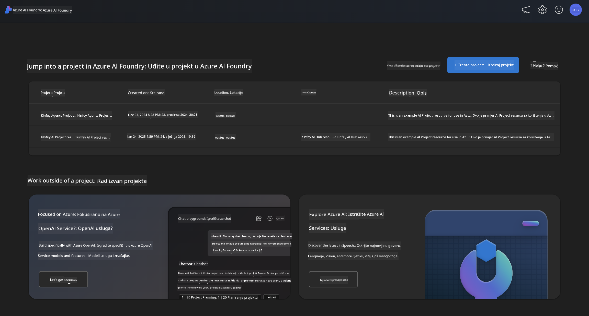
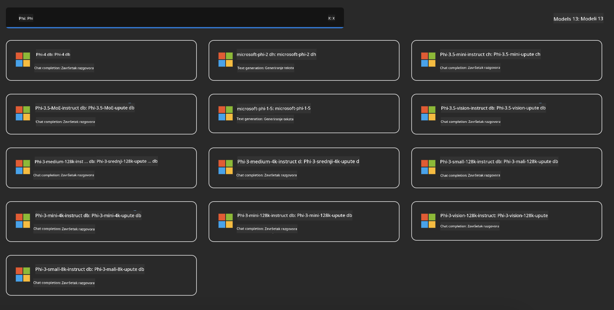
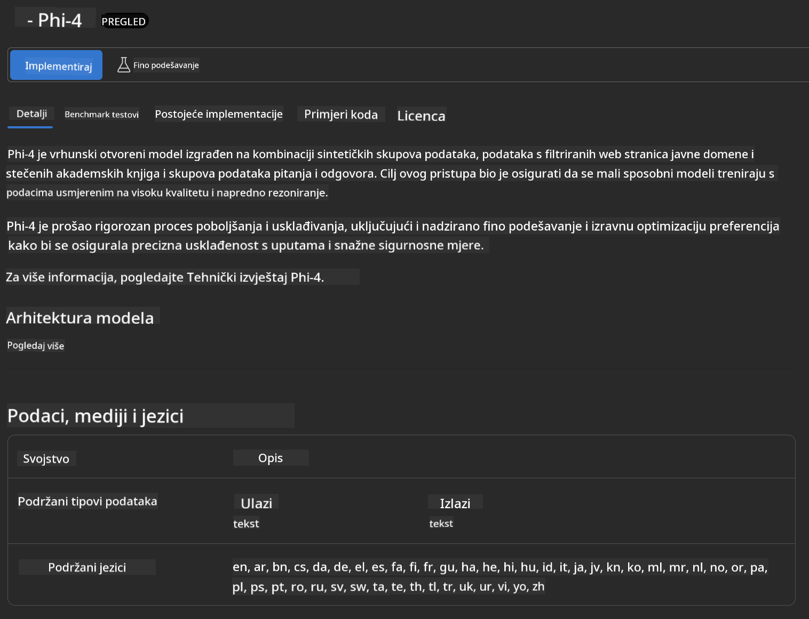
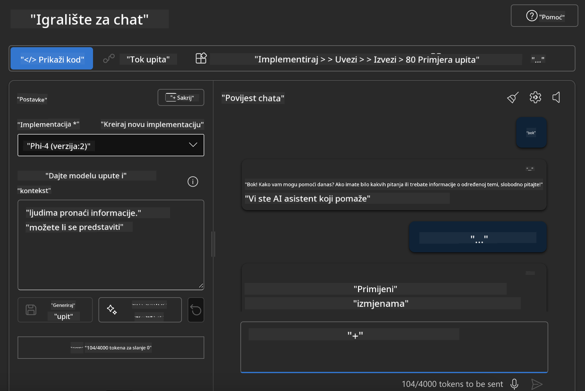

<!--
CO_OP_TRANSLATOR_METADATA:
{
  "original_hash": "3ae21dc5554e888defbe57946ee995ee",
  "translation_date": "2025-07-16T19:11:35+00:00",
  "source_file": "md/01.Introduction/02/03.AzureAIFoundry.md",
  "language_code": "hr"
}
-->
## Phi obitelj u Azure AI Foundry

[Azure AI Foundry](https://ai.azure.com) je pouzdana platforma koja omogućuje programerima da potiču inovacije i oblikuju budućnost s AI na siguran, zaštićen i odgovoran način.

[Azure AI Foundry](https://ai.azure.com) je dizajniran za programere kako bi:

- Izgradili generativne AI aplikacije na platformi razine poduzeća.
- Istraživali, gradili, testirali i implementirali koristeći najnovije AI alate i ML modele, utemeljene na odgovornim AI praksama.
- Suradnjom s timom upravljali cijelim životnim ciklusom razvoja aplikacija.

Uz Azure AI Foundry možete istražiti širok spektar modela, usluga i mogućnosti te započeti s izradom AI aplikacija koje najbolje odgovaraju vašim ciljevima. Platforma Azure AI Foundry olakšava skalabilnost za pretvaranje prototipova u potpuno funkcionalne proizvodne aplikacije. Kontinuirano praćenje i usavršavanje podržavaju dugoročni uspjeh.



Osim korištenja Azure AOAI Service u Azure AI Foundry, možete koristiti i modele trećih strana iz Azure AI Foundry Model Cataloga. Ovo je dobar izbor ako želite koristiti Azure AI Foundry kao svoju AI platformu za rješenja.

Modeli Phi obitelji se brzo mogu implementirati putem Model Cataloga u Azure AI Foundry

[Microsoft Phi Models u Azure AI Foundry Models](https://ai.azure.com/explore/models/?selectedCollection=phi)



### **Implementacija Phi-4 u Azure AI Foundry**



### **Testiranje Phi-4 u Azure AI Foundry Playground**



### **Pokretanje Python koda za pozivanje Azure AI Foundry Phi-4**

```python

import os  
import base64
from openai import AzureOpenAI  
from azure.identity import DefaultAzureCredential, get_bearer_token_provider  
        
endpoint = os.getenv("ENDPOINT_URL", "Your Azure AOAI Service Endpoint")  
deployment = os.getenv("DEPLOYMENT_NAME", "Phi-4")  
      
token_provider = get_bearer_token_provider(  
    DefaultAzureCredential(),  
    "https://cognitiveservices.azure.com/.default"  
)  
  
client = AzureOpenAI(  
    azure_endpoint=endpoint,  
    azure_ad_token_provider=token_provider,  
    api_version="2024-05-01-preview",  
)  
  

chat_prompt = [
    {
        "role": "system",
        "content": "You are an AI assistant that helps people find information."
    },
    {
        "role": "user",
        "content": "can you introduce yourself"
    }
] 
    
# Include speech result if speech is enabled  
messages = chat_prompt 

completion = client.chat.completions.create(  
    model=deployment,  
    messages=messages,
    max_tokens=800,  
    temperature=0.7,  
    top_p=0.95,  
    frequency_penalty=0,  
    presence_penalty=0,
    stop=None,  
    stream=False  
)  
  
print(completion.to_json())  

```

**Odricanje od odgovornosti**:  
Ovaj dokument je preveden korištenjem AI usluge za prevođenje [Co-op Translator](https://github.com/Azure/co-op-translator). Iako težimo točnosti, imajte na umu da automatski prijevodi mogu sadržavati pogreške ili netočnosti. Izvorni dokument na izvornom jeziku treba smatrati autoritativnim izvorom. Za kritične informacije preporučuje se profesionalni ljudski prijevod. Ne snosimo odgovornost za bilo kakva nesporazume ili pogrešna tumačenja koja proizlaze iz korištenja ovog prijevoda.