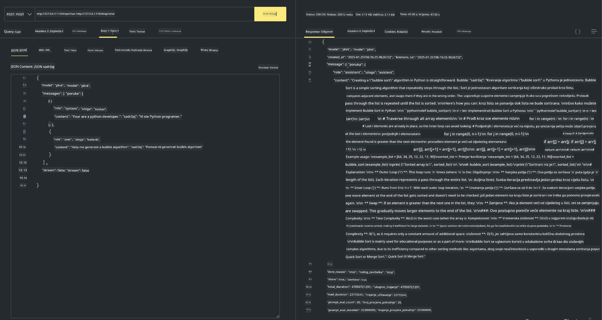

<!--
CO_OP_TRANSLATOR_METADATA:
{
  "original_hash": "2aa35f3c8b437fd5dc9995d53909d495",
  "translation_date": "2025-12-21T13:55:40+00:00",
  "source_file": "md/01.Introduction/02/04.Ollama.md",
  "language_code": "hr"
}
-->
## Phi obitelj u Ollama


[Ollama](https://ollama.com) omogućuje većem broju ljudi izravno postavljanje open source LLM-ova ili SLM-ova putem jednostavnih skripti, a također može graditi API-je za potporu lokalnim scenarijima aplikacije Copilot.

## **1. Instalacija**

Ollama podržava rad na Windowsu, macOS-u i Linuxu. Možete instalirati Ollama putem ovog linka ([https://ollama.com/download](https://ollama.com/download)). Nakon uspješne instalacije možete izravno koristiti Ollama skriptu za pozivanje Phi-3 iz terminalskog prozora. Možete vidjeti sve [dostupne knjižnice u Ollama](https://ollama.com/library). Ako otvorite ovaj repozitorij u Codespaceu, već će imati instaliran Ollama.

```bash

ollama run phi4

```

> [!NOTE]
> Model će se prvo preuzeti kada ga pokrenete prvi put. Naravno, možete također izravno navesti već preuzeti Phi-4 model. Kao primjer koristimo WSL za izvršavanje naredbe. Nakon što je model uspješno preuzet, možete komunicirati izravno u terminalu.


## **2. Pozivanje phi-4 API-ja iz Ollama**

Ako želite pozvati Phi-4 API kojeg generira Ollama, možete upotrijebiti ovu naredbu u terminalu za pokretanje Ollama poslužitelja.

```bash

ollama serve

```

> [!NOTE]
> Ako pokrećete macOS ili Linux, imajte na umu da se može pojaviti sljedeća pogreška **"Error: listen tcp 127.0.0.1:11434: bind: address already in use"**. Možete dobiti ovu pogrešku prilikom pokretanja naredbe. Možete je ili ignorirati, budući da obično znači da poslužitelj već radi, ili možete zaustaviti i ponovno pokrenuti Ollama:

**macOS**

```bash

brew services restart ollama

```

**Linux**

```bash

sudo systemctl stop ollama

```

Ollama podržava dva API-ja: generate i chat. Možete pozvati API modela koji pruža Ollama prema vašim potrebama slanjem zahtjeva lokalnoj usluzi koja radi na portu 11434.

**Chat**

```bash

curl http://127.0.0.1:11434/api/chat -d '{
  "model": "phi3",
  "messages": [
    {
      "role": "system",
      "content": "Your are a python developer."
    },
    {
      "role": "user",
      "content": "Help me generate a bubble algorithm"
    }
  ],
  "stream": false
  
}'
```

Ovo je rezultat u Postmanu



## Dodatni resursi

Provjerite popis dostupnih modela u Ollama u [njihovoj knjižnici](https://ollama.com/library).

Preuzmite svoj model s Ollama poslužitelja koristeći ovu naredbu

```bash
ollama pull phi4
```

Pokrenite model koristeći ovu naredbu

```bash
ollama run phi4
```

***Napomena:*** Posjetite ovaj link [https://github.com/ollama/ollama/blob/main/docs/api.md](https://github.com/ollama/ollama/blob/main/docs/api.md) da biste saznali više

## Pozivanje Ollama iz Pythona

Možete koristiti `requests` ili `urllib3` za slanje zahtjeva na lokalne krajnje točke poslužitelja korištene gore. Međutim, popularan način korištenja Ollame u Pythonu je putem SDK-a [openai](https://pypi.org/project/openai/), budući da Ollama također pruža OpenAI-kompatibilne krajnje točke poslužitelja.

Evo primjera za phi3-mini:

```python
import openai

client = openai.OpenAI(
    base_url="http://localhost:11434/v1",
    api_key="nokeyneeded",
)

response = client.chat.completions.create(
    model="phi4",
    temperature=0.7,
    n=1,
    messages=[
        {"role": "system", "content": "You are a helpful assistant."},
        {"role": "user", "content": "Write a haiku about a hungry cat"},
    ],
)

print("Response:")
print(response.choices[0].message.content)
```

## Pozivanje Ollama iz JavaScripta

```javascript
// Primjer sažimanja datoteke pomoću Phi-4
script({
    model: "ollama:phi4",
    title: "Summarize with Phi-4",
    system: ["system"],
})

// Primjer sažimanja
const file = def("FILE", env.files)
$`Summarize ${file} in a single paragraph.`
```

## Pozivanje Ollama iz C#

Stvorite novu C# Console aplikaciju i dodajte sljedeći NuGet paket:

```bash
dotnet add package Microsoft.SemanticKernel --version 1.34.0
```

Zatim zamijenite ovaj kod u datoteci `Program.cs`

```csharp
using Microsoft.SemanticKernel;
using Microsoft.SemanticKernel.ChatCompletion;

// add chat completion service using the local ollama server endpoint
#pragma warning disable SKEXP0001, SKEXP0003, SKEXP0010, SKEXP0011, SKEXP0050, SKEXP0052
builder.AddOpenAIChatCompletion(
    modelId: "phi4",
    endpoint: new Uri("http://localhost:11434/"),
    apiKey: "non required");

// invoke a simple prompt to the chat service
string prompt = "Write a joke about kittens";
var response = await kernel.InvokePromptAsync(prompt);
Console.WriteLine(response.GetValue<string>());
```

Pokrenite aplikaciju s naredbom:

```bash
dotnet run
```

---

<!-- CO-OP TRANSLATOR DISCLAIMER START -->
Odricanje:
Ovaj dokument preveden je pomoću usluge AI prevođenja Co-op Translator (https://github.com/Azure/co-op-translator). Iako težimo točnosti, imajte na umu da automatizirani prijevodi mogu sadržavati pogreške ili netočnosti. Izvorni dokument na izvornom jeziku treba smatrati autoritativnim izvorom. Za kritične informacije preporučuje se profesionalni prijevod od strane ljudskog prevoditelja. Ne snosimo odgovornost za bilo kakve nesporazume ili pogrešna tumačenja koja proizlaze iz korištenja ovog prijevoda.
<!-- CO-OP TRANSLATOR DISCLAIMER END -->