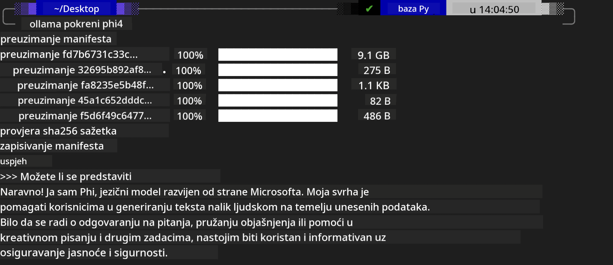

<!--
CO_OP_TRANSLATOR_METADATA:
{
  "original_hash": "0b38834693bb497f96bf53f0d941f9a1",
  "translation_date": "2025-07-16T19:19:24+00:00",
  "source_file": "md/01.Introduction/02/04.Ollama.md",
  "language_code": "hr"
}
-->
## Phi obitelj u Ollama

[Ollama](https://ollama.com) omogućuje većem broju ljudi da izravno pokreću open source LLM ili SLM putem jednostavnih skripti, a također može izgraditi API-je za podršku lokalnim Copilot aplikacijama.

## **1. Instalacija**

Ollama podržava rad na Windows, macOS i Linux operativnim sustavima. Ollama možete instalirati putem ovog linka ([https://ollama.com/download](https://ollama.com/download)). Nakon uspješne instalacije, možete izravno koristiti Ollama skriptu za pozivanje Phi-3 modela kroz terminal. Sve [dostupne biblioteke u Ollama](https://ollama.com/library) možete vidjeti na navedenoj poveznici. Ako otvorite ovaj repozitorij u Codespace-u, Ollama će već biti instaliran.

```bash

ollama run phi4

```

> [!NOTE]
> Model će se prvo preuzeti prilikom prvog pokretanja. Naravno, možete i izravno specificirati već preuzeti Phi-4 model. Kao primjer koristimo WSL za pokretanje naredbe. Nakon što se model uspješno preuzme, možete odmah komunicirati putem terminala.



## **2. Pozivanje phi-4 API-ja iz Ollama**

Ako želite pozvati Phi-4 API generiran od strane Ollama, u terminalu možete koristiti ovu naredbu za pokretanje Ollama servera.

```bash

ollama serve

```

> [!NOTE]
> Ako koristite MacOS ili Linux, imajte na umu da se može pojaviti sljedeća greška **"Error: listen tcp 127.0.0.1:11434: bind: address already in use"**. Ovu grešku možete dobiti prilikom pokretanja naredbe. Možete je zanemariti jer obično znači da server već radi, ili možete zaustaviti i ponovno pokrenuti Ollama:

**macOS**

```bash

brew services restart ollama

```

**Linux**

```bash

sudo systemctl stop ollama

```

Ollama podržava dva API-ja: generate i chat. Model API koji Ollama pruža možete pozivati prema svojim potrebama, slanjem zahtjeva lokalnoj usluzi koja radi na portu 11434.

**Chat**

```bash

curl http://127.0.0.1:11434/api/chat -d '{
  "model": "phi3",
  "messages": [
    {
      "role": "system",
      "content": "Your are a python developer."
    },
    {
      "role": "user",
      "content": "Help me generate a bubble algorithm"
    }
  ],
  "stream": false
  
}'

This is the result in Postman


## Additional Resources

Check the list of available models in Ollama in [their library](https://ollama.com/library).

Pull your model from the Ollama server using this command

```bash
ollama pull phi4
```

Run the model using this command

```bash
ollama run phi4
```

***Note:*** Visit this link [https://github.com/ollama/ollama/blob/main/docs/api.md](https://github.com/ollama/ollama/blob/main/docs/api.md) to learn more

## Calling Ollama from Python

You can use `requests` or `urllib3` to make requests to the local server endpoints used above. However, a popular way to use Ollama in Python is via the [openai](https://pypi.org/project/openai/) SDK, since Ollama provides OpenAI-compatible server endpoints as well.

Here is an example for phi3-mini:

```python
import openai

client = openai.OpenAI(
    base_url="http://localhost:11434/v1",
    api_key="nokeyneeded",
)

response = client.chat.completions.create(
    model="phi4",
    temperature=0.7,
    n=1,
    messages=[
        {"role": "system", "content": "You are a helpful assistant."},
        {"role": "user", "content": "Write a haiku about a hungry cat"},
    ],
)

print("Response:")
print(response.choices[0].message.content)
```

## Calling Ollama from JavaScript 

```javascript
// Primjer sažetka datoteke s Phi-4
script({
    model: "ollama:phi4",
    title: "Sažetak s Phi-4",
    system: ["system"],
})

// Primjer sažetka
const file = def("FILE", env.files)
$`Summarize ${file} in a single paragraph.`
```

## Calling Ollama from C#

Create a new C# Console application and add the following NuGet package:

```bash
dotnet add package Microsoft.SemanticKernel --version 1.34.0
```

Then replace this code in the `Program.cs` file

```csharp
using Microsoft.SemanticKernel;
using Microsoft.SemanticKernel.ChatCompletion;

// dodavanje chat completion servisa koristeći lokalni Ollama server endpoint
#pragma warning disable SKEXP0001, SKEXP0003, SKEXP0010, SKEXP0011, SKEXP0050, SKEXP0052
builder.AddOpenAIChatCompletion(
    modelId: "phi4",
    endpoint: new Uri("http://localhost:11434/"),
    apiKey: "non required");

// pozivanje jednostavnog prompta chat servisu
string prompt = "Write a joke about kittens";
var response = await kernel.InvokePromptAsync(prompt);
Console.WriteLine(response.GetValue<string>());
```

Run the app with the command:

```bash
dotnet run


**Odricanje od odgovornosti**:  
Ovaj dokument je preveden korištenjem AI usluge za prevođenje [Co-op Translator](https://github.com/Azure/co-op-translator). Iako težimo točnosti, imajte na umu da automatski prijevodi mogu sadržavati pogreške ili netočnosti. Izvorni dokument na izvornom jeziku treba smatrati autoritativnim izvorom. Za kritične informacije preporučuje se profesionalni ljudski prijevod. Ne snosimo odgovornost za bilo kakva nesporazume ili pogrešna tumačenja koja proizlaze iz korištenja ovog prijevoda.