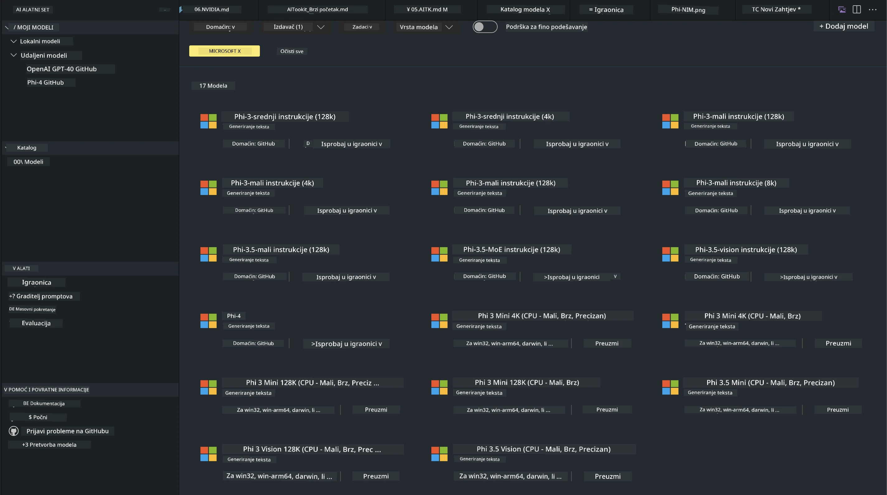
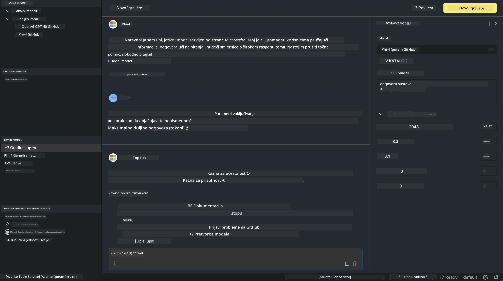

# Phi obitelj u AITK

[AI Toolkit za VS Code](https://marketplace.visualstudio.com/items?itemName=ms-windows-ai-studio.windows-ai-studio) pojednostavljuje razvoj generativnih AI aplikacija okupljajući najnovije alate i modele za razvoj AI-ja iz Azure AI Foundry kataloga i drugih kataloga poput Hugging Face. Moći ćete pregledavati katalog AI modela koji pokreću GitHub modeli i Azure AI Foundry modeli, preuzimati ih lokalno ili na daljinu, fino podešavati, testirati i koristiti u svojoj aplikaciji.

AI Toolkit Preview radi lokalno. Lokalno izvođenje ili fino podešavanje, ovisno o odabranom modelu, može zahtijevati GPU poput NVIDIA CUDA GPU-a. Također možete izravno pokretati GitHub modele putem AITK-a.

## Početak rada

[Saznajte više o instalaciji Windows subsistema za Linux](https://learn.microsoft.com/windows/wsl/install?WT.mc_id=aiml-137032-kinfeylo)

i [promjeni zadane distribucije](https://learn.microsoft.com/windows/wsl/install#change-the-default-linux-distribution-installed).

[AI Toolkit GitHub repozitorij](https://github.com/microsoft/vscode-ai-toolkit/)

- Windows, Linux, macOS

- Za fino podešavanje na Windows i Linux sustavima potreban vam je Nvidia GPU. Osim toga, **Windows** zahtijeva Windows subsistem za Linux s Ubuntu distribucijom 18.4 ili novijom. [Saznajte više o instalaciji Windows subsistema za Linux](https://learn.microsoft.com/windows/wsl/install) i [promjeni zadane distribucije](https://learn.microsoft.com/windows/wsl/install#change-the-default-linux-distribution-installed).

### Instalacija AI Toolkita

AI Toolkit dolazi kao [Visual Studio Code ekstenzija](https://code.visualstudio.com/docs/setup/additional-components#_vs-code-extensions), stoga prvo trebate instalirati [VS Code](https://code.visualstudio.com/docs/setup/windows?WT.mc_id=aiml-137032-kinfeylo) i preuzeti AI Toolkit s [VS Marketplacea](https://marketplace.visualstudio.com/items?itemName=ms-windows-ai-studio.windows-ai-studio).  
[AI Toolkit je dostupan u Visual Studio Marketplaceu](https://marketplace.visualstudio.com/items?itemName=ms-windows-ai-studio.windows-ai-studio) i može se instalirati kao i svaka druga VS Code ekstenzija.

Ako niste upoznati s instalacijom VS Code ekstenzija, slijedite ove korake:

### Prijava

1. U Activity Baru u VS Code-u odaberite **Extensions**  
1. U traku za pretraživanje ekstenzija upišite "AI Toolkit"  
1. Odaberite "AI Toolkit for Visual Studio code"  
1. Kliknite **Install**

Sada ste spremni za korištenje ekstenzije!

Bit ćete upitani da se prijavite na GitHub, stoga kliknite "Allow" za nastavak. Bit ćete preusmjereni na GitHub stranicu za prijavu.

Prijavite se i slijedite korake procesa. Nakon uspješne prijave bit ćete vraćeni u VS Code.

Nakon instalacije ekstenzije vidjet ćete AI Toolkit ikonu u Activity Baru.

Istražimo dostupne opcije!

### Dostupne opcije

Glavni bočni izbornik AI Toolkita organiziran je u  

- **Models**  
- **Resources**  
- **Playground**  
- **Fine-tuning**  
- **Evaluation**

Dostupni su u odjeljku Resources. Za početak odaberite **Model Catalog**.

### Preuzimanje modela iz kataloga

Nakon pokretanja AI Toolkita iz VS Code bočne trake, možete odabrati sljedeće opcije:



- Pronađite podržani model u **Model Catalog** i preuzmite ga lokalno  
- Testirajte izvođenje modela u **Model Playground**  
- Fino podesite model lokalno ili na daljinu u **Model Fine-tuning**  
- Postavite fino podešene modele u oblak putem naredbenog palete AI Toolkita  
- Evaluacija modela

> [!NOTE]
>
> **GPU vs CPU**
>
> Primijetit ćete da kartice modela prikazuju veličinu modela, platformu i tip akceleratora (CPU, GPU). Za optimalne performanse na **Windows uređajima koji imaju barem jedan GPU**, odaberite verzije modela koje su namijenjene samo za Windows.
>
> Time osiguravate da imate model optimiziran za DirectML akcelerator.
>
> Imena modela su u formatu
>
> - `{model_name}-{accelerator}-{quantization}-{format}`.
>
>Da biste provjerili imate li GPU na svom Windows uređaju, otvorite **Task Manager** i zatim odaberite karticu **Performance**. Ako imate GPU(e), bit će navedeni pod imenima poput "GPU 0" ili "GPU 1".

### Pokretanje modela u playgroundu

Nakon što su svi parametri postavljeni, kliknite **Generate Project**.

Kad se model preuzme, odaberite **Load in Playground** na kartici modela u katalogu:

- Pokrenite preuzimanje modela  
- Instalirajte sve preduvjete i ovisnosti  
- Kreirajte VS Code radni prostor



### Korištenje REST API-ja u vašoj aplikaciji

AI Toolkit dolazi s lokalnim REST API web serverom **na portu 5272** koji koristi [OpenAI chat completions format](https://platform.openai.com/docs/api-reference/chat/create).

To vam omogućuje testiranje aplikacije lokalno bez oslanjanja na uslugu AI modela u oblaku. Na primjer, sljedeća JSON datoteka prikazuje kako konfigurirati tijelo zahtjeva:

```json
{
    "model": "Phi-4",
    "messages": [
        {
            "role": "user",
            "content": "what is the golden ratio?"
        }
    ],
    "temperature": 0.7,
    "top_p": 1,
    "top_k": 10,
    "max_tokens": 100,
    "stream": true
}
```

REST API možete testirati pomoću (na primjer) [Postman](https://www.postman.com/) ili CURL (Client URL) alata:

```bash
curl -vX POST http://127.0.0.1:5272/v1/chat/completions -H 'Content-Type: application/json' -d @body.json
```

### Korištenje OpenAI klijentske biblioteke za Python

```python
from openai import OpenAI

client = OpenAI(
    base_url="http://127.0.0.1:5272/v1/", 
    api_key="x" # required for the API but not used
)

chat_completion = client.chat.completions.create(
    messages=[
        {
            "role": "user",
            "content": "what is the golden ratio?",
        }
    ],
    model="Phi-4",
)

print(chat_completion.choices[0].message.content)
```

### Korištenje Azure OpenAI klijentske biblioteke za .NET

Dodajte [Azure OpenAI klijentsku biblioteku za .NET](https://www.nuget.org/packages/Azure.AI.OpenAI/) u svoj projekt putem NuGet-a:

```bash
dotnet add {project_name} package Azure.AI.OpenAI --version 1.0.0-beta.17
```

Dodajte C# datoteku nazvanu **OverridePolicy.cs** u svoj projekt i zalijepite sljedeći kod:

```csharp
// OverridePolicy.cs
using Azure.Core.Pipeline;
using Azure.Core;

internal partial class OverrideRequestUriPolicy(Uri overrideUri)
    : HttpPipelineSynchronousPolicy
{
    private readonly Uri _overrideUri = overrideUri;

    public override void OnSendingRequest(HttpMessage message)
    {
        message.Request.Uri.Reset(_overrideUri);
    }
}
```

Zatim zalijepite sljedeći kod u svoju **Program.cs** datoteku:

```csharp
// Program.cs
using Azure.AI.OpenAI;

Uri localhostUri = new("http://localhost:5272/v1/chat/completions");

OpenAIClientOptions clientOptions = new();
clientOptions.AddPolicy(
    new OverrideRequestUriPolicy(localhostUri),
    Azure.Core.HttpPipelinePosition.BeforeTransport);
OpenAIClient client = new(openAIApiKey: "unused", clientOptions);

ChatCompletionsOptions options = new()
{
    DeploymentName = "Phi-4",
    Messages =
    {
        new ChatRequestSystemMessage("You are a helpful assistant. Be brief and succinct."),
        new ChatRequestUserMessage("What is the golden ratio?"),
    }
};

StreamingResponse<StreamingChatCompletionsUpdate> streamingChatResponse
    = await client.GetChatCompletionsStreamingAsync(options);

await foreach (StreamingChatCompletionsUpdate chatChunk in streamingChatResponse)
{
    Console.Write(chatChunk.ContentUpdate);
}
```


## Fino podešavanje s AI Toolkitom

- Počnite s otkrivanjem modela i playgroundom.  
- Fino podešavanje i izvođenje modela koristeći lokalne računalne resurse.  
- Daljinsko fino podešavanje i izvođenje koristeći Azure resurse

[Fino podešavanje s AI Toolkitom](../../03.FineTuning/Finetuning_VSCodeaitoolkit.md)

## AI Toolkit Q&A resursi

Molimo pogledajte našu [Q&A stranicu](https://github.com/microsoft/vscode-ai-toolkit/blob/main/archive/QA.md) za najčešća pitanja i rješenja

**Odricanje od odgovornosti**:  
Ovaj dokument je preveden korištenjem AI usluge za prevođenje [Co-op Translator](https://github.com/Azure/co-op-translator). Iako nastojimo postići točnost, imajte na umu da automatski prijevodi mogu sadržavati pogreške ili netočnosti. Izvorni dokument na izvornom jeziku treba smatrati autoritativnim izvorom. Za kritične informacije preporučuje se profesionalni ljudski prijevod. Ne snosimo odgovornost za bilo kakva nesporazume ili pogrešna tumačenja koja proizlaze iz korištenja ovog prijevoda.