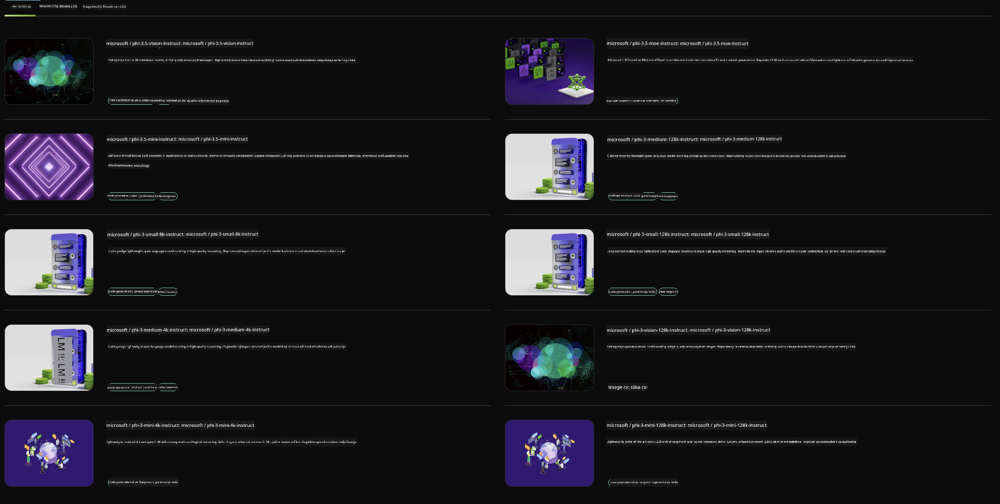

<!--
CO_OP_TRANSLATOR_METADATA:
{
  "original_hash": "7b08e277df2a9307f861ae54bc30c772",
  "translation_date": "2025-05-09T10:04:37+00:00",
  "source_file": "md/01.Introduction/02/06.NVIDIA.md",
  "language_code": "hr"
}
-->
## Phi obitelj u NVIDIA NIM

NVIDIA NIM je skup jednostavnih mikroservisa dizajniranih za ubrzanje implementacije generativnih AI modela u oblaku, podatkovnim centrima i radnim stanicama. NIM-ovi su kategorizirani prema obitelji modela i pojedinačno po modelu. Na primjer, NVIDIA NIM za velike jezične modele (LLM) donosi snagu najsuvremenijih LLM-ova u poslovne aplikacije, pružajući nenadmašne mogućnosti obrade i razumijevanja prirodnog jezika.

NIM olakšava IT i DevOps timovima da samostalno hostaju velike jezične modele (LLM) u vlastitim upravljanim okruženjima, dok programerima i dalje pruža industrijske standardne API-je koji im omogućuju izgradnju moćnih kopilota, chatbotova i AI asistenata koji mogu transformirati njihov posao. Koristeći najnoviju NVIDIA GPU akceleraciju i skalabilnu implementaciju, NIM nudi najbrži put do izvođenja s neusporedivim performansama.

Možete koristiti NVIDIA NIM za izvođenje Phi obitelj modela



### **Primjeri - Phi-3-Vision u NVIDIA NIM**

Zamislite da imate sliku (`demo.png`) i želite generirati Python kod koji obrađuje tu sliku i sprema novu verziju (`phi-3-vision.jpg`).

Gornji kod automatizira ovaj proces tako da:

1. Postavlja okruženje i potrebne konfiguracije.
2. Kreira prompt koji modelu daje upute da generira traženi Python kod.
3. Šalje prompt modelu i prikuplja generirani kod.
4. Izvlači i izvršava generirani kod.
5. Prikazuje originalnu i obrađenu sliku.

Ovaj pristup koristi snagu AI-a za automatizaciju zadataka obrade slika, čineći postizanje ciljeva lakšim i bržim.

[Primjer rješenja koda](../../../../../code/06.E2E/E2E_Nvidia_NIM_Phi3_Vision.ipynb)

Razložimo što cijeli kod radi korak po korak:

1. **Instaliraj potrebni paket**:
    ```python
    !pip install langchain_nvidia_ai_endpoints -U
    ```  
    Ova naredba instalira paket `langchain_nvidia_ai_endpoints`, osiguravajući da je najnovija verzija.

2. **Uvezi potrebne module**:
    ```python
    from langchain_nvidia_ai_endpoints import ChatNVIDIA
    import getpass
    import os
    import base64
    ```  
    Ovi importi donose potrebne module za rad s NVIDIA AI endpointima, sigurnu obradu lozinki, rad s operativnim sustavom i kodiranje/dekodiranje podataka u base64 formatu.

3. **Postavi API ključ**:
    ```python
    if not os.getenv("NVIDIA_API_KEY"):
        os.environ["NVIDIA_API_KEY"] = getpass.getpass("Enter your NVIDIA API key: ")
    ```  
    Ovaj kod provjerava je li postavljena varijabla okruženja `NVIDIA_API_KEY`. Ako nije, traži od korisnika da sigurno unese svoj API ključ.

4. **Definiraj model i putanju slike**:
    ```python
    model = 'microsoft/phi-3-vision-128k-instruct'
    chat = ChatNVIDIA(model=model)
    img_path = './imgs/demo.png'
    ```  
    Ovdje se postavlja model koji će se koristiti, kreira se instanca `ChatNVIDIA` s navedenim modelom i definira putanja do slikovne datoteke.

5. **Kreiraj tekstualni prompt**:
    ```python
    text = "Please create Python code for image, and use plt to save the new picture under imgs/ and name it phi-3-vision.jpg."
    ```  
    Ovdje se definira tekstualni prompt koji modelu daje upute da generira Python kod za obradu slike.

6. **Kodiraj sliku u Base64**:
    ```python
    with open(img_path, "rb") as f:
        image_b64 = base64.b64encode(f.read()).decode()
    image = f''
    ```  
    Ovaj kod čita slikovnu datoteku, kodira je u base64 i kreira HTML tag slike s kodiranim podacima.

7. **Spoji tekst i sliku u prompt**:
    ```python
    prompt = f"{text} {image}"
    ```  
    Ovdje se tekstualni prompt i HTML tag slike spajaju u jedan niz.

8. **Generiraj kod pomoću ChatNVIDIA**:
    ```python
    code = ""
    for chunk in chat.stream(prompt):
        print(chunk.content, end="")
        code += chunk.content
    ```  
    Ovaj kod šalje prompt u `ChatNVIDIA` model and collects the generated code in chunks, printing and appending each chunk to the `code` string.

9. **Izvuci Python kod iz generiranog sadržaja**:
    ```python
    begin = code.index('```python') + 9  
    code = code[begin:]  
    end = code.index('```')
    code = code[:end]
    ```  
    Ovim se uklanja markdown formatiranje i izvlači stvarni Python kod iz generiranog sadržaja.

10. **Pokreni generirani kod**:
    ```python
    import subprocess
    result = subprocess.run(["python", "-c", code], capture_output=True)
    ```  
    Ovaj kod izvršava izvučeni Python kod kao podproces i hvata njegov izlaz.

11. **Prikaži slike**:
    ```python
    from IPython.display import Image, display
    display(Image(filename='./imgs/phi-3-vision.jpg'))
    display(Image(filename='./imgs/demo.png'))
    ```  
    Ove linije prikazuju slike koristeći modul `IPython.display`.

**Odricanje od odgovornosti**:  
Ovaj dokument preveden je pomoću AI usluge za prevođenje [Co-op Translator](https://github.com/Azure/co-op-translator). Iako težimo točnosti, imajte na umu da automatski prijevodi mogu sadržavati pogreške ili netočnosti. Izvorni dokument na izvornom jeziku treba smatrati autoritativnim izvorom. Za kritične informacije preporučuje se profesionalni ljudski prijevod. Ne snosimo odgovornost za bilo kakva nesporazuma ili kriva tumačenja koja proizlaze iz korištenja ovog prijevoda.