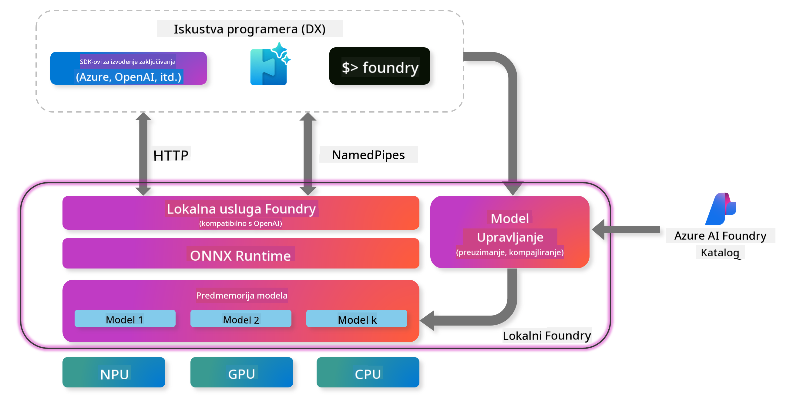
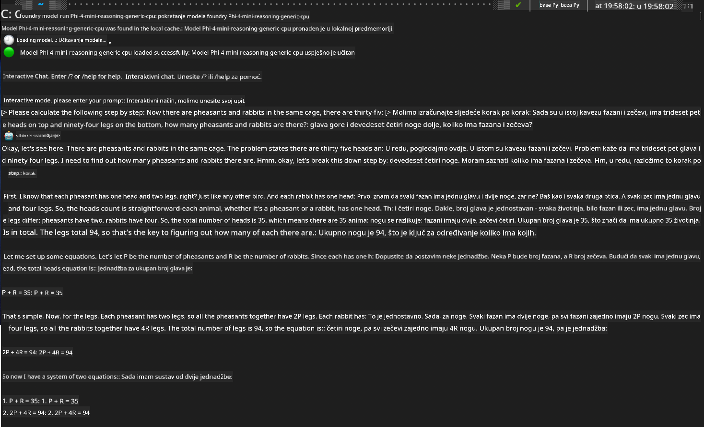

<!--
CO_OP_TRANSLATOR_METADATA:
{
  "original_hash": "52973a5680a65a810aa80b7036afd31f",
  "translation_date": "2025-07-16T19:51:37+00:00",
  "source_file": "md/01.Introduction/02/07.FoundryLocal.md",
  "language_code": "hr"
}
-->
## Početak rada s Phi-Family modelima u Foundry Local

### Uvod u Foundry Local

Foundry Local je moćno rješenje za izvođenje AI modela na uređaju koje donosi AI mogućnosti razine poduzeća izravno na vašu lokalnu opremu. Ovaj vodič će vas provesti kroz postavljanje i korištenje Phi-Family modela s Foundry Local, pružajući vam potpunu kontrolu nad AI zadacima uz očuvanje privatnosti i smanjenje troškova.

Foundry Local nudi prednosti u performansama, privatnosti, prilagodbi i troškovnoj učinkovitosti tako što AI modele pokreće lokalno na vašem uređaju. Integrira se besprijekorno u vaše postojeće radne tokove i aplikacije putem intuitivnog CLI-ja, SDK-a i REST API-ja.




### Zašto odabrati Foundry Local?

Razumijevanje prednosti Foundry Local pomoći će vam da donesete informirane odluke o strategiji implementacije AI-ja:

- **Izvođenje na uređaju:** Pokrećite modele lokalno na vlastitoj opremi, smanjujući troškove i pritom zadržavajući sve podatke na svom uređaju.

- **Prilagodba modela:** Odaberite unaprijed postavljene modele ili koristite vlastite kako biste zadovoljili specifične zahtjeve i scenarije.

- **Učinkovitost troškova:** Uklonite ponavljajuće troškove usluga u oblaku koristeći postojeću opremu, čineći AI pristupačnijim.

- **Besprijekorna integracija:** Povežite se s aplikacijama putem SDK-a, API krajnjih točaka ili CLI-ja, uz jednostavno skaliranje na Azure AI Foundry kako vaše potrebe rastu.

> **Napomena za početak:** Ovaj vodič fokusira se na korištenje Foundry Local putem CLI i SDK sučelja. Naučit ćete oba pristupa kako biste odabrali najbolju metodu za svoj slučaj.

## Dio 1: Postavljanje Foundry Local CLI-ja

### Korak 1: Instalacija

Foundry Local CLI je vaš ulaz u upravljanje i pokretanje AI modela lokalno. Počnimo s instalacijom na vaš sustav.

**Podržane platforme:** Windows i macOS

Za detaljne upute o instalaciji, molimo pogledajte [službenu Foundry Local dokumentaciju](https://github.com/microsoft/Foundry-Local/blob/main/README.md).

### Korak 2: Istraživanje dostupnih modela

Nakon što instalirate Foundry Local CLI, možete otkriti koje su modele dostupne za vaš slučaj upotrebe. Ova naredba prikazat će sve podržane modele:


```bash
foundry model list
```

### Korak 3: Upoznavanje s Phi Family modelima

Phi Family nudi niz modela optimiziranih za različite scenarije i hardverske konfiguracije. Evo Phi modela dostupnih u Foundry Local:

**Dostupni Phi modeli:** 

- **phi-3.5-mini** - Kompaktan model za osnovne zadatke
- **phi-3-mini-128k** - Verzija s proširenim kontekstom za duže razgovore
- **phi-3-mini-4k** - Standardni kontekst model za opću upotrebu
- **phi-4** - Napredni model s poboljšanim mogućnostima
- **phi-4-mini** - Laganija verzija Phi-4
- **phi-4-mini-reasoning** - Specijaliziran za složene zadatke rezoniranja

> **Kompatibilnost s hardverom:** Svaki model može se konfigurirati za različite vrste hardverskog ubrzanja (CPU, GPU) ovisno o mogućnostima vašeg sustava.

### Korak 4: Pokretanje prvog Phi modela

Krenimo s praktičnim primjerom. Pokrenut ćemo model `phi-4-mini-reasoning`, koji je izvrsno prilagođen za rješavanje složenih problema korak po korak.


**Naredba za pokretanje modela:**

```bash
foundry model run Phi-4-mini-reasoning-generic-cpu
```

> **Prvo pokretanje:** Prilikom prvog pokretanja modela, Foundry Local će ga automatski preuzeti na vaš uređaj. Vrijeme preuzimanja ovisi o brzini vaše mreže, stoga budite strpljivi tijekom početnog postavljanja.

### Korak 5: Testiranje modela na stvarnom problemu

Sada testirajmo naš model na klasičnom logičkom problemu kako bismo vidjeli kako izvodi rezoniranje korak po korak:

**Primjer problema:**

```txt
Please calculate the following step by step: Now there are pheasants and rabbits in the same cage, there are thirty-five heads on top and ninety-four legs on the bottom, how many pheasants and rabbits are there?
```

**Očekivano ponašanje:** Model bi trebao razložiti problem u logičke korake, koristeći činjenicu da fazani imaju 2 noge, a zečevi 4 noge, kako bi riješio sustav jednadžbi.

**Rezultati:**



## Dio 2: Izrada aplikacija s Foundry Local SDK-om

### Zašto koristiti SDK?

Dok je CLI idealan za testiranje i brze interakcije, SDK vam omogućuje programsku integraciju Foundry Local u vaše aplikacije. To otvara mogućnosti za:

- Izradu prilagođenih AI aplikacija
- Kreiranje automatiziranih radnih tokova
- Integraciju AI funkcionalnosti u postojeće sustave
- Razvoj chatbotova i interaktivnih alata

### Podržani programski jezici

Foundry Local nudi SDK podršku za više programskih jezika kako bi odgovarao vašim razvojnim preferencijama:

**📦 Dostupni SDK-ovi:**

- **C# (.NET):** [SDK dokumentacija i primjeri](https://github.com/microsoft/Foundry-Local/tree/main/sdk/cs)
- **Python:** [SDK dokumentacija i primjeri](https://github.com/microsoft/Foundry-Local/tree/main/sdk/python)
- **JavaScript:** [SDK dokumentacija i primjeri](https://github.com/microsoft/Foundry-Local/tree/main/sdk/js)
- **Rust:** [SDK dokumentacija i primjeri](https://github.com/microsoft/Foundry-Local/tree/main/sdk/rust)

### Sljedeći koraci

1. **Odaberite SDK koji vam najviše odgovara** prema vašem razvojnom okruženju
2. **Slijedite dokumentaciju specifičnu za SDK** za detaljne upute o implementaciji
3. **Počnite s jednostavnim primjerima** prije nego što krenete u složenije aplikacije
4. **Istražite primjere koda** dostupne u svakom SDK repozitoriju

## Zaključak

Sada ste naučili kako:
- ✅ Instalirati i postaviti Foundry Local CLI
- ✅ Otkriti i pokrenuti Phi Family modele
- ✅ Testirati modele na stvarnim problemima
- ✅ Razumjeti opcije SDK-a za razvoj aplikacija

Foundry Local pruža snažnu osnovu za dovođenje AI mogućnosti izravno u vaše lokalno okruženje, dajući vam kontrolu nad performansama, privatnošću i troškovima, uz fleksibilnost skaliranja prema oblačnim rješenjima kad je to potrebno.

**Odricanje od odgovornosti**:  
Ovaj dokument je preveden korištenjem AI usluge za prevođenje [Co-op Translator](https://github.com/Azure/co-op-translator). Iako težimo točnosti, imajte na umu da automatski prijevodi mogu sadržavati pogreške ili netočnosti. Izvorni dokument na izvornom jeziku treba smatrati autoritativnim izvorom. Za kritične informacije preporučuje se profesionalni ljudski prijevod. Ne snosimo odgovornost za bilo kakva nesporazuma ili pogrešna tumačenja koja proizlaze iz korištenja ovog prijevoda.