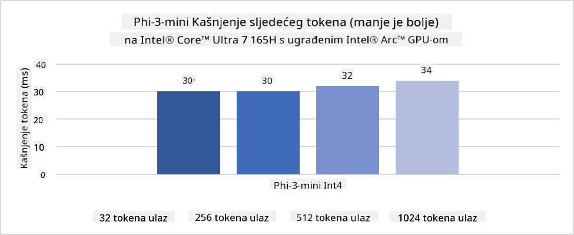
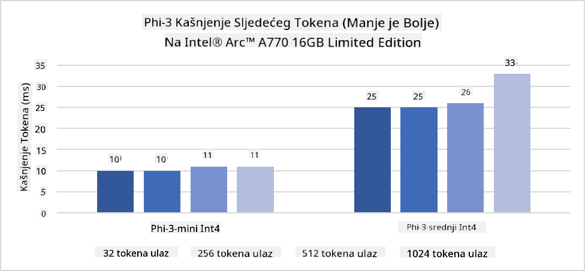
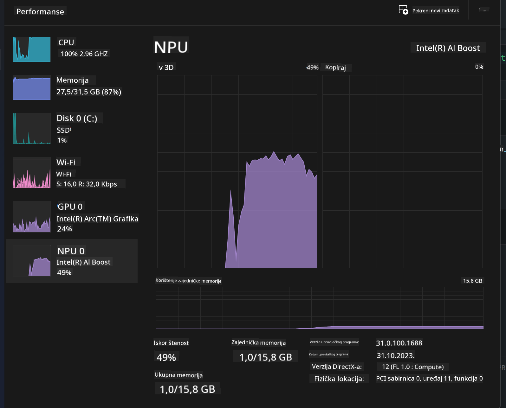
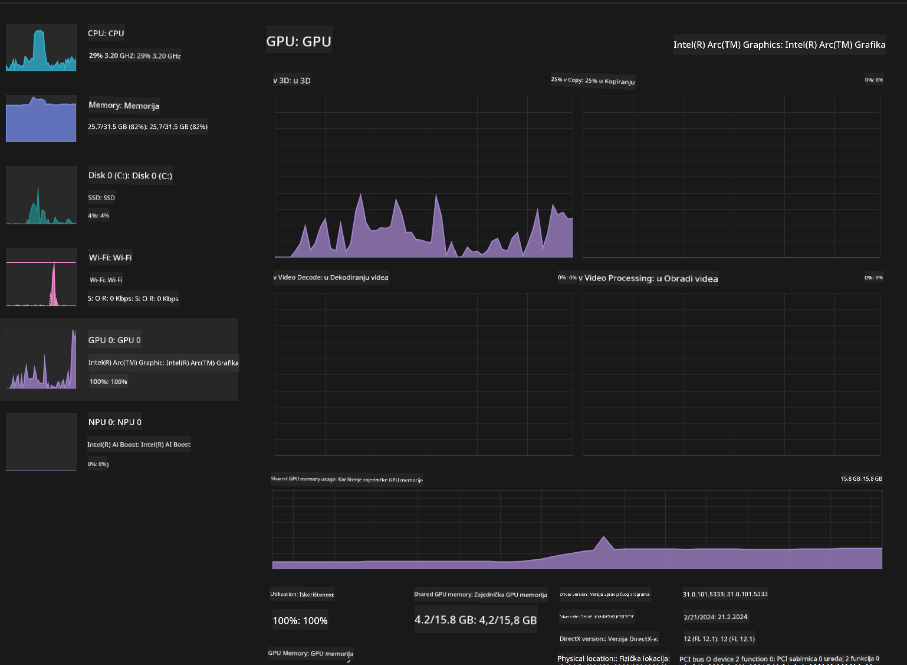

<!--
CO_OP_TRANSLATOR_METADATA:
{
  "original_hash": "e08ce816e23ad813244a09ca34ebb8ac",
  "translation_date": "2025-07-16T20:08:38+00:00",
  "source_file": "md/01.Introduction/03/AIPC_Inference.md",
  "language_code": "hr"
}
-->
# **Inferencija Phi-3 na AI PC-u**

S razvojem generativne umjetne inteligencije i poboljšanjem hardverskih mogućnosti uređaja na rubu mreže, sve veći broj generativnih AI modela može se integrirati u korisničke uređaje Bring Your Own Device (BYOD). AI PC računala su među tim modelima. Počevši od 2024., Intel, AMD i Qualcomm surađuju s proizvođačima računala kako bi predstavili AI PC-e koji omogućuju implementaciju lokaliziranih generativnih AI modela kroz hardverske prilagodbe. U ovom ćemo tekstu fokus staviti na Intel AI PC-e i istražiti kako implementirati Phi-3 na Intel AI PC-u.

### Što je NPU

NPU (Neural Processing Unit) je namjenski procesor ili procesorska jedinica unutar većeg SoC-a, dizajnirana posebno za ubrzavanje operacija neuronskih mreža i AI zadataka. Za razliku od općih CPU-a i GPU-a, NPU-i su optimizirani za paralelno računalstvo vođeno podacima, što ih čini vrlo učinkovitim u obradi velikih količina multimedijskih podataka poput videa i slika te u obradi podataka za neuronske mreže. Posebno su vješti u izvođenju AI zadataka poput prepoznavanja govora, zamućivanja pozadine tijekom video poziva i procesa uređivanja fotografija ili videa poput detekcije objekata.

## NPU vs GPU

Iako mnogi AI i strojno učenje zadaci koriste GPU-e, postoji važna razlika između GPU-a i NPU-a.  
GPU-i su poznati po svojim sposobnostima paralelnog računalstva, no nisu svi GPU-i jednako učinkoviti izvan obrade grafike. NPU-i su, s druge strane, posebno dizajnirani za složene izračune potrebne u radu neuronskih mreža, što ih čini izrazito učinkovitim za AI zadatke.

Ukratko, NPU-i su matematički geniji koji ubrzavaju AI izračune i igraju ključnu ulogu u novoj eri AI PC računala!

***Ovaj primjer temelji se na najnovijem Intel Core Ultra procesoru***

## **1. Korištenje NPU-a za pokretanje Phi-3 modela**

Intel® NPU uređaj je AI inferencijski akcelerator integriran s Intel klijentskim CPU-ima, počevši od Intel® Core™ Ultra generacije CPU-a (ranije poznat kao Meteor Lake). Omogućuje energetski učinkovito izvođenje zadataka umjetnih neuronskih mreža.





**Intel NPU Acceleration Library**

Intel NPU Acceleration Library [https://github.com/intel/intel-npu-acceleration-library](https://github.com/intel/intel-npu-acceleration-library) je Python biblioteka dizajnirana za povećanje učinkovitosti vaših aplikacija iskorištavanjem snage Intel Neural Processing Unit (NPU) za izvođenje visokobrzinskih izračuna na kompatibilnom hardveru.

Primjer Phi-3-mini na AI PC-u pokretanom Intel® Core™ Ultra procesorima.


Instalirajte Python biblioteku pomoću pip

```bash

   pip install intel-npu-acceleration-library

```

***Napomena*** Projekt je još u razvoju, ali referentni model je već vrlo kompletan.

### **Pokretanje Phi-3 s Intel NPU Acceleration Library**

Korištenjem Intel NPU akceleracije, ova biblioteka ne utječe na tradicionalni proces kodiranja. Potrebno je samo koristiti ovu biblioteku za kvantizaciju izvornog Phi-3 modela, poput FP16, INT8, INT4, na primjer:

```python
from transformers import AutoTokenizer, pipeline,TextStreamer
from intel_npu_acceleration_library import NPUModelForCausalLM, int4
from intel_npu_acceleration_library.compiler import CompilerConfig
import warnings

model_id = "microsoft/Phi-3-mini-4k-instruct"

compiler_conf = CompilerConfig(dtype=int4)
model = NPUModelForCausalLM.from_pretrained(
    model_id, use_cache=True, config=compiler_conf, attn_implementation="sdpa"
).eval()

tokenizer = AutoTokenizer.from_pretrained(model_id)

text_streamer = TextStreamer(tokenizer, skip_prompt=True)
```

Nakon uspješne kvantizacije, nastavite s izvršavanjem poziva NPU-a za pokretanje Phi-3 modela.

```python
generation_args = {
   "max_new_tokens": 1024,
   "return_full_text": False,
   "temperature": 0.3,
   "do_sample": False,
   "streamer": text_streamer,
}

pipe = pipeline(
   "text-generation",
   model=model,
   tokenizer=tokenizer,
)

query = "<|system|>You are a helpful AI assistant.<|end|><|user|>Can you introduce yourself?<|end|><|assistant|>"

with warnings.catch_warnings():
    warnings.simplefilter("ignore")
    pipe(query, **generation_args)
```

Tijekom izvršavanja koda, status rada NPU-a možemo pratiti putem Upravitelja zadataka



***Primjeri*** : [AIPC_NPU_DEMO.ipynb](../../../../../code/03.Inference/AIPC/AIPC_NPU_DEMO.ipynb)

## **2. Korištenje DirectML + ONNX Runtime za pokretanje Phi-3 modela**

### **Što je DirectML**

[DirectML](https://github.com/microsoft/DirectML) je visokoučinkovita, hardverski ubrzana DirectX 12 biblioteka za strojno učenje. DirectML pruža GPU akceleraciju za uobičajene zadatke strojnog učenja na širokom spektru podržanog hardvera i upravljačkih programa, uključujući sve GPU-e kompatibilne s DirectX 12 od proizvođača poput AMD, Intel, NVIDIA i Qualcomm.

Kada se koristi samostalno, DirectML API je niskorazinska DirectX 12 biblioteka pogodna za visokoučinkovite, niskolatentne aplikacije poput frameworka, igara i drugih aplikacija u stvarnom vremenu. Besprijekorna interoperabilnost DirectML-a s Direct3D 12, kao i njegov nizak overhead i usklađenost na različitom hardveru, čine DirectML idealnim za ubrzavanje strojnog učenja kada su potrebne visoke performanse i pouzdanost rezultata na različitim uređajima.

***Napomena*** : Najnoviji DirectML već podržava NPU (https://devblogs.microsoft.com/directx/introducing-neural-processor-unit-npu-support-in-directml-developer-preview/)

### DirectML i CUDA u pogledu mogućnosti i performansi:

**DirectML** je biblioteka za strojno učenje koju je razvio Microsoft. Dizajnirana je za ubrzavanje zadataka strojnog učenja na Windows uređajima, uključujući desktop, prijenosna računala i edge uređaje.  
- Bazirano na DX12: DirectML je izgrađen na DirectX 12 (DX12), što omogućuje široku podršku hardvera na GPU-ima, uključujući NVIDIA i AMD.  
- Šira podrška: Budući da koristi DX12, DirectML može raditi s bilo kojim GPU-om koji podržava DX12, čak i integriranim GPU-ima.  
- Obrada slika: DirectML obrađuje slike i druge podatke koristeći neuronske mreže, što ga čini pogodnim za zadatke poput prepoznavanja slika, detekcije objekata i slično.  
- Jednostavnost postavljanja: Postavljanje DirectML-a je jednostavno i ne zahtijeva specifične SDK-ove ili biblioteke proizvođača GPU-a.  
- Performanse: U nekim slučajevima, DirectML postiže dobre performanse i može biti brži od CUDA-e, osobito za određene zadatke.  
- Ograničenja: Međutim, postoje situacije u kojima je DirectML sporiji, osobito kod velikih batch veličina u float16 formatu.

**CUDA** je NVIDIA-ina platforma za paralelno računalstvo i programski model. Omogućuje programerima da iskoriste snagu NVIDIA GPU-a za opće računalne zadatke, uključujući strojno učenje i znanstvene simulacije.  
- Specifično za NVIDIA-u: CUDA je usko integrirana s NVIDIA GPU-ima i posebno je dizajnirana za njih.  
- Visoko optimizirana: Pruža izvrsne performanse za zadatke ubrzane GPU-om, osobito na NVIDIA hardveru.  
- Široko korištena: Mnogi frameworki i biblioteke za strojno učenje (poput TensorFlowa i PyTorcha) podržavaju CUDA-u.  
- Prilagodba: Programeri mogu fino podesiti CUDA postavke za specifične zadatke, što može dovesti do optimalnih performansi.  
- Ograničenja: Međutim, ovisnost o NVIDIA hardveru može biti ograničavajuća ako želite širu kompatibilnost s različitim GPU-ima.

### Odabir između DirectML i CUDA

Izbor između DirectML i CUDA ovisi o vašem specifičnom slučaju upotrebe, dostupnosti hardvera i preferencijama.  
Ako tražite širu kompatibilnost i jednostavnost postavljanja, DirectML može biti dobar izbor. Međutim, ako imate NVIDIA GPU-e i trebate visoko optimizirane performanse, CUDA je i dalje snažan kandidat. Ukratko, oba imaju svoje prednosti i nedostatke, stoga razmotrite svoje zahtjeve i dostupni hardver prije donošenja odluke.

### **Generativna AI s ONNX Runtime**

U eri AI-a, prenosivost AI modela je vrlo važna. ONNX Runtime omogućuje jednostavnu implementaciju treniranih modela na različite uređaje. Programeri ne moraju brinuti o inferencijskom frameworku i koriste jedinstveni API za izvođenje modela. U eri generativne AI, ONNX Runtime također vrši optimizaciju koda (https://onnxruntime.ai/docs/genai/). Kroz optimizirani ONNX Runtime, kvantizirani generativni AI model može se inferirati na različitim uređajima. U Generativnoj AI s ONNX Runtime-om, AI model se može inferirati putem API-ja u Pythonu, C#, C/C++. Naravno, implementacija na iPhone-u može iskoristiti C++ Generative AI s ONNX Runtime API-jem.

[Primjer koda](https://github.com/Azure-Samples/Phi-3MiniSamples/tree/main/onnx)

***kompilacija generativne AI s ONNX Runtime bibliotekom***

```bash

winget install --id=Kitware.CMake  -e

git clone https://github.com/microsoft/onnxruntime.git

cd .\onnxruntime\

./build.bat --build_shared_lib --skip_tests --parallel --use_dml --config Release

cd ../

git clone https://github.com/microsoft/onnxruntime-genai.git

cd .\onnxruntime-genai\

mkdir ort

cd ort

mkdir include

mkdir lib

copy ..\onnxruntime\include\onnxruntime\core\providers\dml\dml_provider_factory.h ort\include

copy ..\onnxruntime\include\onnxruntime\core\session\onnxruntime_c_api.h ort\include

copy ..\onnxruntime\build\Windows\Release\Release\*.dll ort\lib

copy ..\onnxruntime\build\Windows\Release\Release\onnxruntime.lib ort\lib

python build.py --use_dml


```

**Instalacija biblioteke**

```bash

pip install .\onnxruntime_genai_directml-0.3.0.dev0-cp310-cp310-win_amd64.whl

```

Ovo je rezultat izvođenja


***Primjeri*** : [AIPC_DirectML_DEMO.ipynb](../../../../../code/03.Inference/AIPC/AIPC_DirectML_DEMO.ipynb)

## **3. Korištenje Intel OpenVino za pokretanje Phi-3 modela**

### **Što je OpenVINO**

[OpenVINO](https://github.com/openvinotoolkit/openvino) je open-source alatni paket za optimizaciju i implementaciju dubokih neuronskih mreža. Pruža ubrzanje dubokog učenja za modele vida, zvuka i jezika iz popularnih frameworka poput TensorFlowa, PyTorcha i drugih. Počnite s OpenVINO-om. OpenVINO se može koristiti i u kombinaciji s CPU-om i GPU-om za pokretanje Phi-3 modela.

***Napomena***: Trenutno OpenVINO ne podržava NPU.

### **Instalacija OpenVINO biblioteke**

```bash

 pip install git+https://github.com/huggingface/optimum-intel.git

 pip install git+https://github.com/openvinotoolkit/nncf.git

 pip install openvino-nightly

```

### **Pokretanje Phi-3 s OpenVINO**

Kao i NPU, OpenVINO izvršava poziv generativnih AI modela pokretanjem kvantiziranih modela. Prvo je potrebno kvantizirati Phi-3 model i dovršiti kvantizaciju modela putem naredbenog retka koristeći optimum-cli.

**INT4**

```bash

optimum-cli export openvino --model "microsoft/Phi-3-mini-4k-instruct" --task text-generation-with-past --weight-format int4 --group-size 128 --ratio 0.6  --sym  --trust-remote-code ./openvinomodel/phi3/int4

```

**FP16**

```bash

optimum-cli export openvino --model "microsoft/Phi-3-mini-4k-instruct" --task text-generation-with-past --weight-format fp16 --trust-remote-code ./openvinomodel/phi3/fp16

```

konvertirani format izgleda ovako


Učitajte putove modela (model_dir), povezane konfiguracije (ov_config = {"PERFORMANCE_HINT": "LATENCY", "NUM_STREAMS": "1", "CACHE_DIR": ""}) i hardverski ubrzane uređaje (GPU.0) putem OVModelForCausalLM

```python

ov_model = OVModelForCausalLM.from_pretrained(
     model_dir,
     device='GPU.0',
     ov_config=ov_config,
     config=AutoConfig.from_pretrained(model_dir, trust_remote_code=True),
     trust_remote_code=True,
)

```

Tijekom izvršavanja koda, status rada GPU-a možemo pratiti putem Upravitelja zadataka



***Primjeri*** : [AIPC_OpenVino_Demo.ipynb](../../../../../code/03.Inference/AIPC/AIPC_OpenVino_Demo.ipynb)

### ***Napomena*** : Sve tri gore navedene metode imaju svoje prednosti, ali se za inferenciju na AI PC-u preporučuje korištenje NPU akceleracije.

**Odricanje od odgovornosti**:  
Ovaj dokument je preveden korištenjem AI usluge za prevođenje [Co-op Translator](https://github.com/Azure/co-op-translator). Iako nastojimo postići točnost, imajte na umu da automatski prijevodi mogu sadržavati pogreške ili netočnosti. Izvorni dokument na izvornom jeziku treba smatrati autoritativnim izvorom. Za kritične informacije preporučuje se profesionalni ljudski prijevod. Ne snosimo odgovornost za bilo kakva nesporazume ili pogrešna tumačenja koja proizlaze iz korištenja ovog prijevoda.