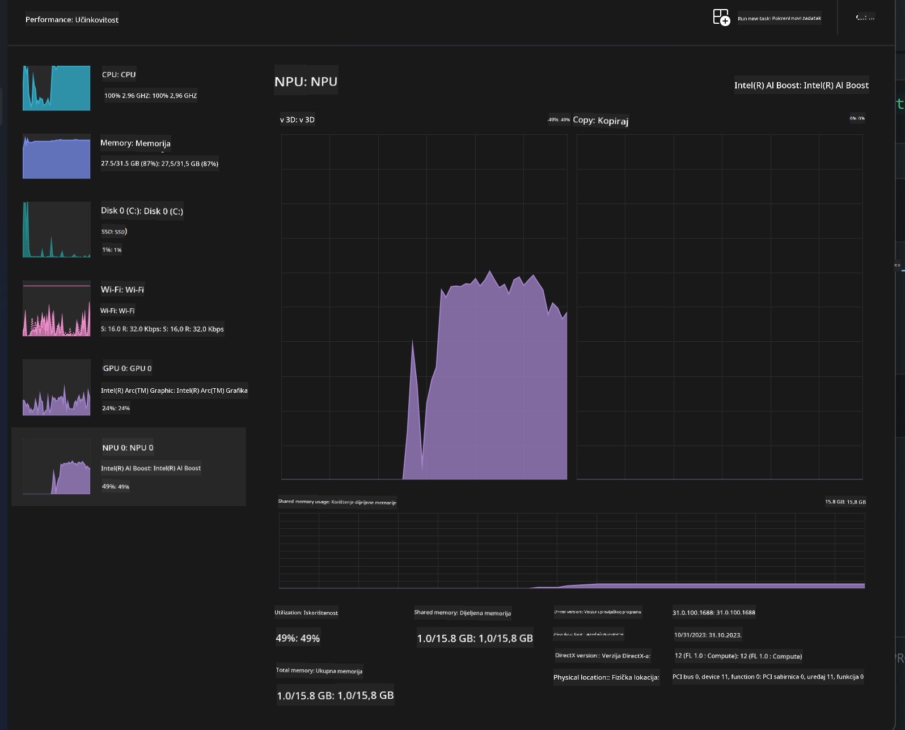
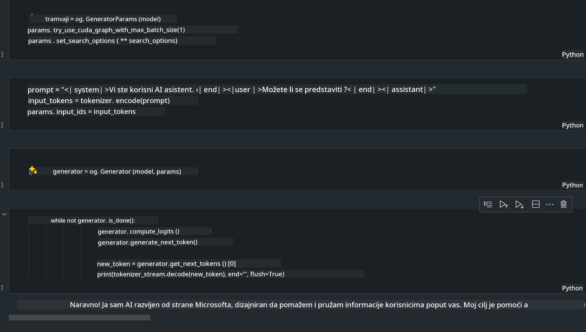
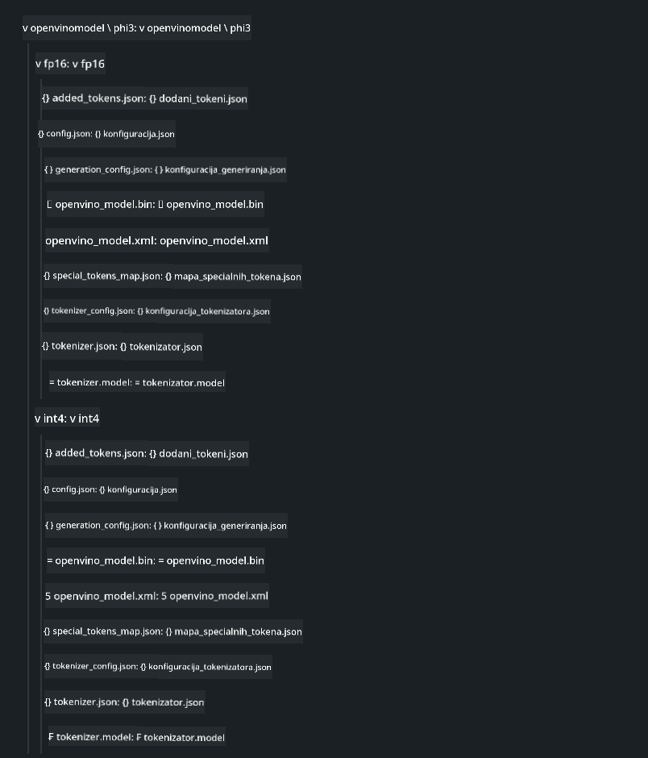

<!--
CO_OP_TRANSLATOR_METADATA:
{
  "original_hash": "e08ce816e23ad813244a09ca34ebb8ac",
  "translation_date": "2025-05-09T10:40:18+00:00",
  "source_file": "md/01.Introduction/03/AIPC_Inference.md",
  "language_code": "hr"
}
-->
# **Inference Phi-3 na AI PC**

S razvojem generativne AI i poboljšanjem hardverskih mogućnosti edge uređaja, sve veći broj generativnih AI modela sada se može integrirati u korisničke Bring Your Own Device (BYOD) uređaje. AI PC računala su među tim modelima. Počevši od 2024., Intel, AMD i Qualcomm surađuju s proizvođačima PC-a kako bi predstavili AI PC računala koja omogućuju implementaciju lokaliziranih generativnih AI modela kroz hardverske modifikacije. U ovoj raspravi fokusirat ćemo se na Intel AI PC i istražiti kako implementirati Phi-3 na Intel AI PC-u.

### Što je NPU

NPU (Neural Processing Unit) je namjenski procesor ili procesorska jedinica unutar većeg SoC-a, dizajnirana posebno za ubrzavanje operacija neuronskih mreža i AI zadataka. Za razliku od općih CPU-a i GPU-a, NPU-ovi su optimizirani za paralelno računanje vođeno podacima, što ih čini vrlo učinkovitim u obradi velikih količina multimedijskih podataka poput videa i slika te podataka za neuronske mreže. Posebno su dobri u obavljanju AI zadataka kao što su prepoznavanje govora, zamagljivanje pozadine u video pozivima i procesi uređivanja fotografija ili videa poput detekcije objekata.

## NPU vs GPU

Iako mnogi AI i strojno učenje zadaci rade na GPU-ima, postoji ključna razlika između GPU-a i NPU-a.  
GPU-i su poznati po svojim sposobnostima paralelnog računanja, no nisu svi GPU-i podjednako učinkoviti izvan obrade grafike. S druge strane, NPU-ovi su posebno dizajnirani za složene izračune uključene u operacije neuronskih mreža, što ih čini izrazito učinkovitim za AI zadatke.

Ukratko, NPU-ovi su matematički genijalci koji ubrzavaju AI izračune i igraju ključnu ulogu u nadolazećem dobu AI PC računala!

***Ovaj primjer temelji se na najnovijem Intelovom Intel Core Ultra procesoru***

## **1. Korištenje NPU-a za pokretanje Phi-3 modela**

Intel® NPU uređaj je AI inferencijski akcelerator integriran s Intel klijentskim CPU-ima, počevši od Intel® Core™ Ultra generacije CPU-a (ranije poznat kao Meteor Lake). Omogućuje energetski učinkovito izvršavanje zadataka umjetnih neuronskih mreža.


**Intel NPU Acceleration Library**

Intel NPU Acceleration Library [https://github.com/intel/intel-npu-acceleration-library](https://github.com/intel/intel-npu-acceleration-library) je Python biblioteka dizajnirana za povećanje učinkovitosti vaših aplikacija koristeći snagu Intel Neural Processing Unit (NPU) za izvođenje visokobrzinskih izračuna na kompatibilnom hardveru.

Primjer Phi-3-mini na AI PC-u pokretanom Intel® Core™ Ultra procesorima.


Instalirajte Python biblioteku pomoću pip

```bash

   pip install intel-npu-acceleration-library

```

***Napomena*** Projekt je još u razvoju, ali referentni model je već vrlo dovršen.

### **Pokretanje Phi-3 s Intel NPU Acceleration Library**

Korištenjem Intel NPU akceleracije, ova biblioteka ne utječe na tradicionalni proces kodiranja. Potrebno je samo koristiti ovu biblioteku za kvantizaciju izvornog Phi-3 modela, poput FP16, INT8, INT4, kao na primjer

```python
from transformers import AutoTokenizer, pipeline,TextStreamer
from intel_npu_acceleration_library import NPUModelForCausalLM, int4
from intel_npu_acceleration_library.compiler import CompilerConfig
import warnings

model_id = "microsoft/Phi-3-mini-4k-instruct"

compiler_conf = CompilerConfig(dtype=int4)
model = NPUModelForCausalLM.from_pretrained(
    model_id, use_cache=True, config=compiler_conf, attn_implementation="sdpa"
).eval()

tokenizer = AutoTokenizer.from_pretrained(model_id)

text_streamer = TextStreamer(tokenizer, skip_prompt=True)
```

Nakon uspješne kvantizacije, nastavite s izvršavanjem pozivajući NPU za pokretanje Phi-3 modela.

```python
generation_args = {
   "max_new_tokens": 1024,
   "return_full_text": False,
   "temperature": 0.3,
   "do_sample": False,
   "streamer": text_streamer,
}

pipe = pipeline(
   "text-generation",
   model=model,
   tokenizer=tokenizer,
)

query = "<|system|>You are a helpful AI assistant.<|end|><|user|>Can you introduce yourself?<|end|><|assistant|>"

with warnings.catch_warnings():
    warnings.simplefilter("ignore")
    pipe(query, **generation_args)
```

Tijekom izvršavanja koda, status rada NPU-a možemo pratiti kroz Task Manager.



***Primjeri*** : [AIPC_NPU_DEMO.ipynb](../../../../../code/03.Inference/AIPC/AIPC_NPU_DEMO.ipynb)

## **2. Korištenje DirectML + ONNX Runtime za pokretanje Phi-3 modela**

### **Što je DirectML**

[DirectML](https://github.com/microsoft/DirectML) je visokoučinkovita, hardverski ubrzana DirectX 12 biblioteka za strojno učenje. DirectML pruža GPU akceleraciju za uobičajene zadatke strojnog učenja na širokom spektru podržanog hardvera i drajvera, uključujući sve DirectX 12 kompatibilne GPU-ove proizvođača poput AMD, Intel, NVIDIA i Qualcomm.

Kada se koristi samostalno, DirectML API je niskorazinska DirectX 12 biblioteka pogodna za visokoučinkovite, niskolatentne aplikacije poput frameworka, igara i drugih aplikacija u stvarnom vremenu. Besprijekorna interoperabilnost DirectML-a s Direct3D 12, zajedno s niskim režijskim troškovima i usklađenošću na različitom hardveru, čini DirectML idealnim za ubrzanje strojnog učenja kada su potrebne visoke performanse i pouzdanost rezultata na različitim uređajima.

***Napomena*** : Najnoviji DirectML već podržava NPU (https://devblogs.microsoft.com/directx/introducing-neural-processor-unit-npu-support-in-directml-developer-preview/)

### DirectML i CUDA u pogledu njihovih mogućnosti i performansi:

**DirectML** je biblioteka za strojno učenje koju je razvio Microsoft. Dizajnirana je za ubrzavanje zadataka strojnog učenja na Windows uređajima, uključujući desktop, prijenosna računala i edge uređaje.
- Temeljen na DX12: DirectML je izgrađen na vrhu DirectX 12 (DX12), što pruža široku podršku za hardver na GPU-ovima, uključujući NVIDIA i AMD.
- Šira podrška: Budući da koristi DX12, DirectML može raditi s bilo kojim GPU-om koji podržava DX12, pa čak i integriranim GPU-ovima.
- Obrada slika: DirectML obrađuje slike i druge podatke koristeći neuronske mreže, što ga čini prikladnim za zadatke poput prepoznavanja slika, detekcije objekata i slično.
- Jednostavnost postavljanja: Postavljanje DirectML-a je jednostavno i ne zahtijeva specifične SDK-ove ili biblioteke proizvođača GPU-a.
- Performanse: U nekim slučajevima DirectML postiže dobre performanse i može biti brži od CUDA, posebno za određene zadatke.
- Ograničenja: Ipak, postoje situacije kada je DirectML sporiji, osobito za velike batch veličine u float16 formatu.

**CUDA** je NVIDIA-in paralelni računalni platforma i programski model. Omogućava developerima da iskoriste snagu NVIDIA GPU-ova za opće računalne zadatke, uključujući strojno učenje i znanstvene simulacije.
- Specifičan za NVIDIA-u: CUDA je usko integriran s NVIDIA GPU-ovima i posebno je dizajniran za njih.
- Visoko optimiziran: Pruža izvrsne performanse za zadatke ubrzane GPU-om, posebno na NVIDIA GPU-ovima.
- Široko korišten: Mnogi frameworki i biblioteke za strojno učenje (kao što su TensorFlow i PyTorch) imaju podršku za CUDA.
- Prilagodba: Developeri mogu fino podešavati CUDA postavke za specifične zadatke, što može dovesti do optimalnih performansi.
- Ograničenja: Međutim, ovisnost o NVIDIA hardveru može biti ograničavajuća ako želite širu kompatibilnost na različitim GPU-ovima.

### Odabir između DirectML i CUDA

Izbor između DirectML i CUDA ovisi o vašem specifičnom slučaju korištenja, dostupnosti hardvera i preferencijama.  
Ako tražite širu kompatibilnost i jednostavnost postavljanja, DirectML može biti dobar izbor. Međutim, ako imate NVIDIA GPU-ove i trebate visoko optimizirane performanse, CUDA je i dalje snažan kandidat. Ukratko, oba imaju svoje prednosti i nedostatke, pa razmotrite svoje zahtjeve i raspoloživi hardver prije donošenja odluke.

### **Generativna AI s ONNX Runtime**

U eri AI, prenosivost AI modela je vrlo važna. ONNX Runtime omogućuje jednostavnu implementaciju treniranih modela na različite uređaje. Developeri ne moraju brinuti o inferencijskom frameworku i koriste jedinstveni API za izvođenje modela. U eri generativne AI, ONNX Runtime je također optimizirao kod (https://onnxruntime.ai/docs/genai/). Kroz optimizirani ONNX Runtime, kvantizirani generativni AI model može se inferirati na različitim uređajima. U Generative AI s ONNX Runtime možete pozivati AI model API putem Pythona, C#, C / C++. Naravno, implementacija na iPhone može iskoristiti C++ Generative AI s ONNX Runtime API-jem.

[Sample Code](https://github.com/Azure-Samples/Phi-3MiniSamples/tree/main/onnx)

***kompilacija generativne AI s ONNX Runtime bibliotekom***

```bash

winget install --id=Kitware.CMake  -e

git clone https://github.com/microsoft/onnxruntime.git

cd .\onnxruntime\

./build.bat --build_shared_lib --skip_tests --parallel --use_dml --config Release

cd ../

git clone https://github.com/microsoft/onnxruntime-genai.git

cd .\onnxruntime-genai\

mkdir ort

cd ort

mkdir include

mkdir lib

copy ..\onnxruntime\include\onnxruntime\core\providers\dml\dml_provider_factory.h ort\include

copy ..\onnxruntime\include\onnxruntime\core\session\onnxruntime_c_api.h ort\include

copy ..\onnxruntime\build\Windows\Release\Release\*.dll ort\lib

copy ..\onnxruntime\build\Windows\Release\Release\onnxruntime.lib ort\lib

python build.py --use_dml


```

**Instalacija biblioteke**

```bash

pip install .\onnxruntime_genai_directml-0.3.0.dev0-cp310-cp310-win_amd64.whl

```

Ovo je rezultat izvođenja



***Primjeri*** : [AIPC_DirectML_DEMO.ipynb](../../../../../code/03.Inference/AIPC/AIPC_DirectML_DEMO.ipynb)

## **3. Korištenje Intel OpenVino za pokretanje Phi-3 modela**

### **Što je OpenVINO**

[OpenVINO](https://github.com/openvinotoolkit/openvino) je open-source alat za optimizaciju i implementaciju dubokih neuronskih mreža. Pruža ubrzanje dubokog učenja za modele vida, zvuka i jezika iz popularnih frameworka poput TensorFlow, PyTorch i drugih. Počnite s OpenVINO-om. OpenVINO se također može koristiti u kombinaciji s CPU-om i GPU-om za pokretanje Phi-3 modela.

***Napomena***: Trenutno OpenVINO ne podržava NPU.

### **Instalacija OpenVINO biblioteke**

```bash

 pip install git+https://github.com/huggingface/optimum-intel.git

 pip install git+https://github.com/openvinotoolkit/nncf.git

 pip install openvino-nightly

```

### **Pokretanje Phi-3 s OpenVINO**

Kao i NPU, OpenVINO izvršava poziv generativnih AI modela kroz kvantizirane modele. Prvo je potrebno kvantizirati Phi-3 model i završiti kvantizaciju na komandnoj liniji pomoću optimum-cli

**INT4**

```bash

optimum-cli export openvino --model "microsoft/Phi-3-mini-4k-instruct" --task text-generation-with-past --weight-format int4 --group-size 128 --ratio 0.6  --sym  --trust-remote-code ./openvinomodel/phi3/int4

```

**FP16**

```bash

optimum-cli export openvino --model "microsoft/Phi-3-mini-4k-instruct" --task text-generation-with-past --weight-format fp16 --trust-remote-code ./openvinomodel/phi3/fp16

```

konvertirani format izgleda ovako



Učitajte putanje modela (model_dir), povezane konfiguracije (ov_config = {"PERFORMANCE_HINT": "LATENCY", "NUM_STREAMS": "1", "CACHE_DIR": ""}) i hardverski ubrzane uređaje (GPU.0) putem OVModelForCausalLM

```python

ov_model = OVModelForCausalLM.from_pretrained(
     model_dir,
     device='GPU.0',
     ov_config=ov_config,
     config=AutoConfig.from_pretrained(model_dir, trust_remote_code=True),
     trust_remote_code=True,
)

```

Tijekom izvršavanja koda, status rada GPU-a možemo pratiti kroz Task Manager.


***Primjeri*** : [AIPC_OpenVino_Demo.ipynb](../../../../../code/03.Inference/AIPC/AIPC_OpenVino_Demo.ipynb)

### ***Napomena*** : Sve tri metode imaju svoje prednosti, no preporučuje se korištenje NPU akceleracije za inferenciju na AI PC-u.

**Odricanje od odgovornosti**:  
Ovaj dokument preveden je korištenjem AI usluge prevođenja [Co-op Translator](https://github.com/Azure/co-op-translator). Iako težimo točnosti, imajte na umu da automatski prijevodi mogu sadržavati pogreške ili netočnosti. Izvorni dokument na izvornom jeziku treba smatrati službenim i autoritativnim izvorom. Za kritične informacije preporučuje se profesionalni ljudski prijevod. Ne snosimo odgovornost za bilo kakva nesporazuma ili pogrešna tumačenja proizašla iz korištenja ovog prijevoda.