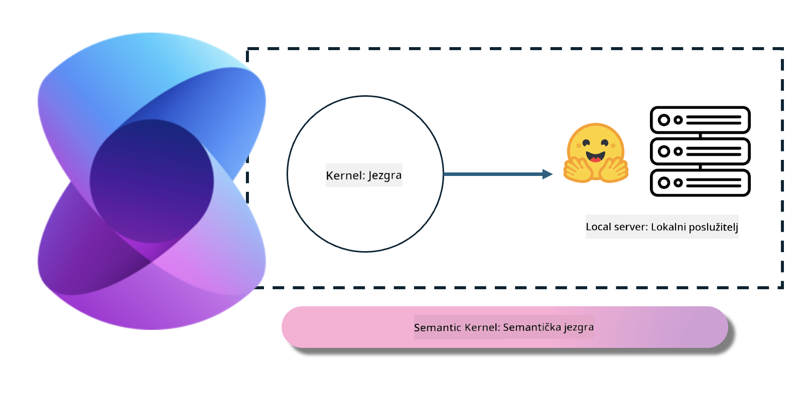
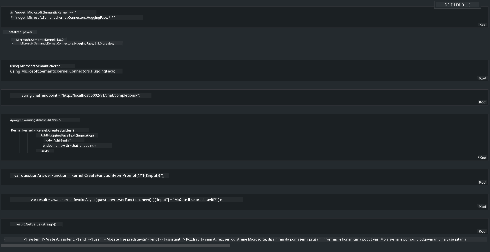

<!--
CO_OP_TRANSLATOR_METADATA:
{
  "original_hash": "bcf5dd7031db0031abdb9dd0c05ba118",
  "translation_date": "2025-07-16T20:59:31+00:00",
  "source_file": "md/01.Introduction/03/Local_Server_Inference.md",
  "language_code": "hr"
}
-->
# **Izvođenje Phi-3 na lokalnom poslužitelju**

Phi-3 možemo postaviti na lokalni poslužitelj. Korisnici mogu odabrati rješenja poput [Ollama](https://ollama.com) ili [LM Studio](https://llamaedge.com), ili mogu napisati vlastiti kod. Phi-3 lokalne usluge možete povezati putem [Semantic Kernel](https://github.com/microsoft/semantic-kernel?WT.mc_id=aiml-138114-kinfeylo) ili [Langchain](https://www.langchain.com/) za izgradnju Copilot aplikacija.

## **Korištenje Semantic Kernel za pristup Phi-3-mini**

U Copilot aplikaciji stvaramo aplikacije putem Semantic Kernel / LangChain. Ovakav okvir aplikacije općenito je kompatibilan s Azure OpenAI Service / OpenAI modelima, a može podržavati i open source modele na Hugging Face te lokalne modele. Što trebamo napraviti ako želimo koristiti Semantic Kernel za pristup Phi-3-mini? Kao primjer koristimo .NET, koji možemo kombinirati s Hugging Face Connectorom u Semantic Kernelu. Po defaultu, on može odgovarati model id-u na Hugging Faceu (prvi put kad ga koristite, model će se preuzeti s Hugging Facea, što može potrajati). Također se možete povezati s lokalno izgrađenom uslugom. Uspoređujući ta dva pristupa, preporučujemo korištenje drugog jer pruža veću autonomiju, osobito u poslovnim aplikacijama.

Iz slike je vidljivo da pristup lokalnim uslugama putem Semantic Kernel lako povezuje s vlastitim Phi-3-mini model poslužiteljem. Ovo je rezultat izvođenja:

***Primjer koda*** https://github.com/kinfey/Phi3MiniSamples/tree/main/semantickernel

**Odricanje od odgovornosti**:  
Ovaj dokument je preveden korištenjem AI usluge za prevođenje [Co-op Translator](https://github.com/Azure/co-op-translator). Iako težimo točnosti, imajte na umu da automatski prijevodi mogu sadržavati pogreške ili netočnosti. Izvorni dokument na izvornom jeziku treba smatrati službenim i autoritativnim izvorom. Za važne informacije preporučuje se profesionalni ljudski prijevod. Ne snosimo odgovornost za bilo kakva nesporazuma ili pogrešna tumačenja koja proizlaze iz korištenja ovog prijevoda.