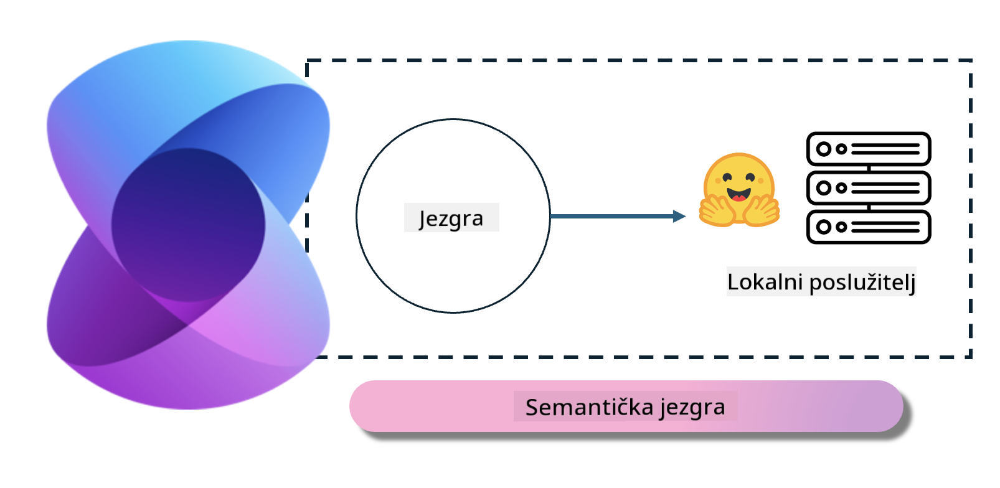
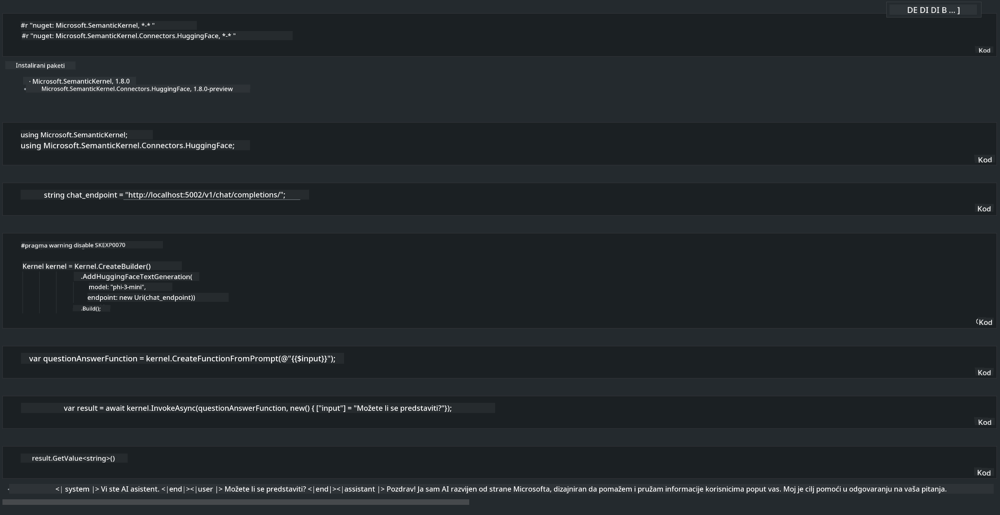

<!--
CO_OP_TRANSLATOR_METADATA:
{
  "original_hash": "bcf5dd7031db0031abdb9dd0c05ba118",
  "translation_date": "2025-05-09T12:09:42+00:00",
  "source_file": "md/01.Introduction/03/Local_Server_Inference.md",
  "language_code": "hr"
}
-->
# **Inferencija Phi-3 na lokalnom serveru**

Phi-3 možemo postaviti na lokalni server. Korisnici mogu odabrati rješenja poput [Ollama](https://ollama.com) ili [LM Studio](https://llamaedge.com), ili mogu napisati vlastiti kod. Phi-3 lokalne usluge možete povezati putem [Semantic Kernel](https://github.com/microsoft/semantic-kernel?WT.mc_id=aiml-138114-kinfeylo) ili [Langchain](https://www.langchain.com/) za izgradnju Copilot aplikacija.

## **Korištenje Semantic Kernel za pristup Phi-3-mini**

U Copilot aplikaciji stvaramo aplikacije preko Semantic Kernel / LangChain. Ovaj tip aplikacijskog okvira općenito je kompatibilan s Azure OpenAI Service / OpenAI modelima, a može podržavati i open source modele s Hugging Face te lokalne modele. Što trebamo napraviti ako želimo koristiti Semantic Kernel za pristup Phi-3-mini? Kao primjer uzimamo .NET, gdje ga možemo kombinirati s Hugging Face Connectorom u Semantic Kernelu. Po defaultu, on može odgovarati model id-u na Hugging Faceu (pri prvom korištenju model će se preuzeti s Hugging Facea, što traje duže). Također se možete povezati s lokalno izgrađenom uslugom. Preporučujemo korištenje ove druge opcije jer pruža veću autonomiju, posebno u enterprise aplikacijama.

Iz slike se vidi da pristup lokalnim uslugama putem Semantic Kernel lako povezuje s vlastitim Phi-3-mini model serverom. Ovo je rezultat izvođenja:

***Sample Code*** https://github.com/kinfey/Phi3MiniSamples/tree/main/semantickernel

**Odricanje od odgovornosti**:  
Ovaj dokument je preveden korištenjem AI prevoditeljskog servisa [Co-op Translator](https://github.com/Azure/co-op-translator). Iako težimo točnosti, imajte na umu da automatski prijevodi mogu sadržavati pogreške ili netočnosti. Izvorni dokument na izvornom jeziku treba smatrati autoritativnim izvorom. Za važne informacije preporučuje se profesionalni ljudski prijevod. Nismo odgovorni za bilo kakve nesporazume ili pogrešna tumačenja koja proizlaze iz korištenja ovog prijevoda.