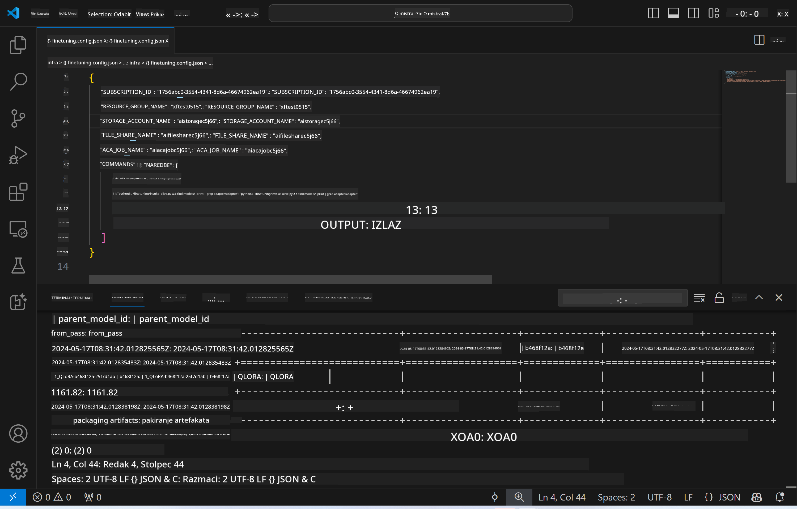
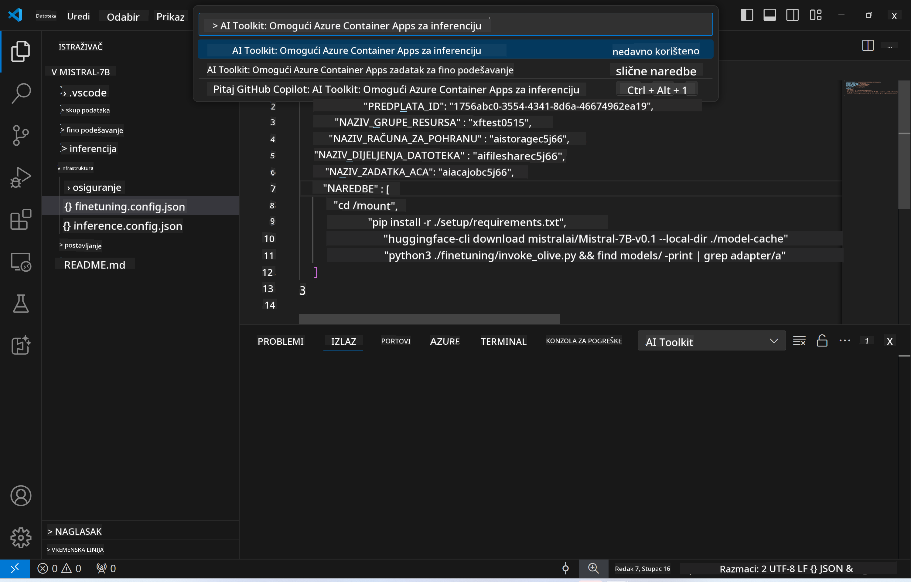
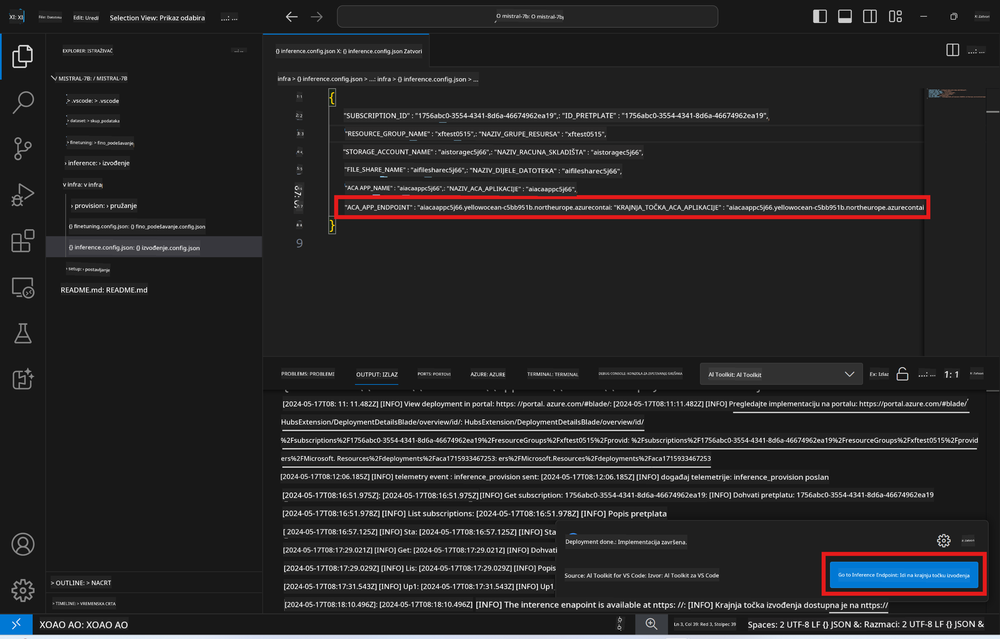

<!--
CO_OP_TRANSLATOR_METADATA:
{
  "original_hash": "a54cd3d65b6963e4e8ce21e143c3ab04",
  "translation_date": "2025-05-09T12:47:55+00:00",
  "source_file": "md/01.Introduction/03/Remote_Interence.md",
  "language_code": "hr"
}
-->
# Remote Inferencing s fino podešenim modelom

Nakon što su adapteri trenirani u udaljenom okruženju, koristite jednostavnu Gradio aplikaciju za interakciju s modelom.



### Postavljanje Azure resursa
Potrebno je postaviti Azure resurse za udaljeno izvođenje izvođenjem `AI Toolkit: Provision Azure Container Apps for inference` iz palete naredbi. Tijekom ovog postupka bit ćete upitani da odaberete svoj Azure pretplatu i grupu resursa.  

   
Prema zadanim postavkama, pretplata i grupa resursa za izvođenje trebaju odgovarati onima korištenima za fino podešavanje. Izvođenje će koristiti isto Azure Container App okruženje i pristupiti modelu i adapteru modela pohranjenima u Azure Files, koji su generirani tijekom koraka fino podešavanja.

## Korištenje AI Toolkit-a

### Postavljanje za izvođenje  
Ako želite izmijeniti kod za izvođenje ili ponovno učitati model za izvođenje, izvršite naredbu `AI Toolkit: Deploy for inference`. To će sinkronizirati vaš najnoviji kod s ACA i ponovno pokrenuti repliku.  


Nakon uspješnog dovršetka postavljanja, model je spreman za evaluaciju putem ove krajnje točke.

### Pristup API-ju za izvođenje

Do API-ja za izvođenje možete pristupiti klikom na gumb "*Go to Inference Endpoint*" prikazan u VSCode obavijesti. Alternativno, web API krajnja točka može se pronaći pod `ACA_APP_ENDPOINT` u `./infra/inference.config.json` i u izlaznom panelu.



> **Note:** Krajnja točka za izvođenje može trebati nekoliko minuta da postane potpuno operativna.

## Komponente izvođenja uključene u predložak
 
| Folder | Sadržaj |
| ------ |--------- |
| `infra` | Sadrži sve potrebne konfiguracije za udaljene operacije. |
| `infra/provision/inference.parameters.json` | Sadrži parametre za bicep predloške, koji se koriste za postavljanje Azure resursa za izvođenje. |
| `infra/provision/inference.bicep` | Sadrži predloške za postavljanje Azure resursa za izvođenje. |
| `infra/inference.config.json` | Konfiguracijska datoteka, generirana naredbom `AI Toolkit: Provision Azure Container Apps for inference`. Koristi se kao ulaz za druge udaljene palete naredbi. |

### Korištenje AI Toolkit-a za konfiguraciju Azure resursa
Konfigurirajte [AI Toolkit](https://marketplace.visualstudio.com/items?itemName=ms-windows-ai-studio.windows-ai-studio)

Postavite Azure Container Apps za izvođenje ` command.

You can find configuration parameters in `./infra/provision/inference.parameters.json` file. Here are the details:
| Parameter | Description |
| --------- |------------ |
| `defaultCommands` | This is the commands to initiate a web API. |
| `maximumInstanceCount` | This parameter sets the maximum capacity of GPU instances. |
| `location` | This is the location where Azure resources are provisioned. The default value is the same as the chosen resource group's location. |
| `storageAccountName`, `fileShareName` `acaEnvironmentName`, `acaEnvironmentStorageName`, `acaAppName`,  `acaLogAnalyticsName` | These parameters are used to name the Azure resources for provision. By default, they will be same to the fine-tuning resource name. You can input a new, unused resource name to create your own custom-named resources, or you can input the name of an already existing Azure resource if you'd prefer to use that. For details, refer to the section [Using existing Azure Resources](../../../../../md/01.Introduction/03). |

### Using Existing Azure Resources

By default, the inference provision use the same Azure Container App Environment, Storage Account, Azure File Share, and Azure Log Analytics that were used for fine-tuning. A separate Azure Container App is created solely for the inference API. 

If you have customized the Azure resources during the fine-tuning step or want to use your own existing Azure resources for inference, specify their names in the `./infra/inference.parameters.json` datoteka. Zatim pokrenite naredbu `AI Toolkit: Provision Azure Container Apps for inference` iz palete naredbi. To će ažurirati navedene resurse i kreirati one koji nedostaju.

Na primjer, ako imate postojeće Azure container okruženje, vaša `./infra/finetuning.parameters.json` datoteka trebala bi izgledati ovako:

```json
{
    "$schema": "https://schema.management.azure.com/schemas/2019-04-01/deploymentParameters.json#",
    "contentVersion": "1.0.0.0",
    "parameters": {
      ...
      "acaEnvironmentName": {
        "value": "<your-aca-env-name>"
      },
      "acaEnvironmentStorageName": {
        "value": null
      },
      ...
    }
  }
```

### Ručno postavljanje  
Ako radije ručno konfigurirate Azure resurse, možete koristiti dostupne bicep datoteke u `./infra/provision` folders. If you have already set up and configured all the Azure resources without using the AI Toolkit command palette, you can simply enter the resource names in the `inference.config.json` datoteci.

Na primjer:

```json
{
  "SUBSCRIPTION_ID": "<your-subscription-id>",
  "RESOURCE_GROUP_NAME": "<your-resource-group-name>",
  "STORAGE_ACCOUNT_NAME": "<your-storage-account-name>",
  "FILE_SHARE_NAME": "<your-file-share-name>",
  "ACA_APP_NAME": "<your-aca-name>",
  "ACA_APP_ENDPOINT": "<your-aca-endpoint>"
}
```

**Odricanje od odgovornosti**:  
Ovaj dokument preveden je korištenjem AI usluge za prijevod [Co-op Translator](https://github.com/Azure/co-op-translator). Iako nastojimo postići točnost, imajte na umu da automatski prijevodi mogu sadržavati pogreške ili netočnosti. Izvorni dokument na izvornom jeziku treba smatrati autoritativnim izvorom. Za kritične informacije preporučuje se profesionalni ljudski prijevod. Nismo odgovorni za bilo kakve nesporazume ili kriva tumačenja proizašla iz korištenja ovog prijevoda.