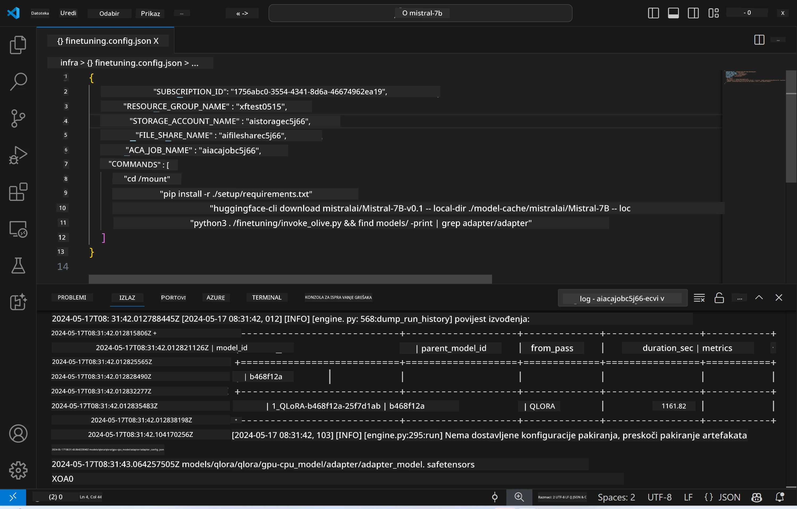
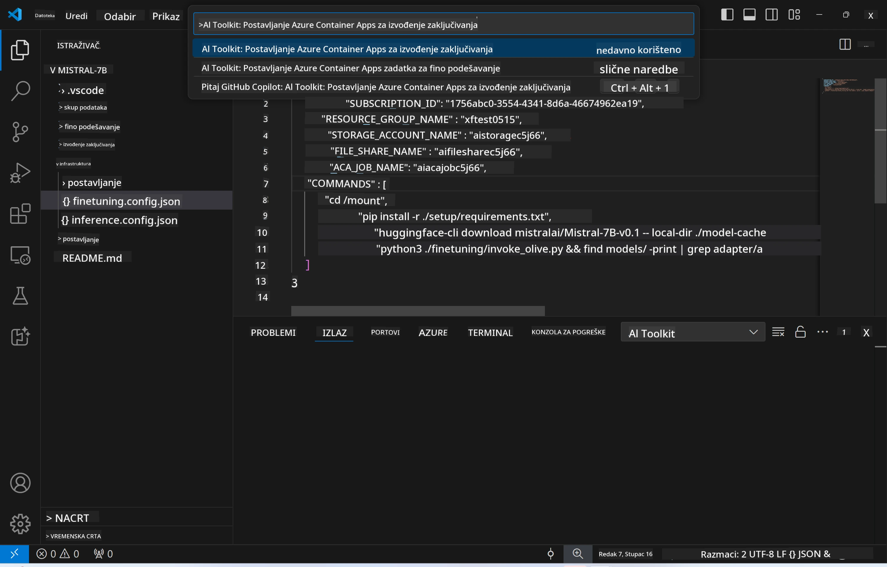
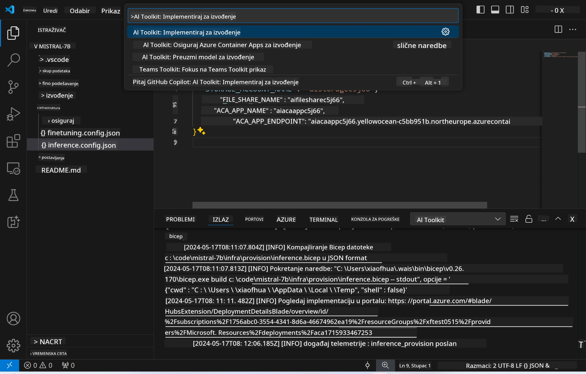

# Remote Inferencing s fino podešenim modelom

Nakon što su adapteri trenirani u udaljenom okruženju, koristite jednostavnu Gradio aplikaciju za interakciju s modelom.



### Postavljanje Azure resursa  
Potrebno je postaviti Azure resurse za udaljeno izvođenje inferencije pokretanjem naredbe `AI Toolkit: Provision Azure Container Apps for inference` iz palete naredbi. Tijekom ovog postupka bit ćete upitani da odaberete svoju Azure pretplatu i grupu resursa.  


Prema zadanim postavkama, pretplata i grupa resursa za inferenciju trebaju biti iste kao one korištene za fino podešavanje. Inferencija će koristiti isto Azure Container App okruženje i pristupiti modelu i adapteru modela pohranjenim u Azure Files, koji su generirani tijekom koraka fino podešavanja.

## Korištenje AI Toolkit-a

### Deploy za inferenciju  
Ako želite izmijeniti kod za inferenciju ili ponovno učitati model za inferenciju, pokrenite naredbu `AI Toolkit: Deploy for inference`. Time ćete sinkronizirati najnoviji kod s ACA i ponovno pokrenuti repliku.



Nakon uspješnog dovršetka deploya, model je spreman za evaluaciju putem ovog endpointa.

### Pristup API-ju za inferenciju

API za inferenciju možete pristupiti klikom na gumb "*Go to Inference Endpoint*" koji se prikazuje u VSCode obavijesti. Alternativno, web API endpoint možete pronaći pod `ACA_APP_ENDPOINT` u datoteci `./infra/inference.config.json` i u izlaznom panelu.


> **Note:** Endpoint za inferenciju može trebati nekoliko minuta da postane potpuno operativan.

## Komponente za inferenciju uključene u predložak

| Mapa | Sadržaj |
| ------ |--------- |
| `infra` | Sadrži sve potrebne konfiguracije za udaljeni rad. |
| `infra/provision/inference.parameters.json` | Sadrži parametre za bicep predloške, koji se koriste za postavljanje Azure resursa za inferenciju. |
| `infra/provision/inference.bicep` | Sadrži predloške za postavljanje Azure resursa za inferenciju. |
| `infra/inference.config.json` | Konfiguracijska datoteka, generirana naredbom `AI Toolkit: Provision Azure Container Apps for inference`. Koristi se kao ulaz za druge udaljene palete naredbi. |

### Korištenje AI Toolkit-a za konfiguraciju postavljanja Azure resursa  
Konfigurirajte [AI Toolkit](https://marketplace.visualstudio.com/items?itemName=ms-windows-ai-studio.windows-ai-studio)

Pokrenite naredbu `Provision Azure Container Apps for inference`.

Parametre konfiguracije možete pronaći u datoteci `./infra/provision/inference.parameters.json`. Evo detalja:  
| Parametar | Opis |
| --------- |------------ |
| `defaultCommands` | Naredbe za pokretanje web API-ja. |
| `maximumInstanceCount` | Postavlja maksimalni broj GPU instanci. |
| `location` | Lokacija na kojoj se postavljaju Azure resursi. Zadana vrijednost je ista kao lokacija odabrane grupe resursa. |
| `storageAccountName`, `fileShareName`, `acaEnvironmentName`, `acaEnvironmentStorageName`, `acaAppName`, `acaLogAnalyticsName` | Ovi parametri služe za imenovanje Azure resursa za postavljanje. Prema zadanim postavkama, isti su kao i imena resursa za fino podešavanje. Možete unijeti novo, neiskorišteno ime resursa za kreiranje vlastitih resursa s prilagođenim imenima ili možete unijeti ime već postojećeg Azure resursa ako želite koristiti njega. Za detalje pogledajte odjeljak [Using existing Azure Resources](../../../../../md/01.Introduction/03). |

### Korištenje postojećih Azure resursa

Prema zadanim postavkama, postavljanje inferencije koristi isto Azure Container App okruženje, Storage Account, Azure File Share i Azure Log Analytics koji su korišteni za fino podešavanje. Za inferencijski API kreira se zaseban Azure Container App.

Ako ste prilagodili Azure resurse tijekom koraka fino podešavanja ili želite koristiti vlastite postojeće Azure resurse za inferenciju, navedite njihova imena u datoteci `./infra/inference.parameters.json`. Zatim pokrenite naredbu `AI Toolkit: Provision Azure Container Apps for inference` iz palete naredbi. Time će se ažurirati navedeni resursi i kreirati oni koji nedostaju.

Na primjer, ako imate postojeće Azure container okruženje, vaša datoteka `./infra/finetuning.parameters.json` trebala bi izgledati ovako:

```json
{
    "$schema": "https://schema.management.azure.com/schemas/2019-04-01/deploymentParameters.json#",
    "contentVersion": "1.0.0.0",
    "parameters": {
      ...
      "acaEnvironmentName": {
        "value": "<your-aca-env-name>"
      },
      "acaEnvironmentStorageName": {
        "value": null
      },
      ...
    }
  }
```

### Ručno postavljanje  
Ako želite ručno konfigurirati Azure resurse, možete koristiti priložene bicep datoteke u mapama `./infra/provision`. Ako ste već postavili i konfigurirali sve Azure resurse bez korištenja AI Toolkit palete naredbi, jednostavno unesite imena resursa u datoteku `inference.config.json`.

Na primjer:

```json
{
  "SUBSCRIPTION_ID": "<your-subscription-id>",
  "RESOURCE_GROUP_NAME": "<your-resource-group-name>",
  "STORAGE_ACCOUNT_NAME": "<your-storage-account-name>",
  "FILE_SHARE_NAME": "<your-file-share-name>",
  "ACA_APP_NAME": "<your-aca-name>",
  "ACA_APP_ENDPOINT": "<your-aca-endpoint>"
}
```

**Odricanje od odgovornosti**:  
Ovaj dokument je preveden korištenjem AI usluge za prevođenje [Co-op Translator](https://github.com/Azure/co-op-translator). Iako težimo točnosti, imajte na umu da automatski prijevodi mogu sadržavati pogreške ili netočnosti. Izvorni dokument na izvornom jeziku treba smatrati autoritativnim izvorom. Za kritične informacije preporučuje se profesionalni ljudski prijevod. Ne snosimo odgovornost za bilo kakve nesporazume ili pogrešna tumačenja koja proizlaze iz korištenja ovog prijevoda.