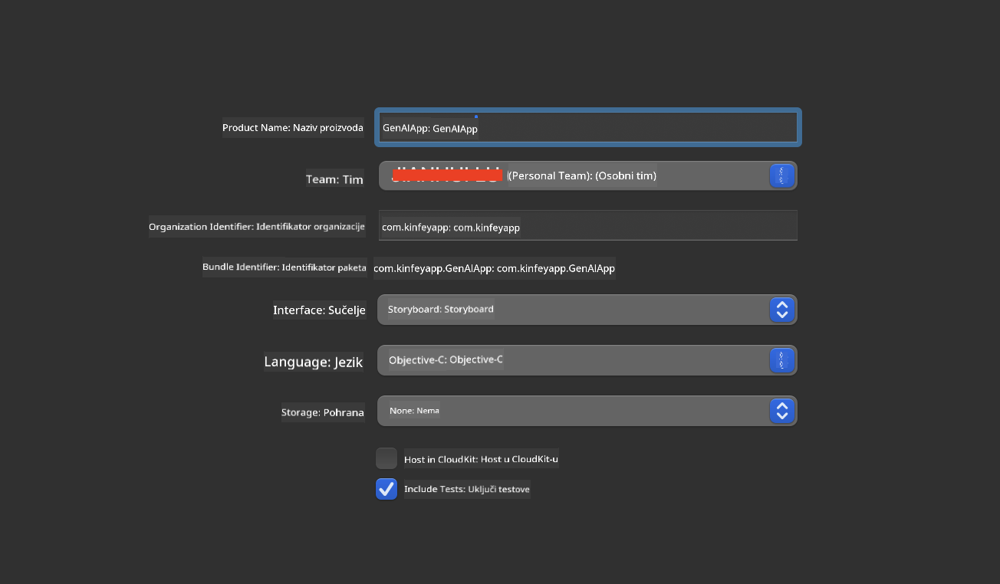
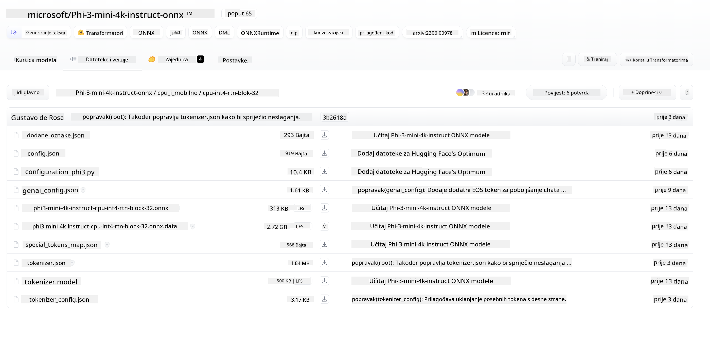
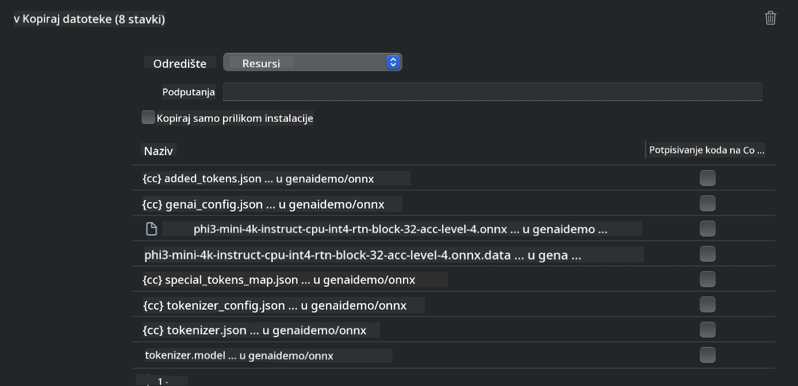
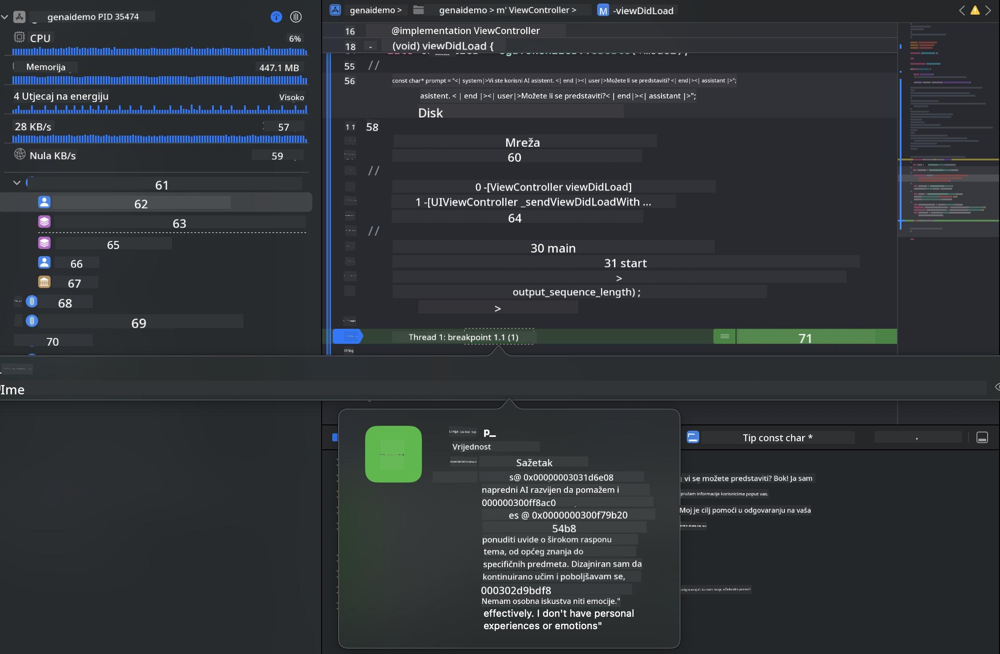

<!--
CO_OP_TRANSLATOR_METADATA:
{
  "original_hash": "82af197df38d25346a98f1f0e84d1698",
  "translation_date": "2025-07-16T20:25:07+00:00",
  "source_file": "md/01.Introduction/03/iOS_Inference.md",
  "language_code": "hr"
}
-->
# **Izvođenje Phi-3 na iOS-u**

Phi-3-mini je nova serija modela iz Microsofta koja omogućuje implementaciju velikih jezičnih modela (LLM) na edge uređajima i IoT uređajima. Phi-3-mini je dostupan za iOS, Android i Edge Device implementacije, što omogućuje generativnoj umjetnoj inteligenciji rad u BYOD okruženjima. Sljedeći primjer pokazuje kako implementirati Phi-3-mini na iOS-u.

## **1. Priprema**

- **a.** macOS 14+
- **b.** Xcode 15+
- **c.** iOS SDK 17.x (iPhone 14 A16 ili noviji)
- **d.** Instalirajte Python 3.10+ (preporučuje se Conda)
- **e.** Instalirajte Python biblioteku: `python-flatbuffers`
- **f.** Instalirajte CMake

### Semantic Kernel i izvođenje

Semantic Kernel je aplikacijski okvir koji vam omogućuje stvaranje aplikacija kompatibilnih s Azure OpenAI Service, OpenAI modelima, pa čak i lokalnim modelima. Pristup lokalnim uslugama preko Semantic Kernel-a omogućuje jednostavnu integraciju s vašim samostalno hostanim Phi-3-mini model serverom.

### Pozivanje kvantiziranih modela s Ollama ili LlamaEdge

Mnogi korisnici preferiraju korištenje kvantiziranih modela za lokalno pokretanje modela. [Ollama](https://ollama.com) i [LlamaEdge](https://llamaedge.com) omogućuju korisnicima pozivanje različitih kvantiziranih modela:

#### **Ollama**

Možete pokrenuti `ollama run phi3` direktno ili ga konfigurirati offline. Kreirajte Modelfile s putanjom do vašeg `gguf` fajla. Primjer koda za pokretanje Phi-3-mini kvantiziranog modela:

```gguf
FROM {Add your gguf file path}
TEMPLATE \"\"\"<|user|> .Prompt<|end|> <|assistant|>\"\"\"
PARAMETER stop <|end|>
PARAMETER num_ctx 4096
```

#### **LlamaEdge**

Ako želite koristiti `gguf` istovremeno u oblaku i na edge uređajima, LlamaEdge je izvrsna opcija.

## **2. Kompilacija ONNX Runtime za iOS**

```bash

git clone https://github.com/microsoft/onnxruntime.git

cd onnxruntime

./build.sh --build_shared_lib --ios --skip_tests --parallel --build_dir ./build_ios --ios --apple_sysroot iphoneos --osx_arch arm64 --apple_deploy_target 17.5 --cmake_generator Xcode --config Release

cd ../

```

### **Napomena**

- **a.** Prije kompilacije, provjerite je li Xcode pravilno konfiguriran i postavite ga kao aktivni developerski direktorij u terminalu:

    ```bash
    sudo xcode-select -switch /Applications/Xcode.app/Contents/Developer
    ```

- **b.** ONNX Runtime treba biti kompajliran za različite platforme. Za iOS možete kompilirati za `arm64` ili `x86_64`.

- **c.** Preporučuje se korištenje najnovijeg iOS SDK-a za kompilaciju. Međutim, možete koristiti i stariju verziju ako vam je potrebna kompatibilnost s prethodnim SDK-ovima.

## **3. Kompilacija Generative AI s ONNX Runtime za iOS**

> **Napomena:** Budući da je Generative AI s ONNX Runtime u preview fazi, imajte na umu moguće promjene.

```bash

git clone https://github.com/microsoft/onnxruntime-genai
 
cd onnxruntime-genai
 
mkdir ort
 
cd ort
 
mkdir include
 
mkdir lib
 
cd ../
 
cp ../onnxruntime/include/onnxruntime/core/session/onnxruntime_c_api.h ort/include
 
cp ../onnxruntime/build_ios/Release/Release-iphoneos/libonnxruntime*.dylib* ort/lib
 
export OPENCV_SKIP_XCODEBUILD_FORCE_TRYCOMPILE_DEBUG=1
 
python3 build.py --parallel --build_dir ./build_ios --ios --ios_sysroot iphoneos --ios_arch arm64 --ios_deployment_target 17.5 --cmake_generator Xcode --cmake_extra_defines CMAKE_XCODE_ATTRIBUTE_CODE_SIGNING_ALLOWED=NO

```

## **4. Kreiranje App aplikacije u Xcode-u**

Odabrao sam Objective-C kao metodu razvoja aplikacije jer je korištenje Generative AI s ONNX Runtime C++ API-jem bolje kompatibilno s Objective-C-jem. Naravno, povezivanje s pozivima možete napraviti i preko Swift bridginga.



## **5. Kopiranje ONNX kvantiziranog INT4 modela u projekt App aplikacije**

Potrebno je uvesti INT4 kvantizirani model u ONNX formatu, koji je potrebno prvo preuzeti.



Nakon preuzimanja, potrebno ga je dodati u direktorij Resources unutar projekta u Xcode-u.



## **6. Dodavanje C++ API-ja u ViewControllers**

> **Napomena:**

- **a.** Dodajte odgovarajuće C++ zaglavne datoteke u projekt.

  

- **b.** Uključite `onnxruntime-genai` dinamičku biblioteku u Xcode.

  

- **c.** Koristite C primjere koda za testiranje. Također možete dodati dodatne funkcionalnosti poput ChatUI za bogatije mogućnosti.

- **d.** Budući da trebate koristiti C++ u projektu, preimenujte `ViewController.m` u `ViewController.mm` kako biste omogućili podršku za Objective-C++.

```objc

    NSString *llmPath = [[NSBundle mainBundle] resourcePath];
    char const *modelPath = llmPath.cString;

    auto model =  OgaModel::Create(modelPath);

    auto tokenizer = OgaTokenizer::Create(*model);

    const char* prompt = "<|system|>You are a helpful AI assistant.<|end|><|user|>Can you introduce yourself?<|end|><|assistant|>";

    auto sequences = OgaSequences::Create();
    tokenizer->Encode(prompt, *sequences);

    auto params = OgaGeneratorParams::Create(*model);
    params->SetSearchOption("max_length", 100);
    params->SetInputSequences(*sequences);

    auto output_sequences = model->Generate(*params);
    const auto output_sequence_length = output_sequences->SequenceCount(0);
    const auto* output_sequence_data = output_sequences->SequenceData(0);
    auto out_string = tokenizer->Decode(output_sequence_data, output_sequence_length);
    
    auto tmp = out_string;

```

## **7. Pokretanje aplikacije**

Nakon što je sve postavljeno, možete pokrenuti aplikaciju i vidjeti rezultate izvođenja Phi-3-mini modela.



Za više primjera koda i detaljne upute, posjetite [Phi-3 Mini Samples repozitorij](https://github.com/Azure-Samples/Phi-3MiniSamples/tree/main/ios).

**Odricanje od odgovornosti**:  
Ovaj dokument je preveden korištenjem AI usluge za prevođenje [Co-op Translator](https://github.com/Azure/co-op-translator). Iako težimo točnosti, imajte na umu da automatski prijevodi mogu sadržavati pogreške ili netočnosti. Izvorni dokument na izvornom jeziku treba smatrati autoritativnim izvorom. Za kritične informacije preporučuje se profesionalni ljudski prijevod. Ne snosimo odgovornost za bilo kakva nesporazume ili pogrešna tumačenja koja proizlaze iz korištenja ovog prijevoda.