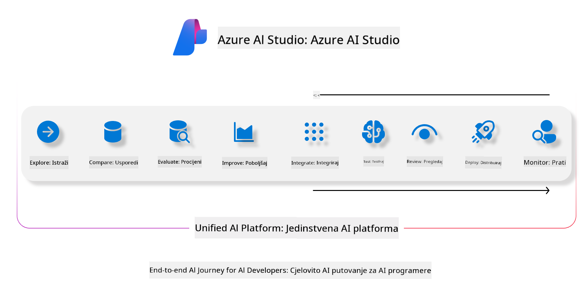

<!--
CO_OP_TRANSLATOR_METADATA:
{
  "original_hash": "7b4235159486df4000e16b7b46ddfec3",
  "translation_date": "2025-05-09T15:04:58+00:00",
  "source_file": "md/01.Introduction/05/AIFoundry.md",
  "language_code": "hr"
}
-->
# **Korištenje Azure AI Foundry za evaluaciju**

Kako evaluirati svoju generativnu AI aplikaciju koristeći [Azure AI Foundry](https://ai.azure.com?WT.mc_id=aiml-138114-kinfeylo). Bilo da procjenjujete jednokratne ili višekratne razgovore, Azure AI Foundry pruža alate za ocjenu performansi i sigurnosti modela.

## Kako evaluirati generativne AI aplikacije s Azure AI Foundry
Za detaljnije upute pogledajte [Azure AI Foundry dokumentaciju](https://learn.microsoft.com/azure/ai-studio/how-to/evaluate-generative-ai-app?WT.mc_id=aiml-138114-kinfeylo)

Evo koraka za početak:

## Evaluacija generativnih AI modela u Azure AI Foundry

**Preduvjeti**

- Testni skup podataka u CSV ili JSON formatu.
- Implementirani generativni AI model (kao što su Phi-3, GPT 3.5, GPT 4 ili Davinci modeli).
- Runtime okruženje s računalnim instancom za pokretanje evaluacije.

## Ugrađene metrike evaluacije

Azure AI Foundry omogućuje evaluaciju kako jednokratnih tako i složenih višekratnih razgovora.  
Za Retrieval Augmented Generation (RAG) scenarije, gdje je model temeljen na specifičnim podacima, možete procijeniti performanse koristeći ugrađene metrike evaluacije.  
Također, moguće je evaluirati opće jednokratne scenarije odgovaranja na pitanja (ne-RAG).

## Kreiranje evaluacijskog pokretanja

Iz sučelja Azure AI Foundry, idite na stranicu Evaluate ili Prompt Flow.  
Slijedite čarobnjak za kreiranje evaluacije kako biste postavili evaluacijsko pokretanje. Unesite opcionalni naziv za evaluaciju.  
Odaberite scenarij koji odgovara ciljevima vaše aplikacije.  
Izaberite jednu ili više metrika evaluacije za procjenu izlaza modela.

## Prilagođeni evaluacijski tijek (opcionalno)

Za veću fleksibilnost, možete uspostaviti prilagođeni tijek evaluacije. Prilagodite proces evaluacije prema svojim specifičnim potrebama.

## Pregled rezultata

Nakon pokretanja evaluacije, evidentirajte, pregledajte i analizirajte detaljne metrike evaluacije u Azure AI Foundry. Dobijte uvid u mogućnosti i ograničenja vaše aplikacije.

**Note** Azure AI Foundry je trenutno u javnoj preview verziji, stoga ga koristite za eksperimentiranje i razvojne svrhe. Za produkcijske zadatke razmotrite druge opcije. Za više detalja i korak-po-korak upute, proučite službenu [AI Foundry dokumentaciju](https://learn.microsoft.com/azure/ai-studio/?WT.mc_id=aiml-138114-kinfeylo).

**Izjava o odricanju odgovornosti**:  
Ovaj dokument preveden je pomoću AI prevoditeljskog servisa [Co-op Translator](https://github.com/Azure/co-op-translator). Iako težimo točnosti, imajte na umu da automatski prijevodi mogu sadržavati pogreške ili netočnosti. Izvorni dokument na izvornom jeziku treba smatrati službenim i autoritativnim izvorom. Za kritične informacije preporučuje se profesionalni ljudski prijevod. Ne snosimo odgovornost za bilo kakva nesporazuma ili pogrešne interpretacije koje proizlaze iz korištenja ovog prijevoda.