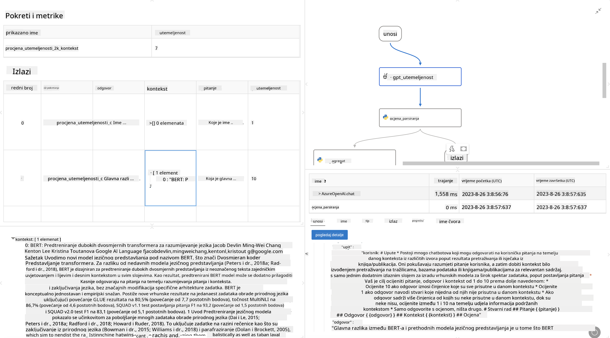

<!--
CO_OP_TRANSLATOR_METADATA:
{
  "original_hash": "3cbe7629d254f1043193b7fe22524d55",
  "translation_date": "2025-05-09T15:23:47+00:00",
  "source_file": "md/01.Introduction/05/Promptflow.md",
  "language_code": "hr"
}
-->
# **Uvod u Promptflow**

[Microsoft Prompt Flow](https://microsoft.github.io/promptflow/index.html?WT.mc_id=aiml-138114-kinfeylo) je vizualni alat za automatizaciju tijeka rada koji korisnicima omogućuje kreiranje automatiziranih tijekova rada koristeći unaprijed izrađene predloške i prilagođene konektore. Dizajniran je kako bi programerima i poslovnim analitičarima omogućio brzo stvaranje automatiziranih procesa za zadatke poput upravljanja podacima, suradnje i optimizacije procesa. Uz Prompt Flow, korisnici lako mogu povezati različite usluge, aplikacije i sustave te automatizirati složene poslovne procese.

Microsoft Prompt Flow je osmišljen kako bi pojednostavio cijeli razvojni ciklus AI aplikacija koje pokreću Large Language Models (LLMs). Bilo da razvijate ideje, radite prototip, testirate, evaluirate ili implementirate aplikacije temeljene na LLM-ovima, Prompt Flow pojednostavljuje proces i omogućuje vam izgradnju LLM aplikacija proizvodne kvalitete.

## Ključne značajke i prednosti korištenja Microsoft Prompt Flow:

**Interaktivno iskustvo izrade**

Prompt Flow pruža vizualni prikaz strukture vašeg tijeka rada, što olakšava razumijevanje i navigaciju kroz projekte.
Nudi iskustvo pisanja koda slično bilježnici za učinkoviti razvoj i ispravljanje tijekova rada.

**Varijante i podešavanje promptova**

Kreirajte i uspoređujte više varijanti promptova kako biste olakšali iterativni proces dorade. Procijenite izvedbu različitih promptova i odaberite one najučinkovitije.

**Ugrađeni evaluacijski tijekovi**
Procijenite kvalitetu i učinkovitost vaših promptova i tijekova rada koristeći ugrađene evaluacijske alate.
Razumite koliko dobro vaše LLM aplikacije rade.

**Sveobuhvatni resursi**

Prompt Flow uključuje biblioteku ugrađenih alata, primjera i predložaka. Ti resursi služe kao polazna točka za razvoj, potiču kreativnost i ubrzavaju proces.

**Suradnja i spremnost za poduzeća**

Podržava timsku suradnju omogućavajući više korisnika da zajednički rade na projektima prompt inženjeringa.
Održava kontrolu verzija i učinkovito dijeli znanje. Pojednostavljuje cijeli proces prompt inženjeringa, od razvoja i evaluacije do implementacije i praćenja.

## Evaluacija u Prompt Flow

U Microsoft Prompt Flow-u, evaluacija ima ključnu ulogu u procjeni performansi vaših AI modela. Pogledajmo kako možete prilagoditi evaluacijske tijekove i metrike unutar Prompt Flow-a:

**Razumijevanje evaluacije u Prompt Flow-u**

U Prompt Flow-u, tijek rada predstavlja niz čvorova koji obrađuju ulaz i generiraju izlaz. Evaluacijski tijekovi su posebne vrste tijekova dizajnirane za procjenu performansi izvršavanja na temelju specifičnih kriterija i ciljeva.

**Ključne značajke evaluacijskih tijekova**

Obično se pokreću nakon tijeka koji se testira, koristeći njegove izlaze. Izračunavaju bodove ili metrike za mjerenje performansi testiranog tijeka. Metrike mogu uključivati točnost, ocjene relevantnosti ili druge relevantne mjere.

### Prilagođavanje evaluacijskih tijekova

**Definiranje ulaza**

Evaluacijski tijekovi trebaju primati izlaze testiranog tijeka. Definirajte ulaze slično kao kod standardnih tijekova.
Na primjer, ako evaluirate QnA tijek, nazovite ulaz "answer". Ako evaluirate klasifikacijski tijek, nazovite ulaz "category". Mogu biti potrebni i ulazi za stvarne oznake (ground truth).

**Izlazi i metrike**

Evaluacijski tijekovi proizvode rezultate koji mjere performanse testiranog tijeka. Metrike se mogu izračunavati pomoću Pythona ili LLM-a (Large Language Models). Koristite funkciju log_metric() za evidentiranje relevantnih metrika.

**Korištenje prilagođenih evaluacijskih tijekova**

Razvijte vlastiti evaluacijski tijek prilagođen vašim specifičnim zadacima i ciljevima. Prilagodite metrike prema svojim evaluacijskim potrebama.
Primijenite ovaj prilagođeni evaluacijski tijek na serijska pokretanja za testiranje u velikom opsegu.

## Ugrađene metode evaluacije

Prompt Flow također nudi ugrađene metode evaluacije.
Možete poslati serijska pokretanja i koristiti ove metode za procjenu kako vaš tijek radi s velikim skupovima podataka.
Pregledajte rezultate evaluacije, usporedite metrike i po potrebi iterirajte.
Zapamtite, evaluacija je ključna za osiguravanje da vaši AI modeli zadovoljavaju željene kriterije i ciljeve. Istražite službenu dokumentaciju za detaljne upute o razvoju i korištenju evaluacijskih tijekova u Microsoft Prompt Flow-u.

Ukratko, Microsoft Prompt Flow omogućuje programerima da stvaraju visokokvalitetne LLM aplikacije pojednostavljujući prompt inženjering i pružajući robusno razvojno okruženje. Ako radite s LLM-ovima, Prompt Flow je vrijedan alat za istraživanje. Pogledajte [Prompt Flow Evaluation Documents](https://learn.microsoft.com/azure/machine-learning/prompt-flow/how-to-develop-an-evaluation-flow?view=azureml-api-2?WT.mc_id=aiml-138114-kinfeylo) za detaljne upute o razvoju i korištenju evaluacijskih tijekova u Microsoft Prompt Flow-u.

**Odricanje od odgovornosti**:  
Ovaj dokument preveden je pomoću AI usluge za prevođenje [Co-op Translator](https://github.com/Azure/co-op-translator). Iako težimo točnosti, imajte na umu da automatski prijevodi mogu sadržavati pogreške ili netočnosti. Izvorni dokument na izvornom jeziku treba smatrati autoritativnim izvorom. Za kritične informacije preporučuje se profesionalni ljudski prijevod. Ne snosimo odgovornost za bilo kakva nesporazumevanja ili kriva tumačenja koja proizlaze iz korištenja ovog prijevoda.