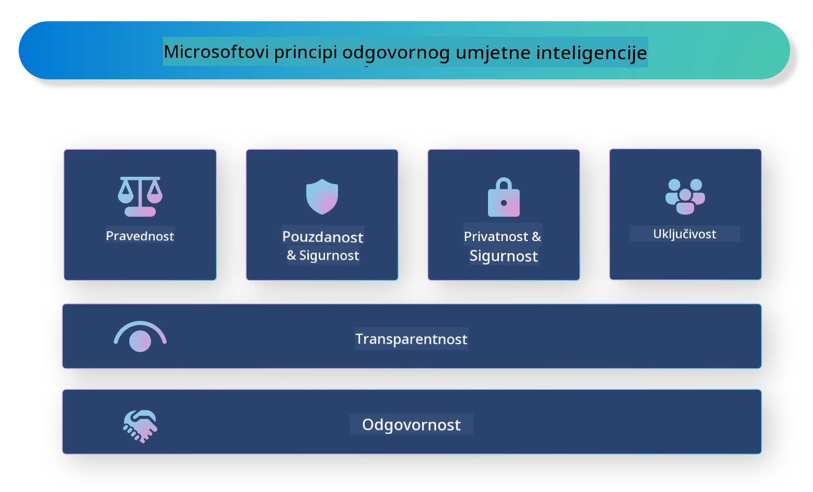

<!--
CO_OP_TRANSLATOR_METADATA:
{
  "original_hash": "805b96b20152936d8f4c587d90d6e06e",
  "translation_date": "2025-05-09T15:49:41+00:00",
  "source_file": "md/01.Introduction/05/ResponsibleAI.md",
  "language_code": "hr"
}
-->
# **Predstavljanje Odgovornog AI-a**

[Microsoft Responsible AI](https://www.microsoft.com/ai/responsible-ai?WT.mc_id=aiml-138114-kinfeylo) je inicijativa koja pomaže developerima i organizacijama u izgradnji AI sustava koji su transparentni, pouzdani i odgovorni. Inicijativa pruža smjernice i resurse za razvoj odgovornih AI rješenja koja su u skladu s etičkim načelima, poput privatnosti, pravičnosti i transparentnosti. Također ćemo istražiti neke od izazova i najboljih praksi vezanih uz izgradnju odgovornih AI sustava.

## Pregled Microsoft Responsible AI-a

**Etička načela**

Microsoft Responsible AI vodi se skupom etičkih načela kao što su privatnost, pravičnost, transparentnost, odgovornost i sigurnost. Ova načela osiguravaju da se AI sustavi razvijaju na etičan i odgovoran način.

**Transparentni AI**

Microsoft Responsible AI naglašava važnost transparentnosti u AI sustavima. To uključuje pružanje jasnih objašnjenja kako AI modeli funkcioniraju, kao i osiguravanje da izvori podataka i algoritmi budu javno dostupni.

**Odgovorni AI**

[Microsoft Responsible AI](https://www.microsoft.com/ai/responsible-ai?WT.mc_id=aiml-138114-kinfeylo) promiče razvoj odgovornih AI sustava koji mogu pružiti uvid u način donošenja odluka od strane AI modela. To pomaže korisnicima da razumiju i vjeruju rezultatima AI sustava.

**Uključivost**

AI sustavi trebaju biti dizajnirani tako da koriste svima. Microsoft želi stvoriti inkluzivni AI koji uzima u obzir različite perspektive i izbjegava pristranost ili diskriminaciju.

**Pouzdanost i sigurnost**

Osiguravanje da su AI sustavi pouzdani i sigurni je ključno. Microsoft se fokusira na izgradnju robusnih modela koji dosljedno rade i izbjegavaju štetne ishode.

**Pravičnost u AI-u**

Microsoft Responsible AI prepoznaje da AI sustavi mogu perpetuirati pristranosti ako su trenirani na pristranim podacima ili algoritmima. Inicijativa pruža smjernice za razvoj pravičnih AI sustava koji ne diskriminiraju na temelju faktora poput rase, spola ili dobi.

**Privatnost i sigurnost**

Microsoft Responsible AI naglašava važnost zaštite privatnosti korisnika i sigurnosti podataka u AI sustavima. To uključuje implementaciju snažne enkripcije podataka i kontrola pristupa, kao i redovite revizije AI sustava radi otkrivanja ranjivosti.

**Odgovornost i odgovornost**

Microsoft Responsible AI promiče odgovornost i odgovornost u razvoju i primjeni AI-a. To uključuje osiguravanje da developeri i organizacije budu svjesni potencijalnih rizika povezanih s AI sustavima i poduzimaju korake za njihovo ublažavanje.

## Najbolje prakse za izgradnju odgovornih AI sustava

**Razvijajte AI modele koristeći raznolike skupove podataka**

Kako biste izbjegli pristranost u AI sustavima, važno je koristiti raznolike skupove podataka koji predstavljaju širok spektar perspektiva i iskustava.

**Koristite tehnike objašnjivog AI-a**

Tehnike objašnjivog AI-a pomažu korisnicima da razumiju kako AI modeli donose odluke, što povećava povjerenje u sustav.

**Redovito provodite reviziju AI sustava radi ranjivosti**

Redovite revizije AI sustava pomažu u identificiranju potencijalnih rizika i ranjivosti koje treba riješiti.

**Implementirajte snažnu enkripciju podataka i kontrole pristupa**

Enkripcija podataka i kontrole pristupa pomažu u zaštiti privatnosti i sigurnosti korisnika u AI sustavima.

**Pridržavajte se etičkih načela u razvoju AI-a**

Pridržavanje etičkih načela kao što su pravičnost, transparentnost i odgovornost pomaže u izgradnji povjerenja u AI sustave i osigurava njihov odgovoran razvoj.

## Korištenje AI Foundry za Odgovorni AI

[Azure AI Foundry](https://ai.azure.com?WT.mc_id=aiml-138114-kinfeylo) je moćna platforma koja developerima i organizacijama omogućuje brzo stvaranje inteligentnih, suvremenih, tržišno spremnih i odgovornih aplikacija. Evo nekoliko ključnih značajki i mogućnosti Azure AI Foundry:

**Gotovi API-ji i modeli**

Azure AI Foundry nudi unaprijed izrađene i prilagodljive API-je i modele. Oni pokrivaju širok raspon AI zadataka, uključujući generativni AI, obradu prirodnog jezika za razgovore, pretraživanje, nadzor, prijevod, govor, vid i donošenje odluka.

**Prompt Flow**

Prompt flow u Azure AI Foundry omogućuje kreiranje iskustava razgovornog AI-a. Omogućuje dizajn i upravljanje razgovornim tokovima, olakšavajući izgradnju chatbotova, virtualnih asistenata i drugih interaktivnih aplikacija.

**Retrieval Augmented Generation (RAG)**

RAG je tehnika koja kombinira pristupe temeljene na pretraživanju i generiranju. Poboljšava kvalitetu generiranih odgovora koristeći postojeće znanje (pretraživanje) i kreativno generiranje (generiranje).

**Evaluacija i metrike nadzora za generativni AI**

Azure AI Foundry pruža alate za evaluaciju i nadzor generativnih AI modela. Možete procijeniti njihovu izvedbu, pravičnost i druge važne metrike za osiguranje odgovorne primjene. Također, ako ste kreirali nadzornu ploču, možete koristiti no-code UI u Azure Machine Learning Studio za prilagodbu i generiranje Responsible AI Dashboarda i pridruženog scorecarda temeljenog na [Responsible AI Toolbox](https://responsibleaitoolbox.ai/?WT.mc_id=aiml-138114-kinfeylo) Python bibliotekama. Ovaj scorecard pomaže u dijeljenju ključnih uvida vezanih uz pravičnost, važnost značajki i druge aspekte odgovorne primjene s tehničkim i netehničkim dionicima.

Za korištenje AI Foundry s odgovornim AI-em, možete slijediti ove najbolje prakse:

**Definirajte problem i ciljeve vašeg AI sustava**

Prije početka razvoja važno je jasno definirati problem ili cilj koji vaš AI sustav želi riješiti. To će vam pomoći identificirati potrebne podatke, algoritme i resurse za izgradnju učinkovitog modela.

**Prikupite i unaprijed obradite relevantne podatke**

Kvaliteta i količina podataka korištenih za treniranje AI sustava značajno utječu na njegovu izvedbu. Stoga je važno prikupiti relevantne podatke, očistiti ih, unaprijed obraditi i osigurati da predstavljaju populaciju ili problem koji pokušavate riješiti.

**Odaberite prikladnu evaluaciju**

Postoje različiti algoritmi za evaluaciju. Važno je odabrati najprikladniji algoritam temeljen na vašim podacima i problemu.

**Evaluirajte i interpretirajte model**

Nakon što izgradite AI model, važno je procijeniti njegovu izvedbu koristeći odgovarajuće metrike i transparentno interpretirati rezultate. To će vam pomoći identificirati pristranosti ili ograničenja modela i izvršiti potrebna poboljšanja.

**Osigurajte transparentnost i objašnjivost**

AI sustavi trebaju biti transparentni i objašnjivi kako bi korisnici mogli razumjeti njihov rad i način donošenja odluka. To je posebno važno za aplikacije koje imaju značajan utjecaj na ljudske živote, poput zdravstva, financija i pravnih sustava.

**Nadzirite i ažurirajte model**

AI sustavi trebaju biti kontinuirano nadzirani i ažurirani kako bi ostali točni i učinkoviti tijekom vremena. To zahtijeva stalno održavanje, testiranje i ponovno treniranje modela.

Za kraj, Microsoft Responsible AI je inicijativa koja pomaže developerima i organizacijama u izgradnji AI sustava koji su transparentni, pouzdani i odgovorni. Zapamtite da je odgovorna implementacija AI-a ključna, a Azure AI Foundry nastoji učiniti to praktičnim za organizacije. Slijedeći etička načela i najbolje prakse, možemo osigurati da se AI sustavi razvijaju i primjenjuju na odgovoran način koji koristi društvu u cjelini.

**Odricanje od odgovornosti**:  
Ovaj dokument preveden je pomoću AI usluge za prevođenje [Co-op Translator](https://github.com/Azure/co-op-translator). Iako nastojimo postići točnost, imajte na umu da automatski prijevodi mogu sadržavati pogreške ili netočnosti. Izvorni dokument na izvornom jeziku treba smatrati autoritativnim izvorom. Za kritične informacije preporučuje se profesionalni ljudski prijevod. Ne snosimo odgovornost za bilo kakva nesporazumevanja ili pogrešne interpretacije koje proizlaze iz korištenja ovog prijevoda.