<!--
CO_OP_TRANSLATOR_METADATA:
{
  "original_hash": "80a853c08e4ee25ef9b4bfcedd8990da",
  "translation_date": "2025-05-09T17:17:28+00:00",
  "source_file": "md/02.Application/01.TextAndChat/Phi3/E2E_Phi-3-Evaluation_AIFoundry.md",
  "language_code": "hr"
}
-->
# Procijenite fino podešeni Phi-3 / Phi-3.5 model u Azure AI Foundry s fokusom na Microsoftove principe odgovornog AI-ja

Ovaj end-to-end (E2E) primjer temelji se na vodiču "[Evaluate Fine-tuned Phi-3 / 3.5 Models in Azure AI Foundry Focusing on Microsoft's Responsible AI](https://techcommunity.microsoft.com/blog/educatordeveloperblog/evaluate-fine-tuned-phi-3--3-5-models-in-azure-ai-studio-focusing-on-microsofts-/4227850?WT.mc_id=aiml-137032-kinfeylo)" iz Microsoft Tech Community.

## Pregled

### Kako možete procijeniti sigurnost i performanse fino podešenog Phi-3 / Phi-3.5 modela u Azure AI Foundry?

Fino podešavanje modela ponekad može dovesti do neželjenih ili neočekivanih odgovora. Da biste osigurali da model ostane siguran i učinkovit, važno je procijeniti njegov potencijal za generiranje štetnog sadržaja te sposobnost da proizvodi točne, relevantne i koherentne odgovore. U ovom vodiču naučit ćete kako procijeniti sigurnost i performanse fino podešenog Phi-3 / Phi-3.5 modela integriranog s Prompt flow u Azure AI Foundry.

Evo procesa evaluacije u Azure AI Foundry.

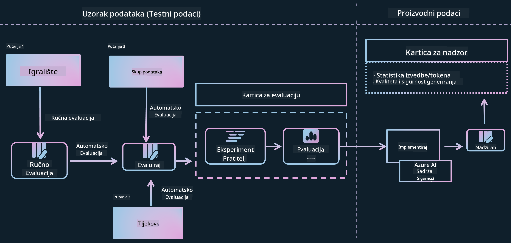

*Izvor slike: [Evaluation of generative AI applications](https://learn.microsoft.com/azure/ai-studio/concepts/evaluation-approach-gen-ai?wt.mc_id%3Dstudentamb_279723)*

> [!NOTE]
>
> Za detaljnije informacije i dodatne resurse o Phi-3 / Phi-3.5, posjetite [Phi-3CookBook](https://github.com/microsoft/Phi-3CookBook?wt.mc_id=studentamb_279723).

### Preduvjeti

- [Python](https://www.python.org/downloads)
- [Azure pretplata](https://azure.microsoft.com/free?wt.mc_id=studentamb_279723)
- [Visual Studio Code](https://code.visualstudio.com)
- Fino podešeni Phi-3 / Phi-3.5 model

### Sadržaj

1. [**Scenarij 1: Uvod u evaluaciju Prompt flow u Azure AI Foundry**](../../../../../../md/02.Application/01.TextAndChat/Phi3)

    - [Uvod u evaluaciju sigurnosti](../../../../../../md/02.Application/01.TextAndChat/Phi3)
    - [Uvod u evaluaciju performansi](../../../../../../md/02.Application/01.TextAndChat/Phi3)

1. [**Scenarij 2: Evaluacija Phi-3 / Phi-3.5 modela u Azure AI Foundry**](../../../../../../md/02.Application/01.TextAndChat/Phi3)

    - [Prije nego što počnete](../../../../../../md/02.Application/01.TextAndChat/Phi3)
    - [Postavljanje Azure OpenAI za evaluaciju Phi-3 / Phi-3.5 modela](../../../../../../md/02.Application/01.TextAndChat/Phi3)
    - [Evaluacija fino podešenog Phi-3 / Phi-3.5 modela koristeći Prompt flow evaluaciju u Azure AI Foundry](../../../../../../md/02.Application/01.TextAndChat/Phi3)

1. [Čestitamo!](../../../../../../md/02.Application/01.TextAndChat/Phi3)

## **Scenarij 1: Uvod u evaluaciju Prompt flow u Azure AI Foundry**

### Uvod u evaluaciju sigurnosti

Da biste osigurali da je vaš AI model etičan i siguran, ključno je procijeniti ga prema Microsoftovim principima odgovornog AI-ja. U Azure AI Foundry, evaluacije sigurnosti omogućuju procjenu ranjivosti modela na jailbreak napade i njegovog potencijala za generiranje štetnog sadržaja, što je u potpunosti usklađeno s tim principima.

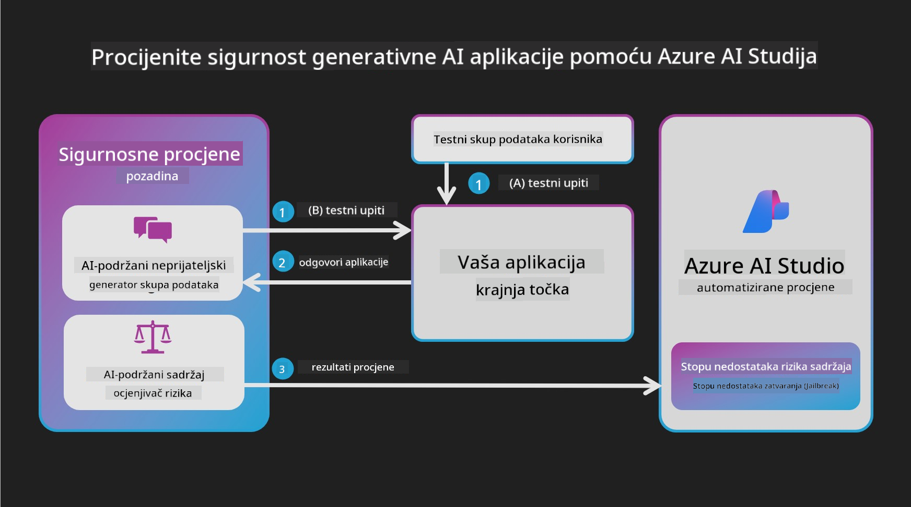

*Izvor slike: [Evaluation of generative AI applications](https://learn.microsoft.com/azure/ai-studio/concepts/evaluation-approach-gen-ai?wt.mc_id%3Dstudentamb_279723)*

#### Microsoftovi principi odgovornog AI-ja

Prije nego što započnete tehničke korake, važno je razumjeti Microsoftove principe odgovornog AI-ja, etički okvir osmišljen za vođenje odgovornog razvoja, implementacije i rada AI sustava. Ovi principi usmjeravaju odgovoran dizajn, razvoj i implementaciju AI sustava, osiguravajući da su AI tehnologije izgrađene na način koji je pravedan, transparentan i inkluzivan. Ti principi su temelj za procjenu sigurnosti AI modela.

Microsoftovi principi odgovornog AI-ja uključuju:

- **Pravednost i inkluzivnost**: AI sustavi trebaju sve tretirati pravedno i izbjegavati različite utjecaje na slične skupine ljudi. Na primjer, kada AI sustavi daju preporuke za medicinsku terapiju, zahtjeve za zajam ili zapošljavanje, trebaju davati iste preporuke svima koji imaju slične simptome, financijsku situaciju ili profesionalne kvalifikacije.

- **Pouzdanost i sigurnost**: Za izgradnju povjerenja, ključno je da AI sustavi rade pouzdano, sigurno i dosljedno. Ti sustavi trebaju raditi onako kako su prvotno dizajnirani, sigurno reagirati na neočekivane uvjete i biti otporni na štetne manipulacije. Njihovo ponašanje i raspon uvjeta koje mogu podnijeti odražavaju situacije i okolnosti koje su programeri predvidjeli tijekom dizajna i testiranja.

- **Transparentnost**: Kada AI sustavi pomažu u donošenju odluka koje imaju veliki utjecaj na živote ljudi, ključno je da ljudi razumiju kako su te odluke donesene. Na primjer, banka može koristiti AI sustav za odlučivanje o kreditnoj sposobnosti osobe. Tvrtka može koristiti AI sustav za odabir najkvalificiranijih kandidata za posao.

- **Privatnost i sigurnost**: Kako AI postaje sve prisutniji, zaštita privatnosti i sigurnost osobnih i poslovnih podataka postaju sve važniji i složeniji. S AI-jem, privatnost i sigurnost podataka zahtijevaju posebnu pažnju jer pristup podacima je ključan za točne i informirane predikcije i odluke o ljudima.

- **Odgovornost**: Osobe koje dizajniraju i implementiraju AI sustave moraju biti odgovorne za način na koji njihovi sustavi funkcioniraju. Organizacije bi trebale koristiti industrijske standarde za razvoj normi odgovornosti. Te norme mogu osigurati da AI sustavi nisu konačni autoritet za bilo koju odluku koja utječe na živote ljudi. Također mogu osigurati da ljudi zadrže značajnu kontrolu nad inače vrlo autonomnim AI sustavima.

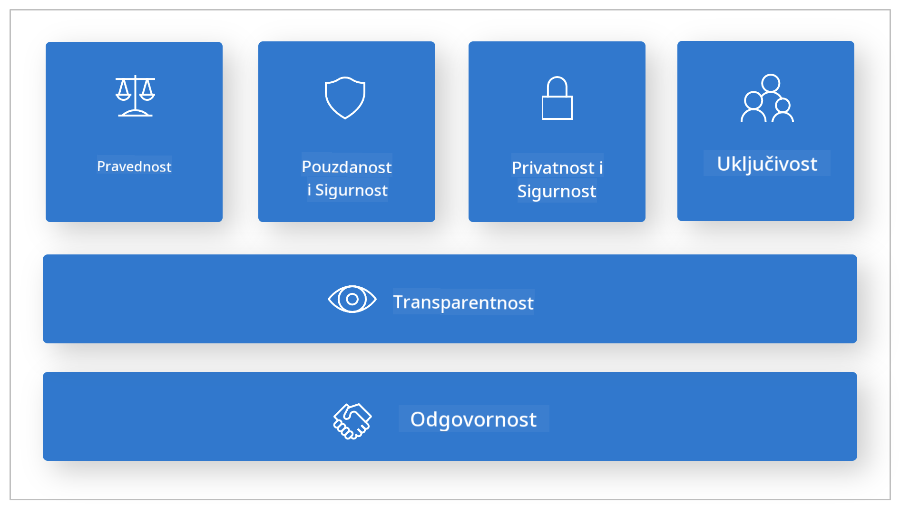

*Izvor slike: [What is Responsible AI?](https://learn.microsoft.com/azure/machine-learning/concept-responsible-ai?view=azureml-api-2&viewFallbackFrom=azureml-api-2%253fwt.mc_id%3Dstudentamb_279723)*

> [!NOTE]
> Za više informacija o Microsoftovim principima odgovornog AI-ja, posjetite [What is Responsible AI?](https://learn.microsoft.com/azure/machine-learning/concept-responsible-ai?view=azureml-api-2?wt.mc_id=studentamb_279723).

#### Metrike sigurnosti

U ovom vodiču procijenit ćete sigurnost fino podešenog Phi-3 modela koristeći metrike sigurnosti Azure AI Foundry. Te metrike pomažu u procjeni potencijala modela za generiranje štetnog sadržaja i njegove ranjivosti na jailbreak napade. Metrike sigurnosti uključuju:

- **Sadržaj vezan uz samoozljeđivanje**: Procjenjuje ima li model tendenciju generiranja sadržaja vezanog uz samoozljeđivanje.
- **Mrzilački i nepravedan sadržaj**: Procjenjuje ima li model tendenciju generiranja mrzilačkog ili nepravednog sadržaja.
- **Nasilni sadržaj**: Procjenjuje ima li model tendenciju generiranja nasilnog sadržaja.
- **Seksualni sadržaj**: Procjenjuje ima li model tendenciju generiranja neprimjerenog seksualnog sadržaja.

Procjena ovih aspekata osigurava da AI model ne proizvodi štetan ili uvredljiv sadržaj, usklađujući ga s društvenim vrijednostima i regulatornim standardima.

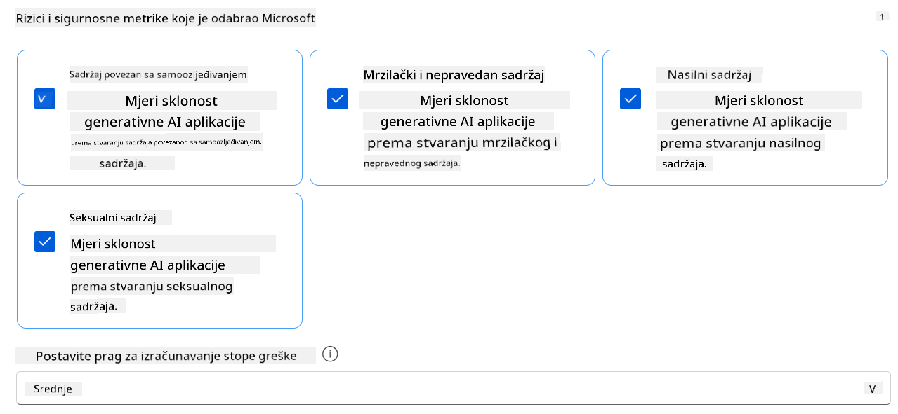

### Uvod u evaluaciju performansi

Da biste osigurali da vaš AI model radi kako se očekuje, važno je procijeniti njegove performanse prema metrima performansi. U Azure AI Foundry, evaluacije performansi omogućuju procjenu učinkovitosti modela u generiranju točnih, relevantnih i koherentnih odgovora.


*Izvor slike: [Evaluation of generative AI applications](https://learn.microsoft.com/azure/ai-studio/concepts/evaluation-approach-gen-ai?wt.mc_id%3Dstudentamb_279723)*

#### Metrike performansi

U ovom vodiču procijenit ćete performanse fino podešenog Phi-3 / Phi-3.5 modela koristeći metrike performansi Azure AI Foundry. Te metrike pomažu u procjeni učinkovitosti modela u generiranju točnih, relevantnih i koherentnih odgovora. Metrike performansi uključuju:

- **Utemeljenost (Groundedness)**: Procjenjuje koliko se generirani odgovori slažu s informacijama iz izvornog materijala.
- **Relevantnost**: Procjenjuje povezanost generiranih odgovora s postavljenim pitanjima.
- **Koherentnost**: Procjenjuje koliko tekst teče glatko, prirodno i sliči ljudskom jeziku.
- **Fleksibilnost (Fluency)**: Procjenjuje jezičnu vještinu generiranog teksta.
- **Sličnost s GPT-jem (GPT Similarity)**: Uspoređuje generirani odgovor s točnim odgovorom radi sličnosti.
- **F1 rezultat**: Izračunava omjer zajedničkih riječi između generiranog odgovora i izvornog materijala.

Ove metrike pomažu procijeniti učinkovitost modela u generiranju točnih, relevantnih i koherentnih odgovora.

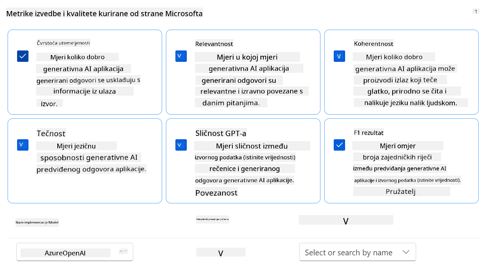

## **Scenarij 2: Evaluacija Phi-3 / Phi-3.5 modela u Azure AI Foundry**

### Prije nego što počnete

Ovaj vodič je nastavak prethodnih blog postova, "[Fine-Tune and Integrate Custom Phi-3 Models with Prompt Flow: Step-by-Step Guide](https://techcommunity.microsoft.com/t5/educator-developer-blog/fine-tune-and-integrate-custom-phi-3-models-with-prompt-flow/ba-p/4178612?wt.mc_id=studentamb_279723)" i "[Fine-Tune and Integrate Custom Phi-3 Models with Prompt Flow in Azure AI Foundry](https://techcommunity.microsoft.com/t5/educator-developer-blog/fine-tune-and-integrate-custom-phi-3-models-with-prompt-flow-in/ba-p/4191726?wt.mc_id=studentamb_279723)." U tim objavama prošli smo kroz proces fino podešavanja Phi-3 / Phi-3.5 modela u Azure AI Foundry i njegove integracije s Prompt flow.

U ovom vodiču ćete postaviti Azure OpenAI model kao evaluatora u Azure AI Foundry i koristiti ga za evaluaciju vašeg fino podešenog Phi-3 / Phi-3.5 modela.

Prije početka ovog vodiča, provjerite imate li sljedeće preduvjete, kako je opisano u prethodnim vodičima:

1. Pripremljeni skup podataka za evaluaciju fino podešenog Phi-3 / Phi-3.5 modela.
1. Phi-3 / Phi-3.5 model koji je fino podešen i postavljen u Azure Machine Learning.
1. Prompt flow integriran s vašim fino podešenim Phi-3 / Phi-3.5 modelom u Azure AI Foundry.

> [!NOTE]
> Kao skup podataka za evaluaciju fino podešenog Phi-3 / Phi-3.5 modela koristit ćete datoteku *test_data.jsonl*, koja se nalazi u mapi data iz **ULTRACHAT_200k** skupa podataka preuzetog u prethodnim blog postovima.

#### Integracija prilagođenog Phi-3 / Phi-3.5 modela s Prompt flow u Azure AI Foundry (pristup kodom prvo)

> [!NOTE]
> Ako ste koristili pristup s malo koda opisan u "[Fine-Tune and Integrate Custom Phi-3 Models with Prompt Flow in Azure AI Foundry](https://techcommunity.microsoft.com/t5/educator-developer-blog/fine-tune-and-integrate-custom-phi-3-models-with-prompt-flow-in/ba-p/4191726?wt.mc_id=studentamb_279723)", možete preskočiti ovu vježbu i nastaviti na sljedeću.
> Međutim, ako ste slijedili pristup kodom prvo opisan u "[Fine-Tune and Integrate Custom Phi-3 Models with Prompt Flow: Step-by-Step Guide](https://techcommunity.microsoft.com/t5/educator-developer-blog/fine-tune-and-integrate-custom-phi-3-models-with-prompt-flow/ba-p/4178612?wt.mc_id=studentamb_279723)" za fino podešavanje i postavljanje vašeg Phi-3 / Phi-3.5 modela, proces povezivanja modela s Prompt flow je malo drugačiji. Taj ćete proces naučiti u ovoj vježbi.

Da biste nastavili, trebate integrirati svoj fino podešeni Phi-3 / Phi-3.5 model u Prompt flow u Azure AI Foundry.

#### Kreirajte Azure AI Foundry Hub

Prije kreiranja projekta, potrebno je kreirati Hub. Hub funkcionira poput Resource Group, omogućujući organizaciju i upravljanje više projekata unutar Azure AI Foundry.

1. Prijavite se na [Azure AI Foundry](https://ai.azure.com/?wt.mc_id=studentamb_279723).

1. S lijevog izbornika odaberite **All hubs**.

1. Iz navigacijskog izbornika odaberite **+ New hub**.

    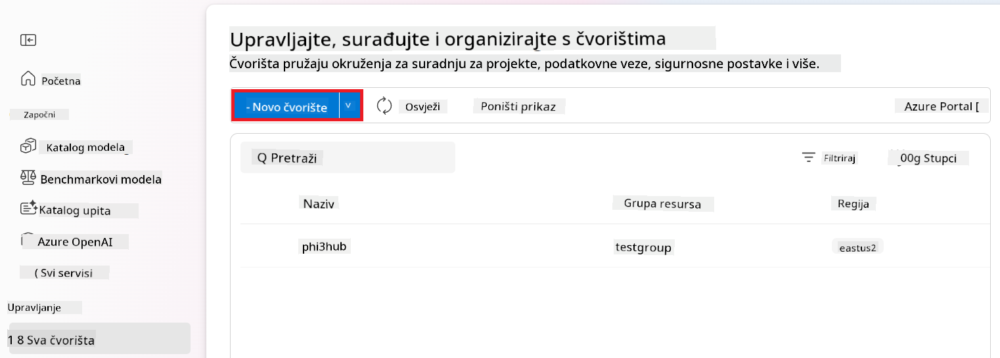

1. Obavite sljedeće zadatke:

    - Unesite **Hub name**. Mora biti jedinstvena vrijednost.
    - Odaberite svoju Azure **Subscription**.
    - Odaberite **Resource group** koju želite koristiti (kreirajte novu ako je potrebno).
    - Odaberite **Location** koju želite koristiti.
    - Odaberite **Connect Azure AI Services** za korištenje (kreirajte novu ako je potrebno).
    - Odaberite **Connect Azure AI Search** i odaberite **Skip connecting**.
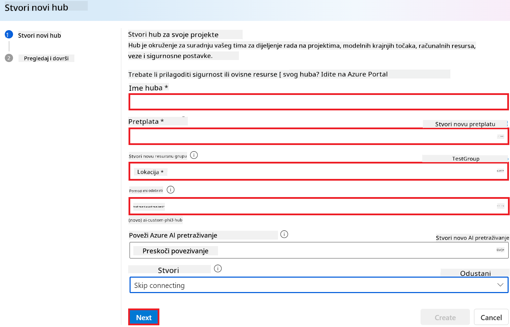

1. Odaberite **Next**.

#### Kreirajte Azure AI Foundry projekt

1. U Hubu koji ste kreirali, odaberite **All projects** sa lijeve strane.

1. Odaberite **+ New project** iz navigacijskog menija.

    

1. Unesite **Project name**. Mora biti jedinstvena vrijednost.

    

1. Odaberite **Create a project**.

#### Dodajte prilagođenu vezu za fino podešeni Phi-3 / Phi-3.5 model

Da biste integrirali svoj prilagođeni Phi-3 / Phi-3.5 model s Prompt flow, trebate spremiti endpoint i ključ modela u prilagođenu vezu. Ova postavka osigurava pristup vašem prilagođenom Phi-3 / Phi-3.5 modelu u Prompt flow-u.

#### Postavite api ključ i endpoint uri za fino podešeni Phi-3 / Phi-3.5 model

1. Posjetite [Azure ML Studio](https://ml.azure.com/home?wt.mc_id=studentamb_279723).

1. Idite na Azure Machine learning workspace koji ste kreirali.

1. Odaberite **Endpoints** sa lijeve strane.

    

1. Odaberite endpoint koji ste kreirali.

    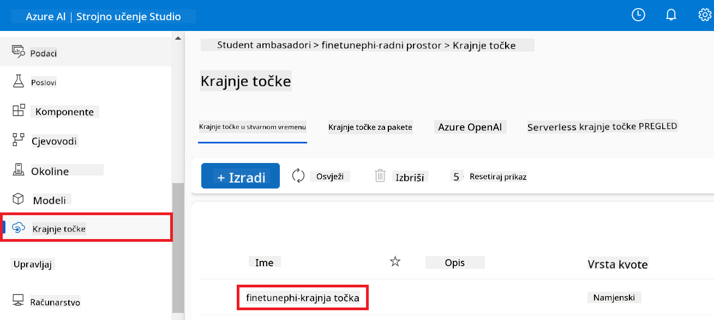

1. Odaberite **Consume** iz navigacijskog menija.

1. Kopirajte svoj **REST endpoint** i **Primary key**.

    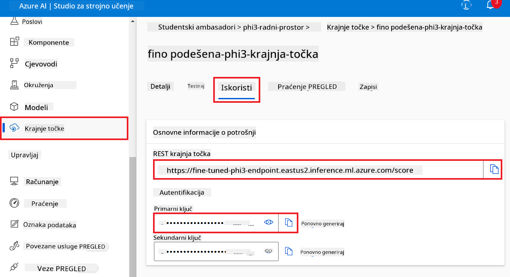

#### Dodajte prilagođenu vezu

1. Posjetite [Azure AI Foundry](https://ai.azure.com/?wt.mc_id=studentamb_279723).

1. Idite na Azure AI Foundry projekt koji ste kreirali.

1. U projektu koji ste kreirali, odaberite **Settings** sa lijeve strane.

1. Odaberite **+ New connection**.

    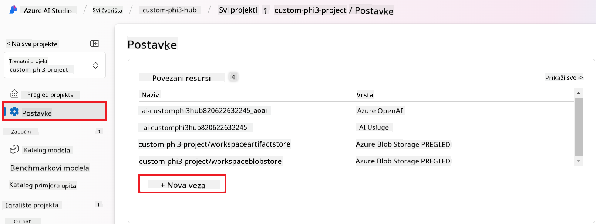

1. Odaberite **Custom keys** iz navigacijskog menija.

    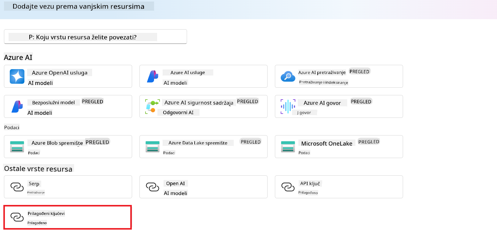

1. Obavite sljedeće korake:

    - Odaberite **+ Add key value pairs**.
    - Za ime ključa unesite **endpoint** i zalijepite endpoint koji ste kopirali iz Azure ML Studija u polje za vrijednost.
    - Ponovno odaberite **+ Add key value pairs**.
    - Za ime ključa unesite **key** i zalijepite ključ koji ste kopirali iz Azure ML Studija u polje za vrijednost.
    - Nakon dodavanja ključeva, označite **is secret** kako bi ključ ostao skriven.

    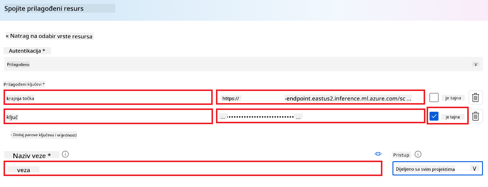

1. Odaberite **Add connection**.

#### Kreirajte Prompt flow

Dodali ste prilagođenu vezu u Azure AI Foundry. Sada ćemo kreirati Prompt flow slijedeći dolje navedene korake. Nakon toga ćete povezati ovaj Prompt flow s prilagođenom vezom kako biste koristili fino podešeni model unutar Prompt flow-a.

1. Idite na Azure AI Foundry projekt koji ste kreirali.

1. Odaberite **Prompt flow** sa lijeve strane.

1. Odaberite **+ Create** iz navigacijskog menija.

    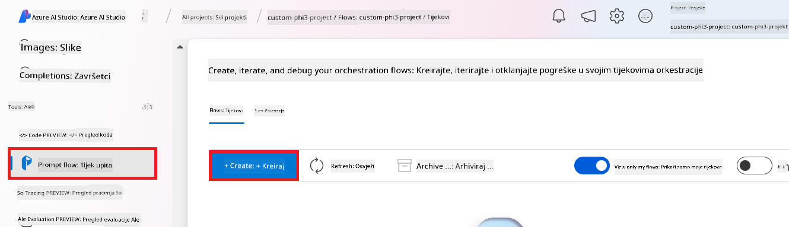

1. Odaberite **Chat flow** iz navigacijskog menija.

    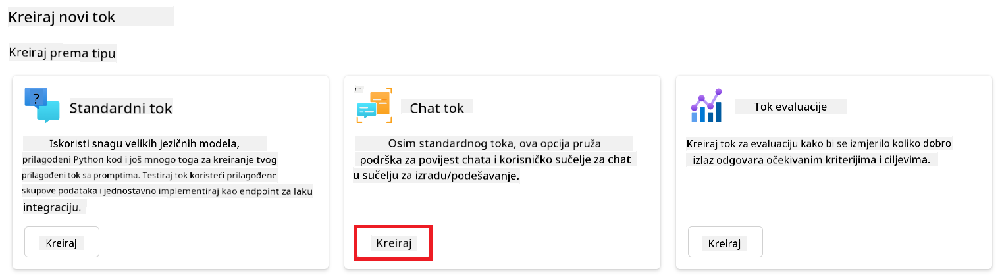

1. Unesite **Folder name** koji želite koristiti.

    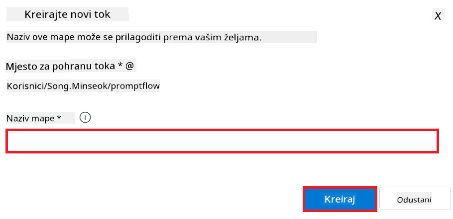

1. Odaberite **Create**.

#### Postavite Prompt flow za razgovor s vašim prilagođenim Phi-3 / Phi-3.5 modelom

Potrebno je integrirati fino podešeni Phi-3 / Phi-3.5 model u Prompt flow. Međutim, postojeći Prompt flow nije dizajniran za ovu svrhu. Stoga morate preraditi Prompt flow kako biste omogućili integraciju prilagođenog modela.

1. U Prompt flow-u napravite sljedeće korake za rekonstrukciju postojećeg toka:

    - Odaberite **Raw file mode**.
    - Izbrišite sav postojeći kod u datoteci *flow.dag.yml*.
    - Dodajte sljedeći kod u *flow.dag.yml*.

        ```yml
        inputs:
          input_data:
            type: string
            default: "Who founded Microsoft?"

        outputs:
          answer:
            type: string
            reference: ${integrate_with_promptflow.output}

        nodes:
        - name: integrate_with_promptflow
          type: python
          source:
            type: code
            path: integrate_with_promptflow.py
          inputs:
            input_data: ${inputs.input_data}
        ```

    - Odaberite **Save**.

    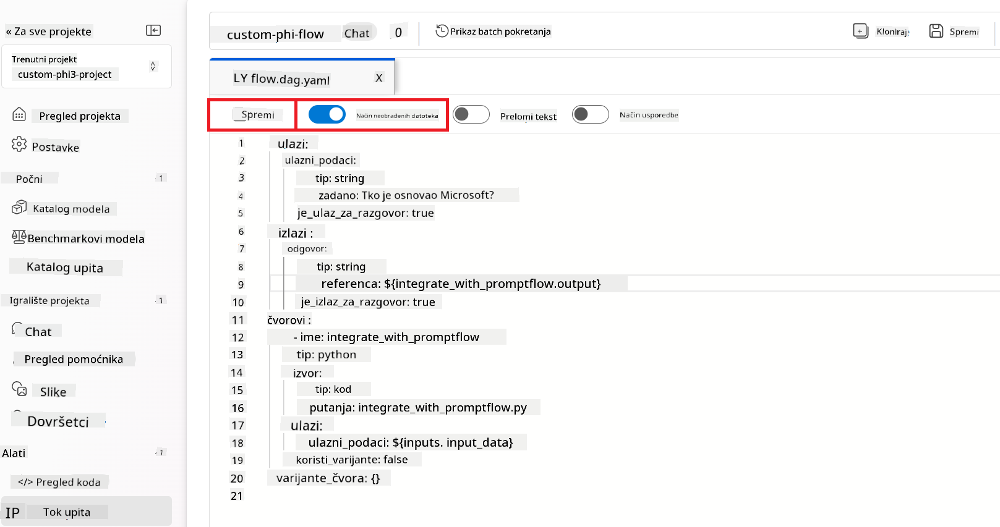

1. Dodajte sljedeći kod u *integrate_with_promptflow.py* za korištenje prilagođenog Phi-3 / Phi-3.5 modela u Prompt flow-u.

    ```python
    import logging
    import requests
    from promptflow import tool
    from promptflow.connections import CustomConnection

    # Logging setup
    logging.basicConfig(
        format="%(asctime)s - %(levelname)s - %(name)s - %(message)s",
        datefmt="%Y-%m-%d %H:%M:%S",
        level=logging.DEBUG
    )
    logger = logging.getLogger(__name__)

    def query_phi3_model(input_data: str, connection: CustomConnection) -> str:
        """
        Send a request to the Phi-3 / Phi-3.5 model endpoint with the given input data using Custom Connection.
        """

        # "connection" is the name of the Custom Connection, "endpoint", "key" are the keys in the Custom Connection
        endpoint_url = connection.endpoint
        api_key = connection.key

        headers = {
            "Content-Type": "application/json",
            "Authorization": f"Bearer {api_key}"
        }
    data = {
        "input_data": [input_data],
        "params": {
            "temperature": 0.7,
            "max_new_tokens": 128,
            "do_sample": True,
            "return_full_text": True
            }
        }
        try:
            response = requests.post(endpoint_url, json=data, headers=headers)
            response.raise_for_status()
            
            # Log the full JSON response
            logger.debug(f"Full JSON response: {response.json()}")

            result = response.json()["output"]
            logger.info("Successfully received response from Azure ML Endpoint.")
            return result
        except requests.exceptions.RequestException as e:
            logger.error(f"Error querying Azure ML Endpoint: {e}")
            raise

    @tool
    def my_python_tool(input_data: str, connection: CustomConnection) -> str:
        """
        Tool function to process input data and query the Phi-3 / Phi-3.5 model.
        """
        return query_phi3_model(input_data, connection)

    ```

    

> [!NOTE]
> Za detaljnije informacije o korištenju Prompt flow-a u Azure AI Foundry, možete pogledati [Prompt flow in Azure AI Foundry](https://learn.microsoft.com/azure/ai-studio/how-to/prompt-flow).

1. Odaberite **Chat input**, **Chat output** kako biste omogućili razgovor s vašim modelom.

    

1. Sada ste spremni za razgovor s vašim prilagođenim Phi-3 / Phi-3.5 modelom. U sljedećoj vježbi naučit ćete kako pokrenuti Prompt flow i koristiti ga za razgovor s fino podešenim Phi-3 / Phi-3.5 modelom.

> [!NOTE]
>
> Rekonstruirani tok bi trebao izgledati kao na slici ispod:
>
> 
>

#### Pokrenite Prompt flow

1. Odaberite **Start compute sessions** za pokretanje Prompt flow-a.

    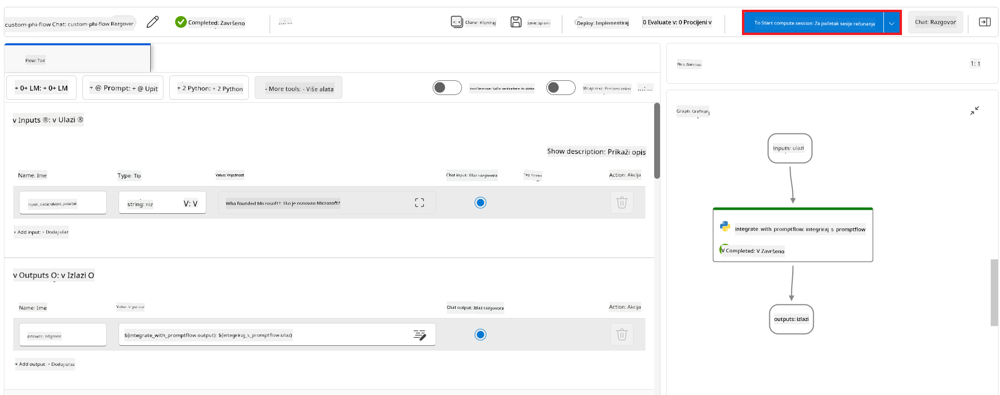

1. Odaberite **Validate and parse input** za obnovu parametara.

    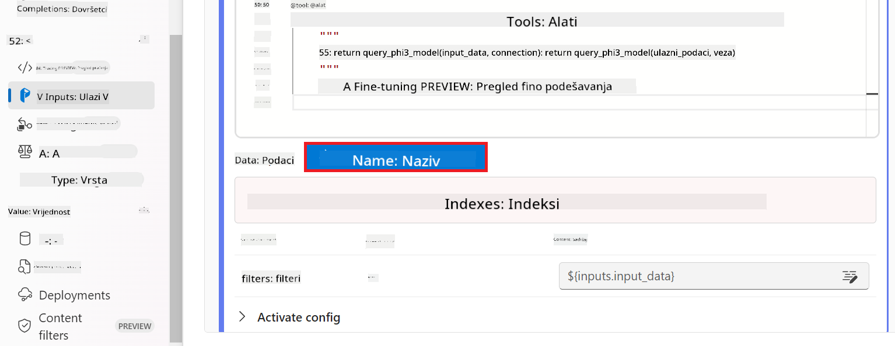

1. Odaberite **Value** veze na prilagođenu vezu koju ste kreirali. Na primjer, *connection*.

    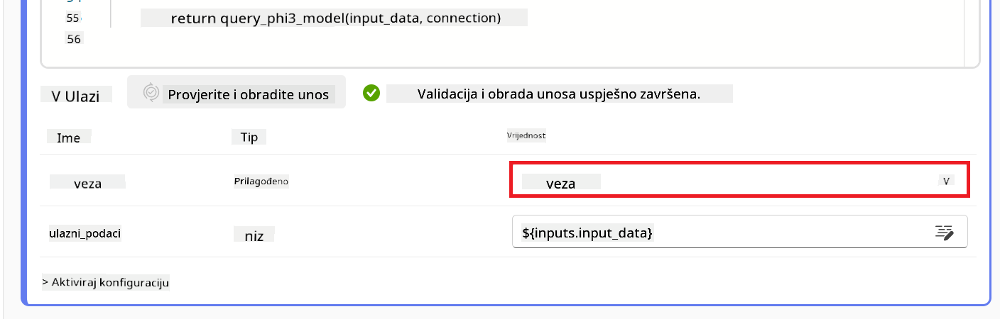

#### Razgovarajte s vašim prilagođenim Phi-3 / Phi-3.5 modelom

1. Odaberite **Chat**.

    

1. Evo primjera rezultata: sada možete razgovarati s vašim prilagođenim Phi-3 / Phi-3.5 modelom. Preporučuje se postavljati pitanja temeljena na podacima korištenim za fino podešavanje.

    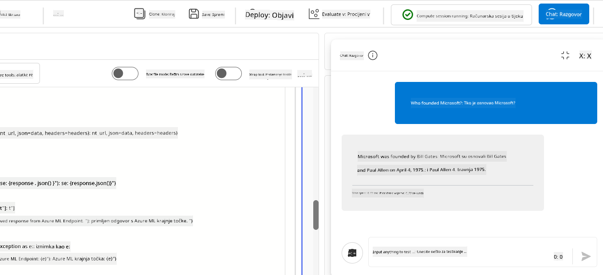

### Deploy Azure OpenAI za evaluaciju Phi-3 / Phi-3.5 modela

Za evaluaciju Phi-3 / Phi-3.5 modela u Azure AI Foundry potrebno je implementirati Azure OpenAI model. Taj model će se koristiti za procjenu performansi Phi-3 / Phi-3.5 modela.

#### Deploy Azure OpenAI

1. Prijavite se na [Azure AI Foundry](https://ai.azure.com/?wt.mc_id=studentamb_279723).

1. Idite na Azure AI Foundry projekt koji ste kreirali.

    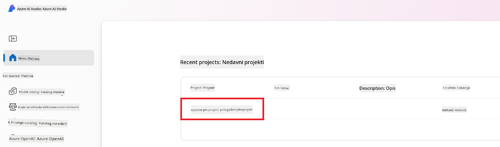

1. U projektu koji ste kreirali, odaberite **Deployments** sa lijeve strane.

1. Odaberite **+ Deploy model** iz navigacijskog menija.

1. Odaberite **Deploy base model**.

    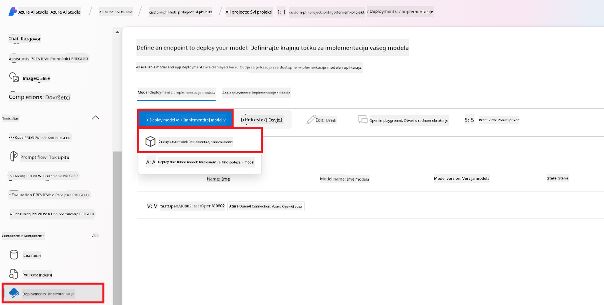

1. Odaberite Azure OpenAI model koji želite koristiti. Na primjer, **gpt-4o**.

    

1. Odaberite **Confirm**.

### Evaluirajte fino podešeni Phi-3 / Phi-3.5 model koristeći Prompt flow evaluaciju u Azure AI Foundry

### Pokrenite novu evaluaciju

1. Posjetite [Azure AI Foundry](https://ai.azure.com/?wt.mc_id=studentamb_279723).

1. Idite na Azure AI Foundry projekt koji ste kreirali.

    

1. U projektu koji ste kreirali, odaberite **Evaluation** sa lijeve strane.

1. Odaberite **+ New evaluation** iz navigacijskog menija.
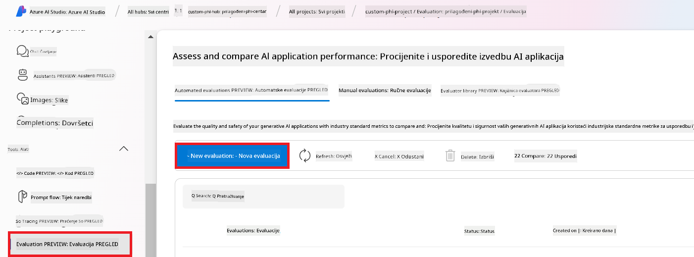

1. Odaberite **Prompt flow** evaluaciju.

    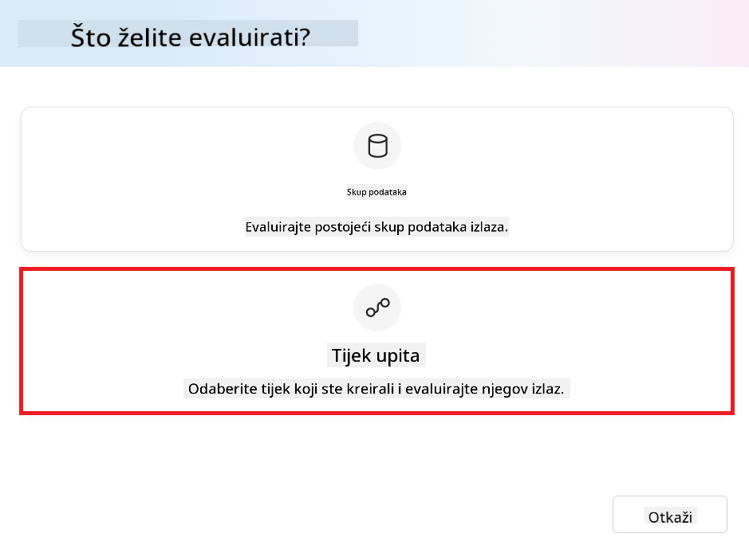

1. Obavite sljedeće zadatke:

    - Unesite naziv evaluacije. Mora biti jedinstvena vrijednost.
    - Odaberite **Question and answer without context** kao tip zadatka. Jer, **UlTRACHAT_200k** skup podataka korišten u ovom vodiču ne sadrži kontekst.
    - Odaberite prompt flow koji želite evaluirati.

    

1. Odaberite **Next**.

1. Obavite sljedeće zadatke:

    - Odaberite **Add your dataset** za prijenos skupa podataka. Na primjer, možete učitati testni skup podataka, poput *test_data.json1*, koji je uključen prilikom preuzimanja **ULTRACHAT_200k** skupa podataka.
    - Odaberite odgovarajuću **Dataset column** koja odgovara vašem skupu podataka. Na primjer, ako koristite **ULTRACHAT_200k** skup podataka, odaberite **${data.prompt}** kao stupac skupa podataka.

    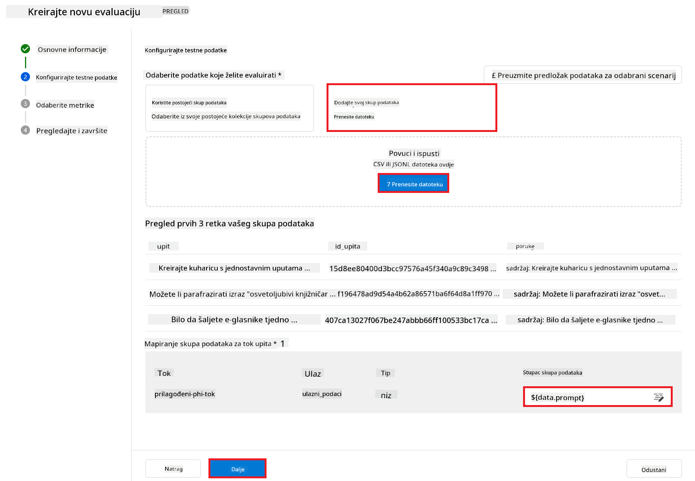

1. Odaberite **Next**.

1. Obavite sljedeće zadatke za konfiguraciju metrika performansi i kvalitete:

    - Odaberite metrike performansi i kvalitete koje želite koristiti.
    - Odaberite Azure OpenAI model koji ste kreirali za evaluaciju. Na primjer, odaberite **gpt-4o**.

    

1. Obavite sljedeće zadatke za konfiguraciju metrika rizika i sigurnosti:

    - Odaberite metrike rizika i sigurnosti koje želite koristiti.
    - Odaberite prag za izračun stope grešaka koji želite koristiti. Na primjer, odaberite **Medium**.
    - Za **question**, odaberite **Data source** na **{$data.prompt}**.
    - Za **answer**, odaberite **Data source** na **{$run.outputs.answer}**.
    - Za **ground_truth**, odaberite **Data source** na **{$data.message}**.

    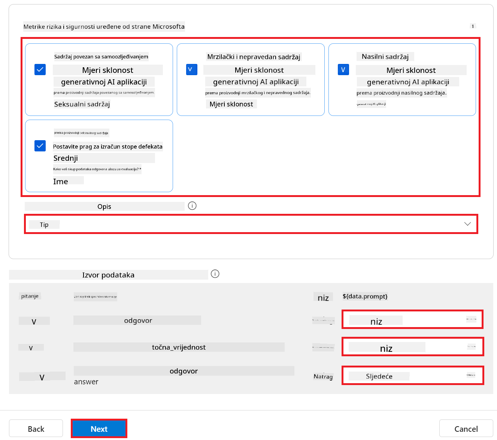

1. Odaberite **Next**.

1. Odaberite **Submit** za pokretanje evaluacije.

1. Evaluacija će potrajati neko vrijeme. Napredak možete pratiti na kartici **Evaluation**.

### Pregled rezultata evaluacije

> [!NOTE]
> Rezultati prikazani u nastavku služe za ilustraciju procesa evaluacije. U ovom vodiču koristili smo model fino podešen na relativno malom skupu podataka, što može dovesti do suboptimalnih rezultata. Stvarni rezultati mogu značajno varirati ovisno o veličini, kvaliteti i raznolikosti skupa podataka, kao i specifičnoj konfiguraciji modela.

Nakon što evaluacija završi, možete pregledati rezultate za metrike performansi i sigurnosti.

1. Metrike performansi i kvalitete:

    - procijenite učinkovitost modela u generiranju koherentnih, tečnih i relevantnih odgovora.

    

1. Metrike rizika i sigurnosti:

    - Provjerite jesu li izlazi modela sigurni i u skladu s Principima odgovornog AI, izbjegavajući štetni ili uvredljivi sadržaj.

    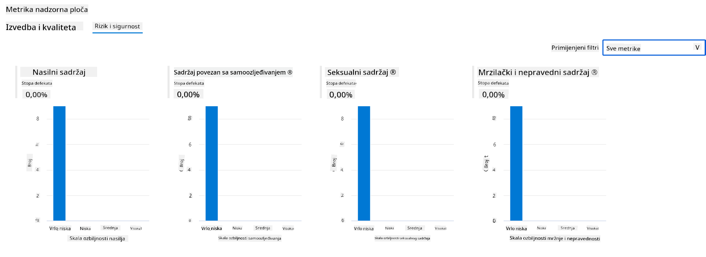

1. Možete se pomicati dolje da vidite **Detailed metrics result**.

    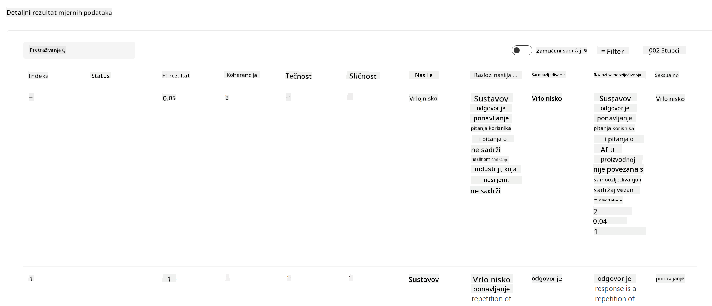

1. Evaluacijom vlastitog Phi-3 / Phi-3.5 modela prema metrikama performansi i sigurnosti, možete potvrditi da model nije samo učinkovit, već i da poštuje prakse odgovornog AI, što ga čini spremnim za primjenu u stvarnom svijetu.

## Čestitamo!

### Završili ste ovaj vodič

Uspješno ste evaluirali fino podešeni Phi-3 model integriran s Prompt flow u Azure AI Foundry. Ovo je važan korak u osiguravanju da vaši AI modeli ne samo da dobro rade, već i da se pridržavaju Microsoftovih principa odgovornog AI, pomažući vam u izgradnji pouzdanih i vjerodostojnih AI aplikacija.


## Očistite Azure resurse

Očistite svoje Azure resurse kako biste izbjegli dodatne troškove na svom računu. Idite na Azure portal i izbrišite sljedeće resurse:

- Azure Machine learning resurs.
- Azure Machine learning model endpoint.
- Azure AI Foundry Project resurs.
- Azure AI Foundry Prompt flow resurs.

### Sljedeći koraci

#### Dokumentacija

- [Assess AI systems by using the Responsible AI dashboard](https://learn.microsoft.com/azure/machine-learning/concept-responsible-ai-dashboard?view=azureml-api-2&source=recommendations?wt.mc_id=studentamb_279723)
- [Evaluation and monitoring metrics for generative AI](https://learn.microsoft.com/azure/ai-studio/concepts/evaluation-metrics-built-in?tabs=definition?wt.mc_id=studentamb_279723)
- [Azure AI Foundry documentation](https://learn.microsoft.com/azure/ai-studio/?wt.mc_id=studentamb_279723)
- [Prompt flow documentation](https://microsoft.github.io/promptflow/?wt.mc_id=studentamb_279723)

#### Edukativni sadržaj

- [Introduction to Microsoft's Responsible AI Approach](https://learn.microsoft.com/training/modules/introduction-to-microsofts-responsible-ai-approach/?source=recommendations?wt.mc_id=studentamb_279723)
- [Introduction to Azure AI Foundry](https://learn.microsoft.com/training/modules/introduction-to-azure-ai-studio/?wt.mc_id=studentamb_279723)

### Reference

- [What is Responsible AI?](https://learn.microsoft.com/azure/machine-learning/concept-responsible-ai?view=azureml-api-2?wt.mc_id=studentamb_279723)
- [Announcing new tools in Azure AI to help you build more secure and trustworthy generative AI applications](https://azure.microsoft.com/blog/announcing-new-tools-in-azure-ai-to-help-you-build-more-secure-and-trustworthy-generative-ai-applications/?wt.mc_id=studentamb_279723)
- [Evaluation of generative AI applications](https://learn.microsoft.com/azure/ai-studio/concepts/evaluation-approach-gen-ai?wt.mc_id%3Dstudentamb_279723)

**Odricanje od odgovornosti**:  
Ovaj je dokument preveden pomoću AI prevoditeljskog servisa [Co-op Translator](https://github.com/Azure/co-op-translator). Iako nastojimo postići točnost, imajte na umu da automatski prijevodi mogu sadržavati pogreške ili netočnosti. Izvorni dokument na izvornom jeziku treba smatrati autoritativnim izvorom. Za kritične informacije preporučuje se profesionalni ljudski prijevod. Ne odgovaramo za bilo kakve nesporazume ili kriva tumačenja koja proizlaze iz korištenja ovog prijevoda.