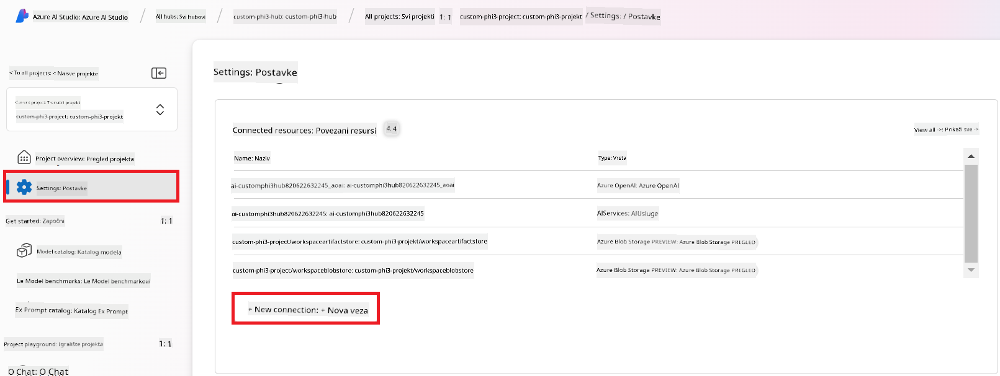
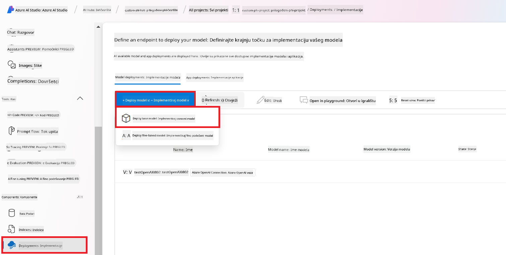

<!--
CO_OP_TRANSLATOR_METADATA:
{
  "original_hash": "80a853c08e4ee25ef9b4bfcedd8990da",
  "translation_date": "2025-07-16T23:58:14+00:00",
  "source_file": "md/02.Application/01.TextAndChat/Phi3/E2E_Phi-3-Evaluation_AIFoundry.md",
  "language_code": "hr"
}
-->
# Procjena fino podešenog Phi-3 / Phi-3.5 modela u Azure AI Foundry s fokusom na Microsoftove principe odgovornog AI-a

Ovaj end-to-end (E2E) primjer temelji se na vodiču "[Evaluate Fine-tuned Phi-3 / 3.5 Models in Azure AI Foundry Focusing on Microsoft's Responsible AI](https://techcommunity.microsoft.com/blog/educatordeveloperblog/evaluate-fine-tuned-phi-3--3-5-models-in-azure-ai-studio-focusing-on-microsofts-/4227850?WT.mc_id=aiml-137032-kinfeylo)" iz Microsoft Tech Community.

## Pregled

### Kako možete procijeniti sigurnost i performanse fino podešenog Phi-3 / Phi-3.5 modela u Azure AI Foundry?

Fino podešavanje modela ponekad može dovesti do neželjenih ili neočekivanih odgovora. Kako biste osigurali da model ostane siguran i učinkovit, važno je procijeniti njegov potencijal za generiranje štetnog sadržaja te sposobnost da proizvodi točne, relevantne i koherentne odgovore. U ovom vodiču naučit ćete kako procijeniti sigurnost i performanse fino podešenog Phi-3 / Phi-3.5 modela integriranog s Prompt flow u Azure AI Foundry.

Evo procesa procjene u Azure AI Foundry.


*Izvor slike: [Evaluation of generative AI applications](https://learn.microsoft.com/azure/ai-studio/concepts/evaluation-approach-gen-ai?wt.mc_id%3Dstudentamb_279723)*

> [!NOTE]
>
> Za detaljnije informacije i dodatne resurse o Phi-3 / Phi-3.5, posjetite [Phi-3CookBook](https://github.com/microsoft/Phi-3CookBook?wt.mc_id=studentamb_279723).

### Preduvjeti

- [Python](https://www.python.org/downloads)
- [Azure pretplata](https://azure.microsoft.com/free?wt.mc_id=studentamb_279723)
- [Visual Studio Code](https://code.visualstudio.com)
- Fino podešen Phi-3 / Phi-3.5 model

### Sadržaj

1. [**Scenarij 1: Uvod u procjenu Prompt flow u Azure AI Foundry**](../../../../../../md/02.Application/01.TextAndChat/Phi3)

    - [Uvod u procjenu sigurnosti](../../../../../../md/02.Application/01.TextAndChat/Phi3)
    - [Uvod u procjenu performansi](../../../../../../md/02.Application/01.TextAndChat/Phi3)

1. [**Scenarij 2: Procjena Phi-3 / Phi-3.5 modela u Azure AI Foundry**](../../../../../../md/02.Application/01.TextAndChat/Phi3)

    - [Prije nego što počnete](../../../../../../md/02.Application/01.TextAndChat/Phi3)
    - [Postavljanje Azure OpenAI za procjenu Phi-3 / Phi-3.5 modela](../../../../../../md/02.Application/01.TextAndChat/Phi3)
    - [Procjena fino podešenog Phi-3 / Phi-3.5 modela korištenjem Prompt flow procjene u Azure AI Foundry](../../../../../../md/02.Application/01.TextAndChat/Phi3)

1. [Čestitamo!](../../../../../../md/02.Application/01.TextAndChat/Phi3)

## **Scenarij 1: Uvod u procjenu Prompt flow u Azure AI Foundry**

### Uvod u procjenu sigurnosti

Kako biste osigurali da je vaš AI model etičan i siguran, ključno je procijeniti ga u skladu s Microsoftovim principima odgovornog AI-a. U Azure AI Foundry, procjene sigurnosti omogućuju vam da procijenite ranjivost vašeg modela na jailbreak napade i njegov potencijal za generiranje štetnog sadržaja, što je u potpunosti usklađeno s tim principima.


*Izvor slike: [Evaluation of generative AI applications](https://learn.microsoft.com/azure/ai-studio/concepts/evaluation-approach-gen-ai?wt.mc_id%3Dstudentamb_279723)*

#### Microsoftovi principi odgovornog AI-a

Prije nego što započnete s tehničkim koracima, važno je razumjeti Microsoftove principe odgovornog AI-a, etički okvir osmišljen za vođenje odgovornog razvoja, implementacije i rada AI sustava. Ti principi usmjeravaju odgovoran dizajn, razvoj i implementaciju AI sustava, osiguravajući da su AI tehnologije izrađene na način koji je pravedan, transparentan i inkluzivan. Ovi principi predstavljaju temelj za procjenu sigurnosti AI modela.

Microsoftovi principi odgovornog AI-a uključuju:

- **Pravednost i inkluzivnost**: AI sustavi trebaju tretirati sve pravedno i izbjegavati različite utjecaje na slične skupine ljudi. Na primjer, kada AI sustavi daju smjernice o medicinskom liječenju, zahtjevima za zajam ili zapošljavanju, trebaju davati iste preporuke svima koji imaju slične simptome, financijske okolnosti ili profesionalne kvalifikacije.

- **Pouzdanost i sigurnost**: Za izgradnju povjerenja, ključno je da AI sustavi rade pouzdano, sigurno i dosljedno. Ti sustavi trebaju moći raditi onako kako su prvotno dizajnirani, sigurno reagirati na neočekivane uvjete i biti otporni na štetne manipulacije. Njihovo ponašanje i raspon uvjeta koje mogu podnijeti odražavaju situacije i okolnosti koje su programeri predvidjeli tijekom dizajna i testiranja.

- **Transparentnost**: Kada AI sustavi pomažu u donošenju odluka koje imaju veliki utjecaj na živote ljudi, ključno je da ljudi razumiju kako su te odluke donesene. Na primjer, banka može koristiti AI sustav za procjenu kreditne sposobnosti osobe. Tvrtka može koristiti AI sustav za odabir najkvalificiranijih kandidata za zapošljavanje.

- **Privatnost i sigurnost**: Kako AI postaje sve prisutniji, zaštita privatnosti i sigurnost osobnih i poslovnih podataka postaju sve važniji i složeniji. S AI-jem, privatnost i sigurnost podataka zahtijevaju posebnu pažnju jer je pristup podacima ključan za točne i informirane predikcije i odluke AI sustava o ljudima.

- **Odgovornost**: Ljudi koji dizajniraju i implementiraju AI sustave moraju biti odgovorni za način na koji njihovi sustavi rade. Organizacije bi trebale koristiti industrijske standarde za razvoj normi odgovornosti. Te norme mogu osigurati da AI sustavi nisu konačna vlast u bilo kojoj odluci koja utječe na živote ljudi. Također mogu osigurati da ljudi zadrže značajnu kontrolu nad inače vrlo autonomnim AI sustavima.


*Izvor slike: [What is Responsible AI?](https://learn.microsoft.com/azure/machine-learning/concept-responsible-ai?view=azureml-api-2&viewFallbackFrom=azureml-api-2%253fwt.mc_id%3Dstudentamb_279723)*

> [!NOTE]
> Za više informacija o Microsoftovim principima odgovornog AI-a, posjetite [What is Responsible AI?](https://learn.microsoft.com/azure/machine-learning/concept-responsible-ai?view=azureml-api-2?wt.mc_id=studentamb_279723).

#### Metrike sigurnosti

U ovom vodiču procijenit ćete sigurnost fino podešenog Phi-3 modela koristeći sigurnosne metrike Azure AI Foundry. Te metrike pomažu u procjeni potencijala modela za generiranje štetnog sadržaja i njegove ranjivosti na jailbreak napade. Sigurnosne metrike uključuju:

- **Sadržaj vezan uz samoozljeđivanje**: Procjenjuje ima li model tendenciju generiranja sadržaja vezanog uz samoozljeđivanje.
- **Mrzilački i nepravedan sadržaj**: Procjenjuje ima li model tendenciju generiranja mrzilačkog ili nepravednog sadržaja.
- **Nasilni sadržaj**: Procjenjuje ima li model tendenciju generiranja nasilnog sadržaja.
- **Seksualni sadržaj**: Procjenjuje ima li model tendenciju generiranja neprimjerenog seksualnog sadržaja.

Procjenom ovih aspekata osigurava se da AI model ne proizvodi štetan ili uvredljiv sadržaj, usklađujući ga s društvenim vrijednostima i regulatornim standardima.


### Uvod u procjenu performansi

Kako biste osigurali da vaš AI model radi prema očekivanjima, važno je procijeniti njegove performanse prema metrikama performansi. U Azure AI Foundry, procjene performansi omogućuju vam da procijenite učinkovitost modela u generiranju točnih, relevantnih i koherentnih odgovora.


*Izvor slike: [Evaluation of generative AI applications](https://learn.microsoft.com/azure/ai-studio/concepts/evaluation-approach-gen-ai?wt.mc_id%3Dstudentamb_279723)*

#### Metrike performansi

U ovom vodiču procijenit ćete performanse fino podešenog Phi-3 / Phi-3.5 modela koristeći metrike performansi Azure AI Foundry. Te metrike pomažu u procjeni učinkovitosti modela u generiranju točnih, relevantnih i koherentnih odgovora. Metrike performansi uključuju:

- **Utemeljenost (Groundedness)**: Procjenjuje koliko se generirani odgovori slažu s informacijama iz izvornog materijala.
- **Relevantnost**: Procjenjuje koliko su generirani odgovori povezani s postavljenim pitanjima.
- **Koherentnost**: Procjenjuje koliko glatko teče generirani tekst, koliko je prirodan i nalik ljudskom jeziku.
- **Tečnost (Fluency)**: Procjenjuje jezičnu vještinu generiranog teksta.
- **Sličnost s GPT-om (GPT Similarity)**: Uspoređuje generirani odgovor s referentnim odgovorom radi sličnosti.
- **F1 rezultat**: Izračunava omjer zajedničkih riječi između generiranog odgovora i izvornog materijala.

Ove metrike pomažu u procjeni učinkovitosti modela u generiranju točnih, relevantnih i koherentnih odgovora.


## **Scenarij 2: Procjena Phi-3 / Phi-3.5 modela u Azure AI Foundry**

### Prije nego što počnete

Ovaj vodič nadovezuje se na prethodne blog postove, "[Fine-Tune and Integrate Custom Phi-3 Models with Prompt Flow: Step-by-Step Guide](https://techcommunity.microsoft.com/t5/educator-developer-blog/fine-tune-and-integrate-custom-phi-3-models-with-prompt-flow/ba-p/4178612?wt.mc_id=studentamb_279723)" i "[Fine-Tune and Integrate Custom Phi-3 Models with Prompt Flow in Azure AI Foundry](https://techcommunity.microsoft.com/t5/educator-developer-blog/fine-tune-and-integrate-custom-phi-3-models-with-prompt-flow-in/ba-p/4191726?wt.mc_id=studentamb_279723)." U tim postovima prošli smo kroz proces fino podešavanja Phi-3 / Phi-3.5 modela u Azure AI Foundry i njegove integracije s Prompt flow.

U ovom vodiču postavit ćete Azure OpenAI model kao evaluatora u Azure AI Foundry i koristiti ga za procjenu vašeg fino podešenog Phi-3 / Phi-3.5 modela.

Prije nego što započnete ovaj vodič, provjerite imate li sljedeće preduvjete, kao što je opisano u prethodnim vodičima:

1. Pripremljeni skup podataka za procjenu fino podešenog Phi-3 / Phi-3.5 modela.
1. Phi-3 / Phi-3.5 model koji je fino podešen i postavljen u Azure Machine Learning.
1. Prompt flow integriran s vašim fino podešenim Phi-3 / Phi-3.5 modelom u Azure AI Foundry.

> [!NOTE]
> Za procjenu fino podešenog Phi-3 / Phi-3.5 modela koristit ćete datoteku *test_data.jsonl*, koja se nalazi u mapi data iz skupa podataka **ULTRACHAT_200k** preuzetog u prethodnim blog postovima.

#### Integracija prilagođenog Phi-3 / Phi-3.5 modela s Prompt flow u Azure AI Foundry (pristup s kodom)
> [!NOTE]  
> Ako ste slijedili low-code pristup opisan u "[Fine-Tune and Integrate Custom Phi-3 Models with Prompt Flow in Azure AI Foundry](https://techcommunity.microsoft.com/t5/educator-developer-blog/fine-tune-and-integrate-custom-phi-3-models-with-prompt-flow-in/ba-p/4191726?wt.mc_id=studentamb_279723)", možete preskočiti ovaj zadatak i nastaviti na sljedeći.  
> Međutim, ako ste koristili code-first pristup opisan u "[Fine-Tune and Integrate Custom Phi-3 Models with Prompt Flow: Step-by-Step Guide](https://techcommunity.microsoft.com/t5/educator-developer-blog/fine-tune-and-integrate-custom-phi-3-models-with-prompt-flow/ba-p/4178612?wt.mc_id=studentamb_279723)" za fino podešavanje i implementaciju vašeg Phi-3 / Phi-3.5 modela, proces povezivanja vašeg modela s Prompt flow-om je malo drugačiji. Taj proces ćete naučiti u ovom zadatku.
Za nastavak, trebate integrirati svoj fino podešeni Phi-3 / Phi-3.5 model u Prompt flow u Azure AI Foundry.

#### Kreirajte Azure AI Foundry Hub

Prije kreiranja Projekta, potrebno je kreirati Hub. Hub funkcionira kao Resource Group, omogućujući vam organizaciju i upravljanje više Projekata unutar Azure AI Foundry.

1. Prijavite se na [Azure AI Foundry](https://ai.azure.com/?wt.mc_id=studentamb_279723).

1. Izaberite **All hubs** s lijevog izbornika.

1. Izaberite **+ New hub** iz navigacijskog izbornika.

    

1. Obavite sljedeće zadatke:

    - Unesite **Hub name**. Mora biti jedinstvena vrijednost.
    - Odaberite svoju Azure **Subscription**.
    - Odaberite **Resource group** koju želite koristiti (kreirajte novu ako je potrebno).
    - Odaberite **Location** koju želite koristiti.
    - Odaberite **Connect Azure AI Services** za korištenje (kreirajte novu ako je potrebno).
    - Odaberite **Connect Azure AI Search** i zatim **Skip connecting**.

    

1. Kliknite **Next**.

#### Kreirajte Azure AI Foundry Projekt

1. U Hubu koji ste kreirali, izaberite **All projects** s lijevog izbornika.

1. Izaberite **+ New project** iz navigacijskog izbornika.

    

1. Unesite **Project name**. Mora biti jedinstvena vrijednost.

    

1. Kliknite **Create a project**.

#### Dodajte prilagođenu vezu za fino podešeni Phi-3 / Phi-3.5 model

Da biste integrirali svoj prilagođeni Phi-3 / Phi-3.5 model s Prompt flow, potrebno je spremiti endpoint i ključ modela u prilagođenu vezu. Ova postavka osigurava pristup vašem prilagođenom Phi-3 / Phi-3.5 modelu unutar Prompt flow.

#### Postavite api ključ i endpoint uri fino podešenog Phi-3 / Phi-3.5 modela

1. Posjetite [Azure ML Studio](https://ml.azure.com/home?wt.mc_id=studentamb_279723).

1. Navigirajte do Azure Machine learning workspace-a koji ste kreirali.

1. Izaberite **Endpoints** s lijevog izbornika.

    

1. Izaberite endpoint koji ste kreirali.

    

1. Izaberite **Consume** iz navigacijskog izbornika.

1. Kopirajte svoj **REST endpoint** i **Primary key**.

    

#### Dodajte prilagođenu vezu

1. Posjetite [Azure AI Foundry](https://ai.azure.com/?wt.mc_id=studentamb_279723).

1. Navigirajte do Azure AI Foundry projekta koji ste kreirali.

1. U projektu koji ste kreirali, izaberite **Settings** s lijevog izbornika.

1. Izaberite **+ New connection**.

    

1. Izaberite **Custom keys** iz navigacijskog izbornika.

    

1. Obavite sljedeće zadatke:

    - Kliknite **+ Add key value pairs**.
    - Za naziv ključa unesite **endpoint** i zalijepite endpoint koji ste kopirali iz Azure ML Studia u polje za vrijednost.
    - Ponovno kliknite **+ Add key value pairs**.
    - Za naziv ključa unesite **key** i zalijepite ključ koji ste kopirali iz Azure ML Studia u polje za vrijednost.
    - Nakon dodavanja ključeva, označite **is secret** kako biste spriječili izlaganje ključa.

    

1. Kliknite **Add connection**.

#### Kreirajte Prompt flow

Dodali ste prilagođenu vezu u Azure AI Foundry. Sada, kreirajmo Prompt flow slijedeći ove korake. Nakon toga, povezati ćete ovaj Prompt flow s prilagođenom vezom kako biste koristili fino podešeni model unutar Prompt flow.

1. Navigirajte do Azure AI Foundry projekta koji ste kreirali.

1. Izaberite **Prompt flow** s lijevog izbornika.

1. Izaberite **+ Create** iz navigacijskog izbornika.

    

1. Izaberite **Chat flow** iz navigacijskog izbornika.

    

1. Unesite **Folder name** koji želite koristiti.

    

1. Kliknite **Create**.

#### Postavite Prompt flow za razgovor s vašim prilagođenim Phi-3 / Phi-3.5 modelom

Potrebno je integrirati fino podešeni Phi-3 / Phi-3.5 model u Prompt flow. Međutim, postojeći Prompt flow nije dizajniran za ovu svrhu. Stoga morate redizajnirati Prompt flow kako biste omogućili integraciju prilagođenog modela.

1. U Prompt flow-u obavite sljedeće zadatke za rekonstrukciju postojećeg toka:

    - Izaberite **Raw file mode**.
    - Izbrišite sav postojeći kod u datoteci *flow.dag.yml*.
    - Dodajte sljedeći kod u *flow.dag.yml*.

        ```yml
        inputs:
          input_data:
            type: string
            default: "Who founded Microsoft?"

        outputs:
          answer:
            type: string
            reference: ${integrate_with_promptflow.output}

        nodes:
        - name: integrate_with_promptflow
          type: python
          source:
            type: code
            path: integrate_with_promptflow.py
          inputs:
            input_data: ${inputs.input_data}
        ```

    - Kliknite **Save**.

    

1. Dodajte sljedeći kod u *integrate_with_promptflow.py* kako biste koristili prilagođeni Phi-3 / Phi-3.5 model u Prompt flow.

    ```python
    import logging
    import requests
    from promptflow import tool
    from promptflow.connections import CustomConnection

    # Logging setup
    logging.basicConfig(
        format="%(asctime)s - %(levelname)s - %(name)s - %(message)s",
        datefmt="%Y-%m-%d %H:%M:%S",
        level=logging.DEBUG
    )
    logger = logging.getLogger(__name__)

    def query_phi3_model(input_data: str, connection: CustomConnection) -> str:
        """
        Send a request to the Phi-3 / Phi-3.5 model endpoint with the given input data using Custom Connection.
        """

        # "connection" is the name of the Custom Connection, "endpoint", "key" are the keys in the Custom Connection
        endpoint_url = connection.endpoint
        api_key = connection.key

        headers = {
            "Content-Type": "application/json",
            "Authorization": f"Bearer {api_key}"
        }
    data = {
        "input_data": [input_data],
        "params": {
            "temperature": 0.7,
            "max_new_tokens": 128,
            "do_sample": True,
            "return_full_text": True
            }
        }
        try:
            response = requests.post(endpoint_url, json=data, headers=headers)
            response.raise_for_status()
            
            # Log the full JSON response
            logger.debug(f"Full JSON response: {response.json()}")

            result = response.json()["output"]
            logger.info("Successfully received response from Azure ML Endpoint.")
            return result
        except requests.exceptions.RequestException as e:
            logger.error(f"Error querying Azure ML Endpoint: {e}")
            raise

    @tool
    def my_python_tool(input_data: str, connection: CustomConnection) -> str:
        """
        Tool function to process input data and query the Phi-3 / Phi-3.5 model.
        """
        return query_phi3_model(input_data, connection)

    ```

    

> [!NOTE]
> Za detaljnije informacije o korištenju Prompt flow u Azure AI Foundry, možete pogledati [Prompt flow in Azure AI Foundry](https://learn.microsoft.com/azure/ai-studio/how-to/prompt-flow).

1. Izaberite **Chat input**, **Chat output** kako biste omogućili razgovor s vašim modelom.

    

1. Sada ste spremni za razgovor s vašim prilagođenim Phi-3 / Phi-3.5 modelom. U sljedećoj vježbi naučit ćete kako pokrenuti Prompt flow i koristiti ga za razgovor s fino podešenim Phi-3 / Phi-3.5 modelom.

> [!NOTE]
>
> Rekonstruirani tok trebao bi izgledati kao na slici ispod:
>
> 
>

#### Pokrenite Prompt flow

1. Kliknite **Start compute sessions** za pokretanje Prompt flow.

    

1. Kliknite **Validate and parse input** za osvježavanje parametara.

    

1. Izaberite **Value** od **connection** na prilagođenu vezu koju ste kreirali. Na primjer, *connection*.

    

#### Razgovarajte s vašim prilagođenim Phi-3 / Phi-3.5 modelom

1. Kliknite **Chat**.

    

1. Evo primjera rezultata: sada možete razgovarati s vašim prilagođenim Phi-3 / Phi-3.5 modelom. Preporučuje se postavljati pitanja temeljena na podacima korištenim za fino podešavanje.

    

### Deploy Azure OpenAI za evaluaciju Phi-3 / Phi-3.5 modela

Za evaluaciju Phi-3 / Phi-3.5 modela u Azure AI Foundry, potrebno je implementirati Azure OpenAI model. Taj model će se koristiti za procjenu performansi Phi-3 / Phi-3.5 modela.

#### Implementirajte Azure OpenAI

1. Prijavite se na [Azure AI Foundry](https://ai.azure.com/?wt.mc_id=studentamb_279723).

1. Navigirajte do Azure AI Foundry projekta koji ste kreirali.

    

1. U projektu koji ste kreirali, izaberite **Deployments** s lijevog izbornika.

1. Izaberite **+ Deploy model** iz navigacijskog izbornika.

1. Izaberite **Deploy base model**.

    

1. Odaberite Azure OpenAI model koji želite koristiti. Na primjer, **gpt-4o**.

    

1. Kliknite **Confirm**.

### Evaluirajte fino podešeni Phi-3 / Phi-3.5 model koristeći Prompt flow evaluaciju u Azure AI Foundry

### Pokrenite novu evaluaciju

1. Posjetite [Azure AI Foundry](https://ai.azure.com/?wt.mc_id=studentamb_279723).

1. Navigirajte do Azure AI Foundry projekta koji ste kreirali.

    

1. U projektu koji ste kreirali, izaberite **Evaluation** s lijevog izbornika.

1. Izaberite **+ New evaluation** iz navigacijskog izbornika.

    

1. Izaberite **Prompt flow** evaluaciju.

    

1. Obavite sljedeće zadatke:

    - Unesite naziv evaluacije. Mora biti jedinstvena vrijednost.
    - Odaberite **Question and answer without context** kao tip zadatka. Jer, **ULTRACHAT_200k** skup podataka korišten u ovom vodiču ne sadrži kontekst.
    - Odaberite prompt flow koji želite evaluirati.

    

1. Kliknite **Next**.

1. Obavite sljedeće zadatke:

    - Kliknite **Add your dataset** za učitavanje skupa podataka. Na primjer, možete učitati testni skup podataka, poput *test_data.json1*, koji je uključen prilikom preuzimanja **ULTRACHAT_200k** skupa podataka.
    - Odaberite odgovarajuću **Dataset column** koja odgovara vašem skupu podataka. Na primjer, ako koristite **ULTRACHAT_200k** skup podataka, odaberite **${data.prompt}** kao stupac skupa podataka.

    

1. Kliknite **Next**.

1. Obavite sljedeće zadatke za konfiguraciju metrika performansi i kvalitete:

    - Odaberite metrike performansi i kvalitete koje želite koristiti.
    - Odaberite Azure OpenAI model koji ste kreirali za evaluaciju. Na primjer, odaberite **gpt-4o**.

    

1. Obavite sljedeće zadatke za konfiguraciju metrika rizika i sigurnosti:

    - Odaberite metrike rizika i sigurnosti koje želite koristiti.
    - Odaberite prag za izračun stope grešaka koji želite koristiti. Na primjer, odaberite **Medium**.
    - Za **question**, odaberite **Data source** na **{$data.prompt}**.
    - Za **answer**, odaberite **Data source** na **{$run.outputs.answer}**.
    - Za **ground_truth**, odaberite **Data source** na **{$data.message}**.

    

1. Kliknite **Next**.

1. Kliknite **Submit** za pokretanje evaluacije.

1. Evaluacija će potrajati neko vrijeme. Napredak možete pratiti u kartici **Evaluation**.

### Pregledajte rezultate evaluacije
> [!NOTE]
> Rezultati prikazani u nastavku služe za ilustraciju procesa evaluacije. U ovom vodiču koristili smo model fino podešen na relativno malom skupu podataka, što može dovesti do manje optimalnih rezultata. Stvarni rezultati mogu se značajno razlikovati ovisno o veličini, kvaliteti i raznolikosti korištenog skupa podataka, kao i o specifičnoj konfiguraciji modela.
Nakon što je evaluacija završena, možete pregledati rezultate za metrike performansi i sigurnosti.

1. Metrike performansi i kvalitete:

    - procijenite učinkovitost modela u generiranju koherentnih, tečnih i relevantnih odgovora.

    

1. Metrike rizika i sigurnosti:

    - Osigurajte da su izlazi modela sigurni i usklađeni s Responsible AI Principles, izbjegavajući bilo kakav štetan ili uvredljiv sadržaj.

    

1. Možete se pomicati prema dolje da biste vidjeli **Detaljne rezultate metrika**.

    

1. Evaluacijom vašeg prilagođenog Phi-3 / Phi-3.5 modela prema metrikama performansi i sigurnosti, možete potvrditi da model nije samo učinkovit, već i da se pridržava principa odgovornog AI, čineći ga spremnim za primjenu u stvarnom svijetu.

## Čestitamo!

### Završili ste ovaj vodič

Uspješno ste evaluirali fino podešeni Phi-3 model integriran s Prompt flow u Azure AI Foundry. Ovo je važan korak u osiguravanju da vaši AI modeli ne samo da dobro rade, već i da se pridržavaju Microsoftovih principa Responsible AI, pomažući vam u izgradnji pouzdanih i vjerodostojnih AI aplikacija.


## Očistite Azure resurse

Očistite svoje Azure resurse kako biste izbjegli dodatne troškove na vašem računu. Idite na Azure portal i izbrišite sljedeće resurse:

- Azure Machine learning resurs.
- Azure Machine learning model endpoint.
- Azure AI Foundry Project resurs.
- Azure AI Foundry Prompt flow resurs.

### Sljedeći koraci

#### Dokumentacija

- [Procjena AI sustava korištenjem Responsible AI dashboarda](https://learn.microsoft.com/azure/machine-learning/concept-responsible-ai-dashboard?view=azureml-api-2&source=recommendations?wt.mc_id=studentamb_279723)
- [Metrike evaluacije i nadzora za generativni AI](https://learn.microsoft.com/azure/ai-studio/concepts/evaluation-metrics-built-in?tabs=definition?wt.mc_id=studentamb_279723)
- [Azure AI Foundry dokumentacija](https://learn.microsoft.com/azure/ai-studio/?wt.mc_id=studentamb_279723)
- [Prompt flow dokumentacija](https://microsoft.github.io/promptflow/?wt.mc_id=studentamb_279723)

#### Edukativni sadržaj

- [Uvod u Microsoftov pristup Responsible AI](https://learn.microsoft.com/training/modules/introduction-to-microsofts-responsible-ai-approach/?source=recommendations?wt.mc_id=studentamb_279723)
- [Uvod u Azure AI Foundry](https://learn.microsoft.com/training/modules/introduction-to-azure-ai-studio/?wt.mc_id=studentamb_279723)

### Reference

- [Što je Responsible AI?](https://learn.microsoft.com/azure/machine-learning/concept-responsible-ai?view=azureml-api-2?wt.mc_id=studentamb_279723)
- [Najava novih alata u Azure AI za izgradnju sigurnijih i pouzdanijih generativnih AI aplikacija](https://azure.microsoft.com/blog/announcing-new-tools-in-azure-ai-to-help-you-build-more-secure-and-trustworthy-generative-ai-applications/?wt.mc_id=studentamb_279723)
- [Evaluacija generativnih AI aplikacija](https://learn.microsoft.com/azure/ai-studio/concepts/evaluation-approach-gen-ai?wt.mc_id%3Dstudentamb_279723)

**Odricanje od odgovornosti**:  
Ovaj dokument je preveden korištenjem AI usluge za prevođenje [Co-op Translator](https://github.com/Azure/co-op-translator). Iako težimo točnosti, imajte na umu da automatski prijevodi mogu sadržavati pogreške ili netočnosti. Izvorni dokument na izvornom jeziku treba smatrati autoritativnim izvorom. Za kritične informacije preporučuje se profesionalni ljudski prijevod. Ne snosimo odgovornost za bilo kakve nesporazume ili pogrešna tumačenja koja proizlaze iz korištenja ovog prijevoda.