<!--
CO_OP_TRANSLATOR_METADATA:
{
  "original_hash": "ecbd9179a21edbaafaf114d47f09f3e3",
  "translation_date": "2025-05-09T18:27:28+00:00",
  "source_file": "md/02.Application/01.TextAndChat/Phi3/E2E_Phi-3-FineTuning_PromptFlow_Integration_AIFoundry.md",
  "language_code": "hr"
}
-->
# Fine-tune i integrirajte prilagođene Phi-3 modele s Prompt flow u Azure AI Foundry

Ovaj end-to-end (E2E) primjer temelji se na vodiču "[Fine-Tune and Integrate Custom Phi-3 Models with Prompt Flow in Azure AI Foundry](https://techcommunity.microsoft.com/t5/educator-developer-blog/fine-tune-and-integrate-custom-phi-3-models-with-prompt-flow-in/ba-p/4191726?WT.mc_id=aiml-137032-kinfeylo)" iz Microsoft Tech Communityja. Predstavlja procese fino podešavanja, implementacije i integracije prilagođenih Phi-3 modela s Prompt flow u Azure AI Foundry.
Za razliku od E2E primjera, "[Fine-Tune and Integrate Custom Phi-3 Models with Prompt Flow](./E2E_Phi-3-FineTuning_PromptFlow_Integration.md)", koji je uključivao pokretanje koda lokalno, ovaj vodič se u potpunosti fokusira na fino podešavanje i integraciju vašeg modela unutar Azure AI / ML Studija.

## Pregled

U ovom E2E primjeru naučit ćete kako fino podesiti Phi-3 model i integrirati ga s Prompt flow u Azure AI Foundry. Korištenjem Azure AI / ML Studija uspostavit ćete radni tijek za implementaciju i korištenje prilagođenih AI modela. Ovaj E2E primjer podijeljen je u tri scenarija:

**Scenarij 1: Postavljanje Azure resursa i priprema za fino podešavanje**

**Scenarij 2: Fino podešavanje Phi-3 modela i implementacija u Azure Machine Learning Studio**

**Scenarij 3: Integracija s Prompt flow i razgovor s vašim prilagođenim modelom u Azure AI Foundry**

Evo pregleda ovog E2E primjera.

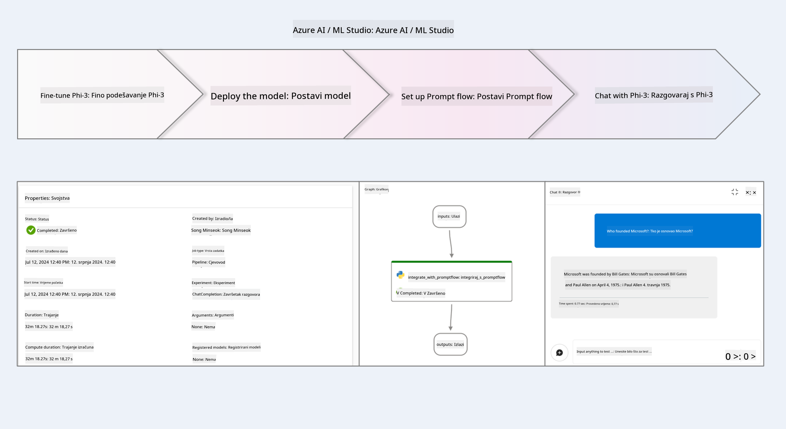

### Sadržaj

1. **[Scenarij 1: Postavljanje Azure resursa i priprema za fino podešavanje](../../../../../../md/02.Application/01.TextAndChat/Phi3)**
    - [Kreiranje Azure Machine Learning radnog prostora](../../../../../../md/02.Application/01.TextAndChat/Phi3)
    - [Zahtjev za GPU kvote u Azure pretplati](../../../../../../md/02.Application/01.TextAndChat/Phi3)
    - [Dodavanje dodjele uloge](../../../../../../md/02.Application/01.TextAndChat/Phi3)
    - [Postavljanje projekta](../../../../../../md/02.Application/01.TextAndChat/Phi3)
    - [Priprema skupa podataka za fino podešavanje](../../../../../../md/02.Application/01.TextAndChat/Phi3)

1. **[Scenarij 2: Fino podešavanje Phi-3 modela i implementacija u Azure Machine Learning Studio](../../../../../../md/02.Application/01.TextAndChat/Phi3)**
    - [Fino podešavanje Phi-3 modela](../../../../../../md/02.Application/01.TextAndChat/Phi3)
    - [Implementacija fino podešenog Phi-3 modela](../../../../../../md/02.Application/01.TextAndChat/Phi3)

1. **[Scenarij 3: Integracija s Prompt flow i razgovor s vašim prilagođenim modelom u Azure AI Foundry](../../../../../../md/02.Application/01.TextAndChat/Phi3)**
    - [Integracija prilagođenog Phi-3 modela s Prompt flow](../../../../../../md/02.Application/01.TextAndChat/Phi3)
    - [Razgovor s vašim prilagođenim Phi-3 modelom](../../../../../../md/02.Application/01.TextAndChat/Phi3)

## Scenarij 1: Postavljanje Azure resursa i priprema za fino podešavanje

### Kreiranje Azure Machine Learning radnog prostora

1. Upišite *azure machine learning* u **traku za pretraživanje** na vrhu stranice portala i odaberite **Azure Machine Learning** iz ponuđenih opcija.

    

2. Odaberite **+ Create** iz navigacijskog izbornika.

3. Odaberite **New workspace** iz navigacijskog izbornika.

    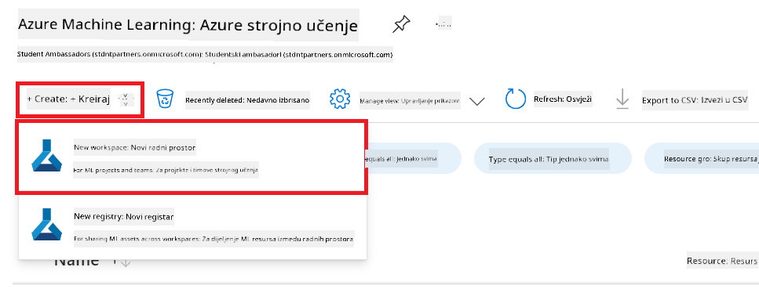

4. Obavite sljedeće zadatke:

    - Odaberite vašu Azure **Pretplatu**.
    - Odaberite **Resource group** koju želite koristiti (kreirajte novu ako je potrebno).
    - Unesite **Workspace Name**. Mora biti jedinstvena vrijednost.
    - Odaberite **Regiju** koju želite koristiti.
    - Odaberite **Storage account** koji želite koristiti (kreirajte novi ako je potrebno).
    - Odaberite **Key vault** koji želite koristiti (kreirajte novi ako je potrebno).
    - Odaberite **Application insights** koji želite koristiti (kreirajte novi ako je potrebno).
    - Odaberite **Container registry** koji želite koristiti (kreirajte novi ako je potrebno).

    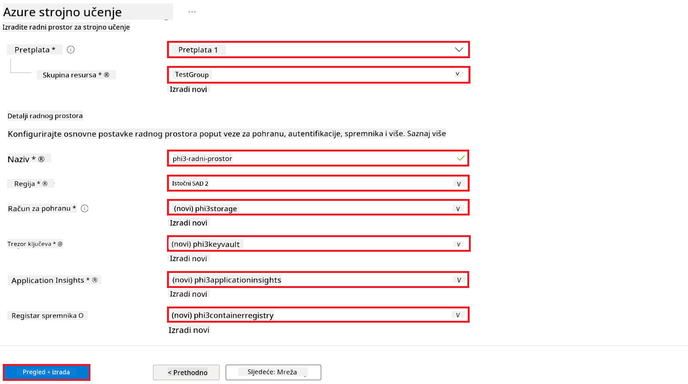

5. Odaberite **Review + Create**.

6. Odaberite **Create**.

### Zahtjev za GPU kvote u Azure pretplati

U ovom vodiču naučit ćete kako fino podesiti i implementirati Phi-3 model koristeći GPU-ove. Za fino podešavanje koristit ćete *Standard_NC24ads_A100_v4* GPU, za što je potrebno podnijeti zahtjev za kvotu. Za implementaciju koristit ćete *Standard_NC6s_v3* GPU, za što je također potreban zahtjev za kvotu.

> [!NOTE]
>
> Samo Pay-As-You-Go pretplate (standardni tip pretplate) imaju pravo na dodjelu GPU resursa; pretplate s pogodnostima trenutno nisu podržane.
>

1. Posjetite [Azure ML Studio](https://ml.azure.com/home?wt.mc_id=studentamb_279723).

1. Obavite sljedeće korake za zahtjev kvote za *Standard NCADSA100v4 Family*:

    - Odaberite **Quota** iz lijevog izbornika.
    - Odaberite **Virtual machine family** koju želite koristiti. Na primjer, odaberite **Standard NCADSA100v4 Family Cluster Dedicated vCPUs**, koja uključuje *Standard_NC24ads_A100_v4* GPU.
    - Odaberite **Request quota** iz navigacijskog izbornika.

        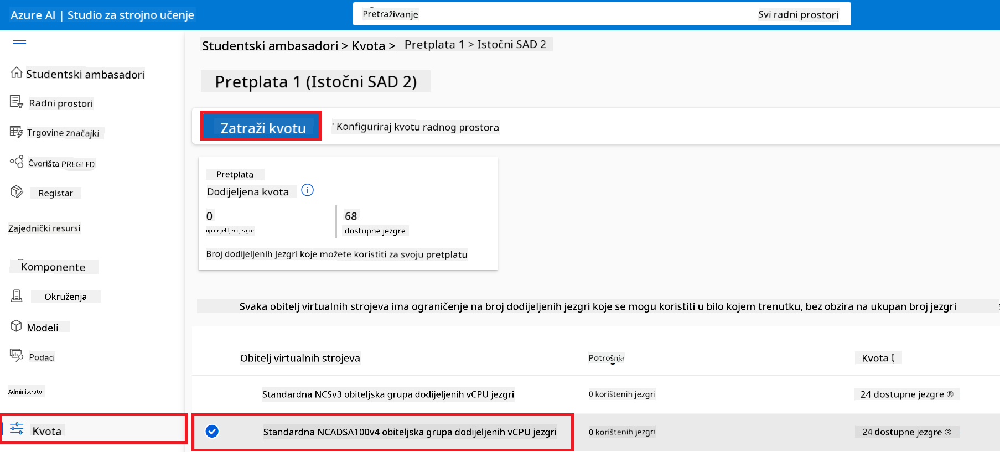

    - Na stranici Request quota unesite **New cores limit** koji želite koristiti. Na primjer, 24.
    - Na stranici Request quota odaberite **Submit** za podnošenje zahtjeva za GPU kvotu.

1. Obavite sljedeće korake za zahtjev kvote za *Standard NCSv3 Family*:

    - Odaberite **Quota** iz lijevog izbornika.
    - Odaberite **Virtual machine family** koju želite koristiti. Na primjer, odaberite **Standard NCSv3 Family Cluster Dedicated vCPUs**, koja uključuje *Standard_NC6s_v3* GPU.
    - Odaberite **Request quota** iz navigacijskog izbornika.
    - Na stranici Request quota unesite **New cores limit** koji želite koristiti. Na primjer, 24.
    - Na stranici Request quota odaberite **Submit** za podnošenje zahtjeva za GPU kvotu.

### Dodavanje dodjele uloge

Za fino podešavanje i implementaciju modela, prvo morate kreirati User Assigned Managed Identity (UAI) i dodijeliti joj odgovarajuće dozvole. Ova UAI će se koristiti za autentikaciju tijekom implementacije.

#### Kreiranje User Assigned Managed Identity (UAI)

1. Upišite *managed identities* u **traku za pretraživanje** na vrhu stranice portala i odaberite **Managed Identities** iz ponuđenih opcija.

    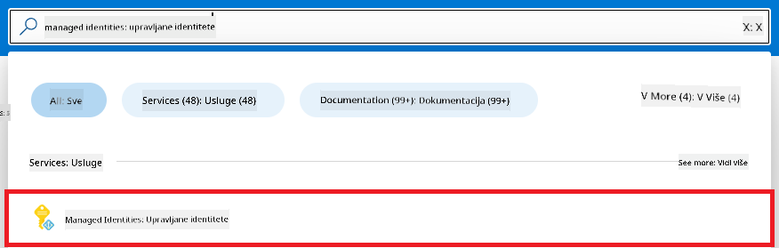

1. Odaberite **+ Create**.

    

1. Obavite sljedeće zadatke:

    - Odaberite vašu Azure **Pretplatu**.
    - Odaberite **Resource group** koju želite koristiti (kreirajte novu ako je potrebno).
    - Odaberite **Regiju** koju želite koristiti.
    - Unesite **Ime**. Mora biti jedinstvena vrijednost.

    

1. Odaberite **Review + create**.

1. Odaberite **+ Create**.

#### Dodavanje uloge Contributor Managed Identity-u

1. Idite na resurs Managed Identity koji ste kreirali.

1. Odaberite **Azure role assignments** iz lijevog izbornika.

1. Odaberite **+Add role assignment** iz navigacijskog izbornika.

1. Na stranici Add role assignment obavite sljedeće zadatke:
    - Odaberite **Scope** na **Resource group**.
    - Odaberite vašu Azure **Pretplatu**.
    - Odaberite **Resource group** koju želite koristiti.
    - Odaberite **Role** na **Contributor**.

    

2. Odaberite **Save**.

#### Dodavanje uloge Storage Blob Data Reader Managed Identity-u

1. Upišite *storage accounts* u **traku za pretraživanje** na vrhu stranice portala i odaberite **Storage accounts** iz ponuđenih opcija.

    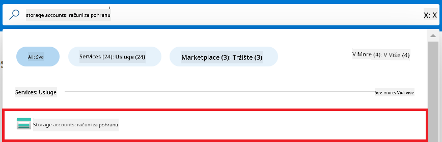

1. Odaberite storage account povezan s Azure Machine Learning radnim prostorom koji ste kreirali. Na primjer, *finetunephistorage*.

1. Obavite sljedeće zadatke za navigaciju do stranice Add role assignment:

    - Idite na Azure Storage račun koji ste kreirali.
    - Odaberite **Access Control (IAM)** iz lijevog izbornika.
    - Odaberite **+ Add** iz navigacijskog izbornika.
    - Odaberite **Add role assignment** iz navigacijskog izbornika.

    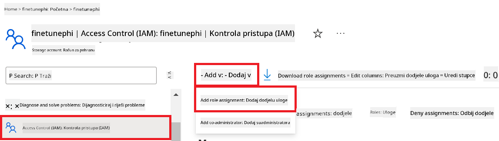

1. Na stranici Add role assignment obavite sljedeće zadatke:

    - Na stranici Role upišite *Storage Blob Data Reader* u **traku za pretraživanje** i odaberite **Storage Blob Data Reader** iz ponuđenih opcija.
    - Na stranici Role odaberite **Next**.
    - Na stranici Members odaberite **Assign access to** **Managed identity**.
    - Na stranici Members odaberite **+ Select members**.
    - Na stranici Select managed identities odaberite vašu Azure **Pretplatu**.
    - Na stranici Select managed identities odaberite **Managed identity** za **Manage Identity**.
    - Na stranici Select managed identities odaberite Managed Identity koju ste kreirali. Na primjer, *finetunephi-managedidentity*.
    - Na stranici Select managed identities odaberite **Select**.

    

1. Odaberite **Review + assign**.

#### Dodavanje uloge AcrPull Managed Identity-u

1. Upišite *container registries* u **traku za pretraživanje** na vrhu stranice portala i odaberite **Container registries** iz ponuđenih opcija.

    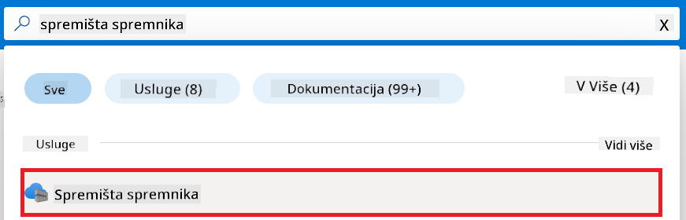

1. Odaberite container registry povezan s Azure Machine Learning radnim prostorom. Na primjer, *finetunephicontainerregistry*.

1. Obavite sljedeće zadatke za navigaciju do stranice Add role assignment:

    - Odaberite **Access Control (IAM)** iz lijevog izbornika.
    - Odaberite **+ Add** iz navigacijskog izbornika.
    - Odaberite **Add role assignment** iz navigacijskog izbornika.

1. Na stranici Add role assignment obavite sljedeće zadatke:

    - Na stranici Role upišite *AcrPull* u **traku za pretraživanje** i odaberite **AcrPull** iz ponuđenih opcija.
    - Na stranici Role odaberite **Next**.
    - Na stranici Members odaberite **Assign access to** **Managed identity**.
    - Na stranici Members odaberite **+ Select members**.
    - Na stranici Select managed identities odaberite vašu Azure **Pretplatu**.
    - Na stranici Select managed identities odaberite **Managed identity** za **Manage Identity**.
    - Na stranici Select managed identities odaberite Managed Identity koju ste kreirali. Na primjer, *finetunephi-managedidentity*.
    - Na stranici Select managed identities odaberite **Select**.
    - Odaberite **Review + assign**.

### Postavljanje projekta

Za preuzimanje skupova podataka potrebnih za fino podešavanje, postavit ćete lokalno okruženje.

U ovom zadatku ćete:

- Kreirati mapu za rad.
- Kreirati virtualno okruženje.
- Instalirati potrebne pakete.
- Kreirati datoteku *download_dataset.py* za preuzimanje skupa podataka.

#### Kreiranje mape za rad

1. Otvorite terminal i upišite sljedeću naredbu za kreiranje mape pod nazivom *finetune-phi* u zadanoj putanji.

    ```console
    mkdir finetune-phi
    ```

2. Upišite sljedeću naredbu u terminalu da biste se prebacili u mapu *finetune-phi* koju ste kreirali.

    ```console
    cd finetune-phi
    ```

#### Kreiranje virtualnog okruženja

1. Upišite sljedeću naredbu u terminalu da biste kreirali virtualno okruženje pod nazivom *.venv*.

    ```console
    python -m venv .venv
    ```

2. Upišite sljedeću naredbu u terminalu da biste aktivirali virtualno okruženje.

    ```console
    .venv\Scripts\activate.bat
    ```

> [!NOTE]
> Ako je uspjelo, trebali biste vidjeti *(.venv)* ispred prompta naredbenog retka.

#### Instalacija potrebnih paketa

1. Upišite sljedeće naredbe u terminalu za instalaciju potrebnih paketa.

    ```console
    pip install datasets==2.19.1
    ```

#### Kreiranje `download_dataset.py`

> [!NOTE]
> Kompletna struktura mape:
>
> ```text
> └── YourUserName
> .    └── finetune-phi
> .        └── download_dataset.py
> ```

1. Otvorite **Visual Studio Code**.

1. Odaberite **File** u izborniku.

1. Odaberite **Open Folder**.

1. Odaberite mapu *finetune-phi* koju ste kreirali, koja se nalazi na putanji *C:\Users\yourUserName\finetune-phi*.

    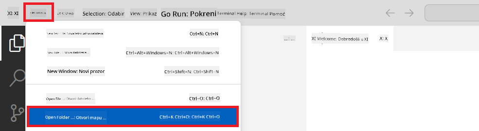

1. U lijevom dijelu Visual Studio Code-a kliknite desnom tipkom miša i odaberite **New File** za kreiranje nove datoteke pod nazivom *download_dataset.py*.

    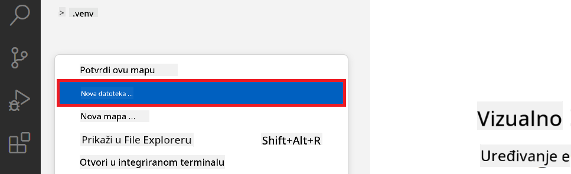

### Priprema skupa podataka za fino podešavanje

U ovom zadatku pokrenut ćete datoteku *download_dataset.py* za preuzimanje skupa podataka *ultrachat_200k* u vaše lokalno okruženje. Taj skup podataka koristit ćete za fino podešavanje Phi-3 modela u Azure Machine Learning.

U ovom zadatku ćete:

- Dodati kod u datoteku *download_dataset.py* za preuzimanje skupa podataka.
- Pokrenuti datoteku *download_dataset.py* za preuzimanje skupa podataka u lokalno okruženje.

#### Preuzimanje skupa podataka pomoću *download_dataset.py*

1. Otvorite datoteku *download_dataset.py* u Visual Studio Code-u.

1. Dodajte sljedeći kod u datoteku *download_dataset.py*.

    ```python
    import json
    import os
    from datasets import load_dataset

    def load_and_split_dataset(dataset_name, config_name, split_ratio):
        """
        Load and split a dataset.
        """
        # Load the dataset with the specified name, configuration, and split ratio
        dataset = load_dataset(dataset_name, config_name, split=split_ratio)
        print(f"Original dataset size: {len(dataset)}")
        
        # Split the dataset into train and test sets (80% train, 20% test)
        split_dataset = dataset.train_test_split(test_size=0.2)
        print(f"Train dataset size: {len(split_dataset['train'])}")
        print(f"Test dataset size: {len(split_dataset['test'])}")
        
        return split_dataset

    def save_dataset_to_jsonl(dataset, filepath):
        """
        Save a dataset to a JSONL file.
        """
        # Create the directory if it does not exist
        os.makedirs(os.path.dirname(filepath), exist_ok=True)
        
        # Open the file in write mode
        with open(filepath, 'w', encoding='utf-8') as f:
            # Iterate over each record in the dataset
            for record in dataset:
                # Dump the record as a JSON object and write it to the file
                json.dump(record, f)
                # Write a newline character to separate records
                f.write('\n')
        
        print(f"Dataset saved to {filepath}")

    def main():
        """
        Main function to load, split, and save the dataset.
        """
        # Load and split the ULTRACHAT_200k dataset with a specific configuration and split ratio
        dataset = load_and_split_dataset("HuggingFaceH4/ultrachat_200k", 'default', 'train_sft[:1%]')
        
        # Extract the train and test datasets from the split
        train_dataset = dataset['train']
        test_dataset = dataset['test']

        # Save the train dataset to a JSONL file
        save_dataset_to_jsonl(train_dataset, "data/train_data.jsonl")
        
        # Save the test dataset to a separate JSONL file
        save_dataset_to_jsonl(test_dataset, "data/test_data.jsonl")

    if __name__ == "__main__":
        main()

    ```

1. Upišite sljedeću naredbu u terminalu za pokretanje skripte i preuzimanje skupa podataka u lokalno okruženje.

    ```console
    python download_dataset.py
    ```

1. Provjerite je li skup podataka uspješno spremljen u lokalni direktorij *finetune-phi/data*.

> [!NOTE]
>
> #### Napomena o veličini skupa podataka i vremenu fino podešavanja
>
> U ovom vodiču koristite samo 1% skupa podataka (`split='train[:1%]'`). To značajno smanjuje količinu podataka, ubrzavajući i proces prijenosa i fino podešavanja. Možete prilagoditi postotak kako biste pronašli pravi balans između vremena treniranja i performansi modela. Korištenje manjeg dijela skupa podataka smanjuje vrijeme potrebno za fino podešavanje, čineći proces upravljivijim za ovaj vodič.

## Scenarij 2: Fino podešavanje Phi-3 modela i
1. Posjetite [Azure ML Studio](https://ml.azure.com/home?wt.mc_id=studentamb_279723).

1. Izaberite **Compute** s lijeve strane izbornika.

1. Izaberite **Compute clusters** iz navigacijskog izbornika.

1. Kliknite na **+ New**.

    

1. Obavite sljedeće zadatke:

    - Izaberite **Region** koji želite koristiti.
    - Postavite **Virtual machine tier** na **Dedicated**.
    - Postavite **Virtual machine type** na **GPU**.
    - Filtrirajte **Virtual machine size** na **Select from all options**.
    - Izaberite **Virtual machine size** na **Standard_NC24ads_A100_v4**.

    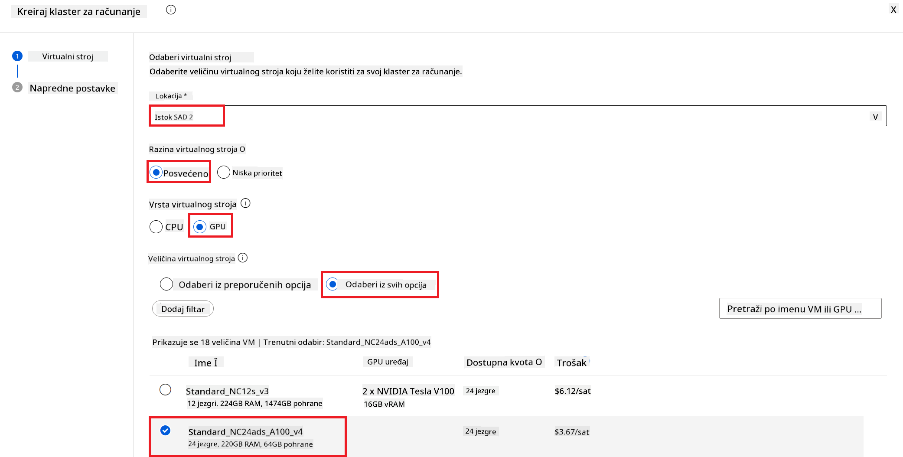

1. Kliknite na **Next**.

1. Obavite sljedeće zadatke:

    - Unesite **Compute name**. Mora biti jedinstvena vrijednost.
    - Postavite **Minimum number of nodes** na **0**.
    - Postavite **Maximum number of nodes** na **1**.
    - Postavite **Idle seconds before scale down** na **120**.

    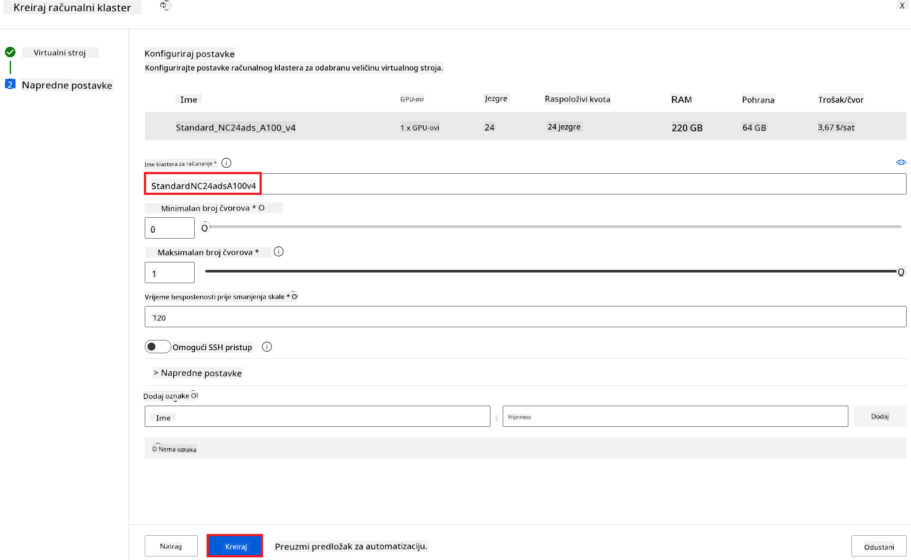

1. Kliknite na **Create**.

#### Fino podešavanje Phi-3 modela

1. Posjetite [Azure ML Studio](https://ml.azure.com/home?wt.mc_id=studentamb_279723).

1. Izaberite Azure Machine Learning workspace koji ste kreirali.

    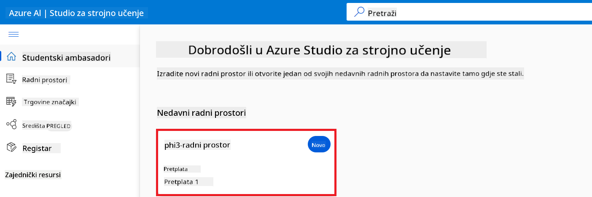

1. Obavite sljedeće zadatke:

    - Izaberite **Model catalog** s lijeve strane.
    - Upišite *phi-3-mini-4k* u **search bar** i izaberite **Phi-3-mini-4k-instruct** iz ponuđenih opcija.

    

1. Izaberite **Fine-tune** iz navigacijskog izbornika.

    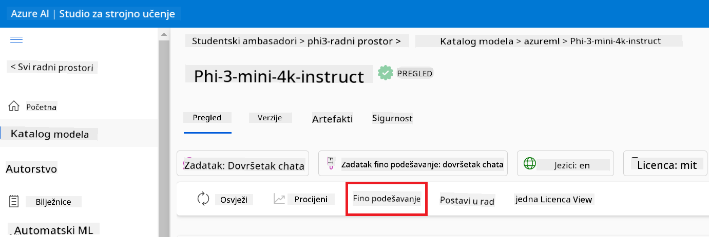

1. Obavite sljedeće zadatke:

    - Postavite **Select task type** na **Chat completion**.
    - Kliknite na **+ Select data** da biste učitali **Traning data**.
    - Za vrstu učitavanja Validation podataka izaberite **Provide different validation data**.
    - Kliknite na **+ Select data** da biste učitali **Validation data**.

    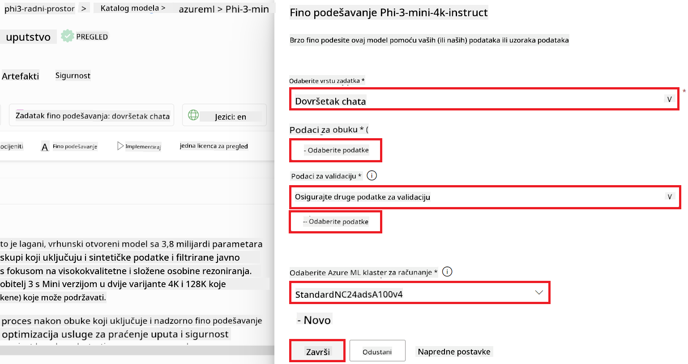

    > [!TIP]
    >
    > Možete odabrati **Advanced settings** kako biste prilagodili postavke poput **learning_rate** i **lr_scheduler_type** za optimizaciju procesa fino podešavanja prema vašim potrebama.

1. Kliknite na **Finish**.

1. U ovom zadatku ste uspješno fino podesili Phi-3 model koristeći Azure Machine Learning. Imajte na umu da proces fino podešavanja može potrajati. Nakon pokretanja posla za fino podešavanje, morate pričekati da se završi. Status posla možete pratiti u kartici Jobs na lijevoj strani vašeg Azure Machine Learning Workspace-a. U sljedećem dijelu ćete implementirati fino podešeni model i integrirati ga s Prompt flow.

    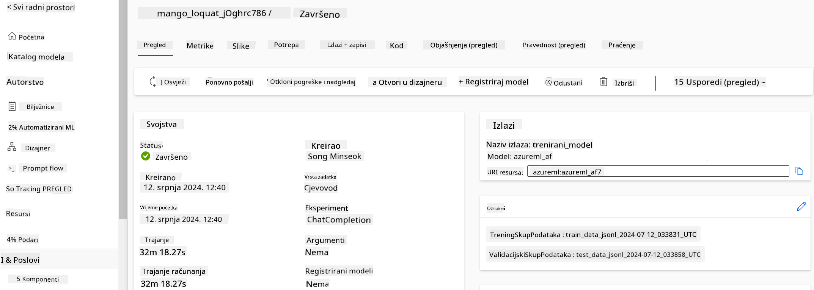

### Implementacija fino podešenog Phi-3 modela

Da biste integrirali fino podešeni Phi-3 model s Prompt flow, potrebno je implementirati model kako bi bio dostupan za real-time inferencu. Ovaj proces uključuje registraciju modela, kreiranje online endpointa i implementaciju modela.

U ovom zadatku ćete:

- Registrirati fino podešeni model u Azure Machine Learning workspace-u.
- Kreirati online endpoint.
- Implementirati registrirani fino podešeni Phi-3 model.

#### Registracija fino podešenog modela

1. Posjetite [Azure ML Studio](https://ml.azure.com/home?wt.mc_id=studentamb_279723).

1. Izaberite Azure Machine Learning workspace koji ste kreirali.

    

1. Izaberite **Models** s lijeve strane.
1. Kliknite na **+ Register**.
1. Izaberite **From a job output**.

    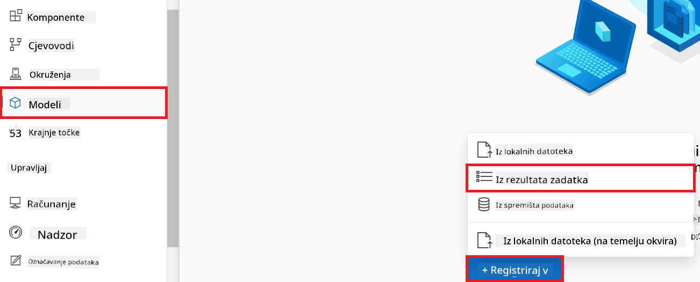

1. Izaberite posao koji ste kreirali.

    

1. Kliknite na **Next**.

1. Postavite **Model type** na **MLflow**.

1. Provjerite je li **Job output** odabrano; trebalo bi biti automatski odabrano.

    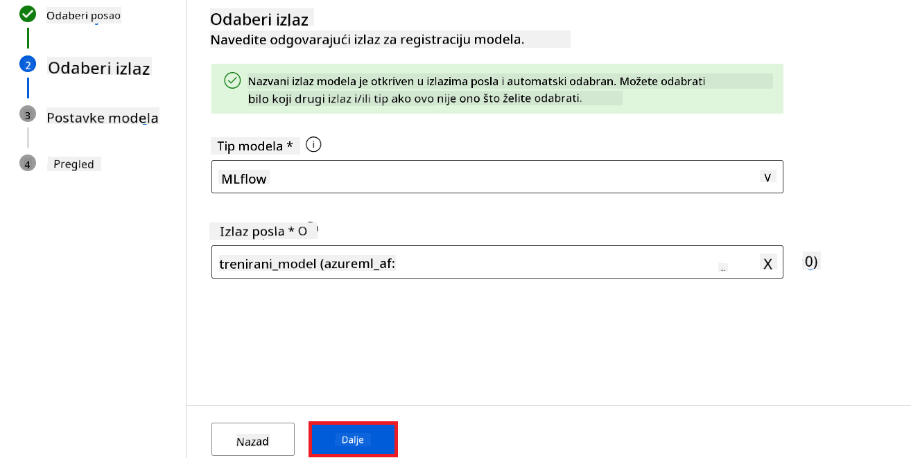

2. Kliknite na **Next**.

3. Kliknite na **Register**.

    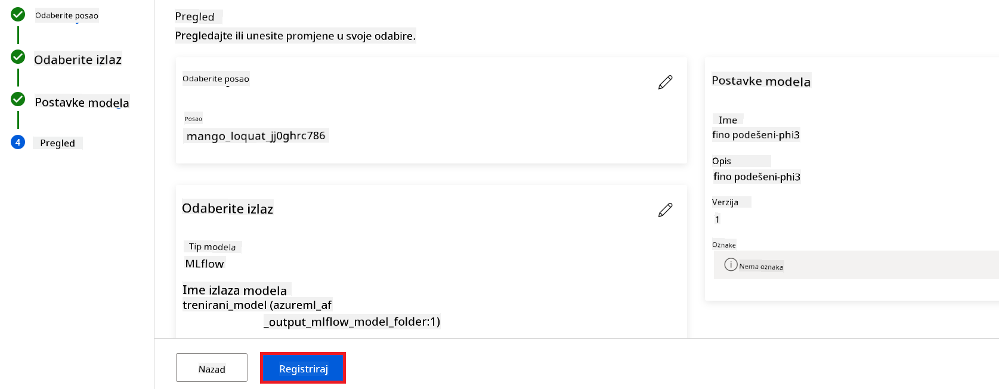

4. Registrirani model možete vidjeti u izborniku **Models** s lijeve strane.

    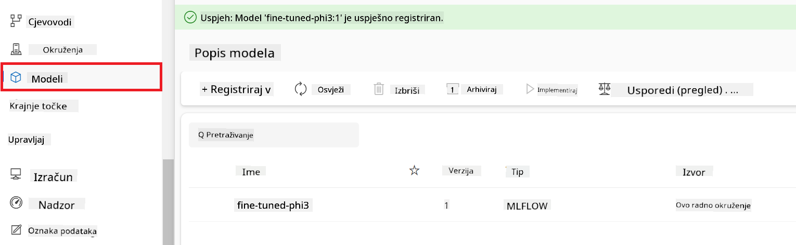

#### Implementacija fino podešenog modela

1. Idite u Azure Machine Learning workspace koji ste kreirali.

1. Izaberite **Endpoints** s lijeve strane.

1. Izaberite **Real-time endpoints** iz navigacijskog izbornika.

    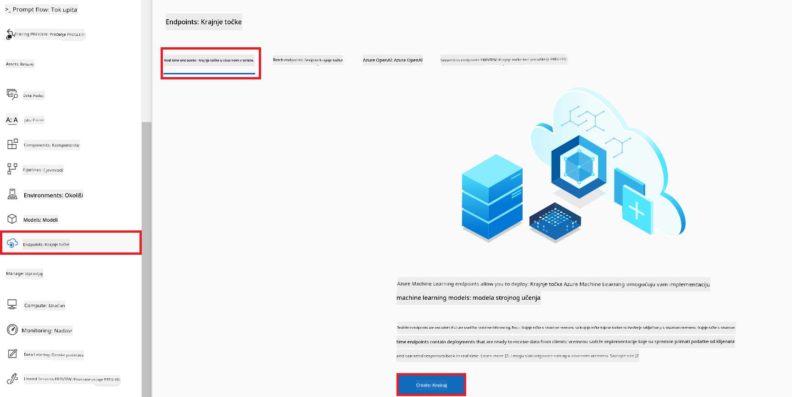

1. Kliknite na **Create**.

1. Odaberite registrirani model koji ste kreirali.

    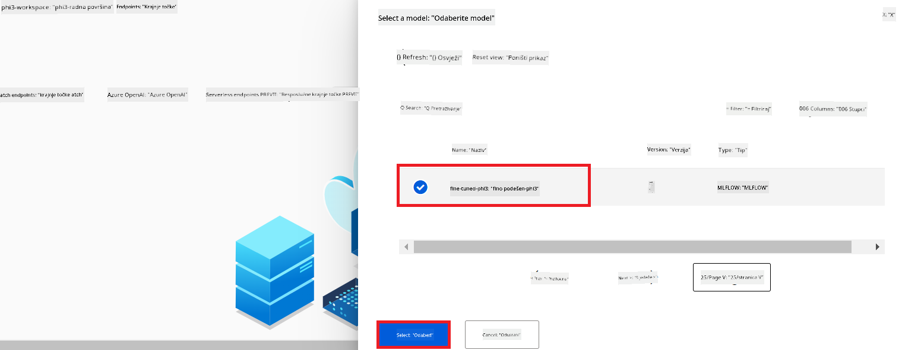

1. Kliknite na **Select**.

1. Obavite sljedeće zadatke:

    - Postavite **Virtual machine** na *Standard_NC6s_v3*.
    - Izaberite **Instance count** koji želite koristiti, na primjer *1*.
    - Postavite **Endpoint** na **New** za kreiranje novog endpointa.
    - Unesite **Endpoint name**. Mora biti jedinstven.
    - Unesite **Deployment name**. Mora biti jedinstven.

    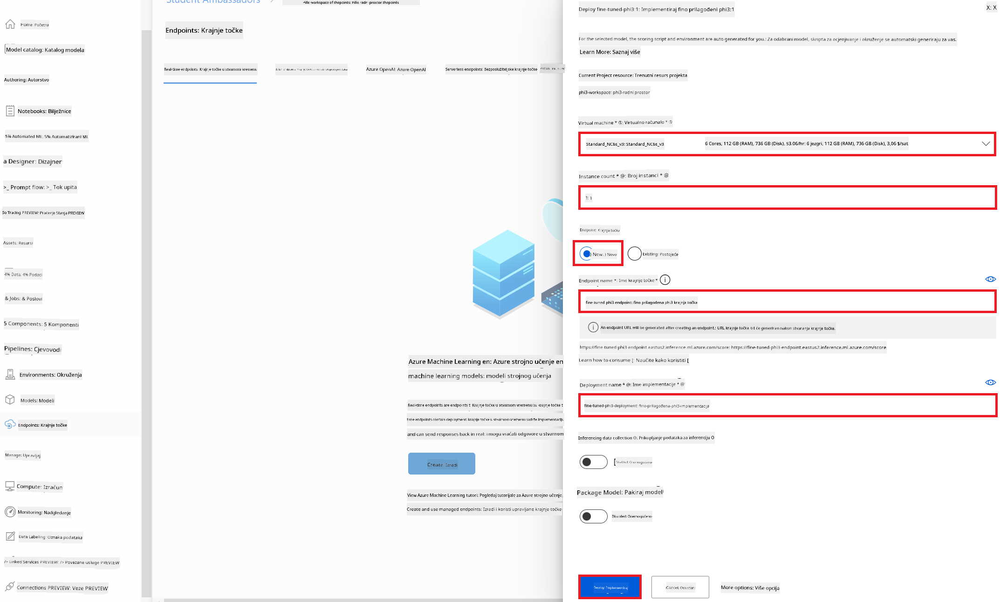

1. Kliknite na **Deploy**.

> [!WARNING]
> Kako biste izbjegli dodatne troškove, obavezno izbrišite kreirani endpoint u Azure Machine Learning workspace-u.
>

#### Provjera statusa implementacije u Azure Machine Learning Workspace

1. Idite u Azure Machine Learning workspace koji ste kreirali.

1. Izaberite **Endpoints** s lijeve strane.

1. Izaberite endpoint koji ste kreirali.

    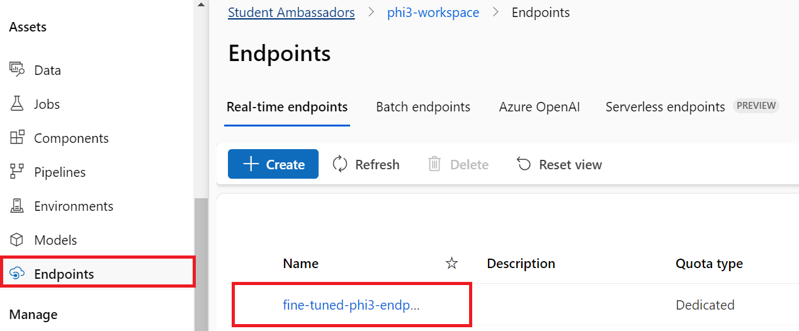

1. Na ovoj stranici možete upravljati endpointima tijekom procesa implementacije.

> [!NOTE]
> Nakon što je implementacija završena, provjerite je li **Live traffic** postavljen na **100%**. Ako nije, kliknite na **Update traffic** kako biste prilagodili promet. Ne možete testirati model ako je promet postavljen na 0%.
>
> 
>

## Scenarij 3: Integracija s Prompt flow i razgovor s vašim prilagođenim modelom u Azure AI Foundry

### Integracija prilagođenog Phi-3 modela s Prompt flow

Nakon uspješne implementacije fino podešenog modela, sada ga možete integrirati s Prompt Flow kako biste koristili model u real-time aplikacijama, omogućujući različite interaktivne zadatke s vašim prilagođenim Phi-3 modelom.

U ovom zadatku ćete:

- Kreirati Azure AI Foundry Hub.
- Kreirati Azure AI Foundry Project.
- Kreirati Prompt flow.
- Dodati prilagođenu vezu za fino podešeni Phi-3 model.
- Postaviti Prompt flow za razgovor s vašim prilagođenim Phi-3 modelom.

> [!NOTE]
> Također možete integrirati s Promptflow koristeći Azure ML Studio. Isti proces integracije vrijedi i za Azure ML Studio.

#### Kreiranje Azure AI Foundry Hub-a

Prije kreiranja projekta, morate kreirati Hub. Hub funkcionira kao Resource Group, omogućujući vam organizaciju i upravljanje više projekata unutar Azure AI Foundry.

1. Posjetite [Azure AI Foundry](https://ai.azure.com/?WT.mc_id=aiml-137032-kinfeylo).

1. Izaberite **All hubs** s lijeve strane.

1. Kliknite na **+ New hub** u navigacijskom izborniku.

    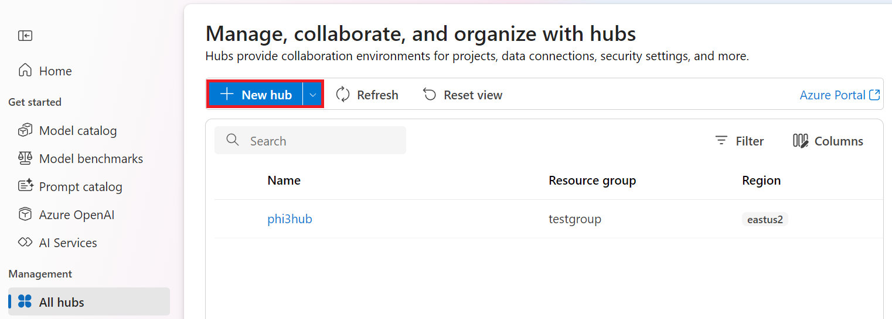

1. Obavite sljedeće zadatke:

    - Unesite **Hub name**. Mora biti jedinstven.
    - Izaberite vašu Azure **Subscription**.
    - Izaberite **Resource group** koju želite koristiti (kreirajte novu ako je potrebno).
    - Izaberite **Location** koju želite koristiti.
    - Izaberite **Connect Azure AI Services** (kreirajte novu ako je potrebno).
    - Za **Connect Azure AI Search** izaberite **Skip connecting**.

    

1. Kliknite na **Next**.

#### Kreiranje Azure AI Foundry projekta

1. U kreiranom Hub-u izaberite **All projects** s lijeve strane.

1. Kliknite na **+ New project** u navigacijskom izborniku.

    

1. Unesite **Project name**. Mora biti jedinstven.

    

1. Kliknite na **Create a project**.

#### Dodavanje prilagođene veze za fino podešeni Phi-3 model

Da biste integrirali vaš prilagođeni Phi-3 model s Prompt flow, morate spremiti endpoint i ključ modela u prilagođenu vezu. Ova postavka osigurava pristup vašem prilagođenom Phi-3 modelu unutar Prompt flow-a.

#### Postavljanje api ključa i endpoint URI-ja fino podešenog Phi-3 modela

1. Posjetite [Azure ML Studio](https://ml.azure.com/home?WT.mc_id=aiml-137032-kinfeylo).

1. Idite u Azure Machine Learning workspace koji ste kreirali.

1. Izaberite **Endpoints** s lijeve strane.

    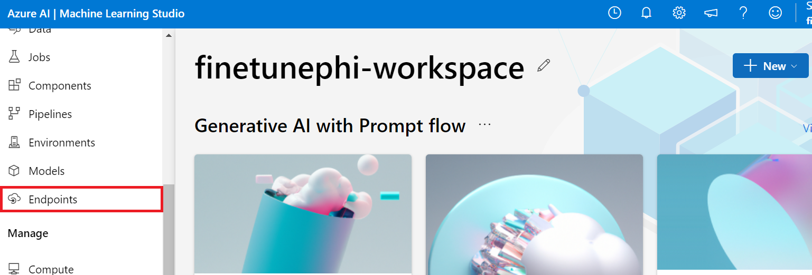

1. Izaberite endpoint koji ste kreirali.

    

1. Izaberite **Consume** iz navigacijskog izbornika.

1. Kopirajte vaš **REST endpoint** i **Primary key**.


#### Dodajte prilagođenu vezu

1. Posjetite [Azure AI Foundry](https://ai.azure.com/?WT.mc_id=aiml-137032-kinfeylo).

1. Idite na Azure AI Foundry projekt koji ste kreirali.

1. U projektu koji ste kreirali, odaberite **Settings** s lijevog izbornika.

1. Odaberite **+ New connection**.

    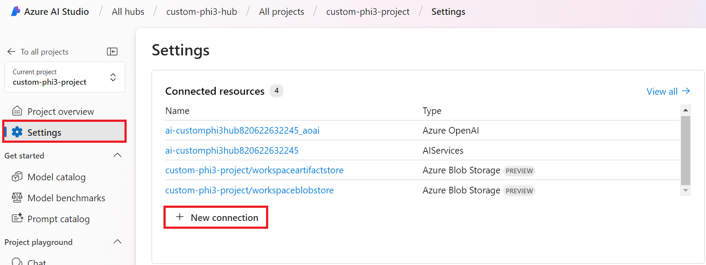

1. Iz navigacijskog izbornika odaberite **Custom keys**.

    

1. Izvršite sljedeće zadatke:

    - Odaberite **+ Add key value pairs**.
    - Za ime ključa unesite **endpoint** i zalijepite endpoint koji ste kopirali iz Azure ML Studija u polje za vrijednost.
    - Ponovno odaberite **+ Add key value pairs**.
    - Za ime ključa unesite **key** i zalijepite ključ koji ste kopirali iz Azure ML Studija u polje za vrijednost.
    - Nakon dodavanja ključeva, označite **is secret** kako biste spriječili izlaganje ključa.

    

1. Odaberite **Add connection**.

#### Kreirajte Prompt flow

Dodali ste prilagođenu vezu u Azure AI Foundry. Sada, krenimo s kreiranjem Prompt flow koristeći sljedeće korake. Nakon toga povezati ćete ovaj Prompt flow s prilagođenom vezom kako biste mogli koristiti fino podešeni model unutar Prompt flow.

1. Idite na Azure AI Foundry projekt koji ste kreirali.

1. Odaberite **Prompt flow** s lijevog izbornika.

1. Iz navigacijskog izbornika odaberite **+ Create**.

    

1. Iz navigacijskog izbornika odaberite **Chat flow**.

    

1. Unesite **Folder name** koji želite koristiti.

    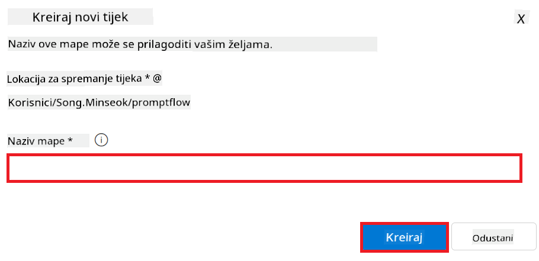

2. Odaberite **Create**.

#### Postavite Prompt flow za razgovor s vašim prilagođenim Phi-3 modelom

Potrebno je integrirati fino podešeni Phi-3 model u Prompt flow. Međutim, postojeći Prompt flow nije dizajniran za ovu svrhu. Stoga morate preurediti Prompt flow kako biste omogućili integraciju prilagođenog modela.

1. U Prompt flow izvršite sljedeće korake za preuređenje postojećeg toka:

    - Odaberite **Raw file mode**.
    - Izbrišite sav postojeći kod u datoteci *flow.dag.yml*.
    - Dodajte sljedeći kod u datoteku *flow.dag.yml*.

        ```yml
        inputs:
          input_data:
            type: string
            default: "Who founded Microsoft?"

        outputs:
          answer:
            type: string
            reference: ${integrate_with_promptflow.output}

        nodes:
        - name: integrate_with_promptflow
          type: python
          source:
            type: code
            path: integrate_with_promptflow.py
          inputs:
            input_data: ${inputs.input_data}
        ```

    - Odaberite **Save**.

    

1. Dodajte sljedeći kod u datoteku *integrate_with_promptflow.py* kako biste koristili prilagođeni Phi-3 model u Prompt flow.

    ```python
    import logging
    import requests
    from promptflow import tool
    from promptflow.connections import CustomConnection

    # Logging setup
    logging.basicConfig(
        format="%(asctime)s - %(levelname)s - %(name)s - %(message)s",
        datefmt="%Y-%m-%d %H:%M:%S",
        level=logging.DEBUG
    )
    logger = logging.getLogger(__name__)

    def query_phi3_model(input_data: str, connection: CustomConnection) -> str:
        """
        Send a request to the Phi-3 model endpoint with the given input data using Custom Connection.
        """

        # "connection" is the name of the Custom Connection, "endpoint", "key" are the keys in the Custom Connection
        endpoint_url = connection.endpoint
        api_key = connection.key

        headers = {
            "Content-Type": "application/json",
            "Authorization": f"Bearer {api_key}"
        }
        data = {
            "input_data": {
                "input_string": [
                    {"role": "user", "content": input_data}
                ],
                "parameters": {
                    "temperature": 0.7,
                    "max_new_tokens": 128
                }
            }
        }
        try:
            response = requests.post(endpoint_url, json=data, headers=headers)
            response.raise_for_status()
            
            # Log the full JSON response
            logger.debug(f"Full JSON response: {response.json()}")

            result = response.json()["output"]
            logger.info("Successfully received response from Azure ML Endpoint.")
            return result
        except requests.exceptions.RequestException as e:
            logger.error(f"Error querying Azure ML Endpoint: {e}")
            raise

    @tool
    def my_python_tool(input_data: str, connection: CustomConnection) -> str:
        """
        Tool function to process input data and query the Phi-3 model.
        """
        return query_phi3_model(input_data, connection)

    ```

    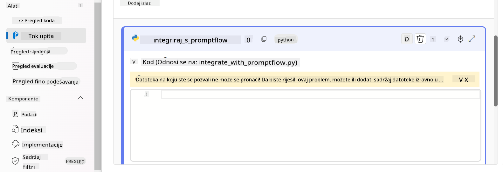

> [!NOTE]
> Za detaljnije informacije o korištenju Prompt flow u Azure AI Foundry, pogledajte [Prompt flow in Azure AI Foundry](https://learn.microsoft.com/azure/ai-studio/how-to/prompt-flow).

1. Odaberite **Chat input**, **Chat output** kako biste omogućili razgovor s vašim modelom.

    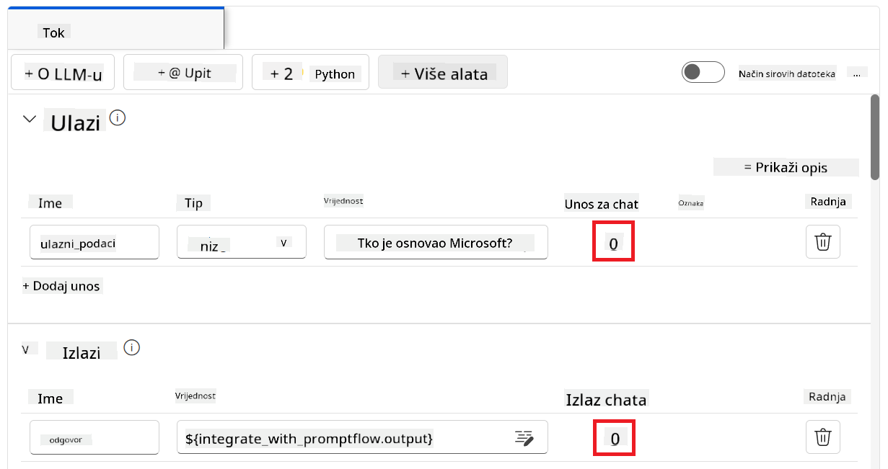

1. Sada ste spremni za razgovor s vašim prilagođenim Phi-3 modelom. U sljedećoj vježbi naučit ćete kako pokrenuti Prompt flow i koristiti ga za razgovor s vašim fino podešenim Phi-3 modelom.

> [!NOTE]
>
> Preuređeni tok trebao bi izgledati kao na slici ispod:
>
> 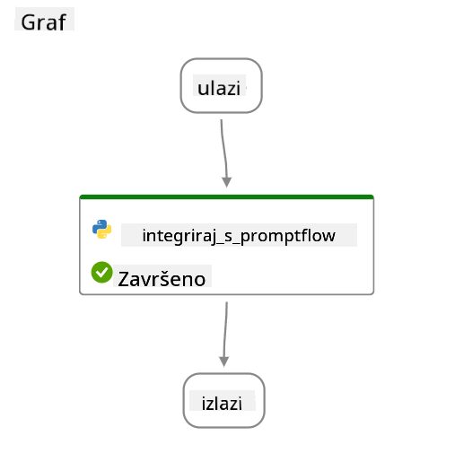
>

### Razgovarajte s vašim prilagođenim Phi-3 modelom

Sada kada ste fino podesili i integrirali svoj prilagođeni Phi-3 model u Prompt flow, spremni ste za početak interakcije s njim. Ova vježba će vas voditi kroz postupak postavljanja i pokretanja razgovora s vašim modelom koristeći Prompt flow. Slijedeći ove korake moći ćete u potpunosti iskoristiti mogućnosti vašeg fino podešenog Phi-3 modela za različite zadatke i razgovore.

- Razgovarajte s vašim prilagođenim Phi-3 modelom koristeći Prompt flow.

#### Pokrenite Prompt flow

1. Odaberite **Start compute sessions** za pokretanje Prompt flow.

    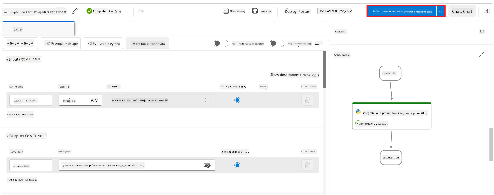

1. Odaberite **Validate and parse input** za osvježavanje parametara.

    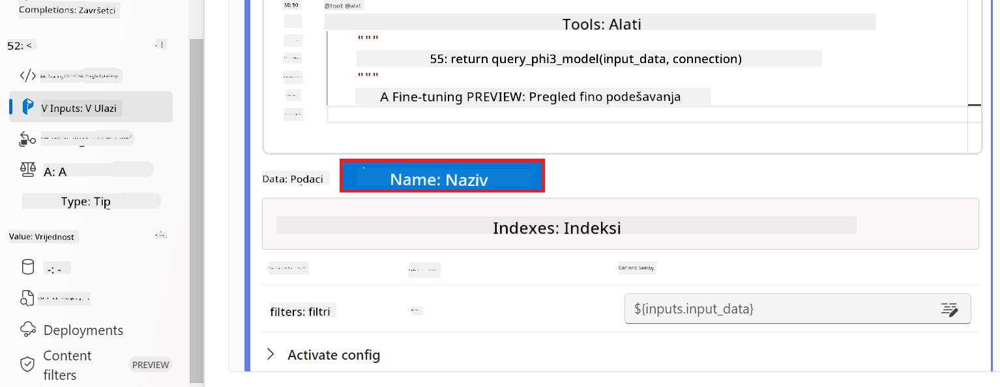

1. Odaberite **Value** od **connection** na prilagođenu vezu koju ste kreirali. Na primjer, *connection*.

    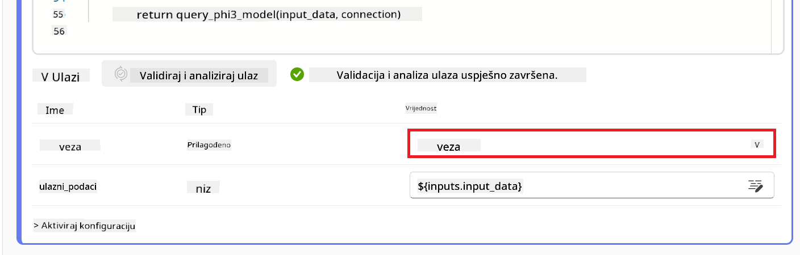

#### Razgovarajte s vašim prilagođenim modelom

1. Odaberite **Chat**.

    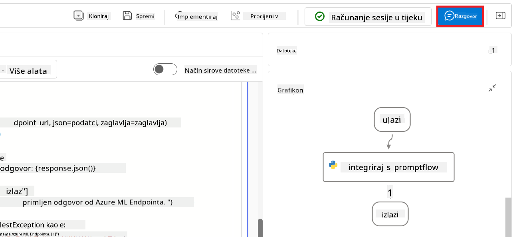

1. Evo primjera rezultata: sada možete razgovarati s vašim prilagođenim Phi-3 modelom. Preporučuje se postavljati pitanja temeljena na podacima korištenim za fino podešavanje.

    

**Odricanje od odgovornosti**:  
Ovaj dokument preveden je pomoću AI usluge za prevođenje [Co-op Translator](https://github.com/Azure/co-op-translator). Iako nastojimo postići točnost, imajte na umu da automatski prijevodi mogu sadržavati pogreške ili netočnosti. Izvorni dokument na izvornom jeziku treba se smatrati službenim i autoritativnim izvorom. Za važne informacije preporučuje se profesionalni ljudski prijevod. Ne odgovaramo za bilo kakva nesporazume ili pogrešna tumačenja koja proizlaze iz korištenja ovog prijevoda.