<!--
CO_OP_TRANSLATOR_METADATA:
{
  "original_hash": "0df910a227098303cc392b6ad204c271",
  "translation_date": "2026-01-06T05:16:49+00:00",
  "source_file": "md/02.Application/01.TextAndChat/Phi3/E2E_Phi-3-FineTuning_PromptFlow_Integration_AIFoundry.md",
  "language_code": "hr"
}
-->
# Dorada i integracija prilagođenih Phi-3 modela s Prompt flow u Azure AI Foundry

Ovaj end-to-end (E2E) primjer temelji se na vodiču "[Fine-Tune and Integrate Custom Phi-3 Models with Prompt Flow in Azure AI Foundry](https://techcommunity.microsoft.com/t5/educator-developer-blog/fine-tune-and-integrate-custom-phi-3-models-with-prompt-flow-in/ba-p/4191726?WT.mc_id=aiml-137032-kinfeylo)" iz Microsoft Tech Communityja. Uvodi procese dorade, implementacije i integracije prilagođenih Phi-3 modela s Prompt flow u Azure AI Foundry.
Za razliku od E2E primjera, "[Fine-Tune and Integrate Custom Phi-3 Models with Prompt Flow](./E2E_Phi-3-FineTuning_PromptFlow_Integration.md)", koji je uključivao lokalno izvođenje koda, ovaj vodič u potpunosti je usmjeren na doradu i integraciju vašeg modela unutar Azure AI / ML Studia.

## Pregled

U ovom E2E primjeru naučit ćete kako doraditi Phi-3 model i integrirati ga s Prompt flow u Azure AI Foundry. Korištenjem Azure AI / ML Studia uspostavit ćete tijek rada za implementaciju i korištenje prilagođenih AI modela. Ovaj E2E primjer podijeljen je u tri scenarija:

**Scenarij 1: Postavljanje Azure resursa i priprema za doradu**

**Scenarij 2: Dorada Phi-3 modela i implementacija u Azure Machine Learning Studio**

**Scenarij 3: Integracija s Prompt flow i razgovor s vašim prilagođenim modelom u Azure AI Foundry**

Evo pregleda ovog E2E primjera.


### Sadržaj

1. **[Scenarij 1: Postavljanje Azure resursa i priprema za doradu](../../../../../../md/02.Application/01.TextAndChat/Phi3)**
    - [Stvaranje Azure Machine Learning Workspacea](../../../../../../md/02.Application/01.TextAndChat/Phi3)
    - [Zahtjev za GPU kvote u Azure pretplati](../../../../../../md/02.Application/01.TextAndChat/Phi3)
    - [Dodavanje dodjele uloga](../../../../../../md/02.Application/01.TextAndChat/Phi3)
    - [Postavljanje projekta](../../../../../../md/02.Application/01.TextAndChat/Phi3)
    - [Priprema skupa podataka za doradu](../../../../../../md/02.Application/01.TextAndChat/Phi3)

1. **[Scenarij 2: Dorada Phi-3 modela i implementacija u Azure Machine Learning Studio](../../../../../../md/02.Application/01.TextAndChat/Phi3)**
    - [Doradite Phi-3 model](../../../../../../md/02.Application/01.TextAndChat/Phi3)
    - [Implementirajte doradeni Phi-3 model](../../../../../../md/02.Application/01.TextAndChat/Phi3)

1. **[Scenarij 3: Integracija s Prompt flow i razgovor s vašim prilagođenim modelom u Azure AI Foundry](../../../../../../md/02.Application/01.TextAndChat/Phi3)**
    - [Integrirajte prilagođeni Phi-3 model s Prompt flow](../../../../../../md/02.Application/01.TextAndChat/Phi3)
    - [Razgovarajte sa svojim prilagođenim Phi-3 modelom](../../../../../../md/02.Application/01.TextAndChat/Phi3)

## Scenarij 1: Postavljanje Azure resursa i priprema za doradu

### Stvaranje Azure Machine Learning Workspacea

1. Upišite *azure machine learning* u **traku za pretraživanje** na vrhu stranice portala i odaberite **Azure Machine Learning** iz ponuđenih opcija.

    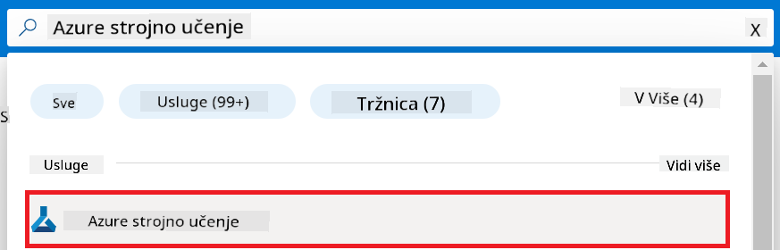

2. Odaberite **+ Create** u navigacijskom izborniku.

3. Odaberite **New workspace** u navigacijskom izborniku.

    

4. Izvršite sljedeće zadatke:

    - Odaberite svoju Azure **Pretplatu**.
    - Odaberite **Resource group** koju ćete koristiti (ako treba, stvorite novu).
    - Unesite **Ime Workspacea**. Mora biti jedinstvena vrijednost.
    - Odaberite **Regiju** koju želite koristiti.
    - Odaberite **Storage account** koji ćete koristiti (ako treba, stvorite novi).
    - Odaberite **Key vault** koji ćete koristiti (ako treba, stvorite novi).
    - Odaberite **Application insights** koji ćete koristiti (ako treba, stvorite novi).
    - Odaberite **Container registry** koji ćete koristiti (ako treba, stvorite novi).

    

5. Odaberite **Review + Create**.

6. Odaberite **Create**.

### Zahtjev za GPU kvote u Azure pretplati

U ovom vodiču naučit ćete kako doraditi i implementirati Phi-3 model koristeći GPU-ove. Za doradu ćete koristiti *Standard_NC24ads_A100_v4* GPU, za što je potreban zahtjev za kvotu. Za implementaciju ćete koristiti *Standard_NC6s_v3* GPU, za što je također potreban zahtjev za kvotu.

> [!NOTE]
>
> Samo Pay-As-You-Go pretplate (standardni tip pretplate) su prihvatljive za dodjelu GPU-a; pretplate s benefitima trenutno nisu podržane.
>

1. Posjetite [Azure ML Studio](https://ml.azure.com/home?wt.mc_id=studentamb_279723).

1. Izvršite sljedeće zadatke za zahtjev *Standard NCADSA100v4 Family* kvote:

    - Odaberite **Quota** iz lijevog izbornika.
    - Odaberite **Virtual machine family** koju želite koristiti. Na primjer, odaberite **Standard NCADSA100v4 Family Cluster Dedicated vCPUs**, koji uključuje GPU *Standard_NC24ads_A100_v4*.
    - Odaberite **Request quota** u navigacijskom izborniku.

        

    - Na stranici Request quota unesite **New cores limit** koju želite koristiti. Na primjer, 24.
    - Na stranici Request quota odaberite **Submit** kako biste zatražili GPU kvotu.

1. Izvršite sljedeće zadatke za zahtjev *Standard NCSv3 Family* kvote:

    - Odaberite **Quota** iz lijevog izbornika.
    - Odaberite **Virtual machine family** koju želite koristiti. Na primjer, odaberite **Standard NCSv3 Family Cluster Dedicated vCPUs**, koji uključuje GPU *Standard_NC6s_v3*.
    - Odaberite **Request quota** u navigacijskom izborniku.
    - Na stranici Request quota unesite **New cores limit** koju želite koristiti. Na primjer, 24.
    - Na stranici Request quota odaberite **Submit** kako biste zatražili GPU kvotu.

### Dodavanje dodjele uloga

Da biste doradili i implementirali svoje modele, prvo morate stvoriti User Assigned Managed Identity (UAI) i dodijeliti joj odgovarajuće dozvole. Ta će se UAI koristiti za autentikaciju tijekom implementacije.

#### Stvaranje User Assigned Managed Identity (UAI)

1. Upišite *managed identities* u **traku za pretraživanje** na vrhu stranice portala i odaberite **Managed Identities** iz ponuđenih opcija.

    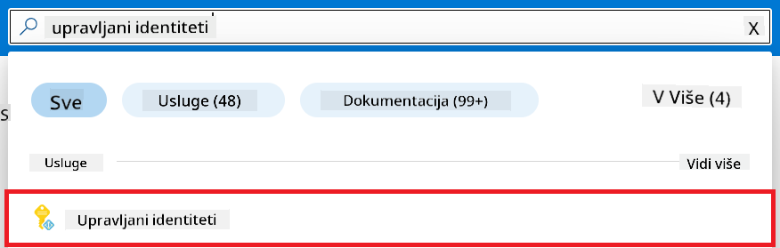

1. Odaberite **+ Create**.

    

1. Izvršite sljedeće zadatke:

    - Odaberite svoju Azure **Pretplatu**.
    - Odaberite **Resource group** koju ćete koristiti (ako treba, stvorite novu).
    - Odaberite **Regiju** koju želite koristiti.
    - Unesite **Naziv**. Mora biti jedinstvena vrijednost.

    

1. Odaberite **Review + create**.

1. Odaberite **+ Create**.

#### Dodavanje uloge Contributor Managed Identity

1. Idite na resurs Managed Identity koji ste stvorili.

1. Odaberite **Azure role assignments** iz lijevog izbornika.

1. Odaberite **+Add role assignment** iz navigacijskog izbornika.

1. Na stranici Add role assignment izvršite sljedeće zadatke:
    - Odaberite **Scope** na **Resource group**.
    - Odaberite svoju Azure **Pretplatu**.
    - Odaberite **Resource group** koju želite koristiti.
    - Odaberite ulogu **Contributor**.

    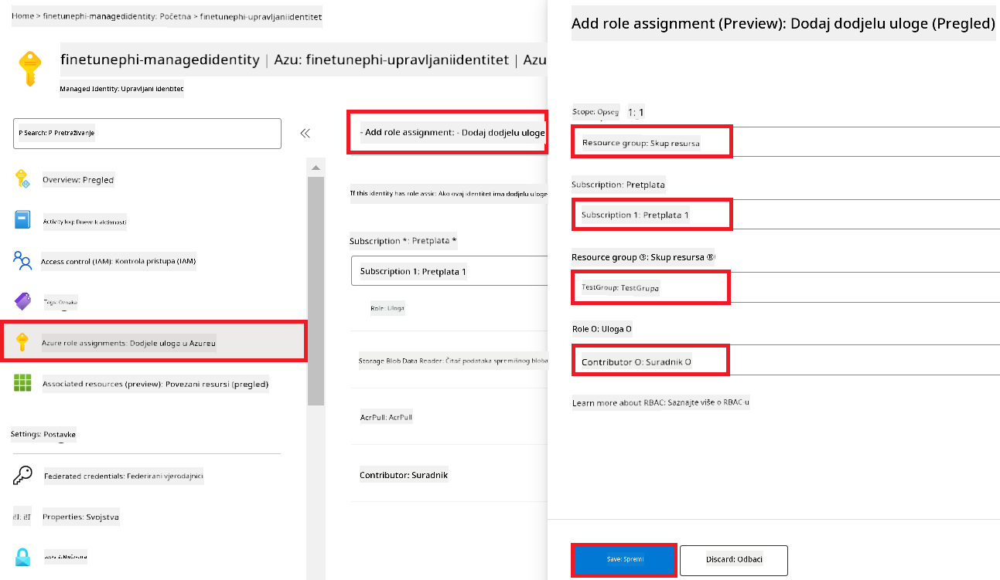

2. Odaberite **Save**.

#### Dodavanje uloge Storage Blob Data Reader Managed Identity

1. Upišite *storage accounts* u **traku za pretraživanje** na vrhu stranice portala i odaberite **Storage accounts** iz ponuđenih opcija.

    

1. Odaberite storage account povezan s Azure Machine Learning workspaceom koji ste stvorili. Na primjer, *finetunephistorage*.

1. Izvršite sljedeće zadatke za navigaciju do stranice Add role assignment:

    - Idite do Azure Storage accounta koji ste kreirali.
    - Odaberite **Access Control (IAM)** u lijevom izborniku.
    - Odaberite **+ Add** u navigacijskom izborniku.
    - Odaberite **Add role assignment** u navigacijskom izborniku.

    

1. Na stranici Add role assignment izvršite sljedeće zadatke:

    - U polje Role upišite *Storage Blob Data Reader* u **traku za pretraživanje** i odaberite **Storage Blob Data Reader** iz ponuđenih opcija.
    - Odaberite **Next**.
    - Na stranici Members odaberite **Assign access to** opciju **Managed identity**.
    - Odaberite **+ Select members**.
    - Na stranici Select managed identities odaberite svoju Azure **Pretplatu**.
    - Odaberite **Managed identity** za **Manage Identity**.
    - Odaberite Manage Identity koji ste napravili, na primjer *finetunephi-managedidentity*.
    - Odaberite **Select**.

    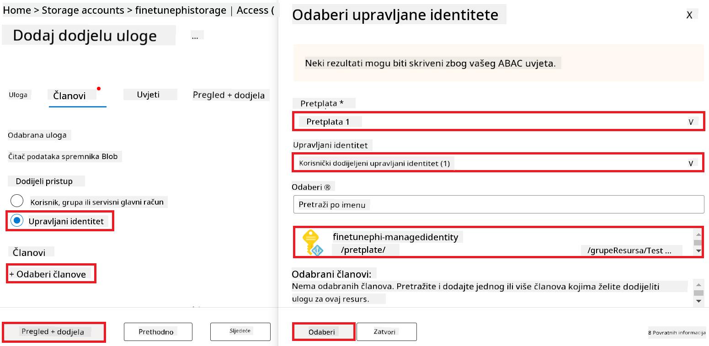

1. Odaberite **Review + assign**.

#### Dodavanje uloge AcrPull Managed Identity

1. Upišite *container registries* u **traku za pretraživanje** na vrhu stranice portala i odaberite **Container registries** iz ponuđenih opcija.

    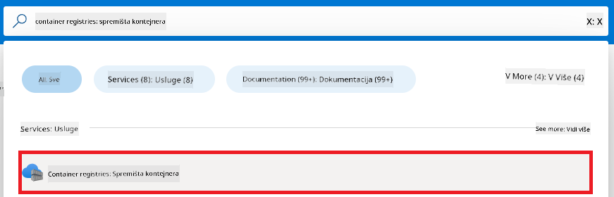

1. Odaberite container registry povezan s Azure Machine Learning workspaceom. Na primjer, *finetunephicontainerregistry*

1. Izvršite sljedeće zadatke za navigaciju do stranice Add role assignment:

    - Odaberite **Access Control (IAM)** u lijevom izborniku.
    - Odaberite **+ Add** u navigacijskom izborniku.
    - Odaberite **Add role assignment** u navigacijskom izborniku.

1. Na stranici Add role assignment izvršite sljedeće zadatke:

    - U polje Role upišite *AcrPull* u **traku za pretraživanje** i odaberite **AcrPull** iz ponuđenih opcija.
    - Odaberite **Next**.
    - Na stranici Members odaberite **Assign access to** opciju **Managed identity**.
    - Odaberite **+ Select members**.
    - Na stranici Select managed identities odaberite svoju Azure **Pretplatu**.
    - Odaberite **Managed identity** za **Manage Identity**.
    - Odaberite Manage Identity koji ste napravili, na primjer *finetunephi-managedidentity*.
    - Odaberite **Select**.
    - Odaberite **Review + assign**.

### Postavljanje projekta

Da biste preuzeli skupove podataka potrebne za doradu, postavit ćete lokalno okruženje.

U ovom zadatku ćete:

- Stvoriti mapu za rad.
- Stvoriti virtualno okruženje.
- Instalirati potrebne pakete.
- Stvoriti datoteku *download_dataset.py* za preuzimanje skupa podataka.

#### Stvorite mapu za rad

1. Otvorite prozor terminala i upišite sljedeću naredbu za stvaranje mape po nazivu *finetune-phi* u zadanoj putanji.

    ```console
    mkdir finetune-phi
    ```

2. Upišite sljedeću naredbu u svoj terminal kako biste prešli u mapu *finetune-phi* koju ste kreirali.

    ```console
    cd finetune-phi
    ```

#### Kreirajte virtualno okruženje

1. Upišite sljedeću naredbu u svoj terminal kako biste kreirali virtualno okruženje nazvano *.venv*.

    ```console
    python -m venv .venv
    ```

2. Upišite sljedeću naredbu u svoj terminal kako biste aktivirali virtualno okruženje.

    ```console
    .venv\Scripts\activate.bat
    ```

> [!NOTE]
> Ako je uspjelo, trebali biste vidjeti *(.venv)* ispred prompta naredbe.

#### Instalirajte potrebne pakete

1. Upišite sljedeće naredbe u svoj terminal kako biste instalirali potrebne pakete.

    ```console
    pip install datasets==2.19.1
    ```

#### Kreirajte `donload_dataset.py`

> [!NOTE]
> Kompletna struktura mape:
>
> ```text
> └── YourUserName
> .    └── finetune-phi
> .        └── download_dataset.py
> ```

1. Otvorite **Visual Studio Code**.

1. Iz izbornika odaberite **File**.

1. Odaberite **Open Folder**.

1. Odaberite mapu *finetune-phi* koju ste kreirali, a koja se nalazi na *C:\Users\yourUserName\finetune-phi*.

    

1. U lijevom panelu Visual Studio Codea kliknite desnom tipkom miša i odaberite **New File** kako biste kreirali novu datoteku pod nazivom *download_dataset.py*.

    

### Pripremite skup podataka za fino podešavanje

U ovoj vježbi pokrenut ćete datoteku *download_dataset.py* kako biste preuzeli skupove podataka *ultrachat_200k* na svoje lokalno okruženje. Zatim ćete koristiti ove skupove podataka za fino podešavanje modela Phi-3 u Azure Machine Learning.

U ovoj vježbi ćete:

- Dodati kod u datoteku *download_dataset.py* za preuzimanje skupova podataka.
- Pokrenuti datoteku *download_dataset.py* kako biste preuzeli skupove podataka u svoje lokalno okruženje.

#### Preuzmite svoj skup podataka koristeći *download_dataset.py*

1. Otvorite datoteku *download_dataset.py* u Visual Studio Codeu.

1. Dodajte sljedeći kod u datoteku *download_dataset.py*.

    ```python
    import json
    import os
    from datasets import load_dataset

    def load_and_split_dataset(dataset_name, config_name, split_ratio):
        """
        Load and split a dataset.
        """
        # Učitaj skup podataka sa specificiranim imenom, konfiguracijom i omjerom podjele
        dataset = load_dataset(dataset_name, config_name, split=split_ratio)
        print(f"Original dataset size: {len(dataset)}")
        
        # Podijeli skup podataka na trening i test skupove (80% trening, 20% test)
        split_dataset = dataset.train_test_split(test_size=0.2)
        print(f"Train dataset size: {len(split_dataset['train'])}")
        print(f"Test dataset size: {len(split_dataset['test'])}")
        
        return split_dataset

    def save_dataset_to_jsonl(dataset, filepath):
        """
        Save a dataset to a JSONL file.
        """
        # Kreiraj direktorij ako ne postoji
        os.makedirs(os.path.dirname(filepath), exist_ok=True)
        
        # Otvori datoteku u načinu pisanja
        with open(filepath, 'w', encoding='utf-8') as f:
            # Iteriraj kroz svaki zapis u skupu podataka
            for record in dataset:
                # Spremi zapis kao JSON objekt i upiši ga u datoteku
                json.dump(record, f)
                # Upisi znak novog reda da odvoji zapise
                f.write('\n')
        
        print(f"Dataset saved to {filepath}")

    def main():
        """
        Main function to load, split, and save the dataset.
        """
        # Učitaj i podijeli ULTRACHAT_200k skup podataka sa specifičnom konfiguracijom i omjerom podjele
        dataset = load_and_split_dataset("HuggingFaceH4/ultrachat_200k", 'default', 'train_sft[:1%]')
        
        # Izvuci trening i test skupove iz podjele
        train_dataset = dataset['train']
        test_dataset = dataset['test']

        # Spremi trening skup u JSONL datoteku
        save_dataset_to_jsonl(train_dataset, "data/train_data.jsonl")
        
        # Spremi test skup u zasebnu JSONL datoteku
        save_dataset_to_jsonl(test_dataset, "data/test_data.jsonl")

    if __name__ == "__main__":
        main()

    ```

1. Upišite sljedeću naredbu u svoj terminal kako biste pokrenuli skriptu i preuzeli skup podataka u svoje lokalno okruženje.

    ```console
    python download_dataset.py
    ```

1. Provjerite jesu li skupovi podataka uspješno spremljeni u lokalni direktorij *finetune-phi/data*.

> [!NOTE]
>
> #### Napomena o veličini skupa podataka i vremenu finog podešavanja
>
> U ovom vodiču koristite samo 1% skupa podataka (`split='train[:1%]'`). To značajno smanjuje količinu podataka, ubrzavajući proces i prijenosa i finog podešavanja. Možete prilagoditi postotak kako biste pronašli pravi balans između vremena treninga i performansi modela. Korištenje manjeg podskupa skupa podataka smanjuje vrijeme potrebno za fino podešavanje, čineći proces upravljivijim za vodič.

## Scenarij 2: Fino podesite Phi-3 model i implementirajte ga u Azure Machine Learning Studio

### Fino podesite Phi-3 model

U ovoj vježbi fino ćete podesiti Phi-3 model u Azure Machine Learning Studio.

U ovoj vježbi ćete:

- Kreirati klaster računala za fino podešavanje.
- Fino podesiti Phi-3 model u Azure Machine Learning Studio.

#### Kreirajte klaster računala za fino podešavanje

1. Posjetite [Azure ML Studio](https://ml.azure.com/home?wt.mc_id=studentamb_279723).

1. Odaberite **Compute** sa lijevog izbornika.

1. Odaberite **Compute clusters** iz navigacijskog izbornika.

1. Odaberite **+ New**.

    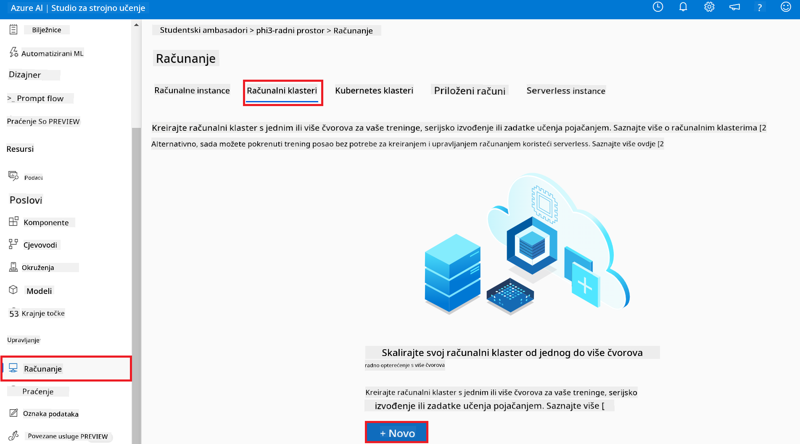

1. Izvršite sljedeće zadatke:

    - Odaberite **Područje** (Region) koje želite koristiti.
    - Odaberite **Virtual machine tier** na **Dedicated**.
    - Odaberite **Virtual machine type** na **GPU**.
    - Za filtar **Virtual machine size** odaberite **Select from all options**.
    - Odaberite veličinu virtualnog stroja **Standard_NC24ads_A100_v4**.

    

1. Odaberite **Next**.

1. Izvršite sljedeće zadatke:

    - Unesite **Ime računala**. Mora biti jedinstvena vrijednost.
    - Odaberite **Minimalni broj čvorova** na **0**.
    - Odaberite **Maksimalni broj čvorova** na **1**.
    - Odaberite **Neaktivni sekundi prije smanjenja** na **120**.

    

1. Odaberite **Create**.

#### Fino podesite Phi-3 model

1. Posjetite [Azure ML Studio](https://ml.azure.com/home?wt.mc_id=studentamb_279723).

1. Odaberite Azure Machine Learning workspace koji ste kreirali.

    

1. Izvršite sljedeće zadatke:

    - Odaberite **Model catalog** s lijevog izbornika.
    - Upišite *phi-3-mini-4k* u **tražilicu** i odaberite **Phi-3-mini-4k-instruct** iz ponuđenih opcija.

    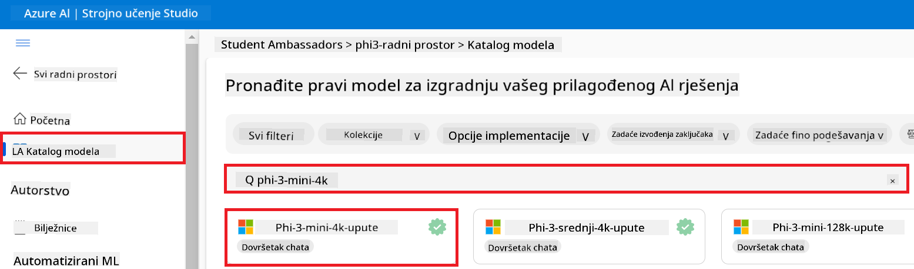

1. Odaberite **Fine-tune** iz navigacijskog izbornika.

    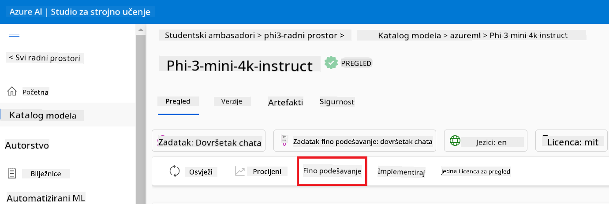

1. Izvršite sljedeće zadatke:

    - Odaberite **Select task type** na **Chat completion**.
    - Odaberite **+ Select data** za učitavanje **Trening podataka**.
    - Za tip učitavanja validacijskih podataka odaberite **Provide different validation data**.
    - Odaberite **+ Select data** za učitavanje **Validacijskih podataka**.

    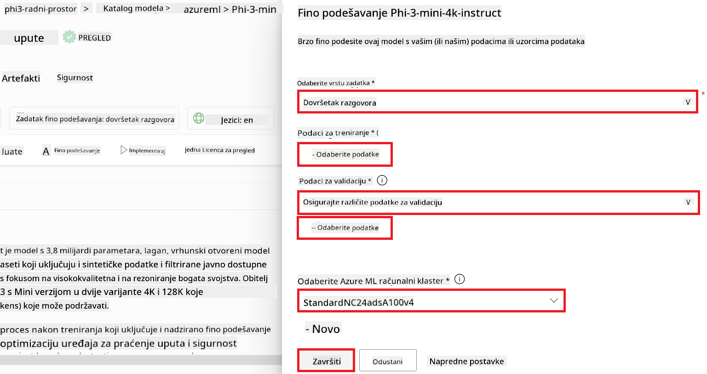

> [!TIP]
>
> Možete odabrati **Napredne postavke** za prilagođavanje konfiguracija poput **learning_rate** i **lr_scheduler_type** kako biste optimizirali proces finog podešavanja prema svojim specifičnim potrebama.

1. Odaberite **Finish**.

1. U ovoj vježbi ste uspješno fino podesili Phi-3 model koristeći Azure Machine Learning. Napomena: proces finog podešavanja može potrajati znatno vremena. Nakon pokretanja posla za fino podešavanje, morate pričekati da se dovrši. Status posla možete pratiti u kartici Jobs na lijevoj strani vašeg Azure Machine Learning Workspacea. U sljedećem nizu vježbi implementirat ćete fino podešeni model i integrirati ga s Prompt flowom.

    

### Implementirajte fino podešeni Phi-3 model

Da biste integrirali fino podešeni Phi-3 model s Prompt flowom, trebate implementirati model kako bi bio dostupan za real-time inferencu. Ovaj proces uključuje registraciju modela, kreiranje online endpointa i implementaciju modela.

U ovoj vježbi ćete:

- Registrirati fino podešeni model u Azure Machine Learning workspaceu.
- Kreirati online endpoint.
- Implementirati registrirani fino podešeni Phi-3 model.

#### Registrirajte fino podešeni model

1. Posjetite [Azure ML Studio](https://ml.azure.com/home?wt.mc_id=studentamb_279723).

1. Odaberite Azure Machine Learning workspace koji ste kreirali.

    

1. Odaberite **Models** sa lijevog izbornika.
1. Odaberite **+ Register**.
1. Odaberite **From a job output**.

    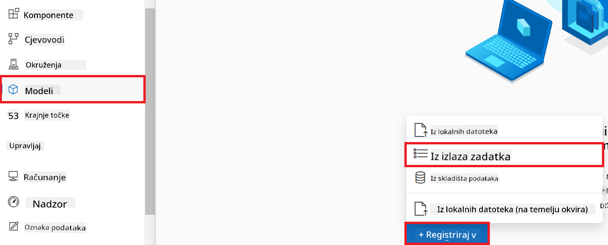

1. Odaberite posao koji ste kreirali.

    

1. Odaberite **Next**.

1. Za **Model type** odaberite **MLflow**.

1. Provjerite je li odabrano **Job output**; obično je automatski odabran.

    

2. Odaberite **Next**.

3. Odaberite **Register**.

    

4. Registrirani model možete pregledati tako da odete na izbornik **Models** s lijevog izbornika.

    

#### Implementirajte fino podešeni model

1. Idite u Azure Machine Learning workspace koji ste kreirali.

1. Odaberite **Endpoints** sa lijevog izbornika.

1. Odaberite **Real-time endpoints** iz navigacijskog izbornika.

    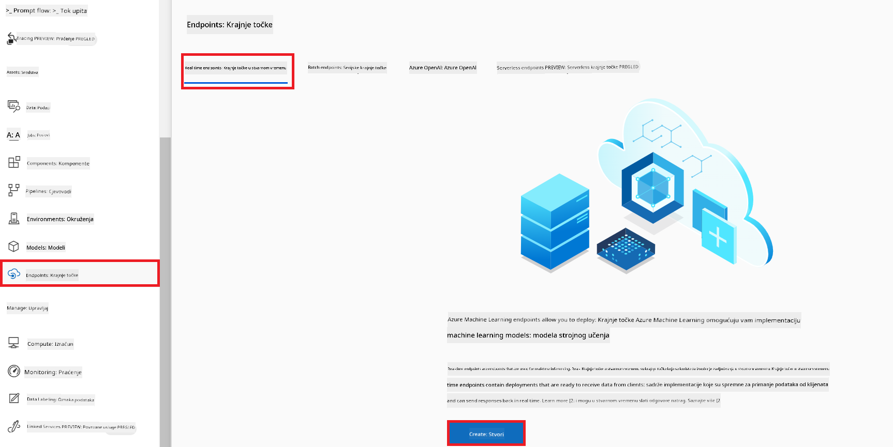

1. Odaberite **Create**.

1. Odaberite registrirani model koji ste kreirali.

    

1. Odaberite **Select**.

1. Izvršite sljedeće zadatke:

    - Za **Virtual machine** odaberite *Standard_NC6s_v3*.
    - Odaberite broj instanci koje želite koristiti. Primjerice, *1*.
    - Za **Endpoint** odaberite **New** kako biste kreirali endpoint.
    - Unesite **Ime endpointa**. Mora biti jedinstveno.
    - Unesite **Ime implementacije**. Mora biti jedinstveno.

    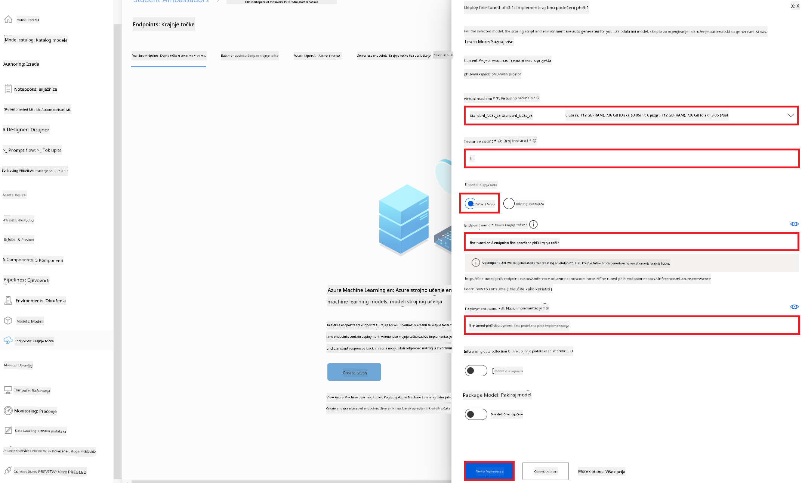

1. Odaberite **Deploy**.

> [!WARNING]
> Kako biste izbjegli dodatne troškove na svom računu, pobrinite se da obrišete kreirani endpoint u Azure Machine Learning workspaceu.
>

#### Provjerite status implementacije u Azure Machine Learning Workspaceu

1. Idite u Azure Machine Learning workspace koji ste kreirali.

1. Odaberite **Endpoints** sa lijevog izbornika.

1. Odaberite endpoint koji ste kreirali.

    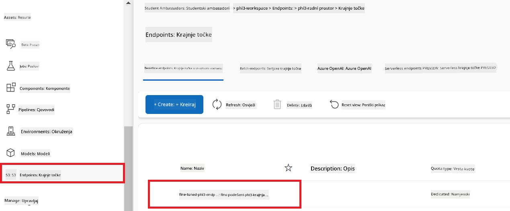

1. Na ovoj stranici možete upravljati endpointima tijekom procesa implementacije.

> [!NOTE]
> Nakon što je implementacija dovršena, pobrinite se da je **Live traffic** postavljen na **100%**. Ako nije, odaberite **Update traffic** za prilagodbu postavki prometa. Napomena: ne možete testirati model ako je promet postavljen na 0%.
>
> 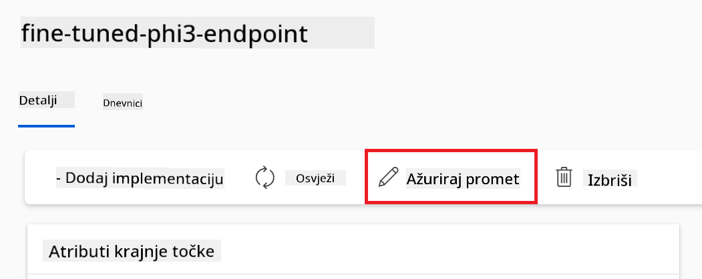
>

## Scenarij 3: Integrirajte s Prompt flowom i razgovarajte sa svojim prilagođenim modelom u Azure AI Foundry

### Integrirajte prilagođeni Phi-3 model s Prompt flowom

Nakon što ste uspješno implementirali svoj fino podešeni model, sada ga možete integrirati s Prompt Flowom kako biste koristili svoj model u real-time aplikacijama, omogućujući razne interaktivne zadatke s vašim prilagođenim Phi-3 modelom.

U ovoj vježbi ćete:

- Kreirati Azure AI Foundry Hub.
- Kreirati Azure AI Foundry Projekt.
- Kreirati Prompt flow.
- Dodati prilagođenu vezu za fino podešeni Phi-3 model.
- Postaviti Prompt flow za razgovor s vašim prilagođenim Phi-3 modelom.

> [!NOTE]
> Također se možete integrirati s Promptflowom koristeći Azure ML Studio. Isti proces integracije može se primijeniti na Azure ML Studio.

#### Kreirajte Azure AI Foundry Hub

Morate kreirati Hub prije nego što kreirate Projekt. Hub funkcionira kao grupa resursa, omogućujući vam organizaciju i upravljanje više projekata unutar Azure AI Foundry.

1. Posjetite [Azure AI Foundry](https://ai.azure.com/?WT.mc_id=aiml-137032-kinfeylo).

1. Odaberite **All hubs** sa lijevog izbornika.

1. Odaberite **+ New hub** iz navigacijskog izbornika.
    

1. Izvršite sljedeće zadatke:

    - Unesite **Ime huba**. Mora biti jedinstvena vrijednost.
    - Odaberite svoju Azure **Pretplatu**.
    - Odaberite **Resource group** koju želite koristiti (kreirajte novu ako je potrebno).
    - Odaberite **Lokaciju** koju želite koristiti.
    - Odaberite **Connect Azure AI Services** za korištenje (kreirajte novu ako je potrebno).
    - Odaberite **Connect Azure AI Search** na **Preskoči povezivanje**.

    

1. Odaberite **Dalje**.

#### Kreirajte Azure AI Foundry projekt

1. U Hubu koji ste kreirali, odaberite **Svi projekti** sa lijevog izbornika.

1. Odaberite **+ Novi projekt** iz navigacijskog izbornika.

    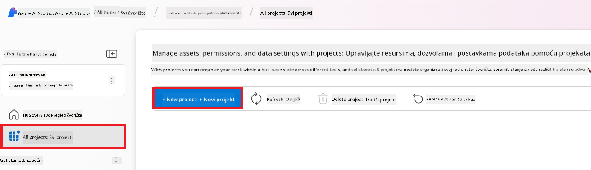

1. Unesite **Ime projekta**. Mora biti jedinstvena vrijednost.

    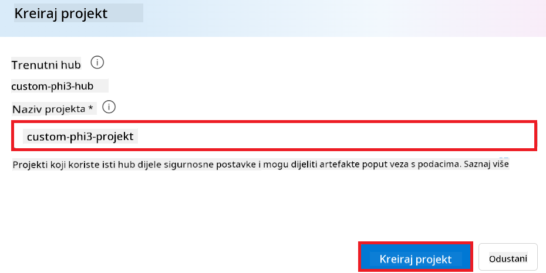

1. Odaberite **Kreiraj projekt**.

#### Dodajte prilagođenu vezu za fino podešen Phi-3 model

Da biste integrirali svoj prilagođeni Phi-3 model s Prompt flow, trebate spremiti endpoint i ključ modela u prilagođenu vezu. Ova postavka osigurava pristup vašem prilagođenom Phi-3 modelu u Prompt flow-u.

#### Postavite api ključ i uri endpointa fino podešenog Phi-3 modela

1. Posjetite [Azure ML Studio](https://ml.azure.com/home?WT.mc_id=aiml-137032-kinfeylo).

1. Idite u Azure Machine learning workspace koji ste kreirali.

1. Odaberite **Endpoints** s lijevog izbornika.

    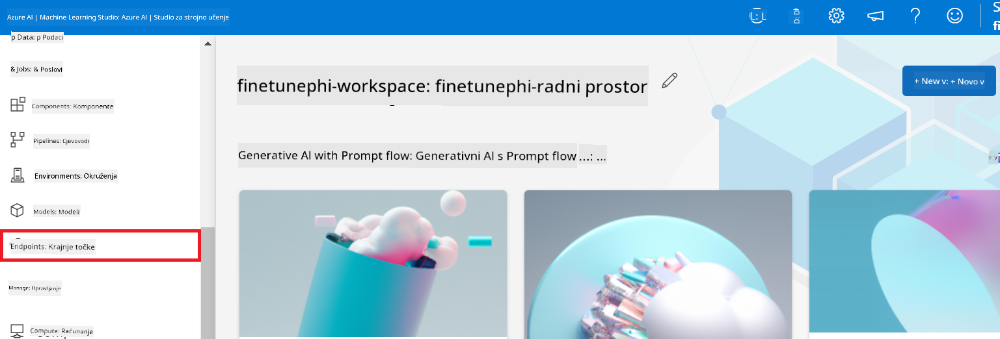

1. Odaberite endpoint koji ste kreirali.

    

1. Odaberite **Consume** iz navigacijskog izbornika.

1. Kopirajte svoj **REST endpoint** i **Primarni ključ**.

    

#### Dodajte prilagođenu vezu

1. Posjetite [Azure AI Foundry](https://ai.azure.com/?WT.mc_id=aiml-137032-kinfeylo).

1. Idite u Azure AI Foundry projekt koji ste kreirali.

1. U projektu koji ste kreirali, odaberite **Postavke** sa lijevog izbornika.

1. Odaberite **+ Nova veza**.

    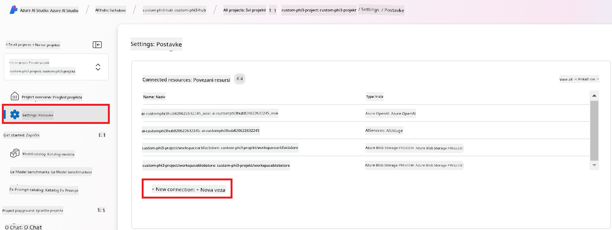

1. Odaberite **Custom keys** iz navigacijskog izbornika.

    

1. Izvršite sljedeće zadatke:

    - Odaberite **+ Dodaj parove ključ-vrijednost**.
    - Za naziv ključa, unesite **endpoint** i zalijepite endpoint koji ste kopirali iz Azure ML Studia u polje vrijednosti.
    - Ponovno odaberite **+ Dodaj parove ključ-vrijednost**.
    - Za naziv ključa, unesite **key** i zalijepite ključ koji ste kopirali iz Azure ML Studia u polje vrijednosti.
    - Nakon dodavanja ključeva, odaberite **je tajna** kako biste spriječili otkrivanje ključa.

    

1. Odaberite **Dodaj vezu**.

#### Kreirajte Prompt flow

Dodali ste prilagođenu vezu u Azure AI Foundry. Sada ćemo kreirati Prompt flow koristeći sljedeće korake. Nakon toga, povezat ćete ovaj Prompt flow s prilagođenom vezom kako biste mogli koristiti fino podešeni model unutar Prompt flow-a.

1. Idite u Azure AI Foundry projekt koji ste kreirali.

1. Odaberite **Prompt flow** sa lijevog izbornika.

1. Odaberite **+ Kreiraj** iz navigacijskog izbornika.

    

1. Odaberite **Chat flow** iz navigacijskog izbornika.

    

1. Unesite **Ime mape** za korištenje.

    

2. Odaberite **Kreiraj**.

#### Postavite Prompt flow za razgovor s vašim prilagođenim Phi-3 modelom

Trebate integrirati fino podešeni Phi-3 model u Prompt flow. Međutim, postojeći Prompt flow nije dizajniran za ovu svrhu. Stoga, morate redizajnirati Prompt flow da omogućite integraciju prilagođenog modela.

1. U Prompt flow-u, izvršite sljedeće zadatke za rekonstrukciju postojećeg tijeka:

    - Odaberite **Način neobrađene datoteke**.
    - Izbrišite sav postojeći kod u datoteci *flow.dag.yml*.
    - Dodajte sljedeći kod u datoteku *flow.dag.yml*.

        ```yml
        inputs:
          input_data:
            type: string
            default: "Who founded Microsoft?"

        outputs:
          answer:
            type: string
            reference: ${integrate_with_promptflow.output}

        nodes:
        - name: integrate_with_promptflow
          type: python
          source:
            type: code
            path: integrate_with_promptflow.py
          inputs:
            input_data: ${inputs.input_data}
        ```

    - Odaberite **Spremi**.

    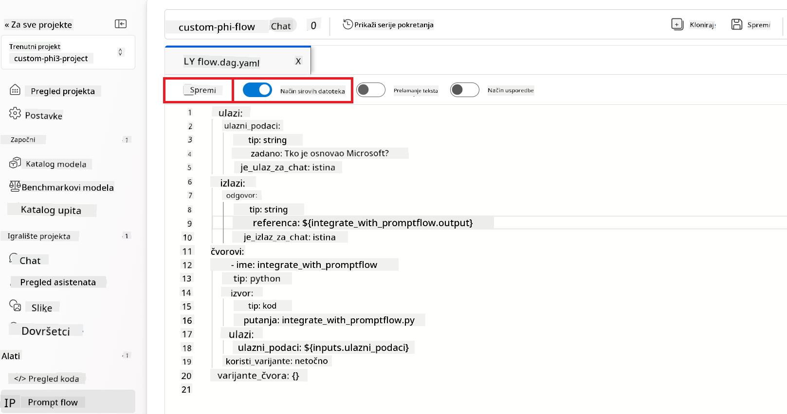

1. Dodajte sljedeći kod u datoteku *integrate_with_promptflow.py* da biste koristili prilagođeni Phi-3 model u Prompt flow-u.

    ```python
    import logging
    import requests
    from promptflow import tool
    from promptflow.connections import CustomConnection

    # Postavljanje zapisivanja
    logging.basicConfig(
        format="%(asctime)s - %(levelname)s - %(name)s - %(message)s",
        datefmt="%Y-%m-%d %H:%M:%S",
        level=logging.DEBUG
    )
    logger = logging.getLogger(__name__)

    def query_phi3_model(input_data: str, connection: CustomConnection) -> str:
        """
        Send a request to the Phi-3 model endpoint with the given input data using Custom Connection.
        """

        # "connection" je naziv prilagođene veze, "endpoint", "key" su ključevi u prilagođenoj vezi
        endpoint_url = connection.endpoint
        api_key = connection.key

        headers = {
            "Content-Type": "application/json",
            "Authorization": f"Bearer {api_key}"
        }
        data = {
            "input_data": {
                "input_string": [
                    {"role": "user", "content": input_data}
                ],
                "parameters": {
                    "temperature": 0.7,
                    "max_new_tokens": 128
                }
            }
        }
        try:
            response = requests.post(endpoint_url, json=data, headers=headers)
            response.raise_for_status()
            
            # Zabilježite puni JSON odgovor
            logger.debug(f"Full JSON response: {response.json()}")

            result = response.json()["output"]
            logger.info("Successfully received response from Azure ML Endpoint.")
            return result
        except requests.exceptions.RequestException as e:
            logger.error(f"Error querying Azure ML Endpoint: {e}")
            raise

    @tool
    def my_python_tool(input_data: str, connection: CustomConnection) -> str:
        """
        Tool function to process input data and query the Phi-3 model.
        """
        return query_phi3_model(input_data, connection)

    ```

    

> [!NOTE]
> Za detaljnije informacije o korištenju Prompt flow-a u Azure AI Foundry-u, možete se obratiti dokumentaciji [Prompt flow u Azure AI Foundry](https://learn.microsoft.com/azure/ai-studio/how-to/prompt-flow).

1. Odaberite **Chat ulaz**, **Chat izlaz** da omogućite razgovor s vašim modelom.

    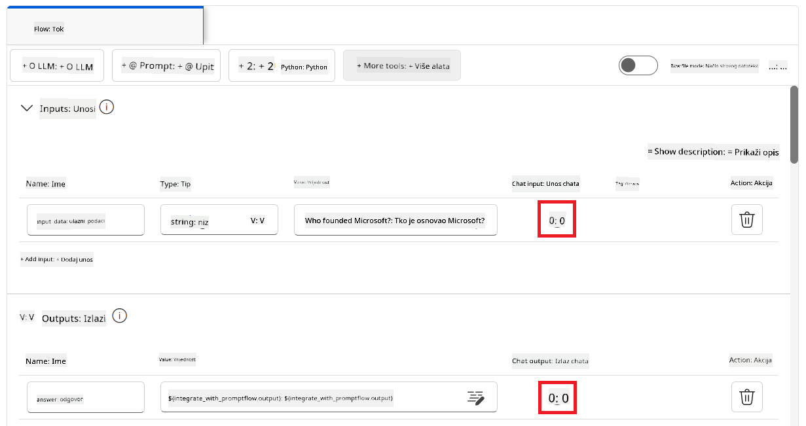

1. Sada ste spremni za razgovor s vašim prilagođenim Phi-3 modelom. U sljedećoj vježbi naučit ćete kako započeti Prompt flow i koristiti ga za razgovor s vašim fino podešenim Phi-3 modelom.

> [!NOTE]
>
> Rekonstruirani tijek trebao bi izgledati kao na slici ispod:
>
> 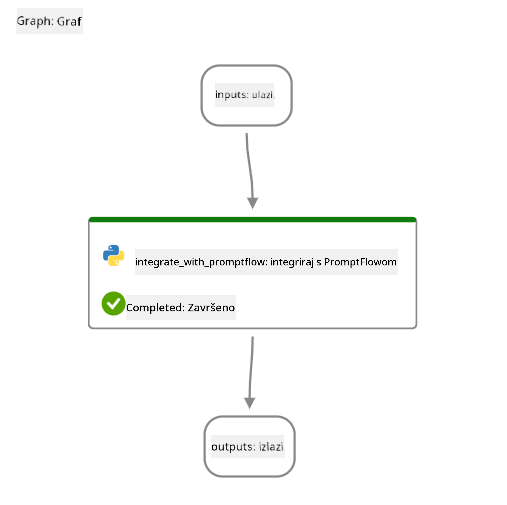
>

### Razgovarajte s vašim prilagođenim Phi-3 modelom

Sad kad ste fino podesili i integrirali svoj prilagođeni Phi-3 model s Prompt flow-om, spremni ste za interakciju s njim. Ova vježba će vas voditi kroz proces postavljanja i pokretanja razgovora s vašim modelom koristeći Prompt flow. Slijedeći ove korake, moći ćete u potpunosti iskoristiti mogućnosti svog fino podešenog Phi-3 modela za razne zadatke i razgovore.

- Razgovarajte s vašim prilagođenim Phi-3 modelom koristeći Prompt flow.

#### Pokrenite Prompt flow

1. Odaberite **Pokreni računalne sesije** za pokretanje Prompt flow-a.

    

1. Odaberite **Validiraj i analiziraj unos** za obnovu parametara.

    

1. Odaberite **Vrijednost** za **vezu** u prilagođenu vezu koju ste kreirali. Na primjer, *connection*.

    

#### Razgovarajte s vašim prilagođenim modelom

1. Odaberite **Razgovor**.

    

1. Evo primjera rezultata: Sada možete razgovarati s vašim prilagođenim Phi-3 modelom. Preporučuje se postavljati pitanja temeljena na podacima korištenima za fino podešavanje.

    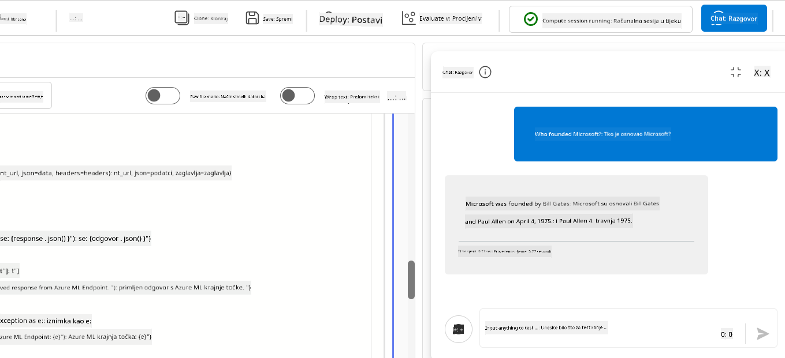

---

<!-- CO-OP TRANSLATOR DISCLAIMER START -->
**Izjava o odricanju od odgovornosti**:
Ovaj dokument preveden je pomoću AI usluge za prijevod [Co-op Translator](https://github.com/Azure/co-op-translator). Iako se trudimo osigurati točnost, imajte na umu da automatski prijevodi mogu sadržavati pogreške ili netočnosti. Izvorni dokument na izvornom jeziku treba smatrati autoritativnim izvorom. Za kritične informacije preporučuje se profesionalni ljudski prijevod. Nismo odgovorni za bilo kakve nesporazume ili kriva tumačenja koja proizlaze iz korištenja ovog prijevoda.
<!-- CO-OP TRANSLATOR DISCLAIMER END -->