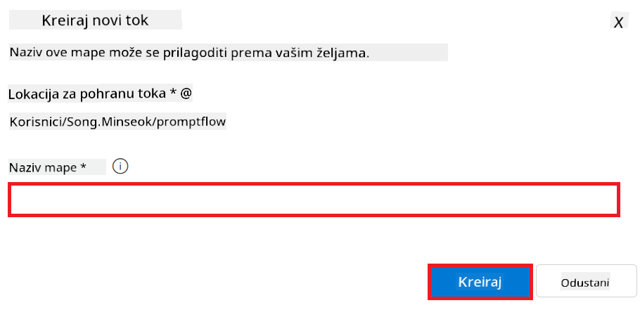

<!--
CO_OP_TRANSLATOR_METADATA:
{
  "original_hash": "ecbd9179a21edbaafaf114d47f09f3e3",
  "translation_date": "2025-07-17T02:00:57+00:00",
  "source_file": "md/02.Application/01.TextAndChat/Phi3/E2E_Phi-3-FineTuning_PromptFlow_Integration_AIFoundry.md",
  "language_code": "hr"
}
-->
# Fino podešavanje i integracija prilagođenih Phi-3 modela s Prompt flow u Azure AI Foundry

Ovaj end-to-end (E2E) primjer temelji se na vodiču "[Fine-Tune and Integrate Custom Phi-3 Models with Prompt Flow in Azure AI Foundry](https://techcommunity.microsoft.com/t5/educator-developer-blog/fine-tune-and-integrate-custom-phi-3-models-with-prompt-flow-in/ba-p/4191726?WT.mc_id=aiml-137032-kinfeylo)" iz Microsoft Tech Community. Uvodi procese fino podešavanja, implementacije i integracije prilagođenih Phi-3 modela s Prompt flow u Azure AI Foundry.
Za razliku od E2E primjera, "[Fine-Tune and Integrate Custom Phi-3 Models with Prompt Flow](./E2E_Phi-3-FineTuning_PromptFlow_Integration.md)", koji je uključivao lokalno pokretanje koda, ovaj vodič se u potpunosti fokusira na fino podešavanje i integraciju vašeg modela unutar Azure AI / ML Studija.

## Pregled

U ovom E2E primjeru naučit ćete kako fino podesiti Phi-3 model i integrirati ga s Prompt flow u Azure AI Foundry. Korištenjem Azure AI / ML Studija uspostavit ćete tijek rada za implementaciju i korištenje prilagođenih AI modela. Ovaj E2E primjer podijeljen je u tri scenarija:

**Scenarij 1: Postavljanje Azure resursa i priprema za fino podešavanje**

**Scenarij 2: Fino podešavanje Phi-3 modela i implementacija u Azure Machine Learning Studio**

**Scenarij 3: Integracija s Prompt flow i razgovor s vašim prilagođenim modelom u Azure AI Foundry**

Evo pregleda ovog E2E primjera.


### Sadržaj

1. **[Scenarij 1: Postavljanje Azure resursa i priprema za fino podešavanje](../../../../../../md/02.Application/01.TextAndChat/Phi3)**
    - [Kreiranje Azure Machine Learning Workspace-a](../../../../../../md/02.Application/01.TextAndChat/Phi3)
    - [Zahtjev za GPU kvote u Azure pretplati](../../../../../../md/02.Application/01.TextAndChat/Phi3)
    - [Dodavanje dodjele uloga](../../../../../../md/02.Application/01.TextAndChat/Phi3)
    - [Postavljanje projekta](../../../../../../md/02.Application/01.TextAndChat/Phi3)
    - [Priprema skupa podataka za fino podešavanje](../../../../../../md/02.Application/01.TextAndChat/Phi3)

1. **[Scenarij 2: Fino podešavanje Phi-3 modela i implementacija u Azure Machine Learning Studio](../../../../../../md/02.Application/01.TextAndChat/Phi3)**
    - [Fino podešavanje Phi-3 modela](../../../../../../md/02.Application/01.TextAndChat/Phi3)
    - [Implementacija fino podešenog Phi-3 modela](../../../../../../md/02.Application/01.TextAndChat/Phi3)

1. **[Scenarij 3: Integracija s Prompt flow i razgovor s vašim prilagođenim modelom u Azure AI Foundry](../../../../../../md/02.Application/01.TextAndChat/Phi3)**
    - [Integracija prilagođenog Phi-3 modela s Prompt flow](../../../../../../md/02.Application/01.TextAndChat/Phi3)
    - [Razgovor s vašim prilagođenim Phi-3 modelom](../../../../../../md/02.Application/01.TextAndChat/Phi3)

## Scenarij 1: Postavljanje Azure resursa i priprema za fino podešavanje

### Kreiranje Azure Machine Learning Workspace-a

1. Upišite *azure machine learning* u **tražilicu** na vrhu stranice portala i odaberite **Azure Machine Learning** iz ponuđenih opcija.

    

2. Odaberite **+ Create** iz navigacijskog izbornika.

3. Odaberite **New workspace** iz navigacijskog izbornika.

    

4. Obavite sljedeće zadatke:

    - Odaberite svoju Azure **Pretplatu**.
    - Odaberite **Resource group** koju želite koristiti (ako je potrebno, kreirajte novu).
    - Unesite **Ime Workspace-a**. Mora biti jedinstvena vrijednost.
    - Odaberite **Regiju** koju želite koristiti.
    - Odaberite **Storage account** koji želite koristiti (ako je potrebno, kreirajte novi).
    - Odaberite **Key vault** koji želite koristiti (ako je potrebno, kreirajte novi).
    - Odaberite **Application insights** koji želite koristiti (ako je potrebno, kreirajte novi).
    - Odaberite **Container registry** koji želite koristiti (ako je potrebno, kreirajte novi).

    

5. Odaberite **Review + Create**.

6. Odaberite **Create**.

### Zahtjev za GPU kvote u Azure pretplati

U ovom vodiču naučit ćete kako fino podesiti i implementirati Phi-3 model koristeći GPU-ove. Za fino podešavanje koristit ćete *Standard_NC24ads_A100_v4* GPU, za koji je potreban zahtjev za kvotu. Za implementaciju koristit ćete *Standard_NC6s_v3* GPU, koji također zahtijeva zahtjev za kvotu.

> [!NOTE]
>
> Samo Pay-As-You-Go pretplate (standardni tip pretplate) imaju pravo na dodjelu GPU-a; pretplate s pogodnostima trenutno nisu podržane.
>

1. Posjetite [Azure ML Studio](https://ml.azure.com/home?wt.mc_id=studentamb_279723).

1. Obavite sljedeće zadatke za zahtjev kvote *Standard NCADSA100v4 Family*:

    - Odaberite **Quota** s lijevog izbornika.
    - Odaberite **Virtual machine family** koju želite koristiti. Na primjer, odaberite **Standard NCADSA100v4 Family Cluster Dedicated vCPUs**, koja uključuje *Standard_NC24ads_A100_v4* GPU.
    - Odaberite **Request quota** iz navigacijskog izbornika.

        

    - Na stranici Request quota unesite **New cores limit** koju želite koristiti. Na primjer, 24.
    - Na stranici Request quota odaberite **Submit** za podnošenje zahtjeva za GPU kvotu.

1. Obavite sljedeće zadatke za zahtjev kvote *Standard NCSv3 Family*:

    - Odaberite **Quota** s lijevog izbornika.
    - Odaberite **Virtual machine family** koju želite koristiti. Na primjer, odaberite **Standard NCSv3 Family Cluster Dedicated vCPUs**, koja uključuje *Standard_NC6s_v3* GPU.
    - Odaberite **Request quota** iz navigacijskog izbornika.
    - Na stranici Request quota unesite **New cores limit** koju želite koristiti. Na primjer, 24.
    - Na stranici Request quota odaberite **Submit** za podnošenje zahtjeva za GPU kvotu.

### Dodavanje dodjele uloga

Za fino podešavanje i implementaciju vaših modela, prvo morate kreirati User Assigned Managed Identity (UAI) i dodijeliti joj odgovarajuće dozvole. Ova UAI će se koristiti za autentifikaciju tijekom implementacije.

#### Kreiranje User Assigned Managed Identity (UAI)

1. Upišite *managed identities* u **tražilicu** na vrhu stranice portala i odaberite **Managed Identities** iz ponuđenih opcija.

    

1. Odaberite **+ Create**.

    

1. Obavite sljedeće zadatke:

    - Odaberite svoju Azure **Pretplatu**.
    - Odaberite **Resource group** koju želite koristiti (ako je potrebno, kreirajte novu).
    - Odaberite **Regiju** koju želite koristiti.
    - Unesite **Ime**. Mora biti jedinstvena vrijednost.

    

1. Odaberite **Review + create**.

1. Odaberite **+ Create**.

#### Dodavanje uloge Contributor Managed Identity

1. Idite na Managed Identity resurs koji ste kreirali.

1. Odaberite **Azure role assignments** s lijevog izbornika.

1. Odaberite **+Add role assignment** iz navigacijskog izbornika.

1. Na stranici Add role assignment obavite sljedeće zadatke:
    - Odaberite **Scope** na **Resource group**.
    - Odaberite svoju Azure **Pretplatu**.
    - Odaberite **Resource group** koju želite koristiti.
    - Odaberite **Role** na **Contributor**.

    

2. Odaberite **Save**.

#### Dodavanje uloge Storage Blob Data Reader Managed Identity

1. Upišite *storage accounts* u **tražilicu** na vrhu stranice portala i odaberite **Storage accounts** iz ponuđenih opcija.

    

1. Odaberite storage account povezan s Azure Machine Learning workspace-om koji ste kreirali. Na primjer, *finetunephistorage*.

1. Obavite sljedeće zadatke za navigaciju do stranice Add role assignment:

    - Idite na Azure Storage account koji ste kreirali.
    - Odaberite **Access Control (IAM)** s lijevog izbornika.
    - Odaberite **+ Add** iz navigacijskog izbornika.
    - Odaberite **Add role assignment** iz navigacijskog izbornika.

    

1. Na stranici Add role assignment obavite sljedeće zadatke:

    - U polje za pretraživanje uloga upišite *Storage Blob Data Reader* i odaberite **Storage Blob Data Reader** iz ponuđenih opcija.
    - Odaberite **Next**.
    - Na stranici Members odaberite **Assign access to** **Managed identity**.
    - Odaberite **+ Select members**.
    - Na stranici Select managed identities odaberite svoju Azure **Pretplatu**.
    - Odaberite **Managed identity** na **Manage Identity**.
    - Odaberite Managed Identity koju ste kreirali. Na primjer, *finetunephi-managedidentity*.
    - Odaberite **Select**.

    

1. Odaberite **Review + assign**.

#### Dodavanje uloge AcrPull Managed Identity

1. Upišite *container registries* u **tražilicu** na vrhu stranice portala i odaberite **Container registries** iz ponuđenih opcija.

    

1. Odaberite container registry povezan s Azure Machine Learning workspace-om. Na primjer, *finetunephicontainerregistry*

1. Obavite sljedeće zadatke za navigaciju do stranice Add role assignment:

    - Odaberite **Access Control (IAM)** s lijevog izbornika.
    - Odaberite **+ Add** iz navigacijskog izbornika.
    - Odaberite **Add role assignment** iz navigacijskog izbornika.

1. Na stranici Add role assignment obavite sljedeće zadatke:

    - U polje za pretraživanje uloga upišite *AcrPull* i odaberite **AcrPull** iz ponuđenih opcija.
    - Odaberite **Next**.
    - Na stranici Members odaberite **Assign access to** **Managed identity**.
    - Odaberite **+ Select members**.
    - Na stranici Select managed identities odaberite svoju Azure **Pretplatu**.
    - Odaberite **Managed identity** na **Manage Identity**.
    - Odaberite Managed Identity koju ste kreirali. Na primjer, *finetunephi-managedidentity*.
    - Odaberite **Select**.
    - Odaberite **Review + assign**.

### Postavljanje projekta

Za preuzimanje skupova podataka potrebnih za fino podešavanje, postavit ćete lokalno okruženje.

U ovom zadatku ćete:

- Kreirati mapu u kojoj ćete raditi.
- Kreirati virtualno okruženje.
- Instalirati potrebne pakete.
- Kreirati datoteku *download_dataset.py* za preuzimanje skupa podataka.

#### Kreiranje mape u kojoj ćete raditi

1. Otvorite terminal i upišite sljedeću naredbu za kreiranje mape nazvane *finetune-phi* u zadanoj putanji.

    ```console
    mkdir finetune-phi
    ```

2. Upišite sljedeću naredbu u terminalu da biste ušli u mapu *finetune-phi* koju ste kreirali.
#### Kreirajte virtualno okruženje

1. Upišite sljedeću naredbu u terminal da biste kreirali virtualno okruženje pod nazivom *.venv*.

    ```console
    python -m venv .venv
    ```

2. Upišite sljedeću naredbu u terminal da biste aktivirali virtualno okruženje.

    ```console
    .venv\Scripts\activate.bat
    ```


> [!NOTE]
> Ako je uspjelo, trebali biste vidjeti *(.venv)* ispred prompta naredbe.

#### Instalirajte potrebne pakete

1. Upišite sljedeće naredbe u terminal da biste instalirali potrebne pakete.

    ```console
    pip install datasets==2.19.1
    ```

#### Kreirajte `download_dataset.py`

> [!NOTE]
> Kompletna struktura mape:
>
> ```text
> └── YourUserName
> .    └── finetune-phi
> .        └── download_dataset.py
> ```

1. Otvorite **Visual Studio Code**.

1. Iz izbornika odaberite **File**.

1. Odaberite **Open Folder**.

1. Odaberite mapu *finetune-phi* koju ste kreirali, a nalazi se na putanji *C:\Users\yourUserName\finetune-phi*.

    

1. U lijevom dijelu Visual Studio Code-a kliknite desnom tipkom i odaberite **New File** za kreiranje nove datoteke pod nazivom *download_dataset.py*.

    

### Pripremite skup podataka za fino podešavanje

U ovom zadatku pokrenut ćete datoteku *download_dataset.py* kako biste preuzeli skupove podataka *ultrachat_200k* na lokalno računalo. Zatim ćete koristiti te skupove podataka za fino podešavanje Phi-3 modela u Azure Machine Learning.

U ovom zadatku ćete:

- Dodati kod u datoteku *download_dataset.py* za preuzimanje skupova podataka.
- Pokrenuti datoteku *download_dataset.py* kako biste preuzeli skupove podataka na lokalno računalo.

#### Preuzmite svoj skup podataka koristeći *download_dataset.py*

1. Otvorite datoteku *download_dataset.py* u Visual Studio Code-u.

1. Dodajte sljedeći kod u datoteku *download_dataset.py*.

    ```python
    import json
    import os
    from datasets import load_dataset

    def load_and_split_dataset(dataset_name, config_name, split_ratio):
        """
        Load and split a dataset.
        """
        # Load the dataset with the specified name, configuration, and split ratio
        dataset = load_dataset(dataset_name, config_name, split=split_ratio)
        print(f"Original dataset size: {len(dataset)}")
        
        # Split the dataset into train and test sets (80% train, 20% test)
        split_dataset = dataset.train_test_split(test_size=0.2)
        print(f"Train dataset size: {len(split_dataset['train'])}")
        print(f"Test dataset size: {len(split_dataset['test'])}")
        
        return split_dataset

    def save_dataset_to_jsonl(dataset, filepath):
        """
        Save a dataset to a JSONL file.
        """
        # Create the directory if it does not exist
        os.makedirs(os.path.dirname(filepath), exist_ok=True)
        
        # Open the file in write mode
        with open(filepath, 'w', encoding='utf-8') as f:
            # Iterate over each record in the dataset
            for record in dataset:
                # Dump the record as a JSON object and write it to the file
                json.dump(record, f)
                # Write a newline character to separate records
                f.write('\n')
        
        print(f"Dataset saved to {filepath}")

    def main():
        """
        Main function to load, split, and save the dataset.
        """
        # Load and split the ULTRACHAT_200k dataset with a specific configuration and split ratio
        dataset = load_and_split_dataset("HuggingFaceH4/ultrachat_200k", 'default', 'train_sft[:1%]')
        
        # Extract the train and test datasets from the split
        train_dataset = dataset['train']
        test_dataset = dataset['test']

        # Save the train dataset to a JSONL file
        save_dataset_to_jsonl(train_dataset, "data/train_data.jsonl")
        
        # Save the test dataset to a separate JSONL file
        save_dataset_to_jsonl(test_dataset, "data/test_data.jsonl")

    if __name__ == "__main__":
        main()

    ```

1. Upišite sljedeću naredbu u terminal da biste pokrenuli skriptu i preuzeli skup podataka na lokalno računalo.

    ```console
    python download_dataset.py
    ```

1. Provjerite jesu li skupovi podataka uspješno spremljeni u lokalni direktorij *finetune-phi/data*.

> [!NOTE]
>
> #### Napomena o veličini skupa podataka i vremenu fino podešavanja
>
> U ovom vodiču koristite samo 1% skupa podataka (`split='train[:1%]'`). To značajno smanjuje količinu podataka, ubrzavajući prijenos i proces fino podešavanja. Možete prilagoditi postotak kako biste pronašli pravi balans između vremena treniranja i performansi modela. Korištenje manjeg dijela skupa podataka smanjuje vrijeme potrebno za fino podešavanje, što ovaj proces čini lakšim za praćenje u vodiču.

## Scenarij 2: Fino podesite Phi-3 model i implementirajte ga u Azure Machine Learning Studio

### Fino podesite Phi-3 model

U ovom zadatku fino ćete podesiti Phi-3 model u Azure Machine Learning Studio.

U ovom zadatku ćete:

- Kreirati računalni klaster za fino podešavanje.
- Fino podesiti Phi-3 model u Azure Machine Learning Studio.

#### Kreirajte računalni klaster za fino podešavanje

1. Posjetite [Azure ML Studio](https://ml.azure.com/home?wt.mc_id=studentamb_279723).

1. S lijevog izbornika odaberite **Compute**.

1. Iz navigacijskog izbornika odaberite **Compute clusters**.

1. Odaberite **+ New**.

    

1. Obavite sljedeće zadatke:

    - Odaberite **Region** koji želite koristiti.
    - Odaberite **Virtual machine tier** na **Dedicated**.
    - Odaberite **Virtual machine type** na **GPU**.
    - Filtrirajte **Virtual machine size** na **Select from all options**.
    - Odaberite **Virtual machine size** na **Standard_NC24ads_A100_v4**.

    

1. Odaberite **Next**.

1. Obavite sljedeće zadatke:

    - Unesite **Compute name**. Mora biti jedinstven.
    - Postavite **Minimum number of nodes** na **0**.
    - Postavite **Maximum number of nodes** na **1**.
    - Postavite **Idle seconds before scale down** na **120**.

    

1. Odaberite **Create**.

#### Fino podesite Phi-3 model

1. Posjetite [Azure ML Studio](https://ml.azure.com/home?wt.mc_id=studentamb_279723).

1. Odaberite Azure Machine Learning workspace koji ste kreirali.

    

1. Obavite sljedeće zadatke:

    - S lijevog izbornika odaberite **Model catalog**.
    - Upišite *phi-3-mini-4k* u **search bar** i odaberite **Phi-3-mini-4k-instruct** iz ponuđenih opcija.

    

1. Iz navigacijskog izbornika odaberite **Fine-tune**.

    

1. Obavite sljedeće zadatke:

    - Odaberite **Select task type** na **Chat completion**.
    - Odaberite **+ Select data** za prijenos **Training data**.
    - Za vrstu prijenosa validacijskih podataka odaberite **Provide different validation data**.
    - Odaberite **+ Select data** za prijenos **Validation data**.

    

    > [!TIP]
    >
    > Možete odabrati **Advanced settings** za prilagodbu postavki poput **learning_rate** i **lr_scheduler_type** kako biste optimizirali proces fino podešavanja prema vašim potrebama.

1. Odaberite **Finish**.

1. U ovom zadatku ste uspješno fino podesili Phi-3 model koristeći Azure Machine Learning. Imajte na umu da proces fino podešavanja može potrajati. Nakon pokretanja zadatka fino podešavanja, potrebno je pričekati da se završi. Status zadatka možete pratiti u kartici Jobs na lijevoj strani vašeg Azure Machine Learning Workspace-a. U sljedećem dijelu implementirat ćete fino podešeni model i integrirati ga s Prompt flow.

    

### Implementirajte fino podešeni Phi-3 model

Da biste integrirali fino podešeni Phi-3 model s Prompt flow, potrebno je implementirati model kako bi bio dostupan za izvođenje u stvarnom vremenu. Ovaj proces uključuje registraciju modela, kreiranje online endpointa i implementaciju modela.

U ovom zadatku ćete:

- Registrirati fino podešeni model u Azure Machine Learning workspace-u.
- Kreirati online endpoint.
- Implementirati registrirani fino podešeni Phi-3 model.

#### Registrirajte fino podešeni model

1. Posjetite [Azure ML Studio](https://ml.azure.com/home?wt.mc_id=studentamb_279723).

1. Odaberite Azure Machine Learning workspace koji ste kreirali.

    

1. S lijevog izbornika odaberite **Models**.
1. Odaberite **+ Register**.
1. Odaberite **From a job output**.

    

1. Odaberite zadatak koji ste kreirali.

    

1. Odaberite **Next**.

1. Odaberite **Model type** na **MLflow**.

1. Provjerite je li odabran **Job output**; trebao bi biti automatski odabran.

    

2. Odaberite **Next**.

3. Odaberite **Register**.

    

4. Registrirani model možete vidjeti u izborniku **Models** s lijeve strane.

    

#### Implementirajte fino podešeni model

1. Idite u Azure Machine Learning workspace koji ste kreirali.

1. S lijevog izbornika odaberite **Endpoints**.

1. Iz navigacijskog izbornika odaberite **Real-time endpoints**.

    

1. Odaberite **Create**.

1. Odaberite registrirani model koji ste kreirali.

    

1. Odaberite **Select**.

1. Obavite sljedeće zadatke:

    - Odaberite **Virtual machine** na *Standard_NC6s_v3*.
    - Odaberite broj instanci koje želite koristiti, npr. *1*.
    - Odaberite **Endpoint** na **New** za kreiranje novog endpointa.
    - Unesite **Endpoint name**. Mora biti jedinstven.
    - Unesite **Deployment name**. Mora biti jedinstven.

    

1. Odaberite **Deploy**.

> [!WARNING]
> Kako biste izbjegli dodatne troškove, obavezno izbrišite kreirani endpoint u Azure Machine Learning workspace-u nakon korištenja.
>

#### Provjerite status implementacije u Azure Machine Learning Workspace-u

1. Idite u Azure Machine Learning workspace koji ste kreirali.

1. S lijevog izbornika odaberite **Endpoints**.

1. Odaberite endpoint koji ste kreirali.

    

1. Na ovoj stranici možete upravljati endpointima tijekom procesa implementacije.

> [!NOTE]
> Nakon što je implementacija završena, provjerite je li **Live traffic** postavljen na **100%**. Ako nije, odaberite **Update traffic** za prilagodbu postavki prometa. Imajte na umu da ne možete testirati model ako je promet postavljen na 0%.
>
> 
>

## Scenarij 3: Integrirajte s Prompt flow i razgovarajte sa svojim prilagođenim modelom u Azure AI Foundry

### Integrirajte prilagođeni Phi-3 model s Prompt flow

Nakon što ste uspješno implementirali svoj fino podešeni model, sada ga možete integrirati s Prompt Flow kako biste koristili model u aplikacijama u stvarnom vremenu, omogućujući razne interaktivne zadatke s vašim prilagođenim Phi-3 modelom.

U ovom zadatku ćete:

- Kreirati Azure AI Foundry Hub.
- Kreirati Azure AI Foundry projekt.
- Kreirati Prompt flow.
- Dodati prilagođenu vezu za fino podešeni Phi-3 model.
- Postaviti Prompt flow za razgovor s vašim prilagođenim Phi-3 modelom.
> [!NOTE]
> Također se možete integrirati s Promptflow koristeći Azure ML Studio. Isti proces integracije može se primijeniti i na Azure ML Studio.
#### Kreirajte Azure AI Foundry Hub

Prije nego što kreirate Projekt, potrebno je napraviti Hub. Hub funkcionira kao Resource Group, omogućujući vam organizaciju i upravljanje više Projekata unutar Azure AI Foundry.

1. Posjetite [Azure AI Foundry](https://ai.azure.com/?WT.mc_id=aiml-137032-kinfeylo).

1. Izaberite **All hubs** s lijevog izbornika.

1. Izaberite **+ New hub** iz navigacijskog izbornika.

    

1. Obavite sljedeće zadatke:

    - Unesite **Hub name**. Mora biti jedinstvena vrijednost.
    - Odaberite svoju Azure **Subscription**.
    - Odaberite **Resource group** koju želite koristiti (ako je potrebno, kreirajte novu).
    - Odaberite **Location** koju želite koristiti.
    - Odaberite **Connect Azure AI Services** koje želite koristiti (ako je potrebno, kreirajte nove).
    - Za **Connect Azure AI Search** odaberite **Skip connecting**.

    

1. Kliknite **Next**.

#### Kreirajte Azure AI Foundry Projekt

1. U Hubu koji ste kreirali, izaberite **All projects** s lijevog izbornika.

1. Izaberite **+ New project** iz navigacijskog izbornika.

    

1. Unesite **Project name**. Mora biti jedinstvena vrijednost.

    

1. Kliknite **Create a project**.

#### Dodajte prilagođenu vezu za fino podešeni Phi-3 model

Da biste integrirali svoj prilagođeni Phi-3 model s Prompt flow, potrebno je spremiti endpoint i ključ modela u prilagođenu vezu. Ova postavka osigurava pristup vašem prilagođenom Phi-3 modelu unutar Prompt flow.

#### Postavite api ključ i endpoint uri fino podešenog Phi-3 modela

1. Posjetite [Azure ML Studio](https://ml.azure.com/home?WT.mc_id=aiml-137032-kinfeylo).

1. Idite u Azure Machine learning workspace koji ste kreirali.

1. Izaberite **Endpoints** s lijevog izbornika.

    

1. Odaberite endpoint koji ste kreirali.

    

1. Izaberite **Consume** iz navigacijskog izbornika.

1. Kopirajte svoj **REST endpoint** i **Primary key**.

    

#### Dodajte prilagođenu vezu

1. Posjetite [Azure AI Foundry](https://ai.azure.com/?WT.mc_id=aiml-137032-kinfeylo).

1. Idite u Azure AI Foundry projekt koji ste kreirali.

1. U projektu koji ste kreirali, izaberite **Settings** s lijevog izbornika.

1. Izaberite **+ New connection**.

    

1. Izaberite **Custom keys** iz navigacijskog izbornika.

    

1. Obavite sljedeće zadatke:

    - Kliknite **+ Add key value pairs**.
    - Za naziv ključa unesite **endpoint** i zalijepite endpoint koji ste kopirali iz Azure ML Studija u polje za vrijednost.
    - Ponovno kliknite **+ Add key value pairs**.
    - Za naziv ključa unesite **key** i zalijepite ključ koji ste kopirali iz Azure ML Studija u polje za vrijednost.
    - Nakon dodavanja ključeva, označite **is secret** kako biste spriječili izlaganje ključa.

    

1. Kliknite **Add connection**.

#### Kreirajte Prompt flow

Dodali ste prilagođenu vezu u Azure AI Foundry. Sada ćemo kreirati Prompt flow koristeći sljedeće korake. Nakon toga ćete povezati ovaj Prompt flow s prilagođenom vezom kako biste mogli koristiti fino podešeni model unutar Prompt flow.

1. Idite u Azure AI Foundry projekt koji ste kreirali.

1. Izaberite **Prompt flow** s lijevog izbornika.

1. Izaberite **+ Create** iz navigacijskog izbornika.

    

1. Izaberite **Chat flow** iz navigacijskog izbornika.

    

1. Unesite **Folder name** koji želite koristiti.

    

2. Kliknite **Create**.

#### Postavite Prompt flow za razgovor s vašim prilagođenim Phi-3 modelom

Potrebno je integrirati fino podešeni Phi-3 model u Prompt flow. Međutim, postojeći Prompt flow nije dizajniran za ovu svrhu. Stoga morate redizajnirati Prompt flow kako biste omogućili integraciju prilagođenog modela.

1. U Prompt flow-u obavite sljedeće zadatke za rekonstrukciju postojećeg toka:

    - Odaberite **Raw file mode**.
    - Izbrišite sav postojeći kod u datoteci *flow.dag.yml*.
    - Dodajte sljedeći kod u datoteku *flow.dag.yml*.

        ```yml
        inputs:
          input_data:
            type: string
            default: "Who founded Microsoft?"

        outputs:
          answer:
            type: string
            reference: ${integrate_with_promptflow.output}

        nodes:
        - name: integrate_with_promptflow
          type: python
          source:
            type: code
            path: integrate_with_promptflow.py
          inputs:
            input_data: ${inputs.input_data}
        ```

    - Kliknite **Save**.

    

1. Dodajte sljedeći kod u datoteku *integrate_with_promptflow.py* kako biste koristili prilagođeni Phi-3 model u Prompt flow.

    ```python
    import logging
    import requests
    from promptflow import tool
    from promptflow.connections import CustomConnection

    # Logging setup
    logging.basicConfig(
        format="%(asctime)s - %(levelname)s - %(name)s - %(message)s",
        datefmt="%Y-%m-%d %H:%M:%S",
        level=logging.DEBUG
    )
    logger = logging.getLogger(__name__)

    def query_phi3_model(input_data: str, connection: CustomConnection) -> str:
        """
        Send a request to the Phi-3 model endpoint with the given input data using Custom Connection.
        """

        # "connection" is the name of the Custom Connection, "endpoint", "key" are the keys in the Custom Connection
        endpoint_url = connection.endpoint
        api_key = connection.key

        headers = {
            "Content-Type": "application/json",
            "Authorization": f"Bearer {api_key}"
        }
        data = {
            "input_data": {
                "input_string": [
                    {"role": "user", "content": input_data}
                ],
                "parameters": {
                    "temperature": 0.7,
                    "max_new_tokens": 128
                }
            }
        }
        try:
            response = requests.post(endpoint_url, json=data, headers=headers)
            response.raise_for_status()
            
            # Log the full JSON response
            logger.debug(f"Full JSON response: {response.json()}")

            result = response.json()["output"]
            logger.info("Successfully received response from Azure ML Endpoint.")
            return result
        except requests.exceptions.RequestException as e:
            logger.error(f"Error querying Azure ML Endpoint: {e}")
            raise

    @tool
    def my_python_tool(input_data: str, connection: CustomConnection) -> str:
        """
        Tool function to process input data and query the Phi-3 model.
        """
        return query_phi3_model(input_data, connection)

    ```

    

> [!NOTE]
> Za detaljnije informacije o korištenju Prompt flow u Azure AI Foundry, možete pogledati [Prompt flow in Azure AI Foundry](https://learn.microsoft.com/azure/ai-studio/how-to/prompt-flow).

1. Odaberite **Chat input**, **Chat output** kako biste omogućili razgovor s vašim modelom.

    

1. Sada ste spremni za razgovor s vašim prilagođenim Phi-3 modelom. U sljedećoj vježbi naučit ćete kako pokrenuti Prompt flow i koristiti ga za razgovor s vašim fino podešenim Phi-3 modelom.

> [!NOTE]
>
> Rekonstruirani tok trebao bi izgledati kao na slici ispod:
>
> 
>

### Razgovarajte s vašim prilagođenim Phi-3 modelom

Sada kada ste fino podesili i integrirali svoj prilagođeni Phi-3 model s Prompt flow, spremni ste za interakciju s njim. Ova vježba će vas provesti kroz proces postavljanja i pokretanja razgovora s vašim modelom koristeći Prompt flow. Slijedeći ove korake, moći ćete u potpunosti iskoristiti mogućnosti vašeg fino podešenog Phi-3 modela za razne zadatke i razgovore.

- Razgovarajte s vašim prilagođenim Phi-3 modelom koristeći Prompt flow.

#### Pokrenite Prompt flow

1. Kliknite **Start compute sessions** za pokretanje Prompt flow.

    

1. Kliknite **Validate and parse input** za osvježavanje parametara.

    

1. Odaberite **Value** za **connection** na prilagođenu vezu koju ste kreirali. Na primjer, *connection*.

    

#### Razgovarajte s vašim prilagođenim modelom

1. Kliknite **Chat**.

    

1. Evo primjera rezultata: sada možete razgovarati s vašim prilagođenim Phi-3 modelom. Preporučuje se postavljati pitanja temeljena na podacima korištenim za fino podešavanje.

    

**Odricanje od odgovornosti**:  
Ovaj dokument je preveden korištenjem AI usluge za prevođenje [Co-op Translator](https://github.com/Azure/co-op-translator). Iako nastojimo postići točnost, imajte na umu da automatski prijevodi mogu sadržavati pogreške ili netočnosti. Izvorni dokument na izvornom jeziku treba smatrati autoritativnim izvorom. Za kritične informacije preporučuje se profesionalni ljudski prijevod. Ne snosimo odgovornost za bilo kakve nesporazume ili pogrešna tumačenja koja proizlaze iz korištenja ovog prijevoda.