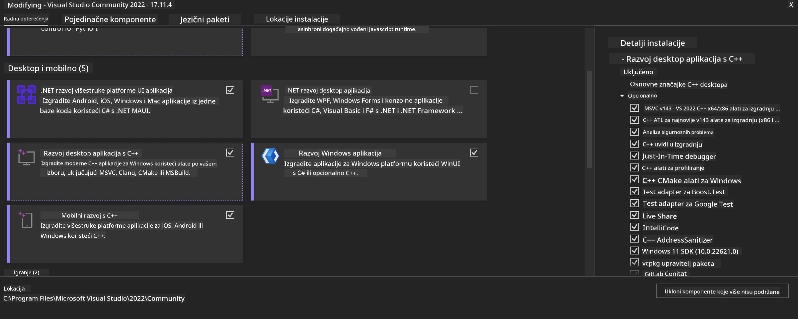
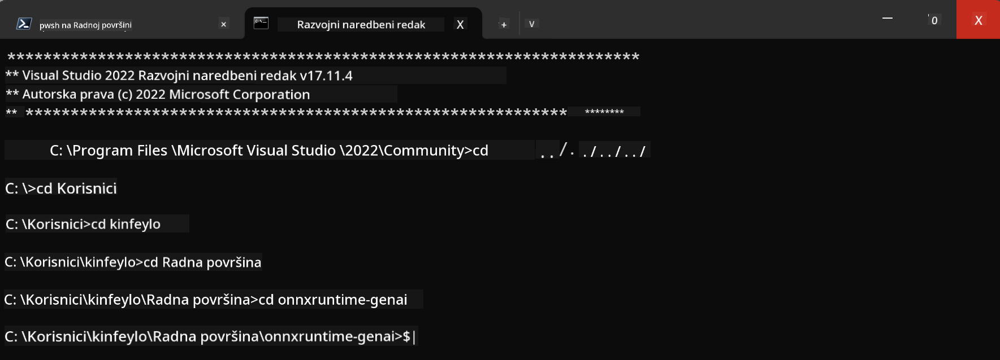

<!--
CO_OP_TRANSLATOR_METADATA:
{
  "original_hash": "b066fc29c1b2129df84e027cb75119ce",
  "translation_date": "2025-07-17T02:47:53+00:00",
  "source_file": "md/02.Application/01.TextAndChat/Phi3/ORTWindowGPUGuideline.md",
  "language_code": "hr"
}
-->
# **Smjernice za OnnxRuntime GenAI Windows GPU**

Ove smjernice pružaju korake za postavljanje i korištenje ONNX Runtime (ORT) s GPU-ima na Windowsu. Namijenjene su da vam pomognu iskoristiti GPU ubrzanje za vaše modele, poboljšavajući performanse i učinkovitost.

Dokument sadrži upute o:

- Postavljanju okoline: Upute za instalaciju potrebnih ovisnosti poput CUDA, cuDNN i ONNX Runtime.
- Konfiguraciji: Kako konfigurirati okolinu i ONNX Runtime za učinkovito korištenje GPU resursa.
- Savjetima za optimizaciju: Preporuke za podešavanje GPU postavki radi optimalnih performansi.

### **1. Python 3.10.x /3.11.8**

   ***Note*** Preporučujemo korištenje [miniforge](https://github.com/conda-forge/miniforge/releases/latest/download/Miniforge3-Windows-x86_64.exe) kao vašeg Python okruženja

   ```bash

   conda create -n pydev python==3.11.8

   conda activate pydev

   ```

   ***Reminder*** Ako imate instaliranu bilo koju Python ONNX biblioteku, molimo deinstalirajte je

### **2. Instalirajte CMake pomoću winget**

   ```bash

   winget install -e --id Kitware.CMake

   ```

### **3. Instalirajte Visual Studio 2022 - Desktop Development with C++**

   ***Note*** Ako ne želite kompajlirati, ovaj korak možete preskočiti



### **4. Instalirajte NVIDIA upravljački program**

1. **NVIDIA GPU Driver**  [https://www.nvidia.com/en-us/drivers/](https://www.nvidia.com/en-us/drivers/)

2. **NVIDIA CUDA 12.4** [https://developer.nvidia.com/cuda-12-4-0-download-archive](https://developer.nvidia.com/cuda-12-4-0-download-archive)

3. **NVIDIA CUDNN 9.4**  [https://developer.nvidia.com/cudnn-downloads](https://developer.nvidia.com/cudnn-downloads)

***Reminder*** Molimo koristite zadane postavke tijekom instalacije

### **5. Postavite NVIDIA okruženje**

Kopirajte NVIDIA CUDNN 9.4 lib, bin, include u NVIDIA CUDA 12.4 lib, bin, include

- kopirajte datoteke iz *'C:\Program Files\NVIDIA\CUDNN\v9.4\bin\12.6'* u  *'C:\Program Files\NVIDIA GPU Computing Toolkit\CUDA\v12.4\bin'*

- kopirajte datoteke iz *'C:\Program Files\NVIDIA\CUDNN\v9.4\include\12.6'* u  *'C:\Program Files\NVIDIA GPU Computing Toolkit\CUDA\v12.4\include'*

- kopirajte datoteke iz *'C:\Program Files\NVIDIA\CUDNN\v9.4\lib\12.6'* u  *'C:\Program Files\NVIDIA GPU Computing Toolkit\CUDA\v12.4\lib\x64'*

### **6. Preuzmite Phi-3.5-mini-instruct-onnx**

   ```bash

   winget install -e --id Git.Git

   winget install -e --id GitHub.GitLFS

   git lfs install

   git clone https://huggingface.co/microsoft/Phi-3.5-mini-instruct-onnx

   ```

### **7. Pokrenite InferencePhi35Instruct.ipynb**

   Otvorite [Notebook](../../../../../../code/09.UpdateSamples/Aug/ortgpu-phi35-instruct.ipynb) i izvršite ga


### **8. Kompajlirajte ORT GenAI GPU**

   ***Note*** 
   
   1. Prvo deinstalirajte sve vezano uz onnx, onnxruntime i onnxruntime-genai

   ```bash

   pip list 
   
   ```

   Zatim deinstalirajte sve onnxruntime biblioteke, npr.

   ```bash

   pip uninstall onnxruntime

   pip uninstall onnxruntime-genai

   pip uninstall onnxruntume-genai-cuda
   
   ```

   2. Provjerite podršku Visual Studio ekstenzije

   Provjerite u C:\Program Files\NVIDIA GPU Computing Toolkit\CUDA\v12.4\extras postoji li mapa C:\Program Files\NVIDIA GPU Computing Toolkit\CUDA\v12.4\extras\visual_studio_integration. 
   
   Ako nije pronađena, provjerite druge mape Cuda toolkit drivera i kopirajte mapu visual_studio_integration i njen sadržaj u C:\Program Files\NVIDIA GPU Computing Toolkit\CUDA\v12.4\extras\visual_studio_integration

   - Ako ne želite kompajlirati, ovaj korak možete preskočiti

   ```bash

   git clone https://github.com/microsoft/onnxruntime-genai

   ```

   - Preuzmite [https://github.com/microsoft/onnxruntime/releases/download/v1.19.2/onnxruntime-win-x64-gpu-1.19.2.zip](https://github.com/microsoft/onnxruntime/releases/download/v1.19.2/onnxruntime-win-x64-gpu-1.19.2.zip)

   - Raspakirajte onnxruntime-win-x64-gpu-1.19.2.zip, preimenujte mapu u **ort** i kopirajte je u onnxruntime-genai

   - Koristeći Windows Terminal, otvorite Developer Command Prompt za VS 2022 i idite u onnxruntime-genai



   - Kompajlirajte koristeći vaše Python okruženje

   ```bash

   cd onnxruntime-genai

   python build.py --use_cuda  --cuda_home "C:\Program Files\NVIDIA GPU Computing Toolkit\CUDA\v12.4" --config Release
 

   cd build/Windows/Release/Wheel

   pip install .whl

   ```

**Odricanje od odgovornosti**:  
Ovaj dokument je preveden korištenjem AI usluge za prevođenje [Co-op Translator](https://github.com/Azure/co-op-translator). Iako težimo točnosti, imajte na umu da automatski prijevodi mogu sadržavati pogreške ili netočnosti. Izvorni dokument na izvornom jeziku treba smatrati autoritativnim izvorom. Za kritične informacije preporučuje se profesionalni ljudski prijevod. Ne snosimo odgovornost za bilo kakva nesporazume ili pogrešna tumačenja koja proizlaze iz korištenja ovog prijevoda.