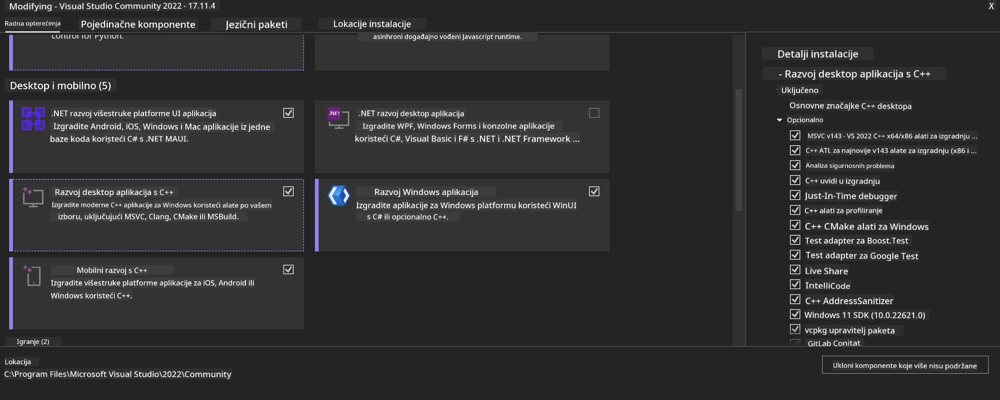
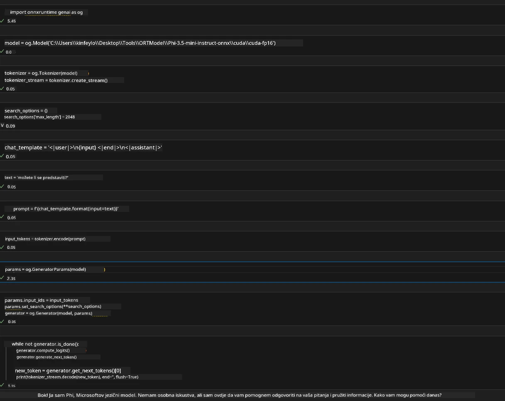
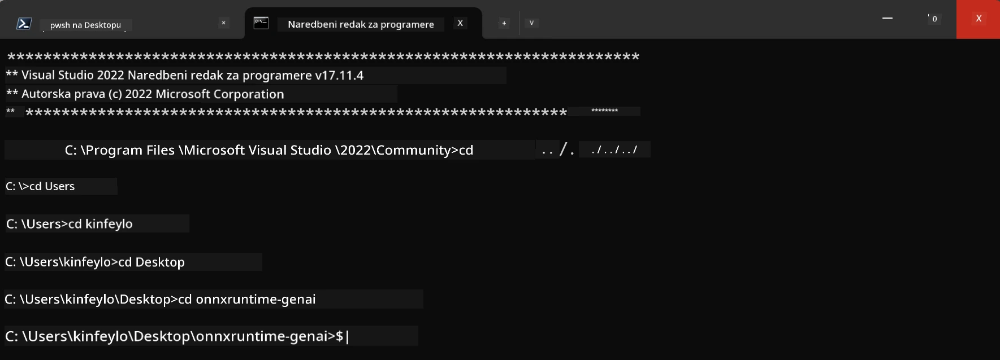

# **Smjernice za OnnxRuntime GenAI Windows GPU**

Ove smjernice daju korake za postavljanje i korištenje ONNX Runtime (ORT) s GPU-ovima na Windowsu. Namijenjene su da vam pomognu iskoristiti ubrzanje putem GPU-a za vaše modele, poboljšavajući performanse i učinkovitost.

Dokument pruža upute o:

- Postavljanje okoline: Upute za instalaciju potrebnih ovisnosti poput CUDA, cuDNN i ONNX Runtime.
- Konfiguracija: Kako konfigurirati okolinu i ONNX Runtime za učinkovito korištenje GPU resursa.
- Savjeti za optimizaciju: Preporuke kako fino podesiti GPU postavke za optimalne performanse.

### **1. Python 3.10.x /3.11.8**

   ***Napomena*** Preporučuje se korištenje [miniforge](https://github.com/conda-forge/miniforge/releases/latest/download/Miniforge3-Windows-x86_64.exe) kao vašeg Python okruženja

   ```bash

   conda create -n pydev python==3.11.8

   conda activate pydev

   ```

   ***Podsjetnik*** Ako ste instalirali bilo koju ONNX Python biblioteku, molimo deinstalirajte je

### **2. Instalirajte CMake putem winget**


   ```bash

   winget install -e --id Kitware.CMake

   ```

### **3. Instalirajte Visual Studio 2022 - Desktop Development with C++**

   ***Napomena*** Ako ne želite kompajlirati, možete preskočiti ovaj korak




### **4. Instalirajte NVIDIA drajver**

1. **NVIDIA GPU drajver**  [https://www.nvidia.com/en-us/drivers/](https://www.nvidia.com/en-us/drivers/)

2. **NVIDIA CUDA 12.4** [https://developer.nvidia.com/cuda-12-4-0-download-archive](https://developer.nvidia.com/cuda-12-4-0-download-archive)

3. **NVIDIA CUDNN 9.4**  [https://developer.nvidia.com/cudnn-downloads](https://developer.nvidia.com/cudnn-downloads)

***Podsjetnik*** Molimo koristite zadane postavke tijekom instalacijskog procesa

### **5. Postavite NVIDIA okolinu**

Kopirajte NVIDIA CUDNN 9.4 lib, bin, include u NVIDIA CUDA 12.4 lib, bin, include

- kopirajte *'C:\Program Files\NVIDIA\CUDNN\v9.4\bin\12.6'* datoteke u *'C:\Program Files\NVIDIA GPU Computing Toolkit\CUDA\v12.4\bin'*

- kopirajte *'C:\Program Files\NVIDIA\CUDNN\v9.4\include\12.6'* datoteke u *'C:\Program Files\NVIDIA GPU Computing Toolkit\CUDA\v12.4\include'*

- kopirajte *'C:\Program Files\NVIDIA\CUDNN\v9.4\lib\12.6'* datoteke u *'C:\Program Files\NVIDIA GPU Computing Toolkit\CUDA\v12.4\lib\x64'*


### **6. Preuzmite Phi-3.5-mini-instruct-onnx**


   ```bash

   winget install -e --id Git.Git

   winget install -e --id GitHub.GitLFS

   git lfs install

   git clone https://huggingface.co/microsoft/Phi-3.5-mini-instruct-onnx

   ```

### **7. Pokretanje InferencePhi35Instruct.ipynb**

   Otvorite [Notebook](../../../../code/09.UpdateSamples/Aug/ortgpu-phi35-instruct.ipynb) i izvršite





### **8. Kompajliranje ORT GenAI GPU**


   ***Napomena*** 
   
   1. Prvo deinstalirajte sve što se odnosi na onnx, onnxruntime i onnxruntime-genai

   
   ```bash

   pip list 
   
   ```

   Zatim deinstalirajte sve onnxruntime biblioteke, tj.


   ```bash

   pip uninstall onnxruntime

   pip uninstall onnxruntime-genai

   pip uninstall onnxruntume-genai-cuda
   
   ```

   2. Provjerite podršku Visual Studio ekstenzija

   Provjerite C:\Program Files\NVIDIA GPU Computing Toolkit\CUDA\v12.4\extras da biste osigurali da postoji C:\Program Files\NVIDIA GPU Computing Toolkit\CUDA\v12.4\extras\visual_studio_integration. 
   
   Ako nije pronađeno, provjerite druge CUDA toolkit mape drajvera i kopirajte mapu visual_studio_integration i njen sadržaj u C:\Program Files\NVIDIA GPU Computing Toolkit\CUDA\v12.4\extras\visual_studio_integration


   - Ako ne želite kompajlirati, možete preskočiti ovaj korak


   ```bash

   git clone https://github.com/microsoft/onnxruntime-genai

   ```

   - Preuzmite [https://github.com/microsoft/onnxruntime/releases/download/v1.19.2/onnxruntime-win-x64-gpu-1.19.2.zip](https://github.com/microsoft/onnxruntime/releases/download/v1.19.2/onnxruntime-win-x64-gpu-1.19.2.zip)

   - Raspakirajte onnxruntime-win-x64-gpu-1.19.2.zip, preimenujte ga u **ort**, kopirajte ort mapu u onnxruntime-genai

   - Koristeći Windows Terminal, otvorite Developer Command Prompt za VS 2022 i idite u onnxruntime-genai



   - Kompajlirajte ga s vašim python okruženjem

   
   ```bash

   cd onnxruntime-genai

   python build.py --use_cuda  --cuda_home "C:\Program Files\NVIDIA GPU Computing Toolkit\CUDA\v12.4" --config Release
 

   cd build/Windows/Release/Wheel

   pip install .whl

   ```

---

<!-- CO-OP TRANSLATOR DISCLAIMER START -->
**Napomena**:
Ovaj dokument je preveden korištenjem AI prevoditeljskog servisa [Co-op Translator](https://github.com/Azure/co-op-translator). Iako težimo točnosti, imajte na umu da automatski prijevodi mogu sadržavati greške ili netočnosti. Izvorni dokument na izvornom jeziku treba smatrati autoritativnim izvorom. Za važne informacije preporuča se profesionalni ljudski prijevod. Nismo odgovorni za bilo kakva nesporazumevanja ili pogrešne interpretacije koje proizlaze iz korištenja ovog prijevoda.
<!-- CO-OP TRANSLATOR DISCLAIMER END -->