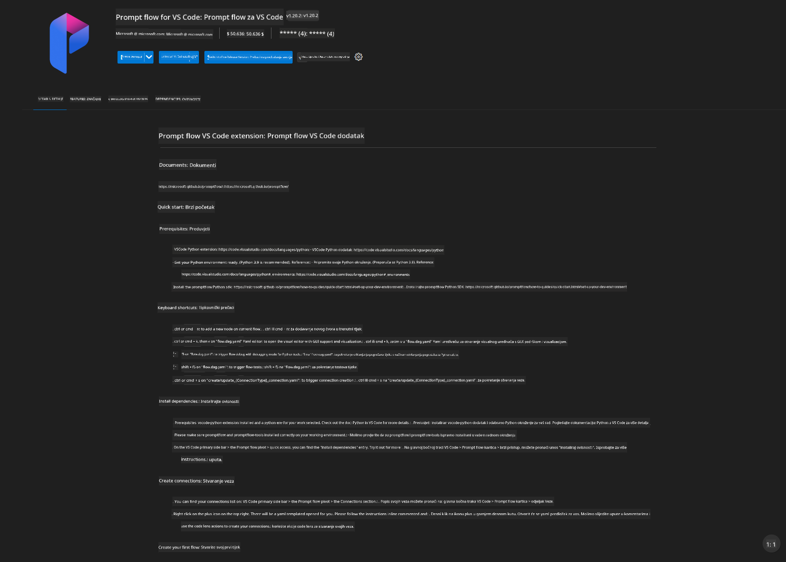
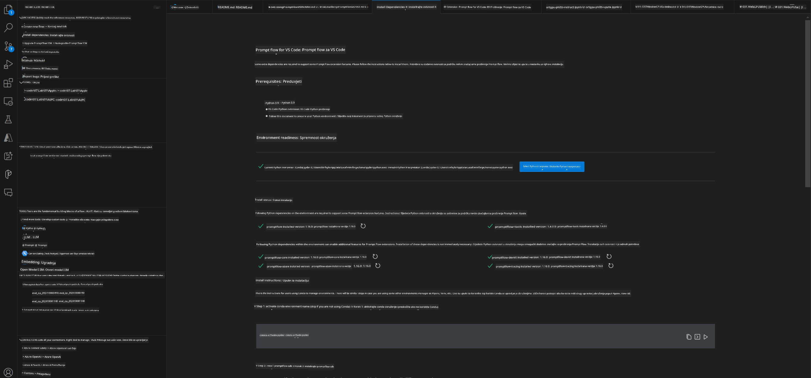
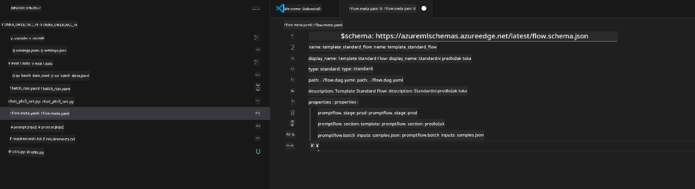
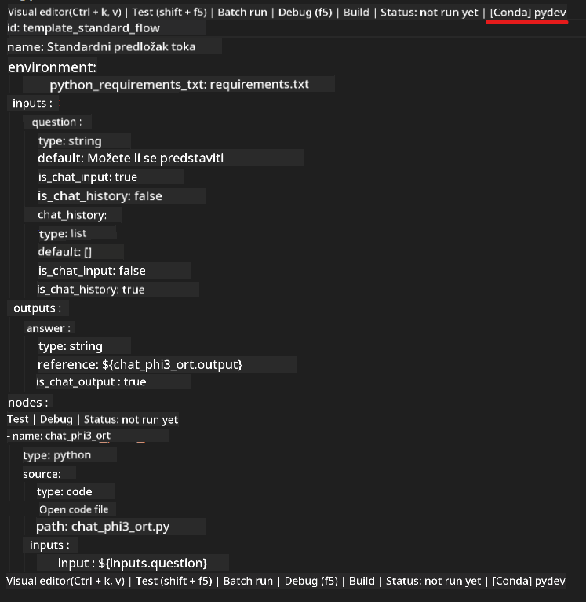
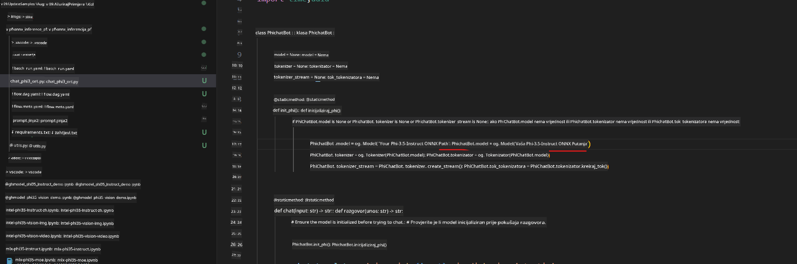
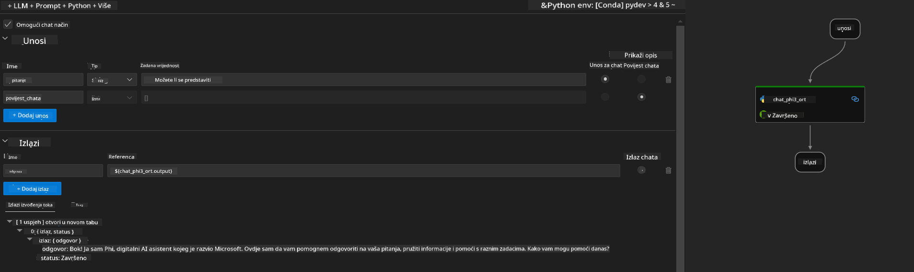
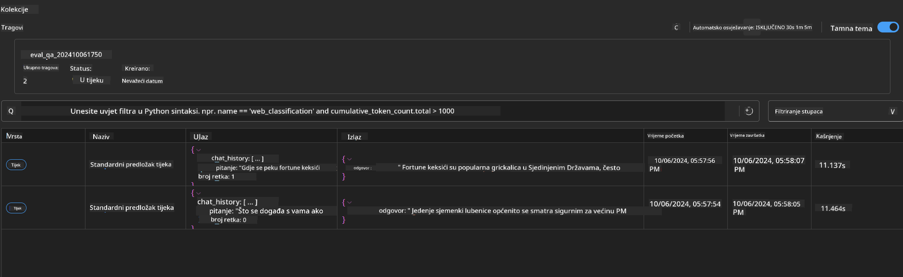

<!--
CO_OP_TRANSLATOR_METADATA:
{
  "original_hash": "92e7dac1e5af0dd7c94170fdaf6860fe",
  "translation_date": "2025-07-17T03:04:10+00:00",
  "source_file": "md/02.Application/01.TextAndChat/Phi3/UsingPromptFlowWithONNX.md",
  "language_code": "hr"
}
-->
# Korištenje Windows GPU-a za izradu Prompt flow rješenja s Phi-3.5-Instruct ONNX

Sljedeći dokument je primjer kako koristiti PromptFlow s ONNX-om (Open Neural Network Exchange) za razvoj AI aplikacija temeljenih na Phi-3 modelima.

PromptFlow je skup razvojnih alata dizajniran za pojednostavljenje cjelokupnog razvojnog ciklusa AI aplikacija baziranih na LLM-u (Large Language Model), od ideje i prototipiranja do testiranja i evaluacije.

Integracijom PromptFlow-a s ONNX-om, developeri mogu:

- Optimizirati performanse modela: Iskoristiti ONNX za učinkovitu inferenciju i implementaciju modela.
- Pojednostaviti razvoj: Koristiti PromptFlow za upravljanje radnim procesom i automatizaciju ponavljajućih zadataka.
- Poboljšati suradnju: Omogućiti bolju suradnju među članovima tima pružajući jedinstveno razvojno okruženje.

**Prompt flow** je skup razvojnih alata osmišljen za pojednostavljenje cjelokupnog razvojnog ciklusa AI aplikacija baziranih na LLM-u, od ideje, prototipiranja, testiranja, evaluacije do produkcijske implementacije i nadzora. Olakšava prompt inženjering i omogućuje izgradnju LLM aplikacija proizvodne kvalitete.

Prompt flow može se povezati s OpenAI, Azure OpenAI Service i prilagodljivim modelima (Huggingface, lokalni LLM/SLM). Cilj nam je implementirati kvantizirani ONNX model Phi-3.5 u lokalne aplikacije. Prompt flow nam može pomoći bolje planirati poslovanje i dovršiti lokalna rješenja temeljena na Phi-3.5. U ovom primjeru kombinirat ćemo ONNX Runtime GenAI Library za dovršetak Prompt flow rješenja baziranog na Windows GPU-u.

## **Instalacija**

### **ONNX Runtime GenAI za Windows GPU**

Pročitajte ovaj vodič za postavljanje ONNX Runtime GenAI za Windows GPU [kliknite ovdje](./ORTWindowGPUGuideline.md)

### **Postavljanje Prompt flow u VSCode**

1. Instalirajte Prompt flow VS Code ekstenziju



2. Nakon instalacije Prompt flow VS Code ekstenzije, kliknite na ekstenziju i odaberite **Installation dependencies** te slijedite ovaj vodič za instalaciju Prompt flow SDK-a u vašem okruženju



3. Preuzmite [Sample Code](../../../../../../code/09.UpdateSamples/Aug/pf/onnx_inference_pf) i otvorite ovaj primjer u VS Code-u



4. Otvorite **flow.dag.yaml** i odaberite svoje Python okruženje



   Otvorite **chat_phi3_ort.py** i promijenite lokaciju Phi-3.5-instruct ONNX modela



5. Pokrenite svoj prompt flow za testiranje

Otvorite **flow.dag.yaml** i kliknite na visual editor


nakon klika, pokrenite ga za testiranje



1. Možete pokrenuti batch u terminalu za pregled dodatnih rezultata


```bash

pf run create --file batch_run.yaml --stream --name 'Your eval qa name'    

```

Rezultate možete provjeriti u svom zadanim pregledniku




**Odricanje od odgovornosti**:  
Ovaj dokument je preveden korištenjem AI usluge za prevođenje [Co-op Translator](https://github.com/Azure/co-op-translator). Iako nastojimo postići točnost, imajte na umu da automatski prijevodi mogu sadržavati pogreške ili netočnosti. Izvorni dokument na izvornom jeziku treba smatrati autoritativnim izvorom. Za kritične informacije preporučuje se profesionalni ljudski prijevod. Ne snosimo odgovornost za bilo kakva nesporazuma ili pogrešna tumačenja koja proizlaze iz korištenja ovog prijevoda.