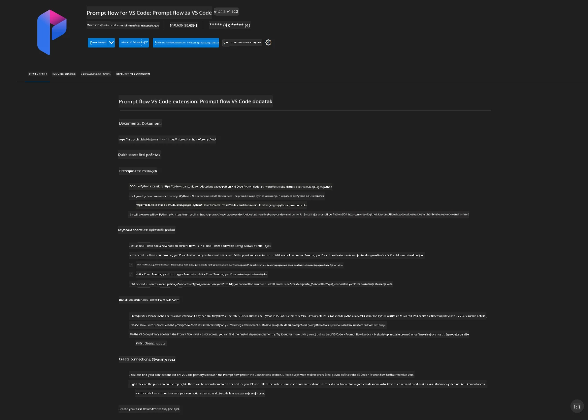
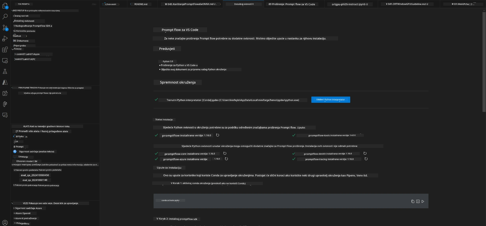
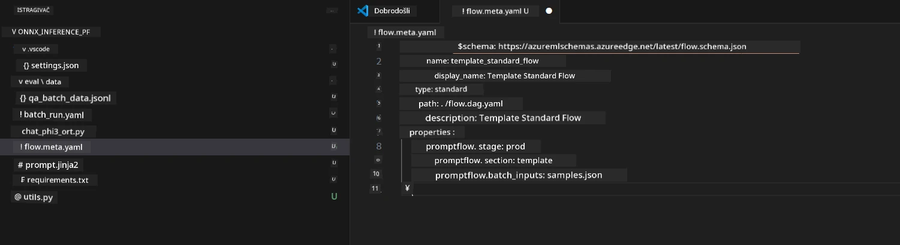
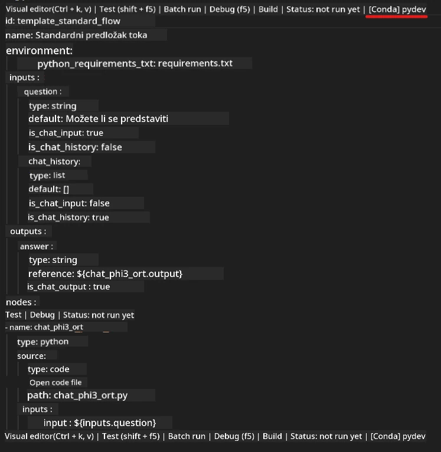
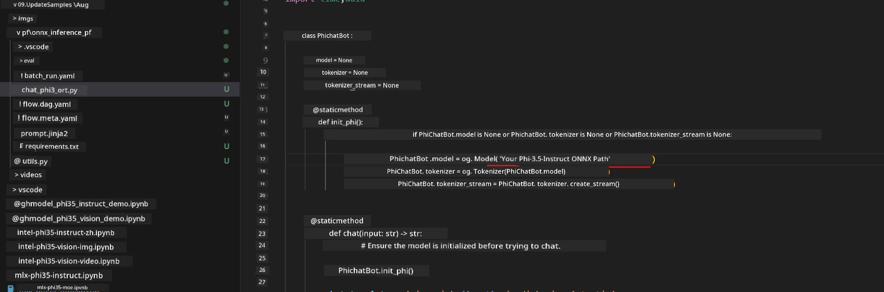
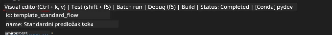
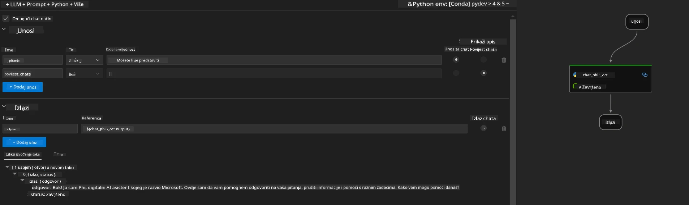
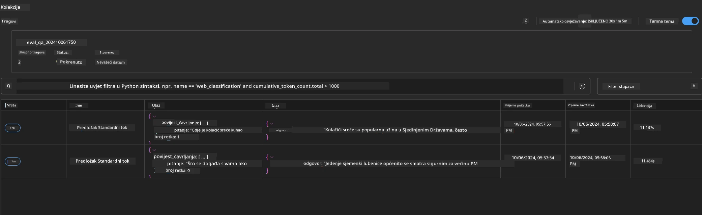

# Korištenje Windows GPU za stvaranje Prompt flow rješenja s Phi-3.5-Instruct ONNX 

Sljedeći dokument je primjer kako koristiti PromptFlow s ONNX (Open Neural Network Exchange) za razvoj AI aplikacija baziranih na Phi-3 modelima.

PromptFlow je skup razvojnih alata dizajniranih za pojednostavljenje cjelokupnog razvojnog ciklusa AI aplikacija baziranih na LLM (Large Language Model), od ideacije i izrade prototipa do testiranja i evaluacije.

Integracijom PromptFlow-a s ONNX-om, developeri mogu:

- Optimizirati performanse modela: Iskoristiti ONNX za učinkovito izvođenje modela i implementaciju.
- Pojednostaviti razvoj: Koristiti PromptFlow za upravljanje radnim procesom i automatizaciju ponavljajućih zadataka.
- Poboljšati suradnju: Omogućiti bolju suradnju među članovima tima pružajući jedinstveno razvojno okruženje.

**Prompt flow** je skup razvojnih alata dizajniranih za pojednostavljenje cjelokupnog razvojnog ciklusa AI aplikacija baziranih na LLM, od ideacije, izrade prototipa, testiranja, evaluacije do proizvodne implementacije i praćenja. Omogućuje znatno jednostavniji prompt inženjering i omogućuje izgradnju LLM aplikacija produkcijske kvalitete.

Prompt flow se može spojiti na OpenAI, Azure OpenAI Service i prilagodljive modele (Huggingface, lokalni LLM/SLM). Nadamo se implementirati kvantizirani ONNX model Phi-3.5 u lokalne aplikacije. Prompt flow nam može pomoći bolje planirati posao i dovršiti lokalna rješenja temeljena na Phi-3.5. U ovom primjeru, kombinirat ćemo ONNX Runtime GenAI knjižnicu za dovršetak Prompt flow rješenja baziranog na Windows GPU.

## **Instalacija**

### **ONNX Runtime GenAI za Windows GPU**

Pročitajte ovaj vodič za postavljanje ONNX Runtime GenAI za Windows GPU [kliknite ovdje](./ORTWindowGPUGuideline.md)

### **Postavljanje Prompt flow u VSCode**

1. Instalirajte Prompt flow VS Code proširenje



2. Nakon instalacije Prompt flow VS Code proširenja, kliknite na proširenje i odaberite **Installation dependencies** te slijedite ovaj vodič za instalaciju Prompt flow SDK u vaše okruženje



3. Preuzmite [Primjer koda](../../../../../../code/09.UpdateSamples/Aug/pf/onnx_inference_pf) i otvorite ovaj primjer u VS Code



4. Otvorite **flow.dag.yaml** da odaberete svoje Python okruženje



   Otvorite **chat_phi3_ort.py** kako biste promijenili lokaciju svog Phi-3.5-instruct ONNX modela



5. Pokrenite svoj prompt flow za testiranje

Otvorite **flow.dag.yaml** kliknite na vizualni editor



nakon klika, pokrenite za testiranje



1. Možete pokretati batch u terminalu za provjeru dodatnih rezultata


```bash

pf run create --file batch_run.yaml --stream --name 'Your eval qa name'    

```

Rezultate možete provjeriti u zadanim pregledniku




---

<!-- CO-OP TRANSLATOR DISCLAIMER START -->
**Napomena**:
Ovaj dokument je preveden korištenjem AI prevoditeljskog servisa [Co-op Translator](https://github.com/Azure/co-op-translator). Iako težimo točnosti, imajte na umu da automatski prijevodi mogu sadržavati greške ili netočnosti. Izvorni dokument na izvornom jeziku treba smatrati autoritativnim izvorom. Za važne informacije preporuča se profesionalni ljudski prijevod. Nismo odgovorni za bilo kakva nesporazumevanja ili pogrešne interpretacije koje proizlaze iz korištenja ovog prijevoda.
<!-- CO-OP TRANSLATOR DISCLAIMER END -->