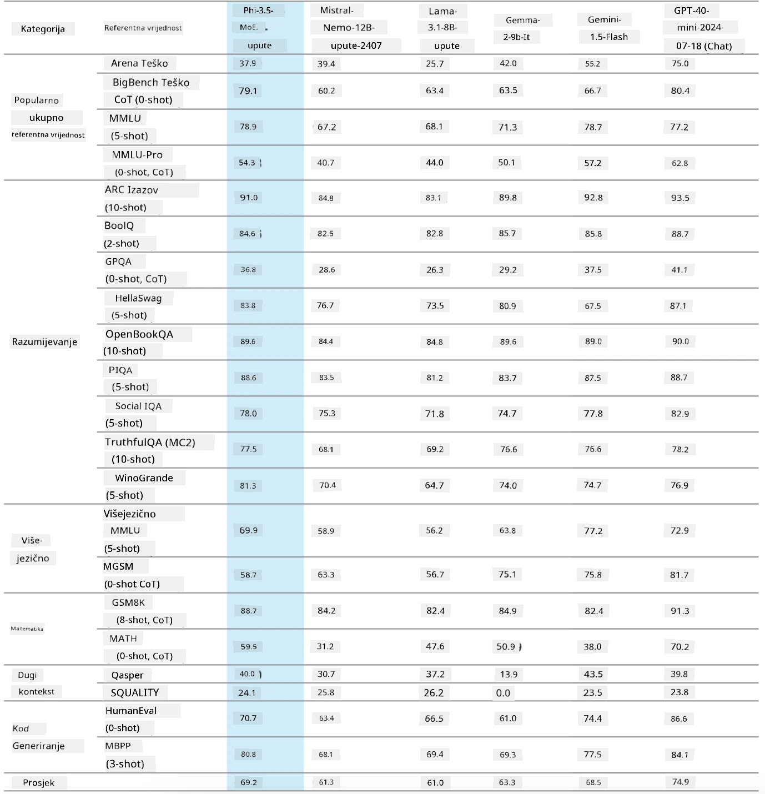
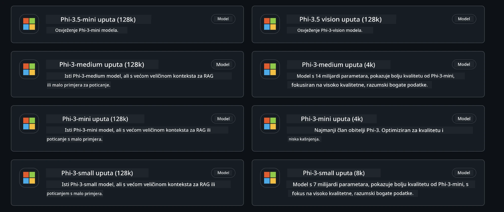
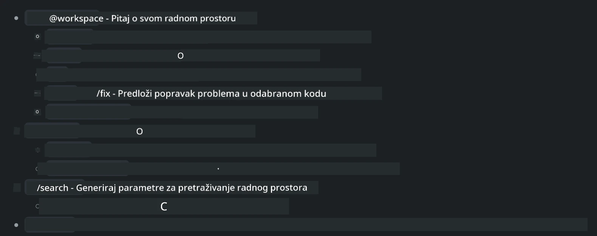
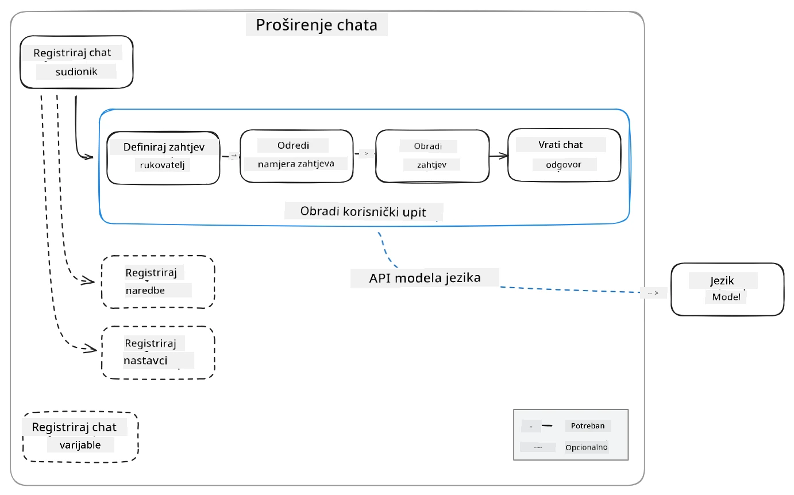
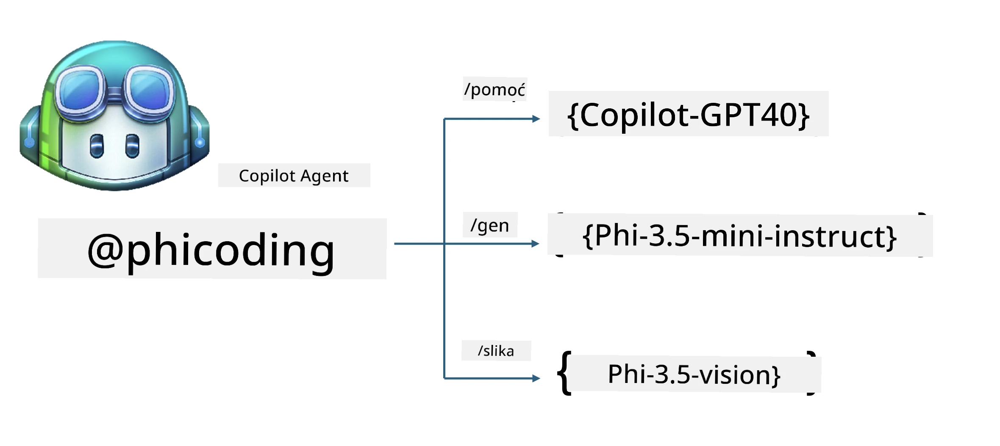
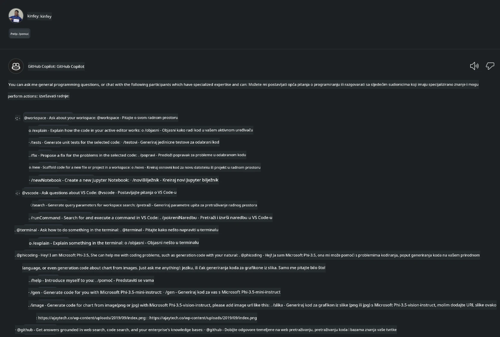
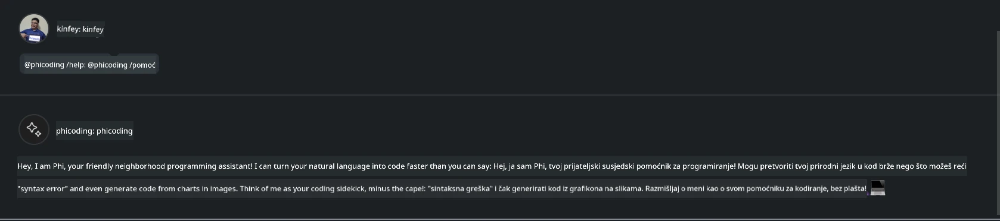
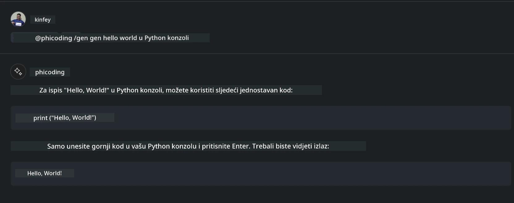
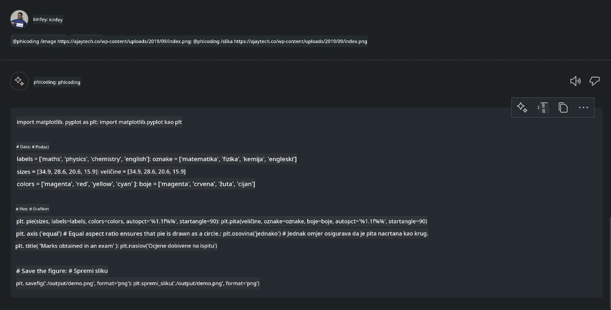

<!--
CO_OP_TRANSLATOR_METADATA:
{
  "original_hash": "35bf81388ac6917277b8d9a0c39bdc70",
  "translation_date": "2025-07-17T03:31:01+00:00",
  "source_file": "md/02.Application/02.Code/Phi3/CreateVSCodeChatAgentWithGitHubModels.md",
  "language_code": "hr"
}
-->
# **Napravite vlastitog Visual Studio Code Chat Copilot Agenta s Phi-3.5 pomoću GitHub Models**

Koristite li Visual Studio Code Copilot? Posebno u Chatu, možete koristiti različite agente za poboljšanje sposobnosti kreiranja, pisanja i održavanja projekata u Visual Studio Codeu. Visual Studio Code pruža API koji omogućuje tvrtkama i pojedincima da kreiraju različite agente temeljene na njihovom poslovanju kako bi proširili svoje mogućnosti u različitim specifičnim područjima. U ovom članku fokusirat ćemo se na **Phi-3.5-mini-instruct (128k)** i **Phi-3.5-vision-instruct (128k)** iz GitHub Models za izradu vlastitog Visual Studio Code Agenta.

## **O Phi-3.5 na GitHub Models**

Znamo da Phi-3/3.5-mini-instruct iz Phi-3/3.5 obitelji ima snažne sposobnosti razumijevanja i generiranja koda, te prednosti u odnosu na Gemma-2-9b i Mistral-Nemo-12B-instruct-2407.



Najnoviji GitHub Models već omogućuju pristup modelima Phi-3.5-mini-instruct (128k) i Phi-3.5-vision-instruct (128k). Programeri im mogu pristupiti putem OpenAI SDK-a, Azure AI Inference SDK-a i REST API-ja.



***Note: *** Preporučuje se korištenje Azure AI Inference SDK-a ovdje, jer se bolje integrira s Azure Model Catalogom u produkcijskom okruženju

Slijede rezultati **Phi-3.5-mini-instruct (128k)** i **Phi-3.5-vision-instruct (128k)** u scenariju generiranja koda nakon povezivanja s GitHub Models, kao i priprema za sljedeće primjere

**Demo: GitHub Models Phi-3.5-mini-instruct (128k) generira kod iz Prompt-a** ([kliknite ovaj link](../../../../../../code/09.UpdateSamples/Aug/ghmodel_phi35_instruct_demo.ipynb))

**Demo: GitHub Models Phi-3.5-vision-instruct (128k) generira kod iz slike** ([kliknite ovaj link](../../../../../../code/09.UpdateSamples/Aug/ghmodel_phi35_vision_demo.ipynb))


## **O GitHub Copilot Chat Agentu**

GitHub Copilot Chat Agent može obavljati različite zadatke u različitim projektnim scenarijima na temelju koda. Sustav ima četiri agenta: workspace, github, terminal, vscode



Dodavanjem imena agenta s ‘@’ možete brzo izvršiti odgovarajući zadatak. Za tvrtke, ako dodate vlastiti poslovno povezani sadržaj poput zahtjeva, kodiranja, testnih specifikacija i objava, možete imati snažnije privatne funkcije za poduzeća temeljene na GitHub Copilotu.

Visual Studio Code Chat Agent sada je službeno objavio svoj API, što omogućuje tvrtkama ili razvojnim programerima u poduzećima da razvijaju agente temeljene na različitim softverskim poslovnim ekosustavima. Temeljem metode razvoja Visual Studio Code Extension Development, lako možete pristupiti sučelju Visual Studio Code Chat Agent API-ja. Možemo razvijati na temelju ovog procesa



Razvojni scenarij može podržavati pristup API-jima trećih strana (kao što su GitHub Models, Azure Model Catalog i samostalno izgrađene usluge temeljene na open source modelima) te može koristiti i modele gpt-35-turbo, gpt-4 i gpt-4o koje pruža GitHub Copilot.

## **Dodajte agenta @phicoding temeljenog na Phi-3.5**

Pokušavamo integrirati programerske sposobnosti Phi-3.5 za dovršavanje pisanja koda, generiranja koda iz slika i drugih zadataka. Izradite agenta temeljenog na Phi-3.5 - @PHI, a sljedeće su neke od funkcija

1. Generira samopredstavljanje temeljeno na GPT-4o koje pruža GitHub Copilot putem naredbe **@phicoding /help**

2. Generira kod za različite programske jezike na temelju **Phi-3.5-mini-instruct (128k)** putem naredbe **@phicoding /gen**

3. Generira kod na temelju **Phi-3.5-vision-instruct (128k)** i dovršava kod iz slike putem naredbe **@phicoding /image**



## **Povezani koraci**

1. Instalirajte podršku za razvoj Visual Studio Code Extensiona koristeći npm

```bash

npm install --global yo generator-code 

```
2. Kreirajte Visual Studio Code Extension plugin (koristeći Typescript razvojni način, nazvan phiext)

```bash

yo code 

```

3. Otvorite kreirani projekt i izmijenite package.json. Ovdje su povezane upute i konfiguracije, kao i konfiguracija GitHub Models. Obratite pažnju da ovdje trebate dodati svoj GitHub Models token.

```json

{
  "name": "phiext",
  "displayName": "phiext",
  "description": "",
  "version": "0.0.1",
  "engines": {
    "vscode": "^1.93.0"
  },
  "categories": [
    "AI",
    "Chat"
  ],
  "activationEvents": [],
  "enabledApiProposals": [
      "chatVariableResolver"
  ],
  "main": "./dist/extension.js",
  "contributes": {
    "chatParticipants": [
        {
            "id": "chat.phicoding",
            "name": "phicoding",
            "description": "Hey! I am Microsoft Phi-3.5, She can help me with coding problems, such as generation code with your natural language, or even generation code about chart from images. Just ask me anything!",
            "isSticky": true,
            "commands": [
                {
                    "name": "help",
                    "description": "Introduce myself to you"
                },
                {
                    "name": "gen",
                    "description": "Generate code for you with Microsoft Phi-3.5-mini-instruct"
                },
                {
                    "name": "image",
                    "description": "Generate code for chart from image(png or jpg) with Microsoft Phi-3.5-vision-instruct, please add image url like this : https://ajaytech.co/wp-content/uploads/2019/09/index.png"
                }
            ]
        }
    ],
    "commands": [
        {
            "command": "phicoding.namesInEditor",
            "title": "Use Microsoft Phi 3.5 in Editor"
        }
    ],
    "configuration": {
      "type": "object",
      "title": "githubmodels",
      "properties": {
        "githubmodels.endpoint": {
          "type": "string",
          "default": "https://models.inference.ai.azure.com",
          "description": "Your GitHub Models Endpoint",
          "order": 0
        },
        "githubmodels.api_key": {
          "type": "string",
          "default": "Your GitHub Models Token",
          "description": "Your GitHub Models Token",
          "order": 1
        },
        "githubmodels.phi35instruct": {
          "type": "string",
          "default": "Phi-3.5-mini-instruct",
          "description": "Your Phi-35-Instruct Model",
          "order": 2
        },
        "githubmodels.phi35vision": {
          "type": "string",
          "default": "Phi-3.5-vision-instruct",
          "description": "Your Phi-35-Vision Model",
          "order": 3
        }
      }
    }
  },
  "scripts": {
    "vscode:prepublish": "npm run package",
    "compile": "webpack",
    "watch": "webpack --watch",
    "package": "webpack --mode production --devtool hidden-source-map",
    "compile-tests": "tsc -p . --outDir out",
    "watch-tests": "tsc -p . -w --outDir out",
    "pretest": "npm run compile-tests && npm run compile && npm run lint",
    "lint": "eslint src",
    "test": "vscode-test"
  },
  "devDependencies": {
    "@types/vscode": "^1.93.0",
    "@types/mocha": "^10.0.7",
    "@types/node": "20.x",
    "@typescript-eslint/eslint-plugin": "^8.3.0",
    "@typescript-eslint/parser": "^8.3.0",
    "eslint": "^9.9.1",
    "typescript": "^5.5.4",
    "ts-loader": "^9.5.1",
    "webpack": "^5.94.0",
    "webpack-cli": "^5.1.4",
    "@vscode/test-cli": "^0.0.10",
    "@vscode/test-electron": "^2.4.1"
  },
  "dependencies": {
    "@types/node-fetch": "^2.6.11",
    "node-fetch": "^3.3.2",
    "@azure-rest/ai-inference": "latest",
    "@azure/core-auth": "latest",
    "@azure/core-sse": "latest"
  }
}


```

4. Izmijenite src/extension.ts

```typescript

// The module 'vscode' contains the VS Code extensibility API
// Import the module and reference it with the alias vscode in your code below
import * as vscode from 'vscode';
import ModelClient from "@azure-rest/ai-inference";
import { AzureKeyCredential } from "@azure/core-auth";


interface IPhiChatResult extends vscode.ChatResult {
    metadata: {
        command: string;
    };
}


const MODEL_SELECTOR: vscode.LanguageModelChatSelector = { vendor: 'copilot', family: 'gpt-4o' };

function isValidImageUrl(url: string): boolean {
    const regex = /^(https?:\/\/.*\.(?:png|jpg))$/i;
    return regex.test(url);
}
  

// This method is called when your extension is activated
// Your extension is activated the very first time the command is executed
export function activate(context: vscode.ExtensionContext) {

    const codinghandler: vscode.ChatRequestHandler = async (request: vscode.ChatRequest, context: vscode.ChatContext, stream: vscode.ChatResponseStream, token: vscode.CancellationToken): Promise<IPhiChatResult> => {


        const config : any = vscode.workspace.getConfiguration('githubmodels');
        const endPoint: string = config.get('endpoint');
        const apiKey: string = config.get('api_key');
        const phi35instruct: string = config.get('phi35instruct');
        const phi35vision: string = config.get('phi35vision');
        
        if (request.command === 'help') {

            const content = "Welcome to Coding assistant with Microsoft Phi-3.5"; 
            stream.progress(content);


            try {
                const [model] = await vscode.lm.selectChatModels(MODEL_SELECTOR);
                if (model) {
                    const messages = [
                        vscode.LanguageModelChatMessage.User("Please help me express this content in a humorous way: I am a programming assistant who can help you convert natural language into code and generate code based on the charts in the images. output format like this : Hey I am Phi ......")
                    ];
                    const chatResponse = await model.sendRequest(messages, {}, token);
                    for await (const fragment of chatResponse.text) {
                        stream.markdown(fragment);
                    }
                }
            } catch(err) {
                console.log(err);
            }


            return { metadata: { command: 'help' } };

        }

        
        if (request.command === 'gen') {

            const content = "Welcome to use phi-3.5 to generate code";

            stream.progress(content);

            const client = new ModelClient(endPoint, new AzureKeyCredential(apiKey));

            const response = await client.path("/chat/completions").post({
              body: {
                messages: [
                  { role:"system", content: "You are a coding assistant.Help answer all code generation questions." },
                  { role:"user", content: request.prompt }
                ],
                model: phi35instruct,
                temperature: 0.4,
                max_tokens: 1000,
                top_p: 1.
              }
            });

            stream.markdown(response.body.choices[0].message.content);

            return { metadata: { command: 'gen' } };

        }


        
        if (request.command === 'image') {


            const content = "Welcome to use phi-3.5 to generate code from image(png or jpg),image url like this:https://ajaytech.co/wp-content/uploads/2019/09/index.png";

            stream.progress(content);

            if (!isValidImageUrl(request.prompt)) {
                stream.markdown('Please provide a valid image URL');
                return { metadata: { command: 'image' } };
            }
            else
            {

                const client = new ModelClient(endPoint, new AzureKeyCredential(apiKey));
    
                const response = await client.path("/chat/completions").post({
                    body: {
                      messages: [
                        { role: "system", content: "You are a helpful assistant that describes images in details." },
                        { role: "user", content: [
                            { type: "text", text: "Please generate code according to the chart in the picture according to the following requirements\n1. Keep all information in the chart, including data and text\n2. Do not generate additional information that is not included in the chart\n3. Please extract data from the picture, do not generate it from csv\n4. Please save the regenerated chart as a chart and save it to ./output/demo.png"},
                            { type: "image_url", image_url: {url: request.prompt}
                            }
                          ]
                        }
                      ],
                      model: phi35vision,
                      temperature: 0.4,
                      max_tokens: 2048,
                      top_p: 1.
                    }
                  });
    
                
                stream.markdown(response.body.choices[0].message.content);
    
                return { metadata: { command: 'image' } };
            }


        }


        return { metadata: { command: '' } };
    };


    const phi_ext = vscode.chat.createChatParticipant("chat.phicoding", codinghandler);

    phi_ext.iconPath = new vscode.ThemeIcon('sparkle');


    phi_ext.followupProvider = {
        provideFollowups(result: IPhiChatResult, context: vscode.ChatContext, token: vscode.CancellationToken) {
            return [{
                prompt: 'Let us coding with Phi-3.5 😋😋😋😋',
                label: vscode.l10n.t('Enjoy coding with Phi-3.5'),
                command: 'help'
            } satisfies vscode.ChatFollowup];
        }
    };

    context.subscriptions.push(phi_ext);
}

// This method is called when your extension is deactivated
export function deactivate() {}


```

6. Pokretanje

***/help***



***@phicoding /help***



***@phicoding /gen***



***@phicoding /image***



Možete preuzeti primjerni kod: [kliknite](../../../../../../code/09.UpdateSamples/Aug/vscode)

## **Resursi**

1. Registrirajte se za GitHub Models [https://gh.io/models](https://gh.io/models)

2. Naučite razvoj Visual Studio Code Extensiona [https://code.visualstudio.com/api/get-started/your-first-extension](https://code.visualstudio.com/api/get-started/your-first-extension)

3. Saznajte više o Visual Studio Code Copilot Chat API-ju [https://code.visualstudio.com/api/extension-guides/chat](https://code.visualstudio.com/api/extension-guides/chat)

**Odricanje od odgovornosti**:  
Ovaj dokument je preveden korištenjem AI usluge za prevođenje [Co-op Translator](https://github.com/Azure/co-op-translator). Iako nastojimo postići točnost, imajte na umu da automatski prijevodi mogu sadržavati pogreške ili netočnosti. Izvorni dokument na izvornom jeziku treba smatrati autoritativnim izvorom. Za kritične informacije preporučuje se profesionalni ljudski prijevod. Ne snosimo odgovornost za bilo kakve nesporazume ili pogrešna tumačenja koja proizlaze iz korištenja ovog prijevoda.