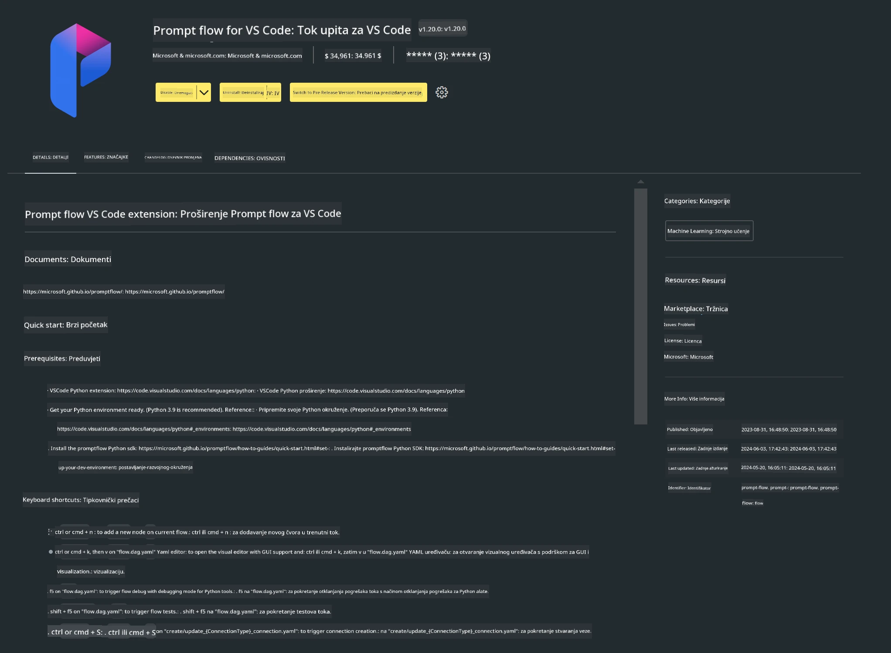

<!--
CO_OP_TRANSLATOR_METADATA:
{
  "original_hash": "a4ef39027902e82f2c33d568d2a2259a",
  "translation_date": "2025-07-17T03:53:00+00:00",
  "source_file": "md/02.Application/02.Code/Phi3/VSCodeExt/HOL/AIPC/01.Installations.md",
  "language_code": "hr"
}
-->
# **Lab 0 - Instalacija**

Kada uđemo u Lab, potrebno je konfigurirati odgovarajuće okruženje:


### **1. Python 3.11+**

Preporučuje se korištenje miniforge za konfiguraciju vašeg Python okruženja

Za konfiguraciju miniforge, molimo pogledajte [https://github.com/conda-forge/miniforge](https://github.com/conda-forge/miniforge)

Nakon konfiguracije miniforge, pokrenite sljedeću naredbu u Power Shellu

```bash

conda create -n pyenv python==3.11.8 -y

conda activate pyenv

```


### **2. Instalirajte Prompt flow SDK**

U Lab 1 koristimo Prompt flow, stoga je potrebno konfigurirati Prompt flow SDK.

```bash

pip install promptflow --upgrade

```

Možete provjeriti promptflow sdk ovom naredbom


```bash

pf --version

```

### **3. Instalirajte Visual Studio Code Prompt flow ekstenziju**




### **4. Intel NPU Acceleration Library**

Intelovi procesori nove generacije podržavaju NPU. Ako želite koristiti NPU za lokalno pokretanje LLM-ova / SLM-ova, možete koristiti ***Intel NPU Acceleration Library***. Ako želite saznati više, možete pročitati [https://github.com/microsoft/PhiCookBook/blob/main/md/01.Introduction/03/AIPC_Inference.md](https://github.com/microsoft/PhiCookBook/blob/main/md/01.Introduction/03/AIPC_Inference.md).

Instalirajte Intel NPU Acceleration Library u bashu


```bash

pip install intel-npu-acceleration-library

```

***Note***: Imajte na umu da ova biblioteka podržava transformers verziju ***4.40.2***, molimo potvrdite verziju


### **5. Ostale Python biblioteke**


kreirajte requirements.txt i dodajte ovaj sadržaj

```txt

notebook
numpy 
scipy 
scikit-learn 
matplotlib 
pandas 
pillow 
graphviz

```


### **6. Instalirajte NVM**

instalirajte nvm u Powershellu


```bash

winget install -e --id CoreyButler.NVMforWindows

```

instalirajte nodejs 18.20


```bash

nvm install 18.20.0

nvm use 18.20.0

```

### **7. Instalirajte Visual Studio Code razvojnu podršku**


```bash

npm install --global yo generator-code

```

Čestitamo! Uspješno ste konfigurirali SDK. Sljedeći korak su praktične vježbe.

**Odricanje od odgovornosti**:  
Ovaj dokument je preveden korištenjem AI usluge za prevođenje [Co-op Translator](https://github.com/Azure/co-op-translator). Iako težimo točnosti, imajte na umu da automatski prijevodi mogu sadržavati pogreške ili netočnosti. Izvorni dokument na izvornom jeziku treba smatrati autoritativnim izvorom. Za kritične informacije preporučuje se profesionalni ljudski prijevod. Ne snosimo odgovornost za bilo kakva nesporazuma ili pogrešna tumačenja koja proizlaze iz korištenja ovog prijevoda.