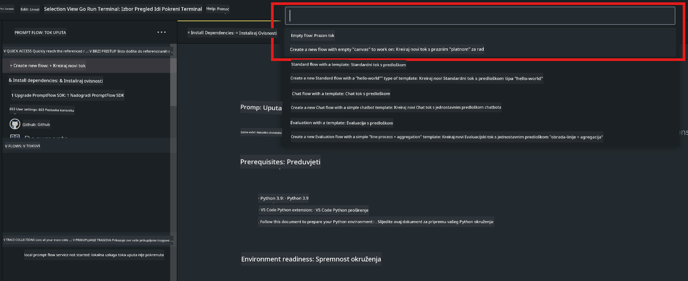
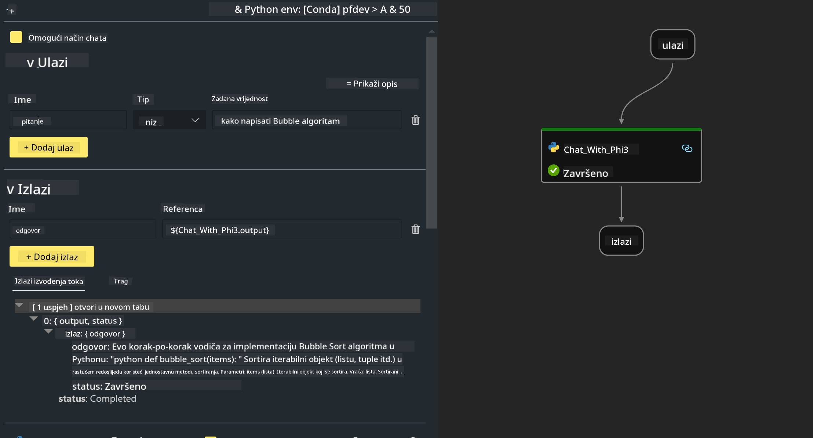
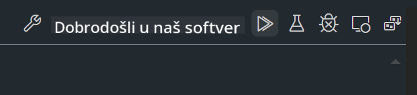

<!--
CO_OP_TRANSLATOR_METADATA:
{
  "original_hash": "bc29f7fe7fc16bed6932733eac8c81b8",
  "translation_date": "2025-05-09T19:26:50+00:00",
  "source_file": "md/02.Application/02.Code/Phi3/VSCodeExt/HOL/AIPC/02.PromptflowWithNPU.md",
  "language_code": "hr"
}
-->
# **Lab 2 - Pokretanje Prompt flow s Phi-3-mini na AIPC-u**

## **Što je Prompt flow**

Prompt flow je skup razvojnih alata dizajniranih da pojednostave cjelokupni razvojni ciklus AI aplikacija baziranih na LLM-ovima, od ideje, prototipiranja, testiranja, evaluacije do produkcijskog puštanja i nadzora. Omogućuje lakše upravljanje prompt inženjeringom i omogućava izgradnju LLM aplikacija produkcijske kvalitete.

S prompt flow-om moći ćete:

- Kreirati tokove koji povezuju LLM-ove, prompte, Python kod i druge alate u izvršni tijek rada.

- Debugirati i iterirati svoje tokove, posebno interakciju s LLM-ovima, jednostavno i brzo.

- Evaluirati tokove, izračunavati metrike kvalitete i performansi s većim skupovima podataka.

- Integrirati testiranje i evaluaciju u svoj CI/CD sustav kako biste osigurali kvalitetu toka.

- Deployati tokove na odabranu platformu za servisiranje ili ih lako integrirati u kod vaše aplikacije.

- (Opcionalno, ali preporučeno) Suradnja s timom koristeći cloud verziju Prompt flow-a u Azure AI.

## **Što je AIPC**

AI PC ima CPU, GPU i NPU, svaki sa specifičnim AI akceleracijskim mogućnostima. NPU, ili neural processing unit, je specijalizirani akcelerator koji obrađuje zadatke umjetne inteligencije (AI) i strojnog učenja (ML) izravno na vašem računalu, bez slanja podataka u cloud. GPU i CPU također mogu obrađivati ove zadatke, ali NPU je posebno učinkovit u AI izračunima s niskom potrošnjom energije. AI PC predstavlja temeljnu promjenu u načinu rada naših računala. Nije rješenje za problem koji prije nije postojao, već velika nadogradnja za svakodnevnu upotrebu računala.

Kako to funkcionira? U usporedbi s generativnom AI i masivnim LLM-ovima treniranim na ogromnim javnim podacima, AI koji se odvija na vašem računalu je pristupačniji na gotovo svim razinama. Koncept je lakše razumljiv, a budući da je treniran na vašim podacima, bez potrebe za pristupom cloudu, prednosti su odmah privlačnije široj populaciji.

U kratkom roku, AI PC svijet uključuje osobne asistente i manje AI modele koji rade direktno na vašem računalu, koristeći vaše podatke za osobna, privatnija i sigurnija AI poboljšanja za svakodnevne zadatke – vođenje zapisnika sa sastanaka, organiziranje fantazijske nogometne lige, automatizaciju poboljšanja za uređivanje fotografija i videa ili kreiranje savršenog rasporeda za obiteljsko okupljanje prema dolascima i odlascima svih sudionika.

## **Izgradnja tokova generacije koda na AIPC-u**

***Note*** ：Ako niste dovršili instalaciju okoline, molimo posjetite [Lab 0 -Installations](./01.Installations.md)

1. Otvorite Prompt flow ekstenziju u Visual Studio Code i kreirajte prazan flow projekt



2. Dodajte ulazne i izlazne parametre te dodajte Python kod kao novi flow



Možete se referirati na ovu strukturu (flow.dag.yaml) za izgradnju svog toka

```yaml

inputs:
  question:
    type: string
    default: how to write Bubble Algorithm
outputs:
  answer:
    type: string
    reference: ${Chat_With_Phi3.output}
nodes:
- name: Chat_With_Phi3
  type: python
  source:
    type: code
    path: Chat_With_Phi3.py
  inputs:
    question: ${inputs.question}


```

3. Dodajte kod u ***Chat_With_Phi3.py***

```python


from promptflow.core import tool

# import torch
from transformers import AutoTokenizer, pipeline,TextStreamer
import intel_npu_acceleration_library as npu_lib

import warnings

import asyncio
import platform

class Phi3CodeAgent:
    
    model = None
    tokenizer = None
    text_streamer = None
    
    model_id = "microsoft/Phi-3-mini-4k-instruct"

    @staticmethod
    def init_phi3():
        
        if Phi3CodeAgent.model is None or Phi3CodeAgent.tokenizer is None or Phi3CodeAgent.text_streamer is None:
            Phi3CodeAgent.model = npu_lib.NPUModelForCausalLM.from_pretrained(
                                    Phi3CodeAgent.model_id,
                                    torch_dtype="auto",
                                    dtype=npu_lib.int4,
                                    trust_remote_code=True
                                )
            Phi3CodeAgent.tokenizer = AutoTokenizer.from_pretrained(Phi3CodeAgent.model_id)
            Phi3CodeAgent.text_streamer = TextStreamer(Phi3CodeAgent.tokenizer, skip_prompt=True)

    

    @staticmethod
    def chat_with_phi3(prompt):
        
        Phi3CodeAgent.init_phi3()

        messages = "<|system|>You are a AI Python coding assistant. Please help me to generate code in Python.The answer only genertated Python code, but any comments and instructions do not need to be generated<|end|><|user|>" + prompt +"<|end|><|assistant|>"


        generation_args = {
            "max_new_tokens": 1024,
            "return_full_text": False,
            "temperature": 0.3,
            "do_sample": False,
            "streamer": Phi3CodeAgent.text_streamer,
        }

        pipe = pipeline(
            "text-generation",
            model=Phi3CodeAgent.model,
            tokenizer=Phi3CodeAgent.tokenizer,
            # **generation_args
        )

        result = ''

        with warnings.catch_warnings():
            warnings.simplefilter("ignore")
            response = pipe(messages, **generation_args)
            result =response[0]['generated_text']
            return result


@tool
def my_python_tool(question: str) -> str:
    if platform.system() == 'Windows':
        asyncio.set_event_loop_policy(asyncio.WindowsSelectorEventLoopPolicy())
    return Phi3CodeAgent.chat_with_phi3(question)


```

4. Možete testirati tok iz Debug ili Run opcije da provjerite radi li generacija koda ispravno



5. Pokrenite tok kao razvojni API u terminalu

```

pf flow serve --source ./ --port 8080 --host localhost   

```

Možete testirati u Postman-u ili Thunder Client-u

### **Note**

1. Prvo pokretanje traje duže. Preporučuje se preuzimanje phi-3 modela preko Hugging face CLI.

2. S obzirom na ograničenu računalnu snagu Intel NPU-a, preporučuje se korištenje Phi-3-mini-4k-instruct modela.

3. Koristimo Intel NPU akceleraciju za kvantizaciju INT4 konverzije, ali ako ponovno pokrećete servis, potrebno je izbrisati cache i nc_workshop mape.

## **Resursi**

1. Naučite Promptflow [https://microsoft.github.io/promptflow/](https://microsoft.github.io/promptflow/)

2. Naučite Intel NPU Acceleration [https://github.com/intel/intel-npu-acceleration-library](https://github.com/intel/intel-npu-acceleration-library)

3. Primjer koda, preuzmite [Local NPU Agent Sample Code](../../../../../../../../../code/07.Lab/01/AIPC)

**Odricanje od odgovornosti**:  
Ovaj dokument preveden je korištenjem AI usluge za prevođenje [Co-op Translator](https://github.com/Azure/co-op-translator). Iako težimo točnosti, imajte na umu da automatski prijevodi mogu sadržavati pogreške ili netočnosti. Izvorni dokument na izvornom jeziku treba smatrati službenim i autoritativnim izvorom. Za kritične informacije preporučuje se profesionalni ljudski prijevod. Ne snosimo odgovornost za bilo kakva nesporazuma ili pogrešna tumačenja proizašla iz korištenja ovog prijevoda.