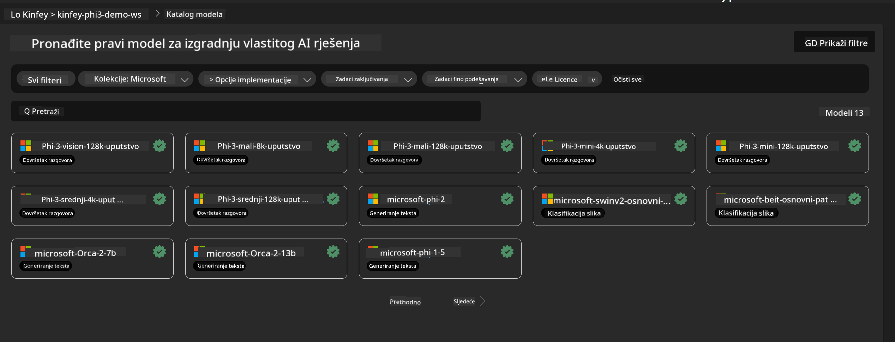
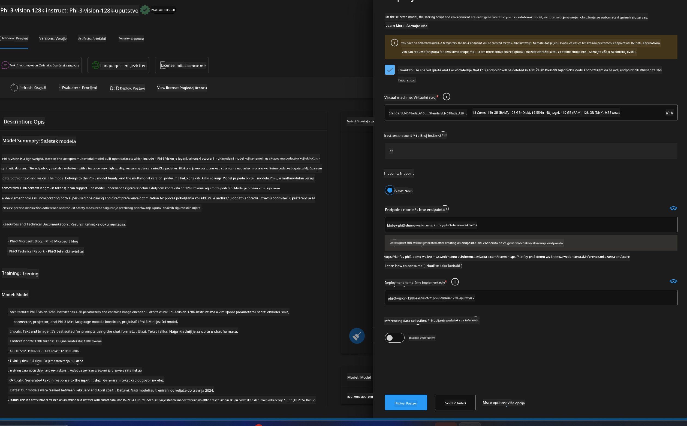
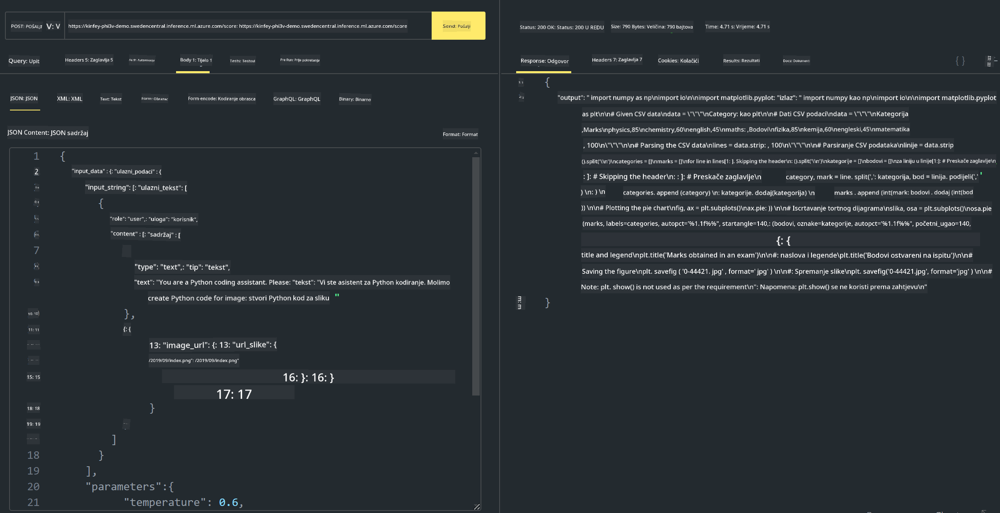

<!--
CO_OP_TRANSLATOR_METADATA:
{
  "original_hash": "20cb4e6ac1686248e8be913ccf6c2bc2",
  "translation_date": "2025-05-09T19:30:34+00:00",
  "source_file": "md/02.Application/02.Code/Phi3/VSCodeExt/HOL/AIPC/03.DeployPhi3VisionOnAzure.md",
  "language_code": "hr"
}
-->
# **Lab 3 - Deploy Phi-3-vision na Azure Machine Learning Service**

Koristimo NPU za dovršetak produkcijskog postavljanja lokalnog koda, a zatim želimo uvesti mogućnost integracije PHI-3-VISION kako bismo omogućili generiranje koda iz slika.

U ovom uvodu, brzo možemo izgraditi Model As Service Phi-3 Vision uslugu u Azure Machine Learning Service.

***Note***： Phi-3 Vision zahtijeva računalnu snagu za brže generiranje sadržaja. Potrebna nam je računalna snaga u oblaku kako bismo to postigli.


### **1. Kreirajte Azure Machine Learning Service**

Potrebno je kreirati Azure Machine Learning Service u Azure Portalu. Ako želite naučiti kako, posjetite ovu poveznicu [https://learn.microsoft.com/azure/machine-learning/quickstart-create-resources?view=azureml-api-2](https://learn.microsoft.com/azure/machine-learning/quickstart-create-resources?view=azureml-api-2)


### **2. Odaberite Phi-3 Vision u Azure Machine Learning Service**




### **3. Postavite Phi-3-Vision u Azure**





### **4. Testirajte Endpoint u Postmanu**





***Note***

1. Parametri koje šaljete moraju uključivati Authorization, azureml-model-deployment i Content-Type. Potrebno je provjeriti informacije o postavljanju da biste ih dobili.

2. Za slanje parametara, Phi-3-Vision treba poslati poveznicu slike. Molimo pogledajte metodu GPT-4-Vision za slanje parametara, kao što je

```json

{
  "input_data":{
    "input_string":[
      {
        "role":"user",
        "content":[ 
          {
            "type": "text",
            "text": "You are a Python coding assistant.Please create Python code for image "
          },
          {
              "type": "image_url",
              "image_url": {
                "url": "https://ajaytech.co/wp-content/uploads/2019/09/index.png"
              }
          }
        ]
      }
    ],
    "parameters":{
          "temperature": 0.6,
          "top_p": 0.9,
          "do_sample": false,
          "max_new_tokens": 2048
    }
  }
}

```

3. Pozovite **/score** koristeći Post metodu

**Čestitamo**! Uspješno ste dovršili brzo postavljanje PHI-3-VISION i isprobali kako generirati kod iz slika. Sljedeće, možemo graditi aplikacije u kombinaciji s NPU-ima i oblakom.

**Odricanje od odgovornosti**:  
Ovaj dokument je preveden pomoću AI prevoditeljskog servisa [Co-op Translator](https://github.com/Azure/co-op-translator). Iako težimo točnosti, imajte na umu da automatski prijevodi mogu sadržavati pogreške ili netočnosti. Izvorni dokument na izvornom jeziku treba smatrati službenim i autoritativnim izvorom. Za kritične informacije preporučuje se profesionalni ljudski prijevod. Ne snosimo odgovornost za bilo kakve nesporazume ili pogrešna tumačenja koja proizlaze iz korištenja ovog prijevoda.