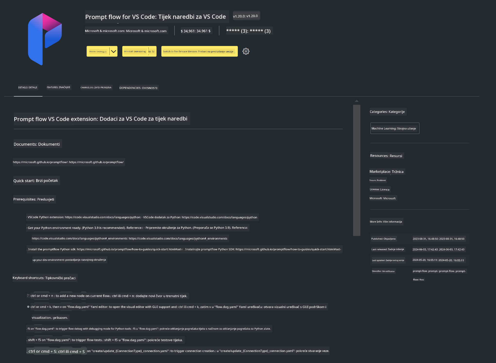

<!--
CO_OP_TRANSLATOR_METADATA:
{
  "original_hash": "4b16264917d9b93169745d92b8ce8c65",
  "translation_date": "2025-05-09T19:37:35+00:00",
  "source_file": "md/02.Application/02.Code/Phi3/VSCodeExt/HOL/Apple/01.Installations.md",
  "language_code": "hr"
}
-->
# **Lab 0 - Instalacija**

Kada uđemo u Lab, potrebno je konfigurirati odgovarajuće okruženje:


### **1. Python 3.11+**

Preporučuje se korištenje miniforge za konfiguraciju vašeg Python okruženja

Za konfiguraciju miniforge, pogledajte [https://github.com/conda-forge/miniforge](https://github.com/conda-forge/miniforge)

Nakon konfiguracije miniforge, pokrenite sljedeću naredbu u Power Shellu

```bash

conda create -n pyenv python==3.11.8 -y

conda activate pyenv

```


### **2. Instalacija Prompt flow SDK-a**

U Lab 1 koristimo Prompt flow, stoga trebate konfigurirati Prompt flow SDK.

```bash

pip install promptflow --upgrade

```

Promptflow sdk možete provjeriti ovom naredbom

```bash

pf --version

```

### **3. Instalirajte Visual Studio Code Prompt flow ekstenziju**



### **4. Appleov MLX Framework**

MLX je framework za istraživanje strojnog učenja na Apple siliciju, razvijen od strane Apple istraživanja strojnog učenja. Možete koristiti **Apple MLX framework** za ubrzavanje LLM / SLM s Apple Siliconom. Ako želite saznati više, pročitajte [https://github.com/microsoft/PhiCookBook/blob/main/md/01.Introduction/03/MLX_Inference.md](https://github.com/microsoft/PhiCookBook/blob/main/md/01.Introduction/03/MLX_Inference.md).

Instalirajte MLX framework biblioteku u bashu

```bash

pip install mlx-lm

```


### **5. Ostale Python biblioteke**

kreirajte requirements.txt i dodajte ovaj sadržaj

```txt

notebook
numpy 
scipy 
scikit-learn 
matplotlib 
pandas 
pillow 
graphviz

```


### **6. Instalirajte NVM**

instalirajte nvm u Powershellu

```bash

brew install nvm

```

instalirajte nodejs 18.20

```bash

nvm install 18.20.0

nvm use 18.20.0

```

### **7. Instalirajte Visual Studio Code podršku za razvoj**

```bash

npm install --global yo generator-code

```

Čestitamo! Uspješno ste konfigurirali SDK. Sljedeći korak je da nastavite s praktičnim zadacima.

**Odricanje od odgovornosti**:  
Ovaj dokument je preveden korištenjem AI usluge za prevođenje [Co-op Translator](https://github.com/Azure/co-op-translator). Iako težimo točnosti, imajte na umu da automatizirani prijevodi mogu sadržavati pogreške ili netočnosti. Izvorni dokument na izvornom jeziku treba smatrati službenim i autoritativnim izvorom. Za važne informacije preporučuje se profesionalni ljudski prijevod. Ne snosimo odgovornost za bilo kakva nesporazuma ili pogrešna tumačenja koja proizlaze iz korištenja ovog prijevoda.