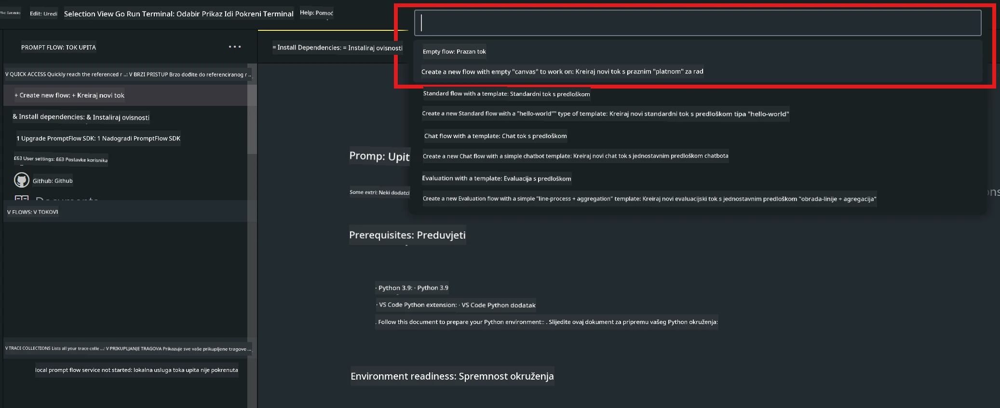
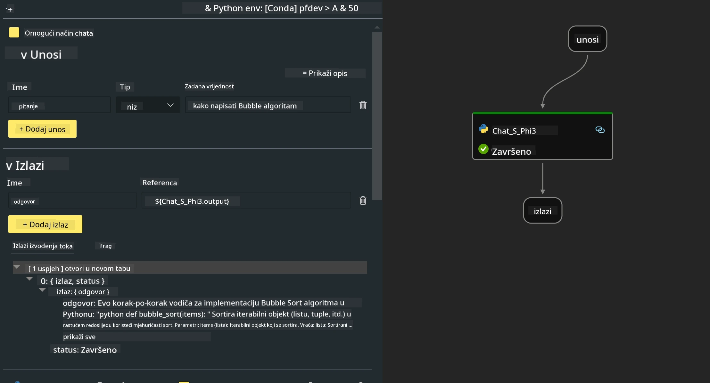
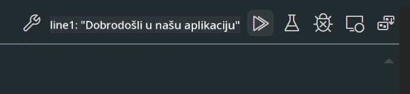

<!--
CO_OP_TRANSLATOR_METADATA:
{
  "original_hash": "3dbbf568625b1ee04b354c2dc81d3248",
  "translation_date": "2025-07-17T04:29:27+00:00",
  "source_file": "md/02.Application/02.Code/Phi3/VSCodeExt/HOL/Apple/02.PromptflowWithMLX.md",
  "language_code": "hr"
}
-->
# **Lab 2 - Pokretanje Prompt flow s Phi-3-mini u AIPC**

## **Što je Prompt flow**

Prompt flow je skup razvojnih alata dizajniranih za pojednostavljenje cjelokupnog razvojnog ciklusa AI aplikacija temeljenih na LLM-ovima, od ideje, prototipiranja, testiranja, evaluacije do produkcijskog postavljanja i nadzora. Omogućuje lakše upravljanje prompt inženjeringom i omogućuje izgradnju LLM aplikacija proizvodne kvalitete.

Uz prompt flow moći ćete:

- Kreirati tokove koji povezuju LLM-ove, promptove, Python kod i druge alate u izvršni radni tijek.

- Jednostavno otklanjati pogreške i iterirati tokove, posebno interakciju s LLM-ovima.

- Evaluirati tokove, izračunavati metrike kvalitete i performansi na većim skupovima podataka.

- Integrirati testiranje i evaluaciju u vaš CI/CD sustav kako biste osigurali kvalitetu toka.

- Jednostavno postaviti tokove na odabranu platformu za servisiranje ili integrirati u kod vaše aplikacije.

- (Opcionalno, ali preporučeno) Suradnja s timom koristeći cloud verziju Prompt flow u Azure AI.

## **Izgradnja generacijskih kodnih tokova na Apple Silicon**

***Note*** ：Ako niste dovršili instalaciju okruženja, molimo posjetite [Lab 0 -Installations](./01.Installations.md)

1. Otvorite Prompt flow ekstenziju u Visual Studio Code i kreirajte prazan projekt toka



2. Dodajte ulazne i izlazne parametre te dodajte Python kod kao novi tok



Možete se referirati na ovu strukturu (flow.dag.yaml) za izgradnju vašeg toka

```yaml

inputs:
  prompt:
    type: string
    default: Write python code for Fibonacci serie. Please use markdown as output
outputs:
  result:
    type: string
    reference: ${gen_code_by_phi3.output}
nodes:
- name: gen_code_by_phi3
  type: python
  source:
    type: code
    path: gen_code_by_phi3.py
  inputs:
    prompt: ${inputs.prompt}


```

3. Kvantizirajte phi-3-mini

Želimo bolje pokretati SLM na lokalnim uređajima. Općenito, kvantiziramo model (INT4, FP16, FP32)

```bash

python -m mlx_lm.convert --hf-path microsoft/Phi-3-mini-4k-instruct

```

**Note:** zadana mapa je mlx_model

4. Dodajte kod u ***Chat_With_Phi3.py***

```python


from promptflow import tool

from mlx_lm import load, generate


# The inputs section will change based on the arguments of the tool function, after you save the code
# Adding type to arguments and return value will help the system show the types properly
# Please update the function name/signature per need
@tool
def my_python_tool(prompt: str) -> str:

    model_id = './mlx_model_phi3_mini'

    model, tokenizer = load(model_id)

    # <|user|>\nWrite python code for Fibonacci serie. Please use markdown as output<|end|>\n<|assistant|>

    response = generate(model, tokenizer, prompt="<|user|>\n" + prompt  + "<|end|>\n<|assistant|>", max_tokens=2048, verbose=True)

    return response


```

4. Možete testirati tok iz Debug ili Run da provjerite radi li generacijski kod ispravno



5. Pokrenite tok kao razvojni API u terminalu

```

pf flow serve --source ./ --port 8080 --host localhost   

```

Možete ga testirati u Postman / Thunder Client

### **Note**

1. Prvo pokretanje traje dugo. Preporučuje se preuzimanje phi-3 modela preko Hugging face CLI.

2. S obzirom na ograničenu računalnu snagu Intel NPU-a, preporučuje se korištenje Phi-3-mini-4k-instruct.

3. Koristimo Intel NPU ubrzanje za kvantizaciju INT4 konverzije, ali ako ponovno pokrećete servis, potrebno je izbrisati cache i nc_workshop mape.

## **Resursi**

1. Naučite Promptflow [https://microsoft.github.io/promptflow/](https://microsoft.github.io/promptflow/)

2. Naučite Intel NPU Acceleration [https://github.com/intel/intel-npu-acceleration-library](https://github.com/intel/intel-npu-acceleration-library)

3. Primjer koda, preuzmite [Local NPU Agent Sample Code](../../../../../../../../../code/07.Lab/01/AIPC/local-npu-agent)

**Odricanje od odgovornosti**:  
Ovaj dokument je preveden korištenjem AI usluge za prevođenje [Co-op Translator](https://github.com/Azure/co-op-translator). Iako nastojimo postići točnost, imajte na umu da automatski prijevodi mogu sadržavati pogreške ili netočnosti. Izvorni dokument na izvornom jeziku treba smatrati autoritativnim izvorom. Za kritične informacije preporučuje se profesionalni ljudski prijevod. Ne snosimo odgovornost za bilo kakva nesporazuma ili pogrešna tumačenja koja proizlaze iz korištenja ovog prijevoda.