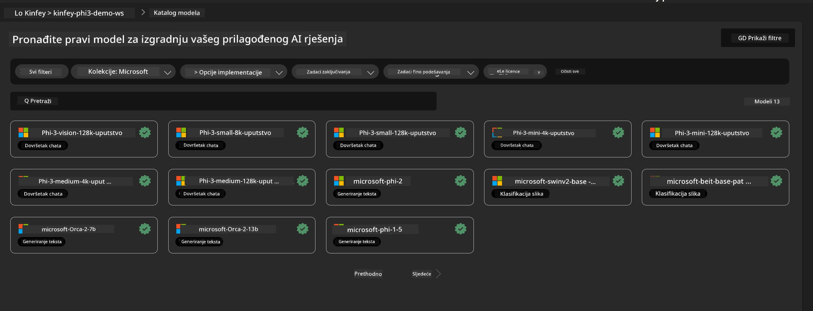
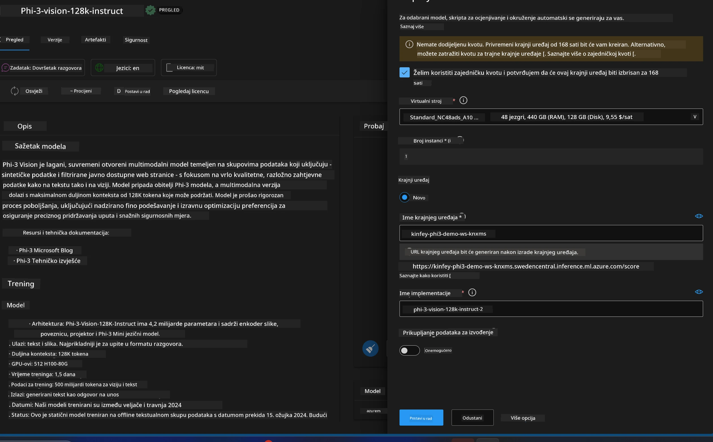
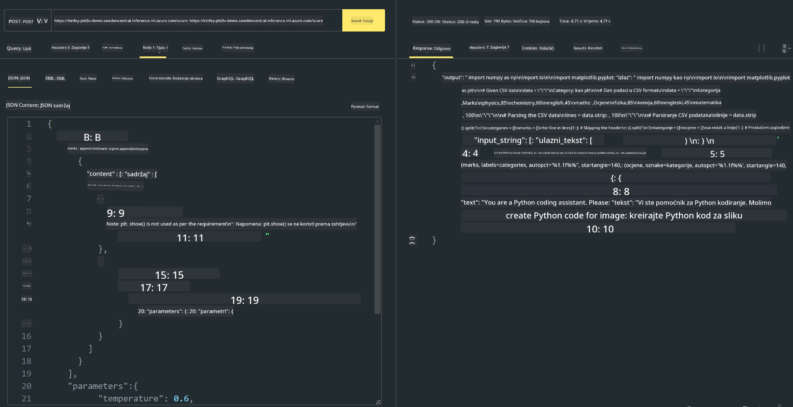

# **Laboratorij 3 - Implementacija Phi-3-vision na Azure Machine Learning Service**

Koristimo NPU za dovršetak produkcijske implementacije lokalnog koda, a zatim želimo omogućiti uvođenje PHI-3-VISION kroz njega kako bismo ostvarili generiranje koda iz slika.

U ovom uvodu možemo brzo izgraditi Model As Service Phi-3 Vision uslugu u Azure Machine Learning Service.

***Note***: Phi-3 Vision zahtijeva računalnu snagu za brže generiranje sadržaja. Potrebna nam je računalna snaga u oblaku da nam pomogne u tome.


### **1. Kreirajte Azure Machine Learning Service**

Potrebno je kreirati Azure Machine Learning Service u Azure Portalu. Ako želite naučiti kako, posjetite ovaj link [https://learn.microsoft.com/azure/machine-learning/quickstart-create-resources?view=azureml-api-2](https://learn.microsoft.com/azure/machine-learning/quickstart-create-resources?view=azureml-api-2)


### **2. Odaberite Phi-3 Vision u Azure Machine Learning Service**




### **3. Implementirajte Phi-3-Vision u Azure**





### **4. Testirajte Endpoint u Postmanu**





***Note***

1. Parametri koji se šalju moraju uključivati Authorization, azureml-model-deployment i Content-Type. Potrebno je provjeriti informacije o implementaciji da biste ih dobili.

2. Za prijenos parametara, Phi-3-Vision treba poslati poveznicu na sliku. Molimo pogledajte metodu GPT-4-Vision za prijenos parametara, na primjer

```json

{
  "input_data":{
    "input_string":[
      {
        "role":"user",
        "content":[ 
          {
            "type": "text",
            "text": "You are a Python coding assistant.Please create Python code for image "
          },
          {
              "type": "image_url",
              "image_url": {
                "url": "https://ajaytech.co/wp-content/uploads/2019/09/index.png"
              }
          }
        ]
      }
    ],
    "parameters":{
          "temperature": 0.6,
          "top_p": 0.9,
          "do_sample": false,
          "max_new_tokens": 2048
    }
  }
}

```

3. Pozovite **/score** koristeći Post metodu

**Čestitamo**! Uspješno ste dovršili brzu implementaciju PHI-3-VISION i isprobali kako koristiti slike za generiranje koda. Sljedeće možemo graditi aplikacije u kombinaciji s NPU-ima i oblakom.

**Odricanje od odgovornosti**:  
Ovaj dokument je preveden korištenjem AI usluge za prevođenje [Co-op Translator](https://github.com/Azure/co-op-translator). Iako nastojimo postići točnost, imajte na umu da automatski prijevodi mogu sadržavati pogreške ili netočnosti. Izvorni dokument na izvornom jeziku treba smatrati autoritativnim izvorom. Za kritične informacije preporučuje se profesionalni ljudski prijevod. Ne snosimo odgovornost za bilo kakve nesporazume ili pogrešna tumačenja koja proizlaze iz korištenja ovog prijevoda.