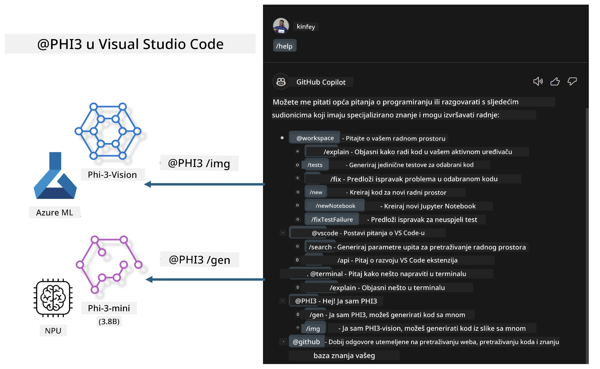

# **Izgradite vlastiti Visual Studio Code GitHub Copilot Chat s Microsoft Phi-3 obitelji**

Jeste li koristili workspace agenta u GitHub Copilot Chatu? Želite li izgraditi vlastitog agenta za kod vašeg tima? Ovaj praktični laboratorij nastoji spojiti open source model za izgradnju poslovnog agenta za kod na razini poduzeća.

## **Osnove**

### **Zašto odabrati Microsoft Phi-3**

Phi-3 je serija modela koja uključuje phi-3-mini, phi-3-small i phi-3-medium, bazirane na različitim parametrima treniranja za generiranje teksta, dovršavanje dijaloga i generiranje koda. Postoji i phi-3-vision baziran na Vision tehnologiji. Pogodan je za poduzeća ili različite timove za kreiranje offline generativnih AI rješenja.

Preporučujemo da pročitate ovaj link [https://github.com/microsoft/PhiCookBook/blob/main/md/01.Introduction/01/01.PhiFamily.md](https://github.com/microsoft/PhiCookBook/blob/main/md/01.Introduction/01/01.PhiFamily.md)

### **Microsoft GitHub Copilot Chat**

Ekstenzija GitHub Copilot Chat pruža vam chat sučelje koje vam omogućuje interakciju s GitHub Copilotom i dobivanje odgovora na pitanja vezana uz kodiranje izravno unutar VS Code-a, bez potrebe za pretraživanjem dokumentacije ili online foruma.

Copilot Chat može koristiti isticanje sintakse, uvlačenje i druge značajke formatiranja kako bi odgovor bio jasniji. Ovisno o vrsti pitanja korisnika, rezultat može sadržavati poveznice na kontekst koji je Copilot koristio za generiranje odgovora, poput izvornog koda ili dokumentacije, ili gumbe za pristup funkcionalnostima VS Code-a.

- Copilot Chat se integrira u vaš razvojni tijek i pruža pomoć tamo gdje vam je potrebna:

- Pokrenite inline chat razgovor izravno iz editora ili terminala za pomoć dok kodirate

- Koristite Chat prikaz za AI asistenta sa strane koji vam može pomoći u bilo kojem trenutku

- Pokrenite Quick Chat za brzo postavljanje pitanja i povratak na posao

GitHub Copilot Chat možete koristiti u različitim scenarijima, kao što su:

- Odgovaranje na pitanja o kodiranju kako najbolje riješiti problem

- Objašnjavanje tuđeg koda i predlaganje poboljšanja

- Predlaganje ispravaka koda

- Generiranje jedinica testova

- Generiranje dokumentacije koda

Preporučujemo da pročitate ovaj link [https://code.visualstudio.com/docs/copilot/copilot-chat](https://code.visualstudio.com/docs/copilot/copilot-chat?WT.mc_id=aiml-137032-kinfeylo)

###  **Microsoft GitHub Copilot Chat @workspace**

Korištenje **@workspace** u Copilot Chatu omogućuje vam postavljanje pitanja o cijeloj vašoj bazi koda. Na temelju pitanja, Copilot inteligentno pronalazi relevantne datoteke i simbole, koje zatim koristi u svom odgovoru kao poveznice i primjere koda.

Za odgovor na vaše pitanje, **@workspace** pretražuje iste izvore koje bi programer koristio prilikom navigacije kroz bazu koda u VS Code-u:

- Sve datoteke u workspaceu, osim onih koje su ignorirane u .gitignore datoteci

- Strukturu direktorija s ugniježđenim imenima mapa i datoteka

- GitHubov indeks pretraživanja koda, ako je workspace GitHub repozitorij indeksiran kod pretraživanja

- Simbole i definicije u workspaceu

- Trenutno odabrani tekst ili vidljivi tekst u aktivnom editoru

Napomena: .gitignore se zanemaruje ako imate otvorenu datoteku ili odabrani tekst unutar ignorirane datoteke.

Preporučujemo da pročitate ovaj link [[https://code.visualstudio.com/docs/copilot/copilot-chat](https://code.visualstudio.com/docs/copilot/workspace-context?WT.mc_id=aiml-137032-kinfeylo)]

## **Saznajte više o ovom laboratoriju**

GitHub Copilot je znatno poboljšao učinkovitost programiranja u poduzećima, a svako poduzeće želi prilagoditi relevantne funkcije GitHub Copilota. Mnoge tvrtke su prilagodile ekstenzije slične GitHub Copilotu na temelju vlastitih poslovnih scenarija i open source modela. Za poduzeća su prilagođene ekstenzije lakše za kontrolu, ali to može utjecati na korisničko iskustvo. GitHub Copilot ima snažnije funkcije za opće scenarije i profesionalnost. Ako se iskustvo može održati dosljednim, bolje je prilagoditi vlastitu ekstenziju poduzeća. GitHub Copilot Chat pruža relevantne API-je za poduzeća za proširenje chat iskustva. Održavanje dosljednog iskustva uz prilagođene funkcije pruža bolje korisničko iskustvo.

Ovaj laboratorij uglavnom koristi Phi-3 model u kombinaciji s lokalnim NPU-om i Azure hibridom za izgradnju prilagođenog agenta u GitHub Copilot Chatu ***@PHI3*** koji pomaže razvojnim programerima u poduzeću u dovršavanju generiranja koda ***(@PHI3 /gen)*** i generiranju koda na temelju slika ***(@PHI3 /img)***.

### ***Napomena:***

Ovaj laboratorij je trenutno implementiran na AIPC Intel CPU i Apple Silicon platformama. Nastavit ćemo ažurirati verziju za Qualcomm NPU.

## **Laboratorij**

| Naziv | Opis | AIPC | Apple |
| ------------ | ----------- | -------- |-------- |
| Lab0 - Instalacije(✅) | Konfiguracija i instalacija potrebnih okruženja i alata | [Go](./HOL/AIPC/01.Installations.md) |[Go](./HOL/Apple/01.Installations.md) |
| Lab1 - Pokretanje Prompt flow s Phi-3-mini (✅) | U kombinaciji s AIPC / Apple Silicon, korištenje lokalnog NPU-a za generiranje koda putem Phi-3-mini | [Go](./HOL/AIPC/02.PromptflowWithNPU.md) |  [Go](./HOL/Apple/02.PromptflowWithMLX.md) |
| Lab2 - Deploy Phi-3-vision na Azure Machine Learning Service(✅) | Generiranje koda implementacijom Model Cataloga Azure Machine Learning Service - Phi-3-vision slika | [Go](./HOL/AIPC/03.DeployPhi3VisionOnAzure.md) |[Go](./HOL/Apple/03.DeployPhi3VisionOnAzure.md) |
| Lab3 - Kreirajte @phi-3 agenta u GitHub Copilot Chatu(✅)  | Kreiranje prilagođenog Phi-3 agenta u GitHub Copilot Chatu za dovršavanje generiranja koda, generiranje grafova, RAG i slično | [Go](./HOL/AIPC/04.CreatePhi3AgentInVSCode.md) | [Go](./HOL/Apple/04.CreatePhi3AgentInVSCode.md) |
| Primjer koda (✅)  | Preuzimanje primjera koda | [Go](../../../../../../../code/07.Lab/01/AIPC) | [Go](../../../../../../../code/07.Lab/01/Apple) |

## **Resursi**

1. Phi-3 Cookbook [https://github.com/microsoft/Phi-3CookBook](https://github.com/microsoft/Phi-3CookBook)

2. Saznajte više o GitHub Copilotu [https://learn.microsoft.com/training/paths/copilot/](https://learn.microsoft.com/training/paths/copilot/?WT.mc_id=aiml-137032-kinfeylo)

3. Saznajte više o GitHub Copilot Chatu [https://learn.microsoft.com/training/paths/accelerate-app-development-using-github-copilot/](https://learn.microsoft.com/training/paths/accelerate-app-development-using-github-copilot/?WT.mc_id=aiml-137032-kinfeylo)

4. Saznajte više o GitHub Copilot Chat API-ju [https://code.visualstudio.com/api/extension-guides/chat](https://code.visualstudio.com/api/extension-guides/chat?WT.mc_id=aiml-137032-kinfeylo)

5. Saznajte više o Azure AI Foundry [https://learn.microsoft.com/training/paths/create-custom-copilots-ai-studio/](https://learn.microsoft.com/training/paths/create-custom-copilots-ai-studio/?WT.mc_id=aiml-137032-kinfeylo)

6. Saznajte više o Model Catalogu Azure AI Foundry [https://learn.microsoft.com/azure/ai-studio/how-to/model-catalog-overview](https://learn.microsoft.com/azure/ai-studio/how-to/model-catalog-overview)

**Odricanje od odgovornosti**:  
Ovaj dokument je preveden korištenjem AI usluge za prevođenje [Co-op Translator](https://github.com/Azure/co-op-translator). Iako težimo točnosti, imajte na umu da automatski prijevodi mogu sadržavati pogreške ili netočnosti. Izvorni dokument na izvornom jeziku treba smatrati autoritativnim izvorom. Za kritične informacije preporučuje se profesionalni ljudski prijevod. Ne snosimo odgovornost za bilo kakve nesporazume ili pogrešna tumačenja koja proizlaze iz korištenja ovog prijevoda.