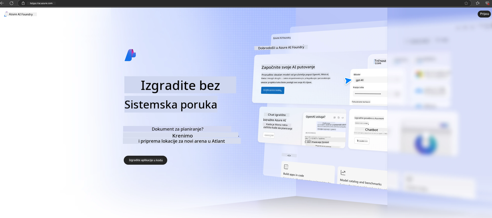

# **Korištenje Phi-3 u Azure AI Foundry**

S razvojem Generativne AI, želimo koristiti jedinstvenu platformu za upravljanje različitim LLM i SLM modelima, integraciju podataka poduzeća, fine-tuning/RAG operacije te evaluaciju različitih poslovnih procesa nakon integracije LLM i SLM, kako bi se generativna AI bolje implementirala u pametne aplikacije. [Azure AI Foundry](https://ai.azure.com) je platforma za generativnu AI na razini poduzeća.

Uz Azure AI Foundry možete ocjenjivati odgovore velikih jezičnih modela (LLM) i orkestrirati komponente aplikacija s prompt flow za bolje performanse. Platforma omogućuje skalabilnost za jednostavnu transformaciju prototipova u punopravnu produkciju. Kontinuirano praćenje i usavršavanje podržavaju dugoročni uspjeh.

Phi-3 model možemo brzo implementirati na Azure AI Foundry kroz jednostavne korake, a zatim koristiti Azure AI Foundry za dovršetak Playground/Chat, fine-tuning, evaluaciju i druge povezane zadatke vezane uz Phi-3.

## **1. Priprema**

Ako već imate instaliran [Azure Developer CLI](https://learn.microsoft.com/azure/developer/azure-developer-cli/overview?WT.mc_id=aiml-138114-kinfeylo) na svom računalu, korištenje ovog predloška je jednostavno kao pokretanje ove naredbe u novom direktoriju.

## Ručno kreiranje

Kreiranje Microsoft Azure AI Foundry projekta i huba odličan je način za organizaciju i upravljanje vašim AI radom. Evo vodiča korak po korak za početak:

### Kreiranje projekta u Azure AI Foundry

1. **Idite na Azure AI Foundry**: Prijavite se u Azure AI Foundry portal.
2. **Kreirajte projekt**:
   - Ako ste unutar nekog projekta, odaberite "Azure AI Foundry" u gornjem lijevom kutu stranice da biste otišli na početnu stranicu.
   - Odaberite "+ Create project".
   - Unesite naziv projekta.
   - Ako imate hub, on će biti odabran prema zadanim postavkama. Ako imate pristup više hubova, možete odabrati drugi iz padajućeg izbornika. Ako želite kreirati novi hub, odaberite "Create new hub" i unesite naziv.
   - Odaberite "Create".

### Kreiranje huba u Azure AI Foundry

1. **Idite na Azure AI Foundry**: Prijavite se sa svojim Azure računom.
2. **Kreirajte hub**:
   - Odaberite Management center iz lijevog izbornika.
   - Odaberite "All resources", zatim strelicu prema dolje pored "+ New project" i odaberite "+ New hub".
   - U dijalogu "Create a new hub" unesite naziv huba (npr. contoso-hub) i prilagodite ostala polja po želji.
   - Odaberite "Next", pregledajte informacije, zatim odaberite "Create".

Za detaljnije upute možete pogledati službenu [Microsoft dokumentaciju](https://learn.microsoft.com/azure/ai-studio/how-to/create-projects).

Nakon uspješnog kreiranja, možete pristupiti studiju koji ste napravili putem [ai.azure.com](https://ai.azure.com/)

Na jednom AI Foundry može postojati više projekata. Kreirajte projekt u AI Foundry kao pripremu.

Kreirajte Azure AI Foundry [QuickStarts](https://learn.microsoft.com/azure/ai-studio/quickstarts/get-started-code)

## **2. Implementacija Phi modela u Azure AI Foundry**

Kliknite na opciju Explore unutar projekta da uđete u Model Catalog i odaberete Phi-3

Odaberite Phi-3-mini-4k-instruct

Kliknite 'Deploy' za implementaciju Phi-3-mini-4k-instruct modela

> [!NOTE]
>
> Prilikom implementacije možete odabrati računalnu snagu

## **3. Playground Chat Phi u Azure AI Foundry**

Idite na stranicu implementacije, odaberite Playground i razgovarajte s Phi-3 u Azure AI Foundry

## **4. Implementacija modela iz Azure AI Foundry**

Za implementaciju modela iz Azure Model Catalog slijedite ove korake:

- Prijavite se u Azure AI Foundry.
- Odaberite model koji želite implementirati iz Azure AI Foundry model kataloga.
- Na stranici s detaljima modela odaberite Deploy, zatim Serverless API s Azure AI Content Safety.
- Odaberite projekt u kojem želite implementirati modele. Da biste koristili Serverless API, vaš workspace mora biti u regiji East US 2 ili Sweden Central. Možete prilagoditi naziv implementacije.
- U čarobnjaku za implementaciju odaberite Pricing and terms da biste saznali o cijenama i uvjetima korištenja.
- Odaberite Deploy. Pričekajte dok implementacija ne bude spremna i dok ne budete preusmjereni na stranicu Deployments.
- Odaberite Open in playground za početak interakcije s modelom.
- Možete se vratiti na stranicu Deployments, odabrati implementaciju i zabilježiti Target URL i Secret Key, koje možete koristiti za pozivanje implementacije i generiranje rezultata.
- Detalje o endpointu, URL-u i pristupnim ključevima uvijek možete pronaći u kartici Build pod sekcijom Deployments.

> [!NOTE]
> Imajte na umu da vaš račun mora imati Azure AI Developer ulogu s odgovarajućim dopuštenjima na Resource Group da biste mogli izvršiti ove korake.

## **5. Korištenje Phi API-ja u Azure AI Foundry**

Možete pristupiti https://{Your project name}.region.inference.ml.azure.com/swagger.json putem Postman GET zahtjeva i kombinirati ga s Key kako biste saznali dostupne sučelja.

Vrlo jednostavno možete dobiti parametre zahtjeva, kao i parametre odgovora.

**Odricanje od odgovornosti**:  
Ovaj dokument je preveden korištenjem AI usluge za prevođenje [Co-op Translator](https://github.com/Azure/co-op-translator). Iako nastojimo postići točnost, imajte na umu da automatski prijevodi mogu sadržavati pogreške ili netočnosti. Izvorni dokument na izvornom jeziku treba smatrati autoritativnim izvorom. Za kritične informacije preporučuje se profesionalni ljudski prijevod. Ne snosimo odgovornost za bilo kakva nesporazuma ili pogrešna tumačenja koja proizlaze iz korištenja ovog prijevoda.