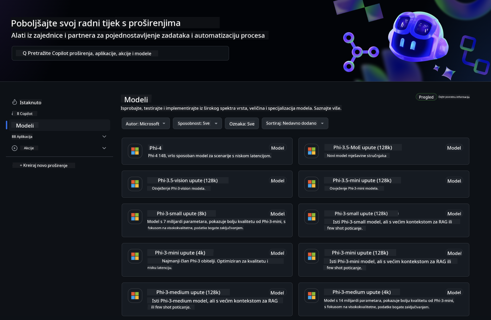
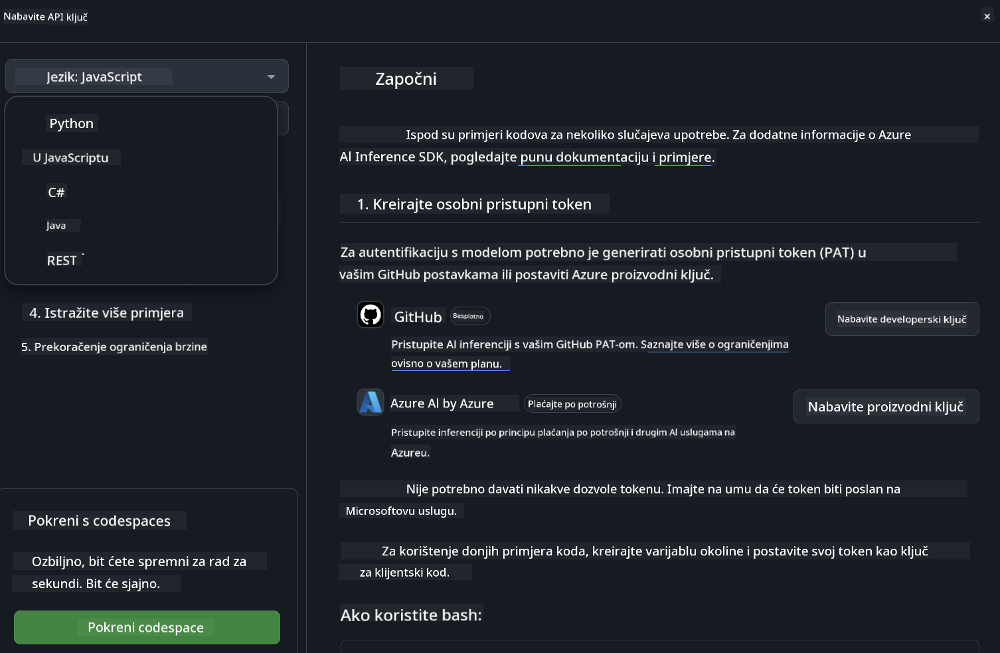
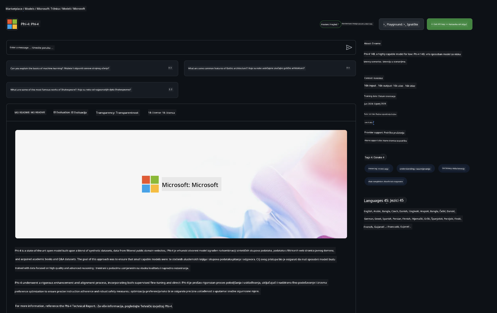

<!--
CO_OP_TRANSLATOR_METADATA:
{
  "original_hash": "5113634b77370af6790f9697d5d7de90",
  "translation_date": "2025-07-17T05:42:44+00:00",
  "source_file": "md/02.QuickStart/GitHubModel_QuickStart.md",
  "language_code": "hr"
}
-->
## GitHub modeli - ograničena javna beta

Dobrodošli na [GitHub Models](https://github.com/marketplace/models)! Sve je spremno za istraživanje AI modela hostanih na Azure AI.



Za više informacija o modelima dostupnim na GitHub Models, pogledajte [GitHub Model Marketplace](https://github.com/marketplace/models)

## Dostupni modeli

Svaki model ima vlastiti playground i primjere koda


### Phi-3 modeli u GitHub Model katalogu

[Phi-3-Medium-128k-Instruct](https://github.com/marketplace/models/azureml/Phi-3-medium-128k-instruct)

[Phi-3-medium-4k-instruct](https://github.com/marketplace/models/azureml/Phi-3-medium-4k-instruct)

[Phi-3-mini-128k-instruct](https://github.com/marketplace/models/azureml/Phi-3-mini-128k-instruct)

[Phi-3-mini-4k-instruct](https://github.com/marketplace/models/azureml/Phi-3-mini-4k-instruct)

[Phi-3-small-128k-instruct](https://github.com/marketplace/models/azureml/Phi-3-small-128k-instruct)

[Phi-3-small-8k-instruct](https://github.com/marketplace/models/azureml/Phi-3-small-8k-instruct)

## Početak rada

Postoji nekoliko osnovnih primjera spremnih za pokretanje. Možete ih pronaći u direktoriju samples. Ako želite odmah prijeći na svoj omiljeni jezik, primjere možete pronaći u sljedećim jezicima:

- Python
- JavaScript
- cURL

Također postoji namjensko Codespaces okruženje za pokretanje primjera i modela.



## Primjeri koda

Ispod su primjeri koda za nekoliko slučajeva upotrebe. Za dodatne informacije o Azure AI Inference SDK, pogledajte kompletnu dokumentaciju i primjere.

## Postavljanje

1. Kreirajte personal access token  
Nije potrebno davati nikakve dozvole tokenu. Imajte na umu da će token biti poslan Microsoftovoj usluzi.

Za korištenje donjih primjera koda, kreirajte varijablu okruženja i postavite svoj token kao ključ za klijentski kod.

Ako koristite bash:  
```
export GITHUB_TOKEN="<your-github-token-goes-here>"
```  
Ako ste u powershellu:  

```
$Env:GITHUB_TOKEN="<your-github-token-goes-here>"
```  

Ako koristite Windows command prompt:  

```
set GITHUB_TOKEN=<your-github-token-goes-here>
```  

## Python primjer

### Instalirajte ovisnosti  
Instalirajte Azure AI Inference SDK koristeći pip (zahtijeva: Python >=3.8):

```
pip install azure-ai-inference
```  
### Pokrenite osnovni primjer koda

Ovaj primjer prikazuje osnovni poziv chat completion API-ja. Koristi GitHub AI model inference endpoint i vaš GitHub token. Poziv je sinkroni.

```
import os
from azure.ai.inference import ChatCompletionsClient
from azure.ai.inference.models import SystemMessage, UserMessage
from azure.core.credentials import AzureKeyCredential

endpoint = "https://models.inference.ai.azure.com"
# Replace Model_Name 
model_name = "Phi-3-small-8k-instruct"
token = os.environ["GITHUB_TOKEN"]

client = ChatCompletionsClient(
    endpoint=endpoint,
    credential=AzureKeyCredential(token),
)

response = client.complete(
    messages=[
        SystemMessage(content="You are a helpful assistant."),
        UserMessage(content="What is the capital of France?"),
    ],
    model=model_name,
    temperature=1.,
    max_tokens=1000,
    top_p=1.
)

print(response.choices[0].message.content)
```

### Pokrenite višekratni razgovor

Ovaj primjer prikazuje višekratni razgovor s chat completion API-jem. Kada koristite model za chat aplikaciju, morate upravljati poviješću razgovora i slati najnovije poruke modelu.

```
import os
from azure.ai.inference import ChatCompletionsClient
from azure.ai.inference.models import AssistantMessage, SystemMessage, UserMessage
from azure.core.credentials import AzureKeyCredential

token = os.environ["GITHUB_TOKEN"]
endpoint = "https://models.inference.ai.azure.com"
# Replace Model_Name
model_name = "Phi-3-small-8k-instruct"

client = ChatCompletionsClient(
    endpoint=endpoint,
    credential=AzureKeyCredential(token),
)

messages = [
    SystemMessage(content="You are a helpful assistant."),
    UserMessage(content="What is the capital of France?"),
    AssistantMessage(content="The capital of France is Paris."),
    UserMessage(content="What about Spain?"),
]

response = client.complete(messages=messages, model=model_name)

print(response.choices[0].message.content)
```

### Strimirajte izlaz

Za bolje korisničko iskustvo, poželjet ćete strimirati odgovor modela kako bi se prvi token pojavio brzo i izbjegli čekanje na duge odgovore.

```
import os
from azure.ai.inference import ChatCompletionsClient
from azure.ai.inference.models import SystemMessage, UserMessage
from azure.core.credentials import AzureKeyCredential

token = os.environ["GITHUB_TOKEN"]
endpoint = "https://models.inference.ai.azure.com"
# Replace Model_Name
model_name = "Phi-3-small-8k-instruct"

client = ChatCompletionsClient(
    endpoint=endpoint,
    credential=AzureKeyCredential(token),
)

response = client.complete(
    stream=True,
    messages=[
        SystemMessage(content="You are a helpful assistant."),
        UserMessage(content="Give me 5 good reasons why I should exercise every day."),
    ],
    model=model_name,
)

for update in response:
    if update.choices:
        print(update.choices[0].delta.content or "", end="")

client.close()
```  
## JavaScript

### Instalirajte ovisnosti

Instalirajte Node.js.

Kopirajte sljedeće retke teksta i spremite ih kao datoteku package.json u svoj direktorij.

```
{
  "type": "module",
  "dependencies": {
    "@azure-rest/ai-inference": "latest",
    "@azure/core-auth": "latest",
    "@azure/core-sse": "latest"
  }
}
```

Napomena: @azure/core-sse je potreban samo ako strimirate odgovor chat completiona.

Otvorite terminal u ovom direktoriju i pokrenite npm install.

Za svaki od donjih primjera koda, kopirajte sadržaj u datoteku sample.js i pokrenite s node sample.js.

### Pokrenite osnovni primjer koda

Ovaj primjer prikazuje osnovni poziv chat completion API-ja. Koristi GitHub AI model inference endpoint i vaš GitHub token. Poziv je sinkroni.

```
import ModelClient from "@azure-rest/ai-inference";
import { AzureKeyCredential } from "@azure/core-auth";

const token = process.env["GITHUB_TOKEN"];
const endpoint = "https://models.inference.ai.azure.com";
// Update your modelname
const modelName = "Phi-3-small-8k-instruct";

export async function main() {

  const client = new ModelClient(endpoint, new AzureKeyCredential(token));

  const response = await client.path("/chat/completions").post({
    body: {
      messages: [
        { role:"system", content: "You are a helpful assistant." },
        { role:"user", content: "What is the capital of France?" }
      ],
      model: modelName,
      temperature: 1.,
      max_tokens: 1000,
      top_p: 1.
    }
  });

  if (response.status !== "200") {
    throw response.body.error;
  }
  console.log(response.body.choices[0].message.content);
}

main().catch((err) => {
  console.error("The sample encountered an error:", err);
});
```

### Pokrenite višekratni razgovor

Ovaj primjer prikazuje višekratni razgovor s chat completion API-jem. Kada koristite model za chat aplikaciju, morate upravljati poviješću razgovora i slati najnovije poruke modelu.

```
import ModelClient from "@azure-rest/ai-inference";
import { AzureKeyCredential } from "@azure/core-auth";

const token = process.env["GITHUB_TOKEN"];
const endpoint = "https://models.inference.ai.azure.com";
// Update your modelname
const modelName = "Phi-3-small-8k-instruct";

export async function main() {

  const client = new ModelClient(endpoint, new AzureKeyCredential(token));

  const response = await client.path("/chat/completions").post({
    body: {
      messages: [
        { role: "system", content: "You are a helpful assistant." },
        { role: "user", content: "What is the capital of France?" },
        { role: "assistant", content: "The capital of France is Paris." },
        { role: "user", content: "What about Spain?" },
      ],
      model: modelName,
    }
  });

  if (response.status !== "200") {
    throw response.body.error;
  }

  for (const choice of response.body.choices) {
    console.log(choice.message.content);
  }
}

main().catch((err) => {
  console.error("The sample encountered an error:", err);
});
```

### Strimirajte izlaz  
Za bolje korisničko iskustvo, poželjet ćete strimirati odgovor modela kako bi se prvi token pojavio brzo i izbjegli čekanje na duge odgovore.

```
import ModelClient from "@azure-rest/ai-inference";
import { AzureKeyCredential } from "@azure/core-auth";
import { createSseStream } from "@azure/core-sse";

const token = process.env["GITHUB_TOKEN"];
const endpoint = "https://models.inference.ai.azure.com";
// Update your modelname
const modelName = "Phi-3-small-8k-instruct";

export async function main() {

  const client = new ModelClient(endpoint, new AzureKeyCredential(token));

  const response = await client.path("/chat/completions").post({
    body: {
      messages: [
        { role: "system", content: "You are a helpful assistant." },
        { role: "user", content: "Give me 5 good reasons why I should exercise every day." },
      ],
      model: modelName,
      stream: true
    }
  }).asNodeStream();

  const stream = response.body;
  if (!stream) {
    throw new Error("The response stream is undefined");
  }

  if (response.status !== "200") {
    stream.destroy();
    throw new Error(`Failed to get chat completions, http operation failed with ${response.status} code`);
  }

  const sseStream = createSseStream(stream);

  for await (const event of sseStream) {
    if (event.data === "[DONE]") {
      return;
    }
    for (const choice of (JSON.parse(event.data)).choices) {
        process.stdout.write(choice.delta?.content ?? ``);
    }
  }
}

main().catch((err) => {
  console.error("The sample encountered an error:", err);
});
```

## REST

### Pokrenite osnovni primjer koda

Zalijepite sljedeće u shell:

```
curl -X POST "https://models.inference.ai.azure.com/chat/completions" \
    -H "Content-Type: application/json" \
    -H "Authorization: Bearer $GITHUB_TOKEN" \
    -d '{
        "messages": [
            {
                "role": "system",
                "content": "You are a helpful assistant."
            },
            {
                "role": "user",
                "content": "What is the capital of France?"
            }
        ],
        "model": "Phi-3-small-8k-instruct"
    }'
```  
### Pokrenite višekratni razgovor

Pozovite chat completion API i proslijedite povijest razgovora:

```
curl -X POST "https://models.inference.ai.azure.com/chat/completions" \
    -H "Content-Type: application/json" \
    -H "Authorization: Bearer $GITHUB_TOKEN" \
    -d '{
        "messages": [
            {
                "role": "system",
                "content": "You are a helpful assistant."
            },
            {
                "role": "user",
                "content": "What is the capital of France?"
            },
            {
                "role": "assistant",
                "content": "The capital of France is Paris."
            },
            {
                "role": "user",
                "content": "What about Spain?"
            }
        ],
        "model": "Phi-3-small-8k-instruct"
    }'
```  
### Strimirajte izlaz

Ovo je primjer poziva endpointa i strimiranja odgovora.

```
curl -X POST "https://models.inference.ai.azure.com/chat/completions" \
    -H "Content-Type: application/json" \
    -H "Authorization: Bearer $GITHUB_TOKEN" \
    -d '{
        "messages": [
            {
                "role": "system",
                "content": "You are a helpful assistant."
            },
            {
                "role": "user",
                "content": "Give me 5 good reasons why I should exercise every day."
            }
        ],
        "stream": true,
        "model": "Phi-3-small-8k-instruct"
    }'
```

## BESPLATNA upotreba i ograničenja za GitHub modele



[Ograničenja brzine za playground i besplatnu API upotrebu](https://docs.github.com/en/github-models/prototyping-with-ai-models#rate-limits) namijenjena su da vam pomognu u eksperimentiranju s modelima i prototipiranju AI aplikacija. Za korištenje izvan tih ograničenja i za skaliranje vaše aplikacije, morate osigurati resurse iz Azure računa i autentificirati se preko njega umjesto preko vašeg GitHub personal access tokena. Ne morate mijenjati ništa drugo u svom kodu. Koristite ovaj link da saznate kako prijeći granice besplatnog sloja u Azure AI.

### Napomene

Imajte na umu da kada komunicirate s modelom, eksperimentirate s AI-jem, pa su moguće pogreške u sadržaju.

Ova značajka podliježe različitim ograničenjima (uključujući broj zahtjeva po minuti, zahtjeve po danu, tokene po zahtjevu i istovremene zahtjeve) i nije namijenjena za produkcijsku upotrebu.

GitHub Models koristi Azure AI Content Safety. Ovi filteri se ne mogu isključiti kao dio GitHub Models iskustva. Ako odlučite koristiti modele kroz plaćenu uslugu, molimo konfigurirajte svoje filtere sadržaja prema svojim potrebama.

Ova usluga je podložna GitHub Pre-release uvjetima.

**Odricanje od odgovornosti**:  
Ovaj dokument je preveden korištenjem AI usluge za prevođenje [Co-op Translator](https://github.com/Azure/co-op-translator). Iako težimo točnosti, imajte na umu da automatski prijevodi mogu sadržavati pogreške ili netočnosti. Izvorni dokument na izvornom jeziku treba smatrati službenim i autoritativnim izvorom. Za važne informacije preporučuje se profesionalni ljudski prijevod. Ne snosimo odgovornost za bilo kakva nesporazuma ili pogrešna tumačenja koja proizlaze iz korištenja ovog prijevoda.