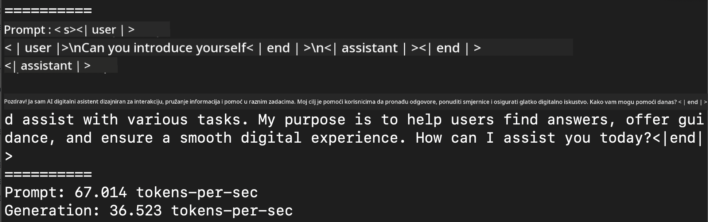
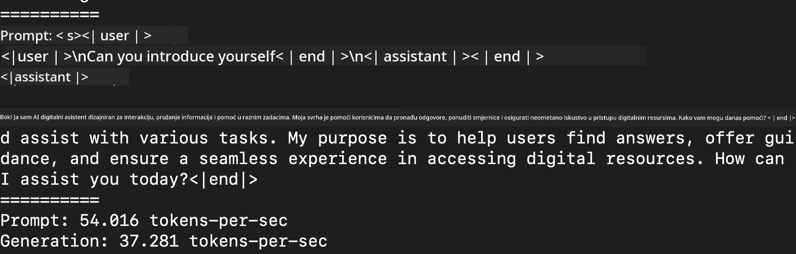
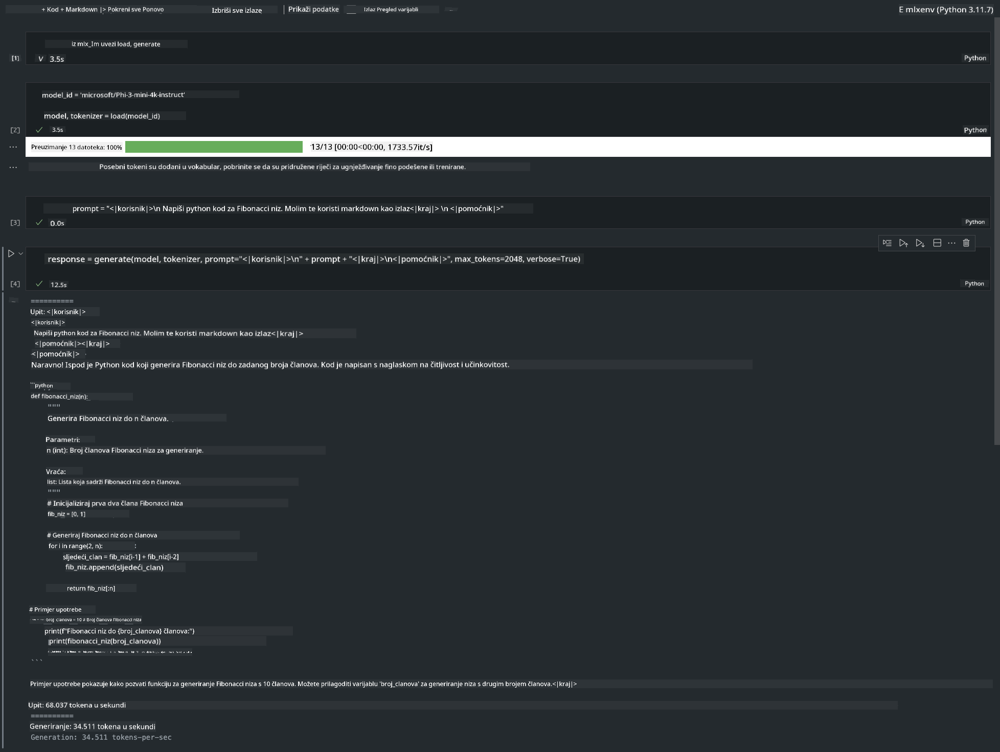

<!--
CO_OP_TRANSLATOR_METADATA:
{
  "original_hash": "dcb656f3d206fc4968e236deec5d4384",
  "translation_date": "2025-05-09T22:34:00+00:00",
  "source_file": "md/03.FineTuning/03.Inference/MLX_Inference.md",
  "language_code": "hr"
}
-->
# **Inference Phi-3 s Apple MLX Frameworkom**

## **Što je MLX Framework**

MLX je okvir za rad s nizovima za istraživanje strojnog učenja na Apple siliciju, razvijen od strane Apple istraživača strojnog učenja.

MLX je dizajniran od strane istraživača strojnog učenja za istraživače strojnog učenja. Okvir je namijenjen da bude jednostavan za korištenje, ali istovremeno učinkovit za treniranje i implementaciju modela. Sam dizajn okvira je također konceptualno jednostavan. Namjera nam je olakšati istraživačima da prošire i unaprijede MLX s ciljem brzog ispitivanja novih ideja.

LLM-ovi se mogu ubrzati na Apple Silicon uređajima pomoću MLX-a, a modeli se mogu vrlo praktično pokretati lokalno.

## **Korištenje MLX-a za inferenciju Phi-3-mini**

### **1. Postavljanje MLX okruženja**

1. Python 3.11.x  
2. Instalirajte MLX Library  


```bash

pip install mlx-lm

```

### **2. Pokretanje Phi-3-mini u Terminalu s MLX-om**


```bash

python -m mlx_lm.generate --model microsoft/Phi-3-mini-4k-instruct --max-token 2048 --prompt  "<|user|>\nCan you introduce yourself<|end|>\n<|assistant|>"

```

Rezultat (moje okruženje je Apple M1 Max, 64GB) je



### **3. Kvantizacija Phi-3-mini s MLX-om u Terminalu**


```bash

python -m mlx_lm.convert --hf-path microsoft/Phi-3-mini-4k-instruct

```

***Note：*** Model se može kvantizirati pomoću mlx_lm.convert, a zadana kvantizacija je INT4. Ovaj primjer kvantizira Phi-3-mini u INT4.

Model se može kvantizirati pomoću mlx_lm.convert, a zadana kvantizacija je INT4. Ovaj primjer kvantizira Phi-3-mini u INT4. Nakon kvantizacije, model će biti pohranjen u zadani direktorij ./mlx_model

Model kvantiziran s MLX-om možemo testirati iz terminala


```bash

python -m mlx_lm.generate --model ./mlx_model/ --max-token 2048 --prompt  "<|user|>\nCan you introduce yourself<|end|>\n<|assistant|>"

```

Rezultat je




### **4. Pokretanje Phi-3-mini s MLX-om u Jupyter Notebooku**




***Note:*** Molimo pročitajte ovaj primjer [kliknite ovaj link](../../../../../code/03.Inference/MLX/MLX_DEMO.ipynb)


## **Resursi**

1. Saznajte više o Apple MLX Frameworku [https://ml-explore.github.io](https://ml-explore.github.io/mlx/build/html/index.html)

2. Apple MLX GitHub Repo [https://github.com/ml-explore](https://github.com/ml-explore)

**Odricanje od odgovornosti**:  
Ovaj dokument je preveden korištenjem AI usluge za prevođenje [Co-op Translator](https://github.com/Azure/co-op-translator). Iako težimo točnosti, imajte na umu da automatski prijevodi mogu sadržavati pogreške ili netočnosti. Izvorni dokument na izvornom jeziku treba smatrati autoritativnim izvorom. Za kritične informacije preporučuje se profesionalni ljudski prijevod. Ne snosimo odgovornost za bilo kakva nesporazuma ili pogrešna tumačenja koja proizlaze iz korištenja ovog prijevoda.