<!--
CO_OP_TRANSLATOR_METADATA:
{
  "original_hash": "c1559c5af6caccf6f623fd43a6b3a9a3",
  "translation_date": "2025-07-17T06:15:34+00:00",
  "source_file": "md/03.FineTuning/FineTuning_AIFoundry.md",
  "language_code": "hr"
}
-->
# Fino podešavanje Phi-3 s Azure AI Foundry

Pogledajmo kako fino podesiti Microsoftov jezični model Phi-3 Mini koristeći Azure AI Foundry. Fino podešavanje omogućuje prilagodbu Phi-3 Mini modela za specifične zadatke, čineći ga još moćnijim i svjesnijim konteksta.

## Razmatranja

- **Mogućnosti:** Koji modeli se mogu fino podešavati? Za što se osnovni model može fino podesiti?
- **Troškovi:** Kakav je model cijena za fino podešavanje?
- **Prilagodljivost:** Koliko mogu mijenjati osnovni model – i na koje načine?
- **Praktičnost:** Kako se zapravo odvija fino podešavanje – trebam li pisati vlastiti kod? Trebam li vlastiti računalni kapacitet?
- **Sigurnost:** Fino podešeni modeli poznati su po sigurnosnim rizicima – postoje li zaštitne mjere koje sprječavaju neželjenu štetu?

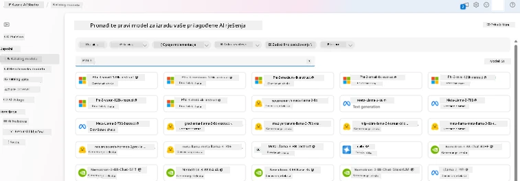

## Priprema za fino podešavanje

### Preduvjeti

> [!NOTE]
> Za modele iz obitelji Phi-3, opcija fino podešavanja po modelu plaćanja po korištenju dostupna je samo za hubove kreirane u regiji **East US 2**.

- Azure pretplata. Ako nemate Azure pretplatu, kreirajte [plaćeni Azure račun](https://azure.microsoft.com/pricing/purchase-options/pay-as-you-go) da biste započeli.

- [AI Foundry projekt](https://ai.azure.com?WT.mc_id=aiml-138114-kinfeylo).
- Azure kontrole pristupa temeljene na ulogama (Azure RBAC) koriste se za dodjelu pristupa operacijama u Azure AI Foundry. Da biste izvršili korake u ovom članku, vaš korisnički račun mora imati __Azure AI Developer ulogu__ na grupi resursa.

### Registracija pružatelja usluge pretplate

Provjerite je li pretplata registrirana za `Microsoft.Network` resource provider.

1. Prijavite se u [Azure portal](https://portal.azure.com).
1. Izaberite **Subscriptions** u lijevom izborniku.
1. Odaberite pretplatu koju želite koristiti.
1. Izaberite **AI project settings** > **Resource providers** u lijevom izborniku.
1. Potvrdite da je **Microsoft.Network** na popisu resource providera. Ako nije, dodajte ga.

### Priprema podataka

Pripremite svoje podatke za treniranje i validaciju za fino podešavanje modela. Vaši skupovi podataka za treniranje i validaciju sastoje se od primjera ulaza i izlaza koji pokazuju kako želite da model radi.

Provjerite da svi vaši primjeri za treniranje slijede očekivani format za inferenciju. Za učinkovito fino podešavanje modela, osigurajte uravnotežen i raznolik skup podataka.

To uključuje održavanje ravnoteže podataka, uključivanje različitih scenarija i povremeno usavršavanje podataka za treniranje kako bi se uskladili s realnim očekivanjima, što na kraju vodi do točnijih i uravnoteženijih odgovora modela.

Različite vrste modela zahtijevaju različit format podataka za treniranje.

### Chat Completion

Podaci za treniranje i validaciju koje koristite **moraju** biti formatirani kao JSON Lines (JSONL) dokument. Za `Phi-3-mini-128k-instruct` skup podataka za fino podešavanje mora biti u konverzacijskom formatu koji koristi Chat completions API.

### Primjer formata datoteke

```json
    {"messages": [{"role": "system", "content": "You are an Xbox customer support agent whose primary goal is to help users with issues they are experiencing with their Xbox devices. You are friendly and concise. You only provide factual answers to queries, and do not provide answers that are not related to Xbox."}, {"role": "user", "content": "Is Xbox better than PlayStation?"}, {"role": "assistant", "content": "I apologize, but I cannot provide personal opinions. My primary job is to assist you with any issues related to your Xbox device. Do you have any Xbox-related issues that need addressing?"}]}
    {"messages": [{"role": "system", "content": "You are an Xbox customer support agent whose primary goal is to help users with issues they are experiencing with their Xbox devices. You are friendly and concise. You only provide factual answers to queries, and do not provide answers that are not related to Xbox."}, {"role": "user", "content": "Can I play PC games on my Xbox?"}, {"role": "assistant", "content": "While Xbox consoles don't natively support PC games, they can play an array of Xbox games, many of which are also available on PC. Can I assist you with finding games compatible with your Xbox device?"}]}
    {"messages": [{"role": "system", "content": "You are an Xbox customer support agent whose primary goal is to help users with issues they are experiencing with their Xbox devices. You are friendly and concise. You only provide factual answers to queries, and do not provide answers that are not related to Xbox."}, {"role": "user", "content": "I'm having trouble connecting my Xbox to the Wi-Fi."}, {"role": "assistant", "content": "No worries, let's go through the network settings on your Xbox. Can you please tell me what happens when you try to connect it to the Wi-Fi?"}]}
```

Podržani tip datoteke je JSON Lines. Datoteke se učitavaju u zadani datastore i postaju dostupne u vašem projektu.

## Fino podešavanje Phi-3 s Azure AI Foundry

Azure AI Foundry omogućuje vam prilagodbu velikih jezičnih modela vašim osobnim skupovima podataka pomoću procesa poznatog kao fino podešavanje. Fino podešavanje donosi značajnu vrijednost omogućujući prilagodbu i optimizaciju za specifične zadatke i primjene. To rezultira poboljšanim performansama, učinkovitijim troškovima, smanjenjem latencije i prilagođenim rezultatima.

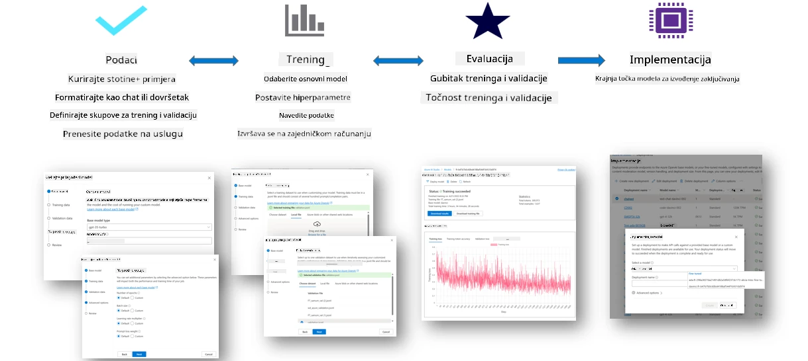

### Kreiranje novog projekta

1. Prijavite se u [Azure AI Foundry](https://ai.azure.com).

1. Odaberite **+New project** za kreiranje novog projekta u Azure AI Foundry.

    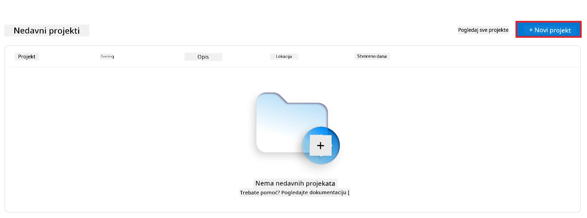

1. Obavite sljedeće zadatke:

    - Naziv projekta **Hub name**. Mora biti jedinstvena vrijednost.
    - Odaberite **Hub** koji ćete koristiti (kreirajte novi ako je potrebno).

    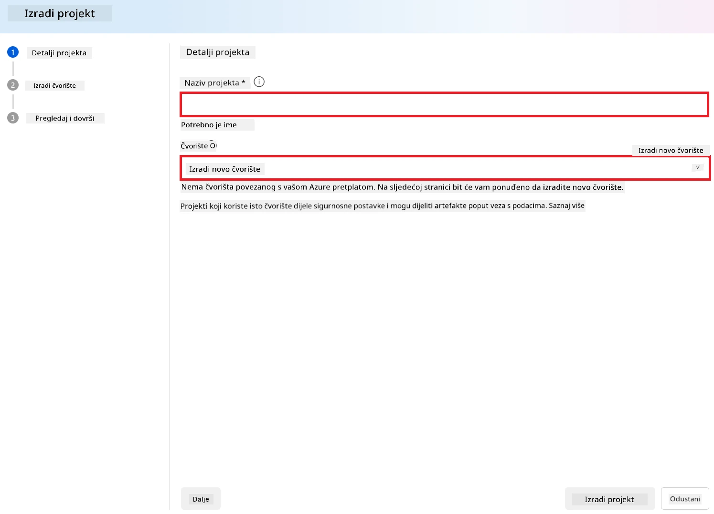

1. Obavite sljedeće zadatke za kreiranje novog huba:

    - Unesite **Hub name**. Mora biti jedinstvena vrijednost.
    - Odaberite svoju Azure **Subscription**.
    - Odaberite **Resource group** koju ćete koristiti (kreirajte novu ako je potrebno).
    - Odaberite **Location** koju želite koristiti.
    - Odaberite **Connect Azure AI Services** koje ćete koristiti (kreirajte novo ako je potrebno).
    - Odaberite **Connect Azure AI Search** i zatim **Skip connecting**.

    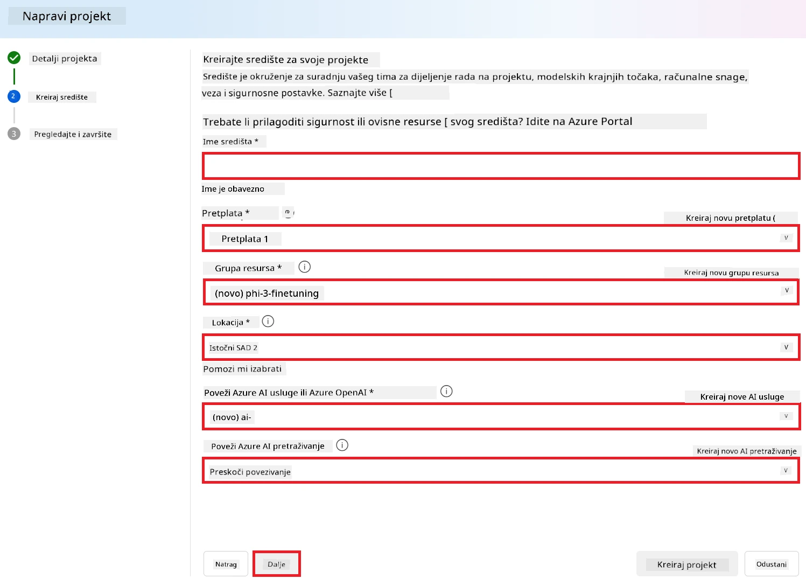

1. Odaberite **Next**.
1. Odaberite **Create a project**.

### Priprema podataka

Prije fino podešavanja prikupite ili kreirajte skup podataka relevantan za vaš zadatak, poput uputa za chat, parova pitanja i odgovora ili bilo kojih drugih relevantnih tekstualnih podataka. Očistite i prethodno obradite te podatke uklanjanjem šuma, rješavanjem nedostajućih vrijednosti i tokenizacijom teksta.

### Fino podešavanje Phi-3 modela u Azure AI Foundry

> [!NOTE]
> Fino podešavanje Phi-3 modela trenutno je podržano samo u projektima smještenim u regiji East US 2.

1. Odaberite **Model catalog** s lijeve strane.

1. Upišite *phi-3* u **search bar** i odaberite phi-3 model koji želite koristiti.

    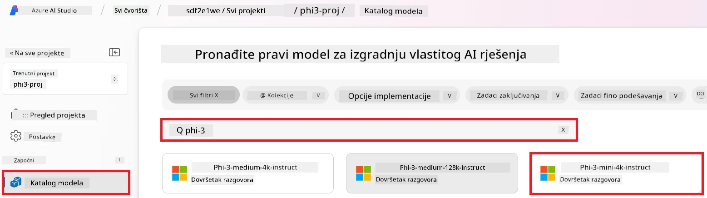

1. Odaberite **Fine-tune**.

    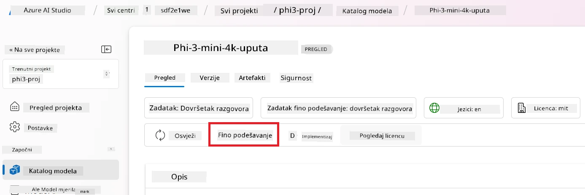

1. Unesite **Fine-tuned model name**.

    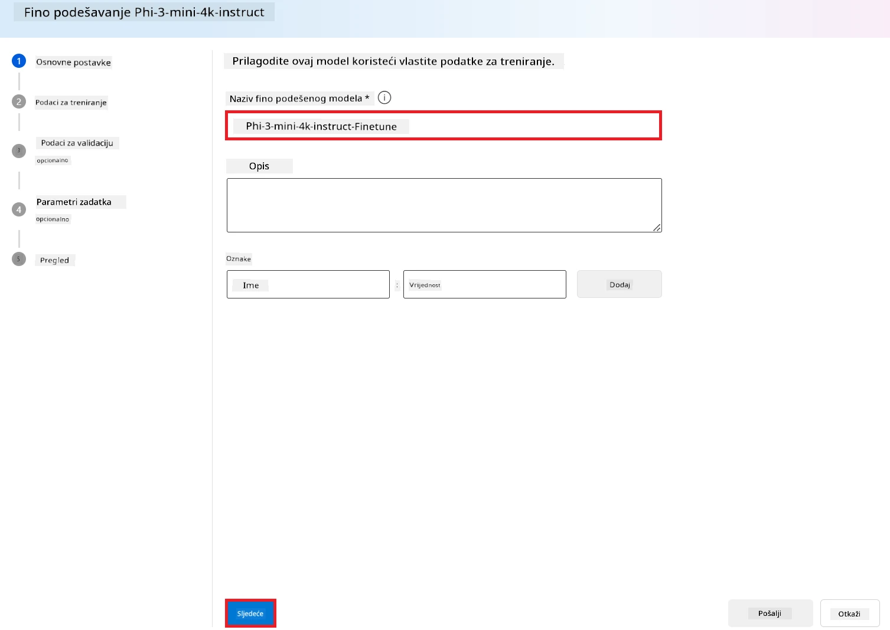

1. Odaberite **Next**.

1. Obavite sljedeće zadatke:

    - Odaberite **task type** na **Chat completion**.
    - Odaberite **Training data** koji želite koristiti. Možete ga učitati putem Azure AI Foundry podataka ili iz lokalnog okruženja.

    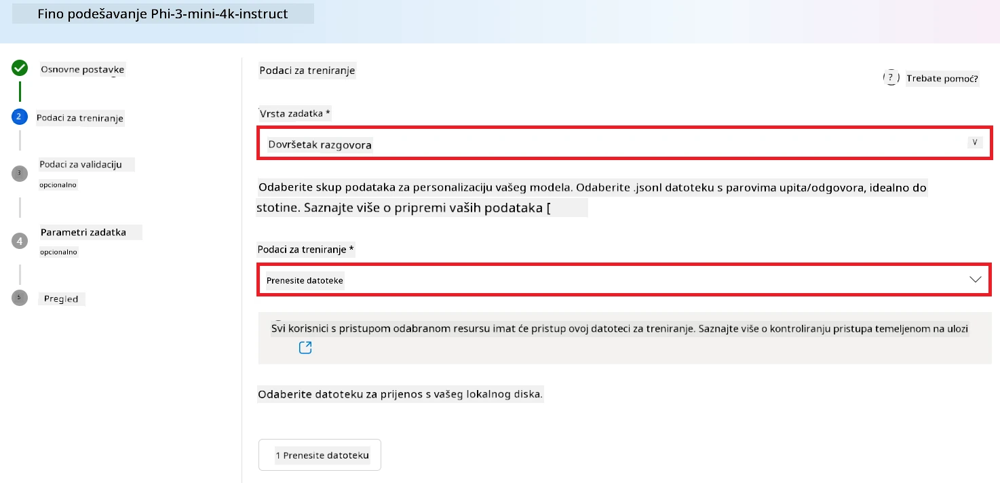

1. Odaberite **Next**.

1. Učitajte **Validation data** koji želite koristiti ili odaberite **Automatic split of training data**.

    

1. Odaberite **Next**.

1. Obavite sljedeće zadatke:

    - Odaberite **Batch size multiplier** koji želite koristiti.
    - Odaberite **Learning rate** koji želite koristiti.
    - Odaberite **Epochs** koje želite koristiti.

    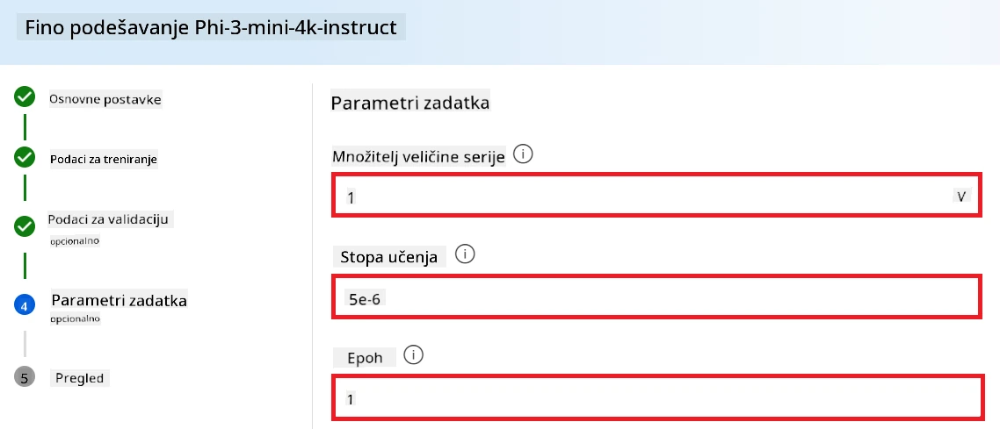

1. Odaberite **Submit** za početak procesa fino podešavanja.

    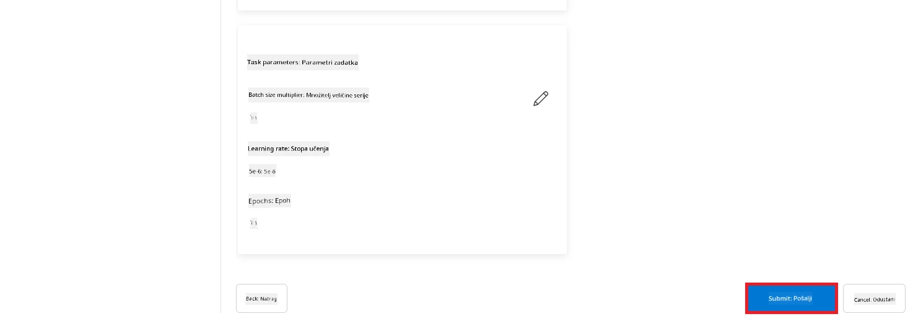

1. Kada je vaš model fino podešen, status će biti prikazan kao **Completed**, kao što je prikazano na slici ispod. Sada možete implementirati model i koristiti ga u svojoj aplikaciji, u playgroundu ili u prompt flowu. Za više informacija pogledajte [Kako implementirati Phi-3 obitelj malih jezičnih modela s Azure AI Foundry](https://learn.microsoft.com/azure/ai-studio/how-to/deploy-models-phi-3?tabs=phi-3-5&pivots=programming-language-python).

    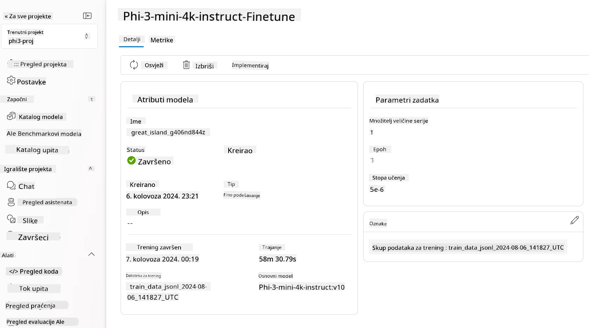

> [!NOTE]
> Za detaljnije informacije o fino podešavanju Phi-3, posjetite [Fine-tune Phi-3 models in Azure AI Foundry](https://learn.microsoft.com/azure/ai-studio/how-to/fine-tune-phi-3?tabs=phi-3-mini).

## Čišćenje fino podešenih modela

Možete izbrisati fino podešeni model s popisa modela za fino podešavanje u [Azure AI Foundry](https://ai.azure.com) ili s stranice s detaljima modela. Odaberite fino podešeni model za brisanje na stranici Fine-tuning, a zatim kliknite gumb Delete za brisanje modela.

> [!NOTE]
> Ne možete izbrisati prilagođeni model ako ima postojeću implementaciju. Prvo morate izbrisati implementaciju modela prije nego što možete izbrisati prilagođeni model.

## Troškovi i kvote

### Razmatranja troškova i kvota za Phi-3 modele fino podešene kao usluga

Phi modeli fino podešeni kao usluga nude se od strane Microsofta i integrirani su s Azure AI Foundry za korištenje. Cijene možete pronaći prilikom [implementacije](https://learn.microsoft.com/azure/ai-studio/how-to/deploy-models-phi-3?tabs=phi-3-5&pivots=programming-language-python) ili fino podešavanja modela pod karticom Pricing and terms u čarobnjaku za implementaciju.

## Filtriranje sadržaja

Modeli implementirani kao usluga s plaćanjem po korištenju zaštićeni su Azure AI Content Safety. Kada se implementiraju na real-time endpointima, možete isključiti ovu mogućnost. Uz omogućenu Azure AI Content Safety, i prompt i completion prolaze kroz skup klasifikacijskih modela koji detektiraju i sprječavaju isporuku štetnog sadržaja. Sustav filtriranja sadržaja detektira i poduzima mjere za određene kategorije potencijalno štetnog sadržaja u ulaznim promptovima i izlaznim odgovorima. Saznajte više o [Azure AI Content Safety](https://learn.microsoft.com/azure/ai-studio/concepts/content-filtering).

**Konfiguracija fino podešavanja**

Hyperparametri: Definirajte hyperparametre poput stope učenja, veličine batcha i broja epoha treniranja.

**Funkcija gubitka**

Odaberite odgovarajuću funkciju gubitka za svoj zadatak (npr. cross-entropy).

**Optimizator**

Odaberite optimizator (npr. Adam) za ažuriranje gradijenata tijekom treniranja.

**Proces fino podešavanja**

- Učitajte unaprijed trenirani model: Učitajte Phi-3 Mini checkpoint.
- Dodajte prilagođene slojeve: Dodajte slojeve specifične za zadatak (npr. klasifikacijski sloj za upute za chat).

**Trenirajte model**  
Fino podesite model koristeći pripremljeni skup podataka. Pratite napredak treniranja i po potrebi prilagođavajte hyperparametre.

**Evaluacija i validacija**

Validacijski skup: Podijelite podatke na skup za treniranje i validaciju.

**Procjena performansi**

Koristite metrike poput točnosti, F1-score ili perplexity za procjenu performansi modela.

## Spremanje fino podešenog modela

**Checkpoint**  
Spremite checkpoint fino podešenog modela za buduću upotrebu.

## Implementacija

- Implementirajte kao web uslugu: Implementirajte svoj fino podešeni model kao web uslugu u Azure AI Foundry.
- Testirajte endpoint: Pošaljite testne upite na implementirani endpoint kako biste provjerili njegovu funkcionalnost.

## Iterirajte i poboljšavajte

Iterirajte: Ako performanse nisu zadovoljavajuće, iterirajte podešavanjem hyperparametara, dodavanjem više podataka ili dodatnim epoha fino podešavanja.

## Pratite i usavršavajte

Kontinuirano pratite ponašanje modela i po potrebi ga usavršavajte.

## Prilagodite i proširite

Prilagođeni zadaci: Phi-3 Mini može se fino podešavati za različite zadatke osim uputa za chat. Istražite druge primjene!  
Eksperimentirajte: Isprobajte različite arhitekture, kombinacije slojeva i tehnike za poboljšanje performansi.

> [!NOTE]
> Fino podešavanje je iterativan proces. Eksperimentirajte, učite i prilagođavajte svoj model kako biste postigli najbolje rezultate za svoj specifični zadatak!

**Odricanje od odgovornosti**:  
Ovaj dokument je preveden korištenjem AI usluge za prevođenje [Co-op Translator](https://github.com/Azure/co-op-translator). Iako težimo točnosti, imajte na umu da automatski prijevodi mogu sadržavati pogreške ili netočnosti. Izvorni dokument na izvornom jeziku treba smatrati službenim i autoritativnim izvorom. Za kritične informacije preporučuje se profesionalni ljudski prijevod. Ne snosimo odgovornost za bilo kakva nesporazuma ili pogrešna tumačenja koja proizlaze iz korištenja ovog prijevoda.