<!--
CO_OP_TRANSLATOR_METADATA:
{
  "original_hash": "c1559c5af6caccf6f623fd43a6b3a9a3",
  "translation_date": "2025-05-09T20:38:24+00:00",
  "source_file": "md/03.FineTuning/FineTuning_AIFoundry.md",
  "language_code": "hr"
}
-->
# Fino podešavanje Phi-3 s Azure AI Foundry

Istražimo kako fino podesiti Microsoftov Phi-3 Mini jezični model koristeći Azure AI Foundry. Fino podešavanje omogućuje prilagodbu Phi-3 Mini modela specifičnim zadacima, čineći ga još moćnijim i osjetljivijim na kontekst.

## Razmatranja

- **Mogućnosti:** Koji modeli se mogu fino podesiti? Što se može postići fino podešenim osnovnim modelom?
- **Troškovi:** Kakav je model cijena za fino podešavanje?
- **Prilagodljivost:** Koliko mogu mijenjati osnovni model – i na koji način?
- **Praktičnost:** Kako se zapravo provodi fino podešavanje – moram li pisati prilagođeni kod? Trebam li vlastiti računarski kapacitet?
- **Sigurnost:** Fino podešeni modeli poznati su po sigurnosnim rizicima – postoje li zaštitne mjere za sprječavanje neželjenih šteta?

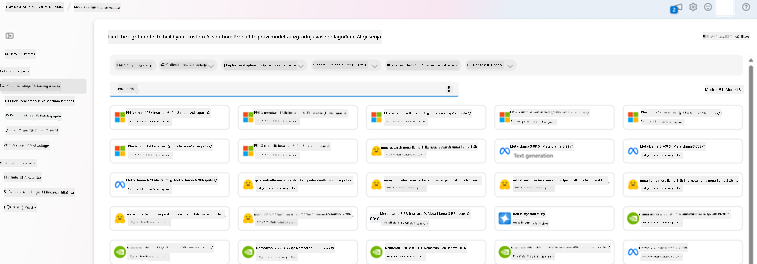

## Priprema za fino podešavanje

### Preduvjeti

> [!NOTE]
> Za modele iz obitelji Phi-3, model plaćanja po korištenju za fino podešavanje dostupan je samo za hubove kreirane u regijama **East US 2**.

- Pretplata na Azure. Ako nemate Azure pretplatu, kreirajte [plaćeni Azure račun](https://azure.microsoft.com/pricing/purchase-options/pay-as-you-go) da započnete.

- [AI Foundry projekt](https://ai.azure.com?WT.mc_id=aiml-138114-kinfeylo).
- Azure kontrola pristupa temeljena na ulogama (Azure RBAC) koristi se za dodjelu pristupa operacijama u Azure AI Foundry. Da biste izvršili korake u ovom članku, vaš korisnički račun mora imati __Azure AI Developer ulogu__ na grupi resursa.

### Registracija pružatelja pretplate

Provjerite je li pretplata registrirana za `Microsoft.Network` resource provider.

1. Prijavite se na [Azure portal](https://portal.azure.com).
1. Izaberite **Subscriptions** iz lijevog izbornika.
1. Odaberite pretplatu koju želite koristiti.
1. Izaberite **AI project settings** > **Resource providers** iz lijevog izbornika.
1. Potvrdite da je **Microsoft.Network** na popisu pružatelja resursa. Ako nije, dodajte ga.

### Priprema podataka

Pripremite svoje podatke za treniranje i validaciju za fino podešavanje modela. Vaši skupovi podataka za treniranje i validaciju sastoje se od primjera ulaza i izlaza koji pokazuju kako želite da model radi.

Pobrinite se da svi vaši primjeri za treniranje slijede očekivani format za izvođenje. Da biste učinkovito fino podesili modele, osigurajte uravnotežen i raznolik skup podataka.

To uključuje održavanje ravnoteže podataka, uključivanje različitih scenarija i povremeno usavršavanje podataka za treniranje kako bi se uskladili s očekivanjima iz stvarnog svijeta, što na kraju vodi do točnijih i uravnoteženijih odgovora modela.

Različite vrste modela zahtijevaju različite formate podataka za treniranje.

### Chat Completion

Podaci za treniranje i validaciju koje koristite **moraju** biti formatirani kao JSON Lines (JSONL) dokument. Za `Phi-3-mini-128k-instruct` skup za fino podešavanje mora biti formatiran u konverzacijski format koji koristi Chat completions API.

### Primjer formata datoteke

```json
    {"messages": [{"role": "system", "content": "You are an Xbox customer support agent whose primary goal is to help users with issues they are experiencing with their Xbox devices. You are friendly and concise. You only provide factual answers to queries, and do not provide answers that are not related to Xbox."}, {"role": "user", "content": "Is Xbox better than PlayStation?"}, {"role": "assistant", "content": "I apologize, but I cannot provide personal opinions. My primary job is to assist you with any issues related to your Xbox device. Do you have any Xbox-related issues that need addressing?"}]}
    {"messages": [{"role": "system", "content": "You are an Xbox customer support agent whose primary goal is to help users with issues they are experiencing with their Xbox devices. You are friendly and concise. You only provide factual answers to queries, and do not provide answers that are not related to Xbox."}, {"role": "user", "content": "Can I play PC games on my Xbox?"}, {"role": "assistant", "content": "While Xbox consoles don't natively support PC games, they can play an array of Xbox games, many of which are also available on PC. Can I assist you with finding games compatible with your Xbox device?"}]}
    {"messages": [{"role": "system", "content": "You are an Xbox customer support agent whose primary goal is to help users with issues they are experiencing with their Xbox devices. You are friendly and concise. You only provide factual answers to queries, and do not provide answers that are not related to Xbox."}, {"role": "user", "content": "I'm having trouble connecting my Xbox to the Wi-Fi."}, {"role": "assistant", "content": "No worries, let's go through the network settings on your Xbox. Can you please tell me what happens when you try to connect it to the Wi-Fi?"}]}
```

Podržani tip datoteke je JSON Lines. Datoteke se učitavaju u zadani datastore i postaju dostupne u vašem projektu.

## Fino podešavanje Phi-3 s Azure AI Foundry

Azure AI Foundry omogućuje prilagođavanje velikih jezičnih modela vašim osobnim skupovima podataka koristeći proces poznat kao fino podešavanje. Fino podešavanje donosi značajne prednosti omogućavajući prilagodbu i optimizaciju za specifične zadatke i aplikacije. To vodi do poboljšane izvedbe, učinkovitosti troškova, smanjenja latencije i prilagođenih rezultata.

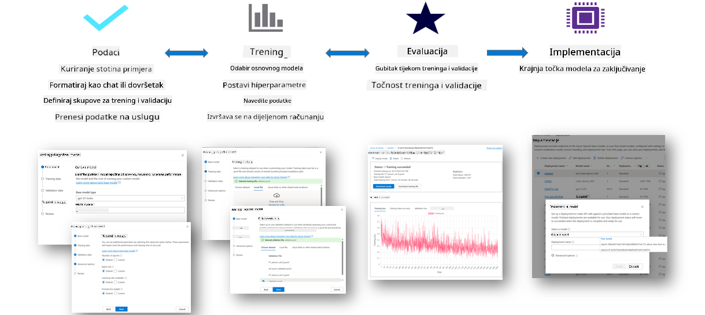

### Kreiranje novog projekta

1. Prijavite se na [Azure AI Foundry](https://ai.azure.com).

1. Izaberite **+New project** za kreiranje novog projekta u Azure AI Foundry.

    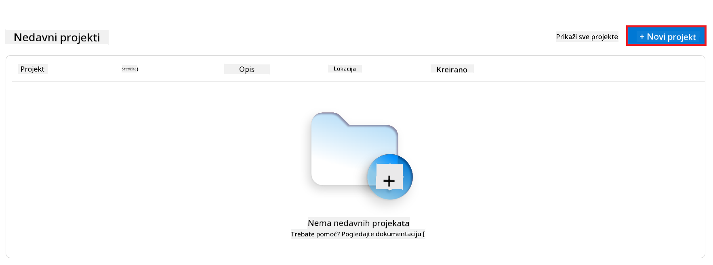

1. Obavite sljedeće zadatke:

    - Naziv projekta **Hub name**. Mora biti jedinstvena vrijednost.
    - Odaberite **Hub** koji ćete koristiti (kreirajte novi ako je potrebno).

    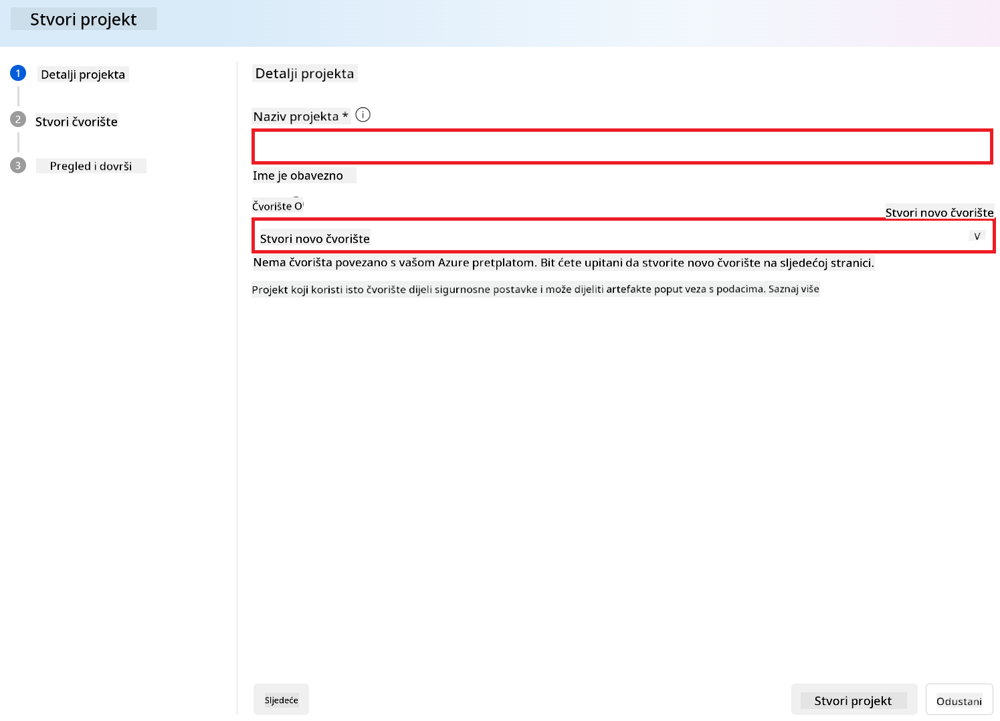

1. Obavite sljedeće korake za kreiranje novog huba:

    - Unesite **Hub name**. Mora biti jedinstvena vrijednost.
    - Odaberite svoju Azure **Subscription**.
    - Odaberite **Resource group** koju ćete koristiti (kreirajte novu ako je potrebno).
    - Odaberite **Location** koju želite koristiti.
    - Odaberite **Connect Azure AI Services** koje ćete koristiti (kreirajte novo ako je potrebno).
    - Odaberite **Connect Azure AI Search** na **Skip connecting**.

    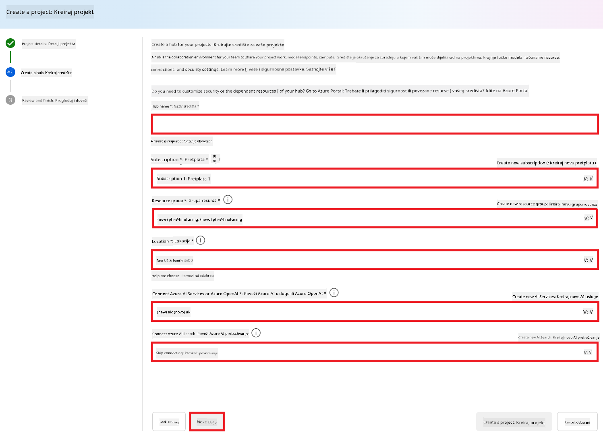

1. Izaberite **Next**.
1. Izaberite **Create a project**.

### Priprema podataka

Prije fino podešavanja, prikupite ili kreirajte skup podataka relevantan za vaš zadatak, poput uputa za chat, parova pitanja i odgovora ili bilo kojih drugih relevantnih tekstualnih podataka. Očistite i prethodno obradite te podatke uklanjanjem šuma, rješavanjem nedostajućih vrijednosti i tokenizacijom teksta.

### Fino podešavanje Phi-3 modela u Azure AI Foundry

> [!NOTE]
> Fino podešavanje Phi-3 modela trenutno je podržano samo u projektima smještenim u East US 2 regiji.

1. Izaberite **Model catalog** s lijeve strane.

1. Upišite *phi-3* u **search bar** i odaberite phi-3 model koji želite koristiti.

    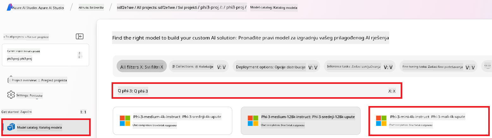

1. Izaberite **Fine-tune**.

    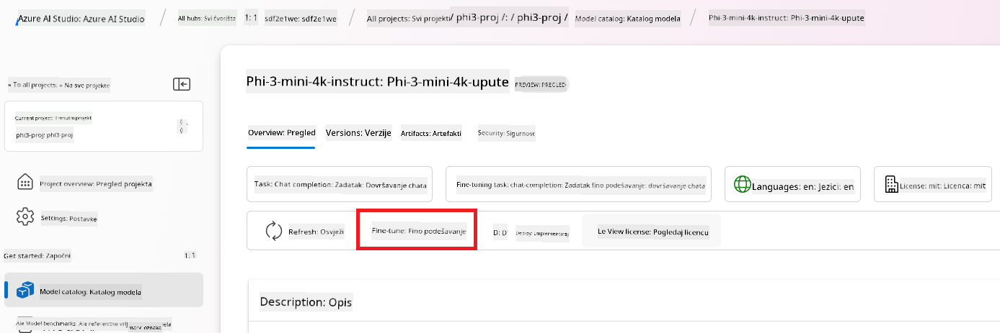

1. Unesite **Fine-tuned model name**.

    

1. Izaberite **Next**.

1. Obavite sljedeće zadatke:

    - Odaberite **task type** na **Chat completion**.
    - Odaberite **Training data** koju želite koristiti. Možete je učitati putem Azure AI Foundry podataka ili iz lokalnog okruženja.

    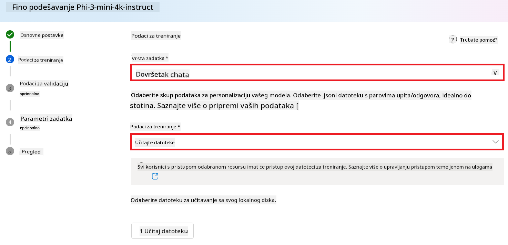

1. Izaberite **Next**.

1. Učitajte **Validation data** koju želite koristiti ili odaberite **Automatic split of training data**.

    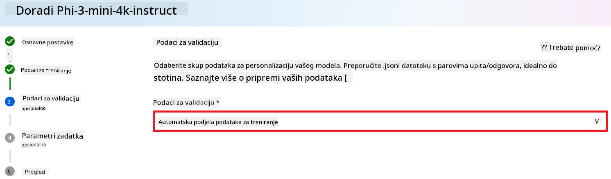

1. Izaberite **Next**.

1. Obavite sljedeće zadatke:

    - Odaberite **Batch size multiplier** koji želite koristiti.
    - Odaberite **Learning rate** koji želite koristiti.
    - Odaberite **Epochs** koje želite koristiti.

    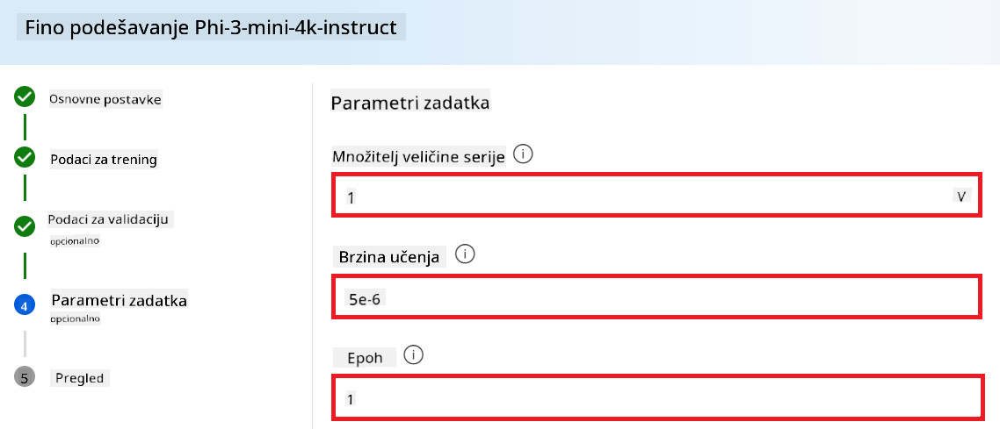

1. Izaberite **Submit** za početak procesa fino podešavanja.

    

1. Kada je vaš model fino podešen, status će biti prikazan kao **Completed**, kao što je prikazano na slici ispod. Sada možete implementirati model i koristiti ga u vlastitoj aplikaciji, na playgroundu ili u prompt flowu. Za više informacija pogledajte [How to deploy Phi-3 family of small language models with Azure AI Foundry](https://learn.microsoft.com/azure/ai-studio/how-to/deploy-models-phi-3?tabs=phi-3-5&pivots=programming-language-python).

    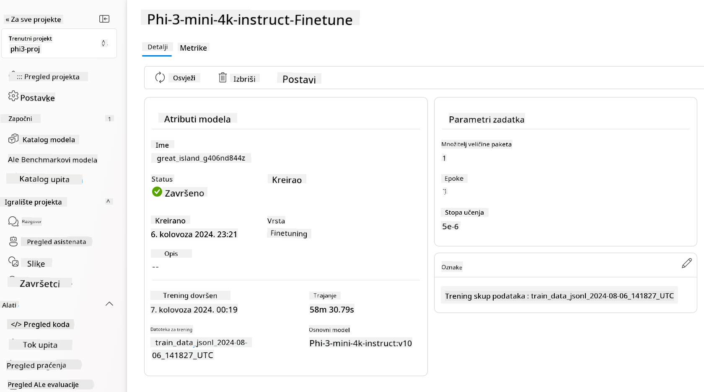

> [!NOTE]
> Za detaljnije informacije o fino podešavanju Phi-3, posjetite [Fine-tune Phi-3 models in Azure AI Foundry](https://learn.microsoft.com/azure/ai-studio/how-to/fine-tune-phi-3?tabs=phi-3-mini).

## Čišćenje fino podešenih modela

Možete izbrisati fino podešeni model s popisa modela za fino podešavanje u [Azure AI Foundry](https://ai.azure.com) ili s stranice detalja modela. Odaberite fino podešeni model za brisanje na stranici Fine-tuning, zatim odaberite gumb Delete za brisanje modela.

> [!NOTE]
> Ne možete izbrisati prilagođeni model ako postoji aktivna implementacija. Prvo morate izbrisati implementaciju modela prije nego što možete izbrisati prilagođeni model.

## Troškovi i kvote

### Razmatranja troškova i kvota za Phi-3 modele fino podešene kao uslugu

Phi modeli fino podešeni kao usluga nude se od strane Microsofta i integrirani su s Azure AI Foundry za upotrebu. Cijene možete pronaći prilikom [implementacije](https://learn.microsoft.com/azure/ai-studio/how-to/deploy-models-phi-3?tabs=phi-3-5&pivots=programming-language-python) ili fino podešavanja modela pod karticom Pricing and terms u čarobnjaku za implementaciju.

## Filtriranje sadržaja

Modeli implementirani kao usluga s plaćanjem po korištenju zaštićeni su Azure AI Content Safety. Kada su implementirani na krajnje točke u stvarnom vremenu, možete isključiti ovu mogućnost. Uz omogućenu Azure AI Content Safety, i prompt i dovršetak prolaze kroz skup klasifikacijskih modela usmjerenih na otkrivanje i sprječavanje izlaza štetnog sadržaja. Sustav filtriranja sadržaja otkriva i poduzima radnje na određenim kategorijama potencijalno štetnog sadržaja u ulaznim promptima i izlaznim dovršecima. Saznajte više o [Azure AI Content Safety](https://learn.microsoft.com/azure/ai-studio/concepts/content-filtering).

**Konfiguracija fino podešavanja**

Hyperparametri: Definirajte hyperparametre poput brzine učenja, veličine serije i broja epoha treniranja.

**Funkcija gubitka**

Odaberite odgovarajuću funkciju gubitka za svoj zadatak (npr. cross-entropy).

**Optimizator**

Odaberite optimizator (npr. Adam) za ažuriranja gradijenta tijekom treniranja.

**Proces fino podešavanja**

- Učitajte prethodno trenirani model: učitajte Phi-3 Mini checkpoint.
- Dodajte prilagođene slojeve: dodajte slojeve specifične za zadatak (npr. klasifikacijska glava za upute za chat).

**Trenirajte model**
Fino podesite model koristeći pripremljeni skup podataka. Pratite napredak treniranja i po potrebi prilagođavajte hyperparametre.

**Evaluacija i validacija**

Skup za validaciju: podijelite podatke na skup za treniranje i validaciju.

**Procjena performansi**

Koristite metrike poput točnosti, F1-score ili perplexity za procjenu performansi modela.

## Spremanje fino podešenog modela

**Checkpoint**
Spremite checkpoint fino podešenog modela za buduću upotrebu.

## Implementacija

- Implementirajte kao web uslugu: implementirajte svoj fino podešeni model kao web uslugu u Azure AI Foundry.
- Testirajte krajnju točku: pošaljite testne upite na implementiranu krajnju točku kako biste provjerili funkcionalnost.

## Iterirajte i poboljšavajte

Iterirajte: ako performanse nisu zadovoljavajuće, ponovite proces podešavanjem hyperparametara, dodavanjem više podataka ili fino podešavanjem kroz dodatne epohe.

## Pratite i usavršavajte

Kontinuirano pratite ponašanje modela i po potrebi ga usavršavajte.

## Prilagodite i proširite

Prilagođeni zadaci: Phi-3 Mini može se fino podesiti za različite zadatke izvan uputa za chat. Istražite druge slučajeve korištenja!
Eksperimentirajte: isprobajte različite arhitekture, kombinacije slojeva i tehnike za poboljšanje performansi.

> [!NOTE]
> Fino podešavanje je iterativan proces. Eksperimentirajte, učite i prilagođavajte model kako biste postigli najbolje rezultate za svoj specifični zadatak!

**Odricanje od odgovornosti**:  
Ovaj dokument je preveden korištenjem AI usluge za prevođenje [Co-op Translator](https://github.com/Azure/co-op-translator). Iako težimo točnosti, imajte na umu da automatski prijevodi mogu sadržavati pogreške ili netočnosti. Izvorni dokument na izvornom jeziku treba smatrati autoritativnim izvorom. Za kritične informacije preporučuje se profesionalni ljudski prijevod. Ne snosimo odgovornost za bilo kakve nesporazume ili pogrešne interpretacije koje proizlaze iz korištenja ovog prijevoda.