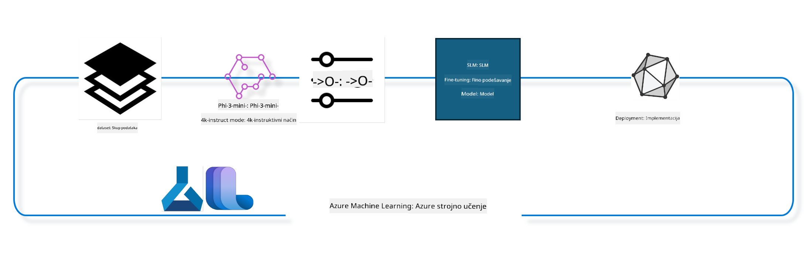

<!--
CO_OP_TRANSLATOR_METADATA:
{
  "original_hash": "944949f040e61b2ea25b3460f7394fd4",
  "translation_date": "2025-05-09T21:39:20+00:00",
  "source_file": "md/03.FineTuning/FineTuning_MLSDK.md",
  "language_code": "hr"
}
-->
## Kako koristiti chat-completion komponente iz Azure ML sistemskog registra za fino podešavanje modela

U ovom primjeru ćemo izvršiti fino podešavanje modela Phi-3-mini-4k-instruct za dovršavanje razgovora između dvije osobe koristeći ultrachat_200k skup podataka.



Primjer će vam pokazati kako provesti fino podešavanje koristeći Azure ML SDK i Python, a zatim kako postaviti fino podešeni model na online endpoint za izvođenje u stvarnom vremenu.

### Podaci za treniranje

Koristit ćemo ultrachat_200k skup podataka. Ovo je snažno filtrirana verzija UltraChat skupa podataka i korištena je za treniranje Zephyr-7B-β, vrhunskog 7b chat modela.

### Model

Koristit ćemo Phi-3-mini-4k-instruct model kako bismo pokazali kako korisnik može fino podesiti model za zadatak chat-dovršavanja. Ako ste otvorili ovaj bilježnik s kartice određenog modela, zapamtite da zamijenite naziv modela.

### Zadatci

- Odaberite model za fino podešavanje.
- Odaberite i istražite podatke za treniranje.
- Konfigurirajte zadatak fino podešavanja.
- Pokrenite zadatak fino podešavanja.
- Pregledajte metrike treniranja i evaluacije.
- Registrirajte fino podešeni model.
- Postavite fino podešeni model za izvođenje u stvarnom vremenu.
- Očistite resurse.

## 1. Postavljanje preduvjeta

- Instalirajte potrebne pakete
- Povežite se s AzureML Workspace-om. Više saznajte u postavljanju SDK autentifikacije. Zamijenite <WORKSPACE_NAME>, <RESOURCE_GROUP> i <SUBSCRIPTION_ID> u nastavku.
- Povežite se na azureml sistemski registar
- Postavite opcionalni naziv eksperimenta
- Provjerite ili kreirajte compute resurs.

> [!NOTE]
> Zahtjevi: jedan GPU čvor može imati više GPU kartica. Na primjer, u jednom čvoru Standard_NC24rs_v3 ima 4 NVIDIA V100 GPU-a, dok u Standard_NC12s_v3 postoje 2 NVIDIA V100 GPU-a. Pogledajte dokumentaciju za ove informacije. Broj GPU kartica po čvoru se postavlja u parametru gpus_per_node u nastavku. Ispravno postavljanje ove vrijednosti osigurat će iskorištavanje svih GPU-a u čvoru. Preporučeni GPU compute SKU-ovi mogu se pronaći ovdje i ovdje.

### Python biblioteke

Instalirajte potrebne pakete pokretanjem ćelije ispod. Ovo nije opcionalan korak ako radite u novom okruženju.

```bash
pip install azure-ai-ml
pip install azure-identity
pip install datasets==2.9.0
pip install mlflow
pip install azureml-mlflow
```

### Interakcija s Azure ML

1. Ovaj Python skript služi za interakciju s Azure Machine Learning (Azure ML) servisom. Evo što radi:

    - Uvozi potrebne module iz paketa azure.ai.ml, azure.identity i azure.ai.ml.entities. Također uvozi modul time.

    - Pokušava se autentificirati koristeći DefaultAzureCredential(), koji omogućuje pojednostavljeni način autentifikacije za brzi razvoj aplikacija u Azure oblaku. Ako to ne uspije, prelazi na InteractiveBrowserCredential(), koji omogućuje interaktivni login putem preglednika.

    - Zatim pokušava kreirati instancu MLClient koristeći metodu from_config, koja čita konfiguraciju iz zadane konfiguracijske datoteke (config.json). Ako to ne uspije, ručno kreira MLClient instancu pružajući subscription_id, resource_group_name i workspace_name.

    - Kreira još jednu MLClient instancu, ovaj put za Azure ML registar nazvan "azureml". Ovaj registar pohranjuje modele, pipeline za fino podešavanje i okruženja.

    - Postavlja naziv eksperimenta na "chat_completion_Phi-3-mini-4k-instruct".

    - Generira jedinstveni vremenski žig pretvarajući trenutno vrijeme (u sekundama od epohe, kao decimalni broj) u cijeli broj, a zatim u string. Ovaj vremenski žig može se koristiti za kreiranje jedinstvenih imena i verzija.

    ```python
    # Import necessary modules from Azure ML and Azure Identity
    from azure.ai.ml import MLClient
    from azure.identity import (
        DefaultAzureCredential,
        InteractiveBrowserCredential,
    )
    from azure.ai.ml.entities import AmlCompute
    import time  # Import time module
    
    # Try to authenticate using DefaultAzureCredential
    try:
        credential = DefaultAzureCredential()
        credential.get_token("https://management.azure.com/.default")
    except Exception as ex:  # If DefaultAzureCredential fails, use InteractiveBrowserCredential
        credential = InteractiveBrowserCredential()
    
    # Try to create an MLClient instance using the default config file
    try:
        workspace_ml_client = MLClient.from_config(credential=credential)
    except:  # If that fails, create an MLClient instance by manually providing the details
        workspace_ml_client = MLClient(
            credential,
            subscription_id="<SUBSCRIPTION_ID>",
            resource_group_name="<RESOURCE_GROUP>",
            workspace_name="<WORKSPACE_NAME>",
        )
    
    # Create another MLClient instance for the Azure ML registry named "azureml"
    # This registry is where models, fine-tuning pipelines, and environments are stored
    registry_ml_client = MLClient(credential, registry_name="azureml")
    
    # Set the experiment name
    experiment_name = "chat_completion_Phi-3-mini-4k-instruct"
    
    # Generate a unique timestamp that can be used for names and versions that need to be unique
    timestamp = str(int(time.time()))
    ```

## 2. Odaberite osnovni model za fino podešavanje

1. Phi-3-mini-4k-instruct je model s 3.8 milijardi parametara, lagan i vrhunski open source model baziran na skupovima podataka korištenim za Phi-2. Model pripada Phi-3 obitelji modela, a Mini verzija dolazi u dvije varijante: 4K i 128K, što je duljina konteksta (u tokenima) koju može podržati. Potrebno je fino podesiti model za naš specifični zadatak da bi se koristio. Možete pregledavati ove modele u Model Catalogu u AzureML Studiju, filtrirajući prema zadatku chat-completion. U ovom primjeru koristimo Phi-3-mini-4k-instruct model. Ako ste otvorili ovaj bilježnik za drugi model, zamijenite naziv i verziju modela prema potrebi.

    > [!NOTE]
    > id modela je svojstvo modela koje će se proslijediti kao ulaz u zadatak fino podešavanja. Također je dostupno kao Asset ID polje na stranici detalja modela u AzureML Studio Model Catalogu.

2. Ovaj Python skript komunicira s Azure Machine Learning (Azure ML) servisom. Evo što radi:

    - Postavlja model_name na "Phi-3-mini-4k-instruct".

    - Koristi get metodu svojstva models objekta registry_ml_client da preuzme najnoviju verziju modela s navedenim imenom iz Azure ML registra. Metoda get se poziva s dva argumenta: naziv modela i oznaka koja specificira da se želi najnovija verzija modela.

    - Ispisuje poruku u konzolu koja pokazuje naziv, verziju i id modela koji će se koristiti za fino podešavanje. Metoda format stringa koristi se za umetanje imena, verzije i id-a modela u poruku. Ime, verzija i id modela dohvaćaju se kao svojstva objekta foundation_model.

    ```python
    # Set the model name
    model_name = "Phi-3-mini-4k-instruct"
    
    # Get the latest version of the model from the Azure ML registry
    foundation_model = registry_ml_client.models.get(model_name, label="latest")
    
    # Print the model name, version, and id
    # This information is useful for tracking and debugging
    print(
        "\n\nUsing model name: {0}, version: {1}, id: {2} for fine tuning".format(
            foundation_model.name, foundation_model.version, foundation_model.id
        )
    )
    ```

## 3. Kreirajte compute koji će se koristiti za zadatak

Zadatak fino podešavanja RADI SAMO s GPU compute resursom. Veličina compute resursa ovisi o veličini modela i u većini slučajeva može biti izazovno odabrati pravi compute za zadatak. U ovoj ćeliji vodimo korisnika kroz odabir pravog compute resursa za zadatak.

> [!NOTE]
> Compute resursi navedeni u nastavku rade s najoptimiziranijom konfiguracijom. Bilo kakve promjene konfiguracije mogu dovesti do Cuda Out Of Memory greške. U takvim slučajevima pokušajte nadograditi compute na veći.

> [!NOTE]
> Prilikom odabira compute_cluster_size u nastavku, provjerite je li compute dostupan u vašoj resource grupi. Ako određeni compute nije dostupan, možete zatražiti pristup compute resursima.

### Provjera podrške modela za fino podešavanje

1. Ovaj Python skript komunicira s Azure Machine Learning (Azure ML) modelom. Evo što radi:

    - Uvozi ast modul, koji omogućuje obradu stabala Python apstraktne sintakse.

    - Provjerava ima li objekt foundation_model (koji predstavlja model u Azure ML) oznaku pod nazivom finetune_compute_allow_list. Oznake u Azure ML su parovi ključ-vrijednost koje možete koristiti za filtriranje i sortiranje modela.

    - Ako oznaka finetune_compute_allow_list postoji, koristi ast.literal_eval funkciju za sigurno parsiranje vrijednosti oznake (stringa) u Python listu. Ta lista se zatim dodjeljuje varijabli computes_allow_list. Ispisuje poruku da treba kreirati compute s te liste.

    - Ako oznaka nije prisutna, postavlja computes_allow_list na None i ispisuje poruku da oznaka nije dio modelovih oznaka.

    - Ukratko, ovaj skript provjerava specifičnu oznaku u metapodacima modela, pretvara vrijednost oznake u listu ako postoji i daje povratnu informaciju korisniku.

    ```python
    # Import the ast module, which provides functions to process trees of the Python abstract syntax grammar
    import ast
    
    # Check if the 'finetune_compute_allow_list' tag is present in the model's tags
    if "finetune_compute_allow_list" in foundation_model.tags:
        # If the tag is present, use ast.literal_eval to safely parse the tag's value (a string) into a Python list
        computes_allow_list = ast.literal_eval(
            foundation_model.tags["finetune_compute_allow_list"]
        )  # convert string to python list
        # Print a message indicating that a compute should be created from the list
        print(f"Please create a compute from the above list - {computes_allow_list}")
    else:
        # If the tag is not present, set computes_allow_list to None
        computes_allow_list = None
        # Print a message indicating that the 'finetune_compute_allow_list' tag is not part of the model's tags
        print("`finetune_compute_allow_list` is not part of model tags")
    ```

### Provjera Compute instance

1. Ovaj Python skript komunicira s Azure Machine Learning (Azure ML) servisom i izvodi nekoliko provjera na compute instanci. Evo što radi:

    - Pokušava dohvatiti compute instancu s imenom pohranjenim u compute_cluster iz Azure ML workspace-a. Ako je stanje provisioning-a compute instance "failed", baca ValueError.

    - Provjerava je li computes_allow_list različit od None. Ako jest, pretvara sve veličine compute resursa u listi u mala slova i provjerava je li veličina trenutnog compute resursa na toj listi. Ako nije, baca ValueError.

    - Ako je computes_allow_list None, provjerava je li veličina compute instance na listi nepodržanih GPU VM veličina. Ako jest, baca ValueError.

    - Dohvaća listu svih dostupnih veličina compute resursa u workspace-u. Zatim prolazi kroz tu listu i za svaku veličinu provjerava podudara li se ime s veličinom trenutne compute instance. Ako se podudara, dohvaća broj GPU-ova za tu veličinu i postavlja gpu_count_found na True.

    - Ako je gpu_count_found True, ispisuje broj GPU-ova u compute instanci. Ako nije, baca ValueError.

    - Ukratko, ovaj skript izvodi nekoliko provjera na compute instanci u Azure ML workspace-u, uključujući provjeru provisioning stanja, veličine u odnosu na dopuštenu listu ili zabranjenu listu i broj GPU-ova.

    ```python
    # Print the exception message
    print(e)
    # Raise a ValueError if the compute size is not available in the workspace
    raise ValueError(
        f"WARNING! Compute size {compute_cluster_size} not available in workspace"
    )
    
    # Retrieve the compute instance from the Azure ML workspace
    compute = workspace_ml_client.compute.get(compute_cluster)
    # Check if the provisioning state of the compute instance is "failed"
    if compute.provisioning_state.lower() == "failed":
        # Raise a ValueError if the provisioning state is "failed"
        raise ValueError(
            f"Provisioning failed, Compute '{compute_cluster}' is in failed state. "
            f"please try creating a different compute"
        )
    
    # Check if computes_allow_list is not None
    if computes_allow_list is not None:
        # Convert all compute sizes in computes_allow_list to lowercase
        computes_allow_list_lower_case = [x.lower() for x in computes_allow_list]
        # Check if the size of the compute instance is in computes_allow_list_lower_case
        if compute.size.lower() not in computes_allow_list_lower_case:
            # Raise a ValueError if the size of the compute instance is not in computes_allow_list_lower_case
            raise ValueError(
                f"VM size {compute.size} is not in the allow-listed computes for finetuning"
            )
    else:
        # Define a list of unsupported GPU VM sizes
        unsupported_gpu_vm_list = [
            "standard_nc6",
            "standard_nc12",
            "standard_nc24",
            "standard_nc24r",
        ]
        # Check if the size of the compute instance is in unsupported_gpu_vm_list
        if compute.size.lower() in unsupported_gpu_vm_list:
            # Raise a ValueError if the size of the compute instance is in unsupported_gpu_vm_list
            raise ValueError(
                f"VM size {compute.size} is currently not supported for finetuning"
            )
    
    # Initialize a flag to check if the number of GPUs in the compute instance has been found
    gpu_count_found = False
    # Retrieve a list of all available compute sizes in the workspace
    workspace_compute_sku_list = workspace_ml_client.compute.list_sizes()
    available_sku_sizes = []
    # Iterate over the list of available compute sizes
    for compute_sku in workspace_compute_sku_list:
        available_sku_sizes.append(compute_sku.name)
        # Check if the name of the compute size matches the size of the compute instance
        if compute_sku.name.lower() == compute.size.lower():
            # If it does, retrieve the number of GPUs for that compute size and set gpu_count_found to True
            gpus_per_node = compute_sku.gpus
            gpu_count_found = True
    # If gpu_count_found is True, print the number of GPUs in the compute instance
    if gpu_count_found:
        print(f"Number of GPU's in compute {compute.size}: {gpus_per_node}")
    else:
        # If gpu_count_found is False, raise a ValueError
        raise ValueError(
            f"Number of GPU's in compute {compute.size} not found. Available skus are: {available_sku_sizes}."
            f"This should not happen. Please check the selected compute cluster: {compute_cluster} and try again."
        )
    ```

## 4. Odaberite skup podataka za fino podešavanje modela

1. Koristimo ultrachat_200k skup podataka. Skup ima četiri podjela, prikladne za Supervised fine-tuning (sft).
Generation ranking (gen). Broj primjera po podjeli prikazan je kako slijedi:

    ```bash
    train_sft test_sft  train_gen  test_gen
    207865  23110  256032  28304
    ```

1. Sljedeće ćelije prikazuju osnovnu pripremu podataka za fino podešavanje:

### Vizualizirajte nekoliko redaka podataka

Želimo da ovaj uzorak brzo radi, pa spremamo train_sft, test_sft datoteke koje sadrže 5% već obrađenih redaka. To znači da će fino podešeni model imati nižu točnost, stoga ga ne treba koristiti u stvarnim uvjetima.
download-dataset.py se koristi za preuzimanje ultrachat_200k skupa podataka i pretvaranje skupa u format prihvatljiv za pipeline komponente za fino podešavanje. Također, budući da je skup velik, ovdje imamo samo dio skupa podataka.

1. Pokretanje skripte ispod preuzima samo 5% podataka. To se može povećati promjenom parametra dataset_split_pc na željeni postotak.

    > [!NOTE]
    > Neki jezični modeli imaju različite jezične kodove pa nazivi stupaca u skupu podataka trebaju to odražavati.

1. Evo primjera kako bi podaci trebali izgledati.
Skup podataka za chat-completion pohranjen je u parquet formatu, pri čemu svaki zapis koristi sljedeću shemu:

    - Ovo je JSON (JavaScript Object Notation) dokument, popularan format za razmjenu podataka. Nije izvršni kod, već način za pohranu i prijenos podataka. Evo pregleda njegove strukture:

    - "prompt": Ovaj ključ sadrži string koji predstavlja zadatak ili pitanje postavljeno AI asistentu.

    - "messages": Ovaj ključ sadrži niz objekata. Svaki objekt predstavlja poruku u razgovoru između korisnika i AI asistenta. Svaki objekt poruke ima dva ključa:

    - "content": Ovaj ključ sadrži string koji predstavlja sadržaj poruke.
    - "role": Ovaj ključ sadrži string koji označava ulogu entiteta koji je poslao poruku. Može biti "user" ili "assistant".
    - "prompt_id": Ovaj ključ sadrži string koji predstavlja jedinstveni identifikator za prompt.

1. U ovom specifičnom JSON dokumentu, prikazan je razgovor u kojem korisnik traži od AI asistenta da stvori protagonistu za distopijsku priču. Asistent odgovara, a korisnik zatim traži dodatne detalje. Asistent pristaje pružiti dodatne detalje. Cijeli razgovor povezan je s određenim prompt_id-jem.

    ```python
    {
        // The task or question posed to an AI assistant
        "prompt": "Create a fully-developed protagonist who is challenged to survive within a dystopian society under the rule of a tyrant. ...",
        
        // An array of objects, each representing a message in a conversation between a user and an AI assistant
        "messages":[
            {
                // The content of the user's message
                "content": "Create a fully-developed protagonist who is challenged to survive within a dystopian society under the rule of a tyrant. ...",
                // The role of the entity that sent the message
                "role": "user"
            },
            {
                // The content of the assistant's message
                "content": "Name: Ava\n\n Ava was just 16 years old when the world as she knew it came crashing down. The government had collapsed, leaving behind a chaotic and lawless society. ...",
                // The role of the entity that sent the message
                "role": "assistant"
            },
            {
                // The content of the user's message
                "content": "Wow, Ava's story is so intense and inspiring! Can you provide me with more details.  ...",
                // The role of the entity that sent the message
                "role": "user"
            }, 
            {
                // The content of the assistant's message
                "content": "Certainly! ....",
                // The role of the entity that sent the message
                "role": "assistant"
            }
        ],
        
        // A unique identifier for the prompt
        "prompt_id": "d938b65dfe31f05f80eb8572964c6673eddbd68eff3db6bd234d7f1e3b86c2af"
    }
    ```

### Preuzimanje podataka

1. Ovaj Python skript koristi pomoćnu skriptu download-dataset.py za preuzimanje skupa podataka. Evo što radi:

    - Uvozi os modul, koji omogućuje prenosivu upotrebu funkcija ovisnih o operativnom sustavu.

    - Koristi funkciju os.system za pokretanje skripte download-dataset.py u shellu s određenim argumentima naredbenog retka. Argumenti specificiraju skup podataka za preuzimanje (HuggingFaceH4/ultrachat_200k), direktorij u koji se preuzima (ultrachat_200k_dataset) i postotak podijele skupa podataka (5). Funkcija os.system vraća izlazni status izvršenja naredbe, koji se sprema u varijablu exit_status.

    - Provjerava je li exit_status različit od 0. U Unix-like sustavima status 0 obično znači da je naredba uspješno izvršena, dok bilo koji drugi broj označava grešku. Ako exit_status nije 0, baca iznimku s porukom o pogrešci pri preuzimanju skupa podataka.

    - Ukratko, ovaj skript pokreće naredbu za preuzimanje skupa podataka pomoću pomoćne skripte i baca iznimku ako naredba ne uspije.

    ```python
    # Import the os module, which provides a way of using operating system dependent functionality
    import os
    
    # Use the os.system function to run the download-dataset.py script in the shell with specific command-line arguments
    # The arguments specify the dataset to download (HuggingFaceH4/ultrachat_200k), the directory to download it to (ultrachat_200k_dataset), and the percentage of the dataset to split (5)
    # The os.system function returns the exit status of the command it executed; this status is stored in the exit_status variable
    exit_status = os.system(
        "python ./download-dataset.py --dataset HuggingFaceH4/ultrachat_200k --download_dir ultrachat_200k_dataset --dataset_split_pc 5"
    )
    
    # Check if exit_status is not 0
    # In Unix-like operating systems, an exit status of 0 usually indicates that a command has succeeded, while any other number indicates an error
    # If exit_status is not 0, raise an Exception with a message indicating that there was an error downloading the dataset
    if exit_status != 0:
        raise Exception("Error downloading dataset")
    ```

### Učitavanje podataka u DataFrame

1. Ovaj Python skript učitava JSON Lines datoteku u pandas DataFrame i prikazuje prvih 5 redaka. Evo što radi:

    - Uvozi pandas biblioteku, moćan alat za manipulaciju i analizu podataka.

    - Postavlja maksimalnu širinu stupca u pandas prikazu na 0, što znači da će se cijeli tekst stupca prikazati bez skraćivanja kad se DataFrame ispiše.

    - Koristi pd.read_json funkciju za učitavanje train_sft.jsonl datoteke iz direktorija ultrachat_200k_dataset u DataFrame. Argument lines=True označava da je datoteka u JSON Lines formatu, gdje je svaki redak zaseban JSON objekt.

    - Koristi metodu head za prikaz prvih 5 redaka DataFrame-a. Ako DataFrame ima manje od 5 redaka, prikazat će sve.

    - Ukratko, skript učitava JSON Lines datoteku u DataFrame i prikazuje prvih 5 redaka s punim tekstom stupaca.

    ```python
    # Import the pandas library, which is a powerful data manipulation and analysis library
    import pandas as pd
    
    # Set the maximum column width for pandas' display options to 0
    # This means that the full text of each column will be displayed without truncation when the DataFrame is printed
    pd.set_option("display.max_colwidth", 0)
    
    # Use the pd.read_json function to load the train_sft.jsonl file from the ultrachat_200k_dataset directory into a DataFrame
    # The lines=True argument indicates that the file is in JSON Lines format, where each line is a separate JSON object
    df = pd.read_json("./ultrachat_200k_dataset/train_sft.jsonl", lines=True)
    
    # Use the head method to display the first 5 rows of the DataFrame
    # If the DataFrame has less than 5 rows, it will display all of them
    df.head()
    ```

## 5. Pošaljite zadatak fino podešavanja koristeći model i podatke kao ulaze

Kreirajte zadatak koji koristi chat-completion pipeline komponentu. Više o svim podržanim parametrima za fino podešavanje.

### Definirajte parametre fino podešavanja

1. Parametri fino podešavanja mogu se podijeliti u dvije kategorije - parametri treniranja i parametri optimizacije.

1. Parametri treniranja definiraju aspekte treniranja kao što su:

    - Optimizer, scheduler koji će se koristiti
    - Metrika koja se optimizira tijekom fino podešavanja
    - Broj koraka treniranja, veličina batch-a i slično
    - Parametri optimizacije pomažu u optimizaciji GPU memorije i učinkovitom korištenju resursa.

1. Ispod su neki od parametara koji pripadaju ovoj kategoriji. Parametri optimizacije razlikuju se za svaki model i paketirani su s modelom da bi se upravljalo tim razlikama.

    - Omogućavanje deepspeed i LoRA
    - Omogućavanje treniranja s miješanom preciznošću
    - Omogućavanje treniranja na više čvorova

> [!NOTE]
> Supervised fino podešavanje može dovesti do gubitka usklađenosti ili katastrofalnog zaborava. Preporučujemo provjeru ovog problema i izvođenje faze usklađivanja nakon fino podešavanja.

### Parametri fino podešavanja

1. Ovaj Python skript postavlja parametre za fino podešavanje modela strojnog učenja. Evo što radi:

    - Postavlja zadane parametre treniranja kao što su broj epoha, veličine batch-a za treniranje i evaluaciju, stopu učenja i tip scheduler-a za stopu učenja.

    - Postavlja zadane parametre optimizacije poput primjene LoRa i DeepSpeed te fazu DeepSpeed-a.

    - Kombinira parametre treniranja i optimizacije u jedan rječnik finetune_parameters.

    - Provjerava ima li foundation_model model-specifične zadane parametre. Ako ih ima, ispisuje upozorenje i ažurira finetune_parameters tim model-specifičnim zadanim vrijednostima. Koristi ast.literal_eval za pretvaranje model-specifičnih zadanih vrijednosti iz stringa u Python rječnik.

    - Ispisuje konačni skup parametara fino podešavanja koji će se koristiti za izvođenje.

    - Ukratko, skript postavlja i prikazuje parametre za fino podešavanje modela strojnog učenja s mogućnošću preklapanja zadanih vrijednosti model-specifičnima.

    @@CODE_BLOCK_9
training pipeline temeljen na različitim parametrima, a zatim ispisivanje ovog prikaznog imena. ```python
    # Define a function to generate a display name for the training pipeline
    def get_pipeline_display_name():
        # Calculate the total batch size by multiplying the per-device batch size, the number of gradient accumulation steps, the number of GPUs per node, and the number of nodes used for fine-tuning
        batch_size = (
            int(finetune_parameters.get("per_device_train_batch_size", 1))
            * int(finetune_parameters.get("gradient_accumulation_steps", 1))
            * int(gpus_per_node)
            * int(finetune_parameters.get("num_nodes_finetune", 1))
        )
        # Retrieve the learning rate scheduler type
        scheduler = finetune_parameters.get("lr_scheduler_type", "linear")
        # Retrieve whether DeepSpeed is applied
        deepspeed = finetune_parameters.get("apply_deepspeed", "false")
        # Retrieve the DeepSpeed stage
        ds_stage = finetune_parameters.get("deepspeed_stage", "2")
        # If DeepSpeed is applied, include "ds" followed by the DeepSpeed stage in the display name; if not, include "nods"
        if deepspeed == "true":
            ds_string = f"ds{ds_stage}"
        else:
            ds_string = "nods"
        # Retrieve whether Layer-wise Relevance Propagation (LoRa) is applied
        lora = finetune_parameters.get("apply_lora", "false")
        # If LoRa is applied, include "lora" in the display name; if not, include "nolora"
        if lora == "true":
            lora_string = "lora"
        else:
            lora_string = "nolora"
        # Retrieve the limit on the number of model checkpoints to keep
        save_limit = finetune_parameters.get("save_total_limit", -1)
        # Retrieve the maximum sequence length
        seq_len = finetune_parameters.get("max_seq_length", -1)
        # Construct the display name by concatenating all these parameters, separated by hyphens
        return (
            model_name
            + "-"
            + "ultrachat"
            + "-"
            + f"bs{batch_size}"
            + "-"
            + f"{scheduler}"
            + "-"
            + ds_string
            + "-"
            + lora_string
            + f"-save_limit{save_limit}"
            + f"-seqlen{seq_len}"
        )
    
    # Call the function to generate the display name
    pipeline_display_name = get_pipeline_display_name()
    # Print the display name
    print(f"Display name used for the run: {pipeline_display_name}")
    ```

### Konfiguriranje Pipelinea

Ovaj Python skripta definira i konfigurira strojno učenje pipeline koristeći Azure Machine Learning SDK. Evo što radi:

1. Uvozi potrebne module iz Azure AI ML SDK-a.
2. Dohvaća pipeline komponentu pod nazivom "chat_completion_pipeline" iz registra.
3. Definira pipeline job koristeći `@pipeline` decorator and the function `create_pipeline`. The name of the pipeline is set to `pipeline_display_name`.

1. Inside the `create_pipeline` function, it initializes the fetched pipeline component with various parameters, including the model path, compute clusters for different stages, dataset splits for training and testing, the number of GPUs to use for fine-tuning, and other fine-tuning parameters.

1. It maps the output of the fine-tuning job to the output of the pipeline job. This is done so that the fine-tuned model can be easily registered, which is required to deploy the model to an online or batch endpoint.

1. It creates an instance of the pipeline by calling the `create_pipeline` function.

1. It sets the `force_rerun` setting of the pipeline to `True`, meaning that cached results from previous jobs will not be used.

1. It sets the `continue_on_step_failure` setting of the pipeline to `False`, što znači da će pipeline stati ako bilo koji korak ne uspije.
4. Ukratko, ova skripta definira i konfigurira pipeline za zadatak dovršetka chata koristeći Azure Machine Learning SDK.

```python
    # Import necessary modules from the Azure AI ML SDK
    from azure.ai.ml.dsl import pipeline
    from azure.ai.ml import Input
    
    # Fetch the pipeline component named "chat_completion_pipeline" from the registry
    pipeline_component_func = registry_ml_client.components.get(
        name="chat_completion_pipeline", label="latest"
    )
    
    # Define the pipeline job using the @pipeline decorator and the function create_pipeline
    # The name of the pipeline is set to pipeline_display_name
    @pipeline(name=pipeline_display_name)
    def create_pipeline():
        # Initialize the fetched pipeline component with various parameters
        # These include the model path, compute clusters for different stages, dataset splits for training and testing, the number of GPUs to use for fine-tuning, and other fine-tuning parameters
        chat_completion_pipeline = pipeline_component_func(
            mlflow_model_path=foundation_model.id,
            compute_model_import=compute_cluster,
            compute_preprocess=compute_cluster,
            compute_finetune=compute_cluster,
            compute_model_evaluation=compute_cluster,
            # Map the dataset splits to parameters
            train_file_path=Input(
                type="uri_file", path="./ultrachat_200k_dataset/train_sft.jsonl"
            ),
            test_file_path=Input(
                type="uri_file", path="./ultrachat_200k_dataset/test_sft.jsonl"
            ),
            # Training settings
            number_of_gpu_to_use_finetuning=gpus_per_node,  # Set to the number of GPUs available in the compute
            **finetune_parameters
        )
        return {
            # Map the output of the fine tuning job to the output of pipeline job
            # This is done so that we can easily register the fine tuned model
            # Registering the model is required to deploy the model to an online or batch endpoint
            "trained_model": chat_completion_pipeline.outputs.mlflow_model_folder
        }
    
    # Create an instance of the pipeline by calling the create_pipeline function
    pipeline_object = create_pipeline()
    
    # Don't use cached results from previous jobs
    pipeline_object.settings.force_rerun = True
    
    # Set continue on step failure to False
    # This means that the pipeline will stop if any step fails
    pipeline_object.settings.continue_on_step_failure = False
    ```

### Podnošenje Posla

1. Ovaj Python skripta podnosi posao pipelinea strojnog učenja u Azure Machine Learning workspace i zatim čeka da posao završi. Evo što radi:

- Poziva metodu create_or_update objekta jobs u workspace_ml_client za podnošenje pipeline posla. Pipeline koji će se pokrenuti specificiran je preko pipeline_object, a eksperiment pod kojim se posao izvodi preko experiment_name.
- Zatim poziva metodu stream objekta jobs u workspace_ml_client da čeka na završetak pipeline posla. Posao za čekanje specificiran je atributom name objekta pipeline_job.
- Ukratko, skripta podnosi pipeline posao u Azure Machine Learning workspace i čeka da posao završi.

```python
    # Submit the pipeline job to the Azure Machine Learning workspace
    # The pipeline to be run is specified by pipeline_object
    # The experiment under which the job is run is specified by experiment_name
    pipeline_job = workspace_ml_client.jobs.create_or_update(
        pipeline_object, experiment_name=experiment_name
    )
    
    # Wait for the pipeline job to complete
    # The job to wait for is specified by the name attribute of the pipeline_job object
    workspace_ml_client.jobs.stream(pipeline_job.name)
    ```

## 6. Registracija fino podešenog modela u workspace

Registrirat ćemo model iz izlaza fine tuning posla. Ovo će pratiti povezanost između fino podešenog modela i fine tuning posla. Fine tuning posao dalje prati povezanost s osnovnim modelom, podacima i kodom za treniranje.

### Registracija ML Modela

1. Ovaj Python skripta registrira model strojnog učenja koji je treniran u Azure Machine Learning pipelineu. Evo što radi:

- Uvozi potrebne module iz Azure AI ML SDK-a.
- Provjerava je li output trained_model dostupan iz pipeline posla pozivom metode get objekta jobs u workspace_ml_client i pristupanjem njegovom atributu outputs.
- Konstrukcija puta do treniranog modela formatiranjem stringa s imenom pipeline posla i imenom izlaza ("trained_model").
- Definira ime za fino podešeni model dodavanjem "-ultrachat-200k" originalnom imenu modela i zamjenom svih kosa crta sa spojnicama.
- Priprema registraciju modela kreiranjem Model objekta s različitim parametrima, uključujući put do modela, tip modela (MLflow model), ime i verziju modela te opis modela.
- Registrira model pozivom metode create_or_update objekta models u workspace_ml_client s Model objektom kao argumentom.
- Ispisuje registrirani model.

1. Ukratko, skripta registrira model strojnog učenja koji je treniran u Azure Machine Learning pipelineu.

```python
    # Import necessary modules from the Azure AI ML SDK
    from azure.ai.ml.entities import Model
    from azure.ai.ml.constants import AssetTypes
    
    # Check if the `trained_model` output is available from the pipeline job
    print("pipeline job outputs: ", workspace_ml_client.jobs.get(pipeline_job.name).outputs)
    
    # Construct a path to the trained model by formatting a string with the name of the pipeline job and the name of the output ("trained_model")
    model_path_from_job = "azureml://jobs/{0}/outputs/{1}".format(
        pipeline_job.name, "trained_model"
    )
    
    # Define a name for the fine-tuned model by appending "-ultrachat-200k" to the original model name and replacing any slashes with hyphens
    finetuned_model_name = model_name + "-ultrachat-200k"
    finetuned_model_name = finetuned_model_name.replace("/", "-")
    
    print("path to register model: ", model_path_from_job)
    
    # Prepare to register the model by creating a Model object with various parameters
    # These include the path to the model, the type of the model (MLflow model), the name and version of the model, and a description of the model
    prepare_to_register_model = Model(
        path=model_path_from_job,
        type=AssetTypes.MLFLOW_MODEL,
        name=finetuned_model_name,
        version=timestamp,  # Use timestamp as version to avoid version conflict
        description=model_name + " fine tuned model for ultrachat 200k chat-completion",
    )
    
    print("prepare to register model: \n", prepare_to_register_model)
    
    # Register the model by calling the create_or_update method of the models object in the workspace_ml_client with the Model object as the argument
    registered_model = workspace_ml_client.models.create_or_update(
        prepare_to_register_model
    )
    
    # Print the registered model
    print("registered model: \n", registered_model)
    ```

## 7. Deploy fino podešenog modela na online endpoint

Online endpointi pružaju trajni REST API koji se može koristiti za integraciju s aplikacijama kojima je potreban model.

### Upravljanje Endpointom

1. Ovaj Python skripta kreira upravljani online endpoint u Azure Machine Learning za registrirani model. Evo što radi:

- Uvozi potrebne module iz Azure AI ML SDK-a.
- Definira jedinstveno ime za online endpoint dodavanjem vremenskog žiga na string "ultrachat-completion-".
- Priprema kreiranje online endpointa kreiranjem ManagedOnlineEndpoint objekta s različitim parametrima, uključujući ime endpointa, opis endpointa i način autentikacije ("key").
- Kreira online endpoint pozivom metode begin_create_or_update workspace_ml_client-a s ManagedOnlineEndpoint objektom kao argumentom, zatim čeka završetak operacije pozivom metode wait.

1. Ukratko, skripta kreira upravljani online endpoint u Azure Machine Learning za registrirani model.

```python
    # Import necessary modules from the Azure AI ML SDK
    from azure.ai.ml.entities import (
        ManagedOnlineEndpoint,
        ManagedOnlineDeployment,
        ProbeSettings,
        OnlineRequestSettings,
    )
    
    # Define a unique name for the online endpoint by appending a timestamp to the string "ultrachat-completion-"
    online_endpoint_name = "ultrachat-completion-" + timestamp
    
    # Prepare to create the online endpoint by creating a ManagedOnlineEndpoint object with various parameters
    # These include the name of the endpoint, a description of the endpoint, and the authentication mode ("key")
    endpoint = ManagedOnlineEndpoint(
        name=online_endpoint_name,
        description="Online endpoint for "
        + registered_model.name
        + ", fine tuned model for ultrachat-200k-chat-completion",
        auth_mode="key",
    )
    
    # Create the online endpoint by calling the begin_create_or_update method of the workspace_ml_client with the ManagedOnlineEndpoint object as the argument
    # Then wait for the creation operation to complete by calling the wait method
    workspace_ml_client.begin_create_or_update(endpoint).wait()
    ```

> [!NOTE]
> Ovdje možete pronaći popis SKU-ova podržanih za deploy - [Managed online endpoints SKU list](https://learn.microsoft.com/azure/machine-learning/reference-managed-online-endpoints-vm-sku-list)

### Deploy ML Modela

1. Ovaj Python skripta deploya registrirani model strojnog učenja na upravljani online endpoint u Azure Machine Learning. Evo što radi:

- Uvozi modul ast, koji pruža funkcije za obradu stabala Python apstraktne sintakse.
- Postavlja tip instance za deployment na "Standard_NC6s_v3".
- Provjerava postoji li tag inference_compute_allow_list u osnovnom modelu. Ako postoji, pretvara vrijednost taga iz stringa u Python listu i dodjeljuje je varijabli inference_computes_allow_list. Ako ne postoji, postavlja inference_computes_allow_list na None.
- Provjerava je li zadani tip instance u dopuštenoj listi. Ako nije, ispisuje poruku korisniku da odabere tip instance iz dopuštene liste.
- Priprema kreiranje deploymenta kreiranjem ManagedOnlineDeployment objekta s različitim parametrima, uključujući ime deploymenta, ime endpointa, ID modela, tip i broj instanci, postavke liveness probe i postavke zahtjeva.
- Kreira deployment pozivom metode begin_create_or_update workspace_ml_client-a s ManagedOnlineDeployment objektom kao argumentom, zatim čeka završetak operacije pozivom metode wait.
- Postavlja promet endpointa da usmjeri 100% prometa na "demo" deployment.
- Ažurira endpoint pozivom metode begin_create_or_update workspace_ml_client-a s endpoint objektom kao argumentom, zatim čeka završetak operacije pozivom metode result.

1. Ukratko, skripta deploya registrirani model strojnog učenja na upravljani online endpoint u Azure Machine Learning.

```python
    # Import the ast module, which provides functions to process trees of the Python abstract syntax grammar
    import ast
    
    # Set the instance type for the deployment
    instance_type = "Standard_NC6s_v3"
    
    # Check if the `inference_compute_allow_list` tag is present in the foundation model
    if "inference_compute_allow_list" in foundation_model.tags:
        # If it is, convert the tag value from a string to a Python list and assign it to `inference_computes_allow_list`
        inference_computes_allow_list = ast.literal_eval(
            foundation_model.tags["inference_compute_allow_list"]
        )
        print(f"Please create a compute from the above list - {computes_allow_list}")
    else:
        # If it's not, set `inference_computes_allow_list` to `None`
        inference_computes_allow_list = None
        print("`inference_compute_allow_list` is not part of model tags")
    
    # Check if the specified instance type is in the allow list
    if (
        inference_computes_allow_list is not None
        and instance_type not in inference_computes_allow_list
    ):
        print(
            f"`instance_type` is not in the allow listed compute. Please select a value from {inference_computes_allow_list}"
        )
    
    # Prepare to create the deployment by creating a `ManagedOnlineDeployment` object with various parameters
    demo_deployment = ManagedOnlineDeployment(
        name="demo",
        endpoint_name=online_endpoint_name,
        model=registered_model.id,
        instance_type=instance_type,
        instance_count=1,
        liveness_probe=ProbeSettings(initial_delay=600),
        request_settings=OnlineRequestSettings(request_timeout_ms=90000),
    )
    
    # Create the deployment by calling the `begin_create_or_update` method of the `workspace_ml_client` with the `ManagedOnlineDeployment` object as the argument
    # Then wait for the creation operation to complete by calling the `wait` method
    workspace_ml_client.online_deployments.begin_create_or_update(demo_deployment).wait()
    
    # Set the traffic of the endpoint to direct 100% of the traffic to the "demo" deployment
    endpoint.traffic = {"demo": 100}
    
    # Update the endpoint by calling the `begin_create_or_update` method of the `workspace_ml_client` with the `endpoint` object as the argument
    # Then wait for the update operation to complete by calling the `result` method
    workspace_ml_client.begin_create_or_update(endpoint).result()
    ```

## 8. Testiranje endpointa s uzorcima podataka

Dohvatit ćemo neke uzorke podataka iz testnog skupa i poslati ih na online endpoint za inferencu. Zatim ćemo prikazati ocijenjene oznake zajedno s točnim oznakama.

### Čitanje rezultata

1. Ovaj Python skripta učitava JSON Lines datoteku u pandas DataFrame, uzima nasumični uzorak i resetira indeks. Evo što radi:

- Učitava datoteku ./ultrachat_200k_dataset/test_gen.jsonl u pandas DataFrame. Funkcija read_json se koristi s argumentom lines=True jer je datoteka u JSON Lines formatu, gdje je svaki redak zaseban JSON objekt.
- Uzima nasumični uzorak od 1 reda iz DataFramea. Funkcija sample se koristi s argumentom n=1 da specificira broj nasumičnih redaka za odabir.
- Resetira indeks DataFramea. Funkcija reset_index se koristi s argumentom drop=True da ukloni originalni indeks i zamijeni ga novim indeksom s zadanim cijelim brojevima.
- Prikazuje prva 2 reda DataFramea koristeći funkciju head s argumentom 2. Međutim, budući da DataFrame sadrži samo jedan red nakon uzorkovanja, prikazat će se samo taj jedan red.

1. Ukratko, skripta učitava JSON Lines datoteku u pandas DataFrame, uzima nasumični uzorak od 1 reda, resetira indeks i prikazuje prvi red.

```python
    # Import pandas library
    import pandas as pd
    
    # Read the JSON Lines file './ultrachat_200k_dataset/test_gen.jsonl' into a pandas DataFrame
    # The 'lines=True' argument indicates that the file is in JSON Lines format, where each line is a separate JSON object
    test_df = pd.read_json("./ultrachat_200k_dataset/test_gen.jsonl", lines=True)
    
    # Take a random sample of 1 row from the DataFrame
    # The 'n=1' argument specifies the number of random rows to select
    test_df = test_df.sample(n=1)
    
    # Reset the index of the DataFrame
    # The 'drop=True' argument indicates that the original index should be dropped and replaced with a new index of default integer values
    # The 'inplace=True' argument indicates that the DataFrame should be modified in place (without creating a new object)
    test_df.reset_index(drop=True, inplace=True)
    
    # Display the first 2 rows of the DataFrame
    # However, since the DataFrame only contains one row after the sampling, this will only display that one row
    test_df.head(2)
    ```

### Kreiranje JSON objekta

1. Ovaj Python skripta kreira JSON objekt s određenim parametrima i sprema ga u datoteku. Evo što radi:

- Uvozi json modul, koji pruža funkcije za rad s JSON podacima.
- Kreira rječnik parameters s ključevima i vrijednostima koji predstavljaju parametre za model strojnog učenja. Ključevi su "temperature", "top_p", "do_sample" i "max_new_tokens", a njihove vrijednosti su 0.6, 0.9, True i 200.
- Kreira drugi rječnik test_json s dva ključa: "input_data" i "params". Vrijednost "input_data" je drugi rječnik s ključevima "input_string" i "parameters". Vrijednost "input_string" je lista koja sadrži prvu poruku iz test_df DataFramea. Vrijednost "parameters" je ranije kreirani rječnik parameters. Vrijednost "params" je prazan rječnik.
- Otvara datoteku pod nazivom sample_score.json

```python
    # Import the json module, which provides functions to work with JSON data
    import json
    
    # Create a dictionary `parameters` with keys and values that represent parameters for a machine learning model
    # The keys are "temperature", "top_p", "do_sample", and "max_new_tokens", and their corresponding values are 0.6, 0.9, True, and 200 respectively
    parameters = {
        "temperature": 0.6,
        "top_p": 0.9,
        "do_sample": True,
        "max_new_tokens": 200,
    }
    
    # Create another dictionary `test_json` with two keys: "input_data" and "params"
    # The value of "input_data" is another dictionary with keys "input_string" and "parameters"
    # The value of "input_string" is a list containing the first message from the `test_df` DataFrame
    # The value of "parameters" is the `parameters` dictionary created earlier
    # The value of "params" is an empty dictionary
    test_json = {
        "input_data": {
            "input_string": [test_df["messages"][0]],
            "parameters": parameters,
        },
        "params": {},
    }
    
    # Open a file named `sample_score.json` in the `./ultrachat_200k_dataset` directory in write mode
    with open("./ultrachat_200k_dataset/sample_score.json", "w") as f:
        # Write the `test_json` dictionary to the file in JSON format using the `json.dump` function
        json.dump(test_json, f)
    ```

### Pozivanje Endpointa

1. Ovaj Python skripta poziva online endpoint u Azure Machine Learning za ocjenjivanje JSON datoteke. Evo što radi:

- Poziva metodu invoke svojstva online_endpoints objekta workspace_ml_client. Ova metoda se koristi za slanje zahtjeva online endpointu i dobivanje odgovora.
- Specificira ime endpointa i deploymenta s argumentima endpoint_name i deployment_name. U ovom slučaju, ime endpointa je spremljeno u varijabli online_endpoint_name, a ime deploymenta je "demo".
- Specificira put do JSON datoteke koja se ocjenjuje s argumentom request_file. U ovom slučaju, datoteka je ./ultrachat_200k_dataset/sample_score.json.
- Sprema odgovor s endpointa u varijablu response.
- Ispisuje sirovi odgovor.

1. Ukratko, skripta poziva online endpoint u Azure Machine Learning za ocjenjivanje JSON datoteke i ispisuje odgovor.

```python
    # Invoke the online endpoint in Azure Machine Learning to score the `sample_score.json` file
    # The `invoke` method of the `online_endpoints` property of the `workspace_ml_client` object is used to send a request to an online endpoint and get a response
    # The `endpoint_name` argument specifies the name of the endpoint, which is stored in the `online_endpoint_name` variable
    # The `deployment_name` argument specifies the name of the deployment, which is "demo"
    # The `request_file` argument specifies the path to the JSON file to be scored, which is `./ultrachat_200k_dataset/sample_score.json`
    response = workspace_ml_client.online_endpoints.invoke(
        endpoint_name=online_endpoint_name,
        deployment_name="demo",
        request_file="./ultrachat_200k_dataset/sample_score.json",
    )
    
    # Print the raw response from the endpoint
    print("raw response: \n", response, "\n")
    ```

## 9. Brisanje online endpointa

1. Ne zaboravite obrisati online endpoint, inače će vam se nastaviti obračunavati troškovi za računanje koje endpoint koristi. Ova linija Python koda briše online endpoint u Azure Machine Learning. Evo što radi:

- Poziva metodu begin_delete svojstva online_endpoints objekta workspace_ml_client. Ova metoda započinje brisanje online endpointa.
- Specificira ime endpointa za brisanje s argumentom name. U ovom slučaju, ime endpointa je spremljeno u varijabli online_endpoint_name.
- Poziva metodu wait da čeka završetak operacije brisanja. Ovo je blokirajuća operacija, što znači da će spriječiti nastavak skripte dok brisanje ne završi.
- Ukratko, ova linija koda započinje brisanje online endpointa u Azure Machine Learning i čeka da operacija završi.

```python
    # Delete the online endpoint in Azure Machine Learning
    # The `begin_delete` method of the `online_endpoints` property of the `workspace_ml_client` object is used to start the deletion of an online endpoint
    # The `name` argument specifies the name of the endpoint to be deleted, which is stored in the `online_endpoint_name` variable
    # The `wait` method is called to wait for the deletion operation to complete. This is a blocking operation, meaning that it will prevent the script from continuing until the deletion is finished
    workspace_ml_client.online_endpoints.begin_delete(name=online_endpoint_name).wait()
    ```

**Odricanje od odgovornosti**:  
Ovaj dokument preveden je korištenjem AI usluge za prevođenje [Co-op Translator](https://github.com/Azure/co-op-translator). Iako nastojimo postići točnost, imajte na umu da automatski prijevodi mogu sadržavati pogreške ili netočnosti. Izvorni dokument na izvornom jeziku treba smatrati autoritativnim izvorom. Za kritične informacije preporučuje se profesionalni ljudski prijevod. Ne snosimo odgovornost za bilo kakva nesporazuma ili pogrešna tumačenja koja proizlaze iz korištenja ovog prijevoda.