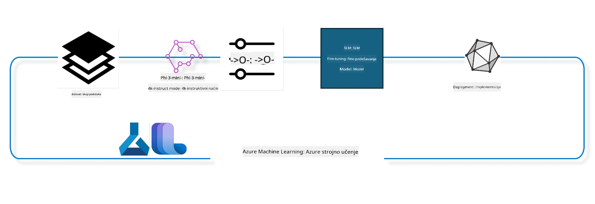

## Kako koristiti komponente za chat-dovršavanje iz Azure ML sistemskog registra za fino podešavanje modela

U ovom primjeru ćemo poduzeti fino podešavanje modela Phi-3-mini-4k-instruct za dovršavanje razgovora između 2 osobe koristeći ultrachat_200k skup podataka.



Primjer će vam pokazati kako poduzeti fino podešavanje koristeći Azure ML SDK i Python, a zatim implementirati fino podešeni model na online krajnju tačku za inferenciju u realnom vremenu.

### Podaci za treniranje

Koristit ćemo skup podataka ultrachat_200k. Ovo je snažno filtrirana verzija UltraChat skupa podataka i koristila se za treniranje Zephyr-7B-β, vrhunskog 7b chat modela.

### Model

Koristit ćemo model Phi-3-mini-4k-instruct da pokažemo kako korisnik može fino podesiti model za zadatak chat-dovršavanja. Ako ste otvorili ovu bilježnicu iz specifične kartice modela, zapamtite da zamijenite specifično ime modela.

### Zadaci

- Odaberite model za fino podešavanje.
- Odaberite i istražite podatke za treniranje.
- Konfigurirajte posao fino podešavanja.
- Pokrenite posao fino podešavanja.
- Pregledajte metrike treniranja i evaluacije.
- Registrirajte fino podešeni model.
- Implementirajte fino podešeni model za inferenciju u realnom vremenu.
- Očistite resurse.

## 1. Postavljanje preduvjeta

- Instalirajte ovisnosti
- Spojite se na AzureML Workspace. Više o tome saznajte na set up SDK authentication. Zamijenite <WORKSPACE_NAME>, <RESOURCE_GROUP> i <SUBSCRIPTION_ID> ispod.
- Spojite se na azureml sistemski registar
- Postavite opcionalni naziv eksperimenta
- Provjerite ili kreirajte računalo.

> [!NOTE]
> Zahtjevi jedan GPU čvor može imati više GPU kartica. Primjerice, u jednom čvoru Standard_NC24rs_v3 ima 4 NVIDIA V100 GPU-a dok u Standard_NC12s_v3 ima 2 NVIDIA V100 GPU-a. Pogledajte dokumentaciju za ove informacije. Broj GPU kartica po čvoru postavlja se u parametru gpus_per_node ispod. Ispravno podešavanje ove vrijednosti osigurava iskorištavanje svih GPU-a u čvoru. Preporučeni GPU compute SKU-ovi dostupni su ovdje i ovdje.

### Python biblioteke

Instalirajte ovisnosti pokretanjem donjeg bloka. Ovo nije opcionalni korak ako pokrećete u novom okruženju.

```bash
pip install azure-ai-ml
pip install azure-identity
pip install datasets==2.9.0
pip install mlflow
pip install azureml-mlflow
```

### Interakcija s Azure ML

1. Ovaj Python skript koristi se za interakciju s Azure Machine Learning (Azure ML) servisom. Evo što radi:

    - Uvozi potrebne module iz azure.ai.ml, azure.identity i azure.ai.ml.entities paketa. Također uvozi modul time.

    - Pokušava se autentificirati koristeći DefaultAzureCredential(), koji pruža pojednostavljeni način autentikacije za brzo započinjanje razvoja aplikacija u Azure oblaku. Ako to ne uspije, pada na InteractiveBrowserCredential(), koji pruža interaktivni login prompt.

    - Zatim pokušava stvoriti instancu MLClient koristeći from_config metodu koja čita konfiguraciju iz zadanog konfiguracijskog fajla (config.json). Ako to ne uspije, stvara instancu MLClient ručno pružajući subscription_id, resource_group_name i workspace_name.

    - Stvara još jednu MLClient instancu, ovaj put za Azure ML registar pod nazivom "azureml". Ovaj registar je mjesto gdje se pohranjuju modeli, pipeline-ovi za fino podešavanje i okruženja.

    - Postavlja naziv eksperimenta na "chat_completion_Phi-3-mini-4k-instruct".

    - Generira jedinstveni vremenski žig pretvarajući trenutno vrijeme (u sekundama od epohe, kao decimalni broj) u cijeli broj, zatim u string. Ovaj žig može se koristiti za stvaranje jedinstvenih naziva i verzija.

    ```python
    # Uvezi potrebne module iz Azure ML i Azure Identity
    from azure.ai.ml import MLClient
    from azure.identity import (
        DefaultAzureCredential,
        InteractiveBrowserCredential,
    )
    from azure.ai.ml.entities import AmlCompute
    import time  # Uvezi time modul
    
    # Pokušaj autentifikaciju koristeći DefaultAzureCredential
    try:
        credential = DefaultAzureCredential()
        credential.get_token("https://management.azure.com/.default")
    except Exception as ex:  # Ako DefaultAzureCredential ne uspije, koristi InteractiveBrowserCredential
        credential = InteractiveBrowserCredential()
    
    # Pokušaj kreirati MLClient instancu koristeći zadanu konfiguracijsku datoteku
    try:
        workspace_ml_client = MLClient.from_config(credential=credential)
    except:  # Ako to ne uspije, kreiraj MLClient instancu tako da ručno uneseš detalje
        workspace_ml_client = MLClient(
            credential,
            subscription_id="<SUBSCRIPTION_ID>",
            resource_group_name="<RESOURCE_GROUP>",
            workspace_name="<WORKSPACE_NAME>",
        )
    
    # Kreiraj još jednu MLClient instancu za Azure ML registar nazvan "azureml"
    # Ovaj registar je mjesto gdje se pohranjuju modeli, fine-tuning pipelineovi i okruženja
    registry_ml_client = MLClient(credential, registry_name="azureml")
    
    # Postavi ime eksperimenta
    experiment_name = "chat_completion_Phi-3-mini-4k-instruct"
    
    # Generiraj jedinstveni vremenski žig koji se može koristiti za imena i verzije koje moraju biti jedinstvene
    timestamp = str(int(time.time()))
    ```

## 2. Odaberite osnovni model za fino podešavanje

1. Phi-3-mini-4k-instruct je lagani model s 3,8 milijardi parametara, vrhunski open model građen na skupovima podataka korištenim za Phi-2. Model pripada obitelji Phi-3 modela, a Mini verzija dolazi u dvije varijante 4K i 128K što je duljina konteksta (u tokenima) koju može podržati, potrebno je fino podesiti model za naš specifični cilj da bismo ga koristili. Možete pregledavati ove modele u Katalogu modela u AzureML Studiju filtrirajući po zadatku chat-dovršavanja. U ovom primjeru koristimo Phi-3-mini-4k-instruct model. Ako ste otvorili ovu bilježnicu za drugi model, zamijenite ime i verziju modela u skladu s tim.

> [!NOTE]
> id svojstvo modela. Ono će biti proslijeđeno kao ulaz u posao fino podešavanja. Također je dostupno kao polje Asset ID na stranici detalja modela u AzureML Studio Katalogu modela.

2. Ovaj Python skript komunicira s Azure Machine Learning (Azure ML) servisom. Evo što radi:

    - Postavlja model_name na "Phi-3-mini-4k-instruct".

    - Koristi get metodu models svojstva registry_ml_client objekta da bi dohvatila najnoviju verziju modela s navedenim imenom iz Azure ML registra. Metoda get poziva se s dva argumenta: naziv modela i oznaka koja specificira da treba dohvatiti najnoviju verziju modela.

    - Ispisuje poruku u konzolu indicirajući ime, verziju i id modela koji će se koristiti za fino podešavanje. Metoda format niza koristi se za umetanje imena, verzije i id modela u poruku. Ime, verzija i id modela pristupaju se kao svojstva objekta foundation_model.

    ```python
    # Postavi naziv modela
    model_name = "Phi-3-mini-4k-instruct"
    
    # Dohvati najnoviju verziju modela iz Azure ML registra
    foundation_model = registry_ml_client.models.get(model_name, label="latest")
    
    # Ispiši naziv modela, verziju i id
    # Ove informacije su korisne za praćenje i otklanjanje pogrešaka
    print(
        "\n\nUsing model name: {0}, version: {1}, id: {2} for fine tuning".format(
            foundation_model.name, foundation_model.version, foundation_model.id
        )
    )
    ```

## 3. Kreirajte računalo za uporabu u poslu

Posao fino podešavanja radi SAMO s GPU računalom. Veličina računala ovisi o veličini modela i u većini slučajeva postane teško odabrati pravo računalo za posao. U ovom bloku vodi se korisnik da odabere ispravno računalo za posao.

> [!NOTE]
> Računala navedena ispod rade s najoptimalnijom konfiguracijom. Bilo kakve promjene konfiguracije mogu dovesti do Cuda Out Of Memory greške. U takvim slučajevima pokušajte nadograditi računalo na veću veličinu.

> [!NOTE]
> Prilikom odabira compute_cluster_size ispod, provjerite je li računalo dostupno u vašoj resource grupi. Ako neko računalo nije dostupno, možete podnijeti zahtjev za pristup računalnim resursima.

### Provjera modela za podršku fino podešavanje

1. Ovaj Python skript komunicira s Azure Machine Learning (Azure ML) modelom. Evo što radi:

    - Uvozi modul ast, koji pruža funkcije za obradu stabala Python apstraktne sintakse.

    - Provjerava ima li objekt foundation_model (koji predstavlja model u Azure ML) oznaku pod nazivom finetune_compute_allow_list. Oznake u Azure ML su parovi ključ-vrijednost koje možete kreirati i koristiti za filtriranje i sortiranje modela.

    - Ako oznaka finetune_compute_allow_list postoji, koristi ast.literal_eval funkciju za sigurno parsiranje vrijednosti oznake (string) u Python listu. Ta se lista zatim pridružuje varijabli computes_allow_list. Ispisuje poruku da bi se trebalo kreirati računalo s popisa.

    - Ako oznaka finetune_compute_allow_list nije prisutna, postavlja computes_allow_list na None i ispisuje poruku da oznaka nije dio oznaka modela.

    - Ukratko, ovaj skript provjerava specifičnu oznaku u metapodacima modela, pretvara vrijednost oznake u listu ako postoji i daje feedback korisniku.

    ```python
    # Uvoz modula ast, koji pruža funkcije za obradu stabala Pythonske apstraktne sintaksne gramatike
    import ast
    
    # Provjeri je li oznaka 'finetune_compute_allow_list' prisutna u oznakama modela
    if "finetune_compute_allow_list" in foundation_model.tags:
        # Ako je oznaka prisutna, koristi ast.literal_eval za sigurno parsiranje vrijednosti oznake (stringa) u Python listu
        computes_allow_list = ast.literal_eval(
            foundation_model.tags["finetune_compute_allow_list"]
        )  # Pretvori string u Python listu
        # Ispiši poruku koja označava da se iz liste treba stvoriti compute
        print(f"Please create a compute from the above list - {computes_allow_list}")
    else:
        # Ako oznaka nije prisutna, postavi computes_allow_list na None
        computes_allow_list = None
        # Ispiši poruku koja označava da oznaka 'finetune_compute_allow_list' nije dio oznaka modela
        print("`finetune_compute_allow_list` is not part of model tags")
    ```

### Provjera Compute instance

1. Ovaj Python skript komunicira s Azure Machine Learning (Azure ML) servisom i vrši nekoliko provjera na jednoj compute instanci. Evo što radi:

    - Pokušava dohvatiti compute instancu s imenom spremljenim u compute_cluster iz Azure ML workspace-a. Ako je provisioning stanje instance "failed", baca ValueError.

    - Provjerava je li computes_allow_list različit od None. Ako jest, pretvara sve veličine računala na listi u mala slova i provjerava je li veličina tekuće compute instance na listi. Ako nije, baca ValueError.

    - Ako je computes_allow_list None, provjerava nalazi li se veličina compute instance na listi nepodržanih GPU VM veličina. Ako jest, baca ValueError.

    - Dohvaća listu svih dostupnih veličina računala u workspace-u. Zatim prolazi kroz listu i za svaku veličinu računala provjerava odgovara li ime veličini trenutačne compute instance. Ako odgovara, dohvaća broj GPU-a za tu veličinu i postavlja gpu_count_found na True.

    - Ako je gpu_count_found True, ispisuje broj GPU-ova na compute instanci. Ako je False, baca ValueError.

    - Ukratko, skript vrši nekoliko provjera na compute instanci u Azure ML workspace-u, uključujući provjeru provisioning stanja, veličine prema listi dopuštenih ili nedopuštenih, te broj GPU-a.
    
    ```python
    # Ispiši poruku iznimke
    print(e)
    # Podigni ValueError ako veličina izračuna nije dostupna u radnom prostoru
    raise ValueError(
        f"WARNING! Compute size {compute_cluster_size} not available in workspace"
    )
    
    # Dohvati instancu izračuna iz Azure ML radnog prostora
    compute = workspace_ml_client.compute.get(compute_cluster)
    # Provjeri je li stanje postavljanja instance izračuna "neuspjelo"
    if compute.provisioning_state.lower() == "failed":
        # Podigni ValueError ako je stanje postavljanja "neuspjelo"
        raise ValueError(
            f"Provisioning failed, Compute '{compute_cluster}' is in failed state. "
            f"please try creating a different compute"
        )
    
    # Provjeri nije li computes_allow_list None
    if computes_allow_list is not None:
        # Pretvori sve veličine izračuna u computes_allow_list u mala slova
        computes_allow_list_lower_case = [x.lower() for x in computes_allow_list]
        # Provjeri je li veličina instance izračuna u computes_allow_list_lower_case
        if compute.size.lower() not in computes_allow_list_lower_case:
            # Podigni ValueError ako veličina instance izračuna nije u computes_allow_list_lower_case
            raise ValueError(
                f"VM size {compute.size} is not in the allow-listed computes for finetuning"
            )
    else:
        # Definiraj popis nepodržanih GPU VM veličina
        unsupported_gpu_vm_list = [
            "standard_nc6",
            "standard_nc12",
            "standard_nc24",
            "standard_nc24r",
        ]
        # Provjeri je li veličina instance izračuna u unsupported_gpu_vm_list
        if compute.size.lower() in unsupported_gpu_vm_list:
            # Podigni ValueError ako je veličina instance izračuna u unsupported_gpu_vm_list
            raise ValueError(
                f"VM size {compute.size} is currently not supported for finetuning"
            )
    
    # Inicijaliziraj zastavicu za provjeru je li broj GPU-ova u instanci izračuna pronađen
    gpu_count_found = False
    # Dohvati popis svih dostupnih veličina izračuna u radnom prostoru
    workspace_compute_sku_list = workspace_ml_client.compute.list_sizes()
    available_sku_sizes = []
    # Iteriraj preko popisa dostupnih veličina izračuna
    for compute_sku in workspace_compute_sku_list:
        available_sku_sizes.append(compute_sku.name)
        # Provjeri odgovara li naziv veličine izračuna veličini instance izračuna
        if compute_sku.name.lower() == compute.size.lower():
            # Ako odgovara, dohvati broj GPU-ova za tu veličinu izračuna i postavi gpu_count_found na True
            gpus_per_node = compute_sku.gpus
            gpu_count_found = True
    # Ako je gpu_count_found True, ispiši broj GPU-ova u instanci izračuna
    if gpu_count_found:
        print(f"Number of GPU's in compute {compute.size}: {gpus_per_node}")
    else:
        # Ako je gpu_count_found False, podigni ValueError
        raise ValueError(
            f"Number of GPU's in compute {compute.size} not found. Available skus are: {available_sku_sizes}."
            f"This should not happen. Please check the selected compute cluster: {compute_cluster} and try again."
        )
    ```

## 4. Odaberite skup podataka za fino podešavanje modela

1. Koristimo ultrachat_200k skup podataka. Skup podataka ima četiri podskupa, pogodne za Supervised fino podešavanje (sft).
Generacijsko rangiranje (gen). Broj primjera po podskupu prikazan je na sljedeći način:

    ```bash
    train_sft test_sft  train_gen  test_gen
    207865  23110  256032  28304
    ```

1. Sljedeći blokovi prikazuju osnovnu pripremu podataka za fino podešavanje:

### Vizualizirajte nekoliko redaka podataka

Želimo da ovaj primjer brzo prođe, pa spremamo train_sft, test_sft datoteke koje sadrže 5% već skraćenih redaka. To znači da će fino podešeni model imati nižu točnost, stoga ne bi smio biti korišten u stvarnom svijetu.
download-dataset.py se koristi za preuzimanje ultrachat_200k skupa podataka i pretvaranje skupa podataka u format koji komponenta za fino podešavanje može konzumirati. Također, budući da je skup podataka velik, ovdje imamo samo dio skupa.

1. Pokretanjem donjeg skripta preuzima se samo 5% podataka. Ovo se može povećati promjenom parametra dataset_split_pc na željeni postotak.

> [!NOTE]
> Neki jezični modeli imaju različite jezične kodove i stoga bi nazivi stupaca u skupu podataka trebali to odražavati.

1. Evo primjera kako podaci trebaju izgledati
Skup podataka za chat-dovršavanje pohranjen je u parquet formatu, gdje svaka stavka koristi sljedeću šemu:

    - Ovo je JSON (JavaScript Object Notation) dokument, popularni format za razmjenu podataka. Nije izvršni kod, nego način spremanja i prijenosa podataka. Evo pregleda njegove strukture:

    - "prompt": Ovaj ključ sadrži niz znakova koji predstavlja zadatak ili pitanje postavljeno AI asistentu.

    - "messages": Ovaj ključ drži niz objekata. Svaki objekt predstavlja poruku u razgovoru između korisnika i AI asistenta. Svaka poruka ima dva ključa:

    - "content": Ovaj ključ sadrži sadržaj poruke u obliku stringa.
    - "role": Ovaj ključ označava ulogu entiteta koji je poslao poruku. Može biti "user" ili "assistant".
    - "prompt_id": Ovaj ključ sadrži jedinstveni identifikator za prompt.

1. U ovom specifičnom JSON dokumentu, prikazan je razgovor gdje korisnik traži od AI asistenta da kreira protagonistu za distopijsku priču. Asistent odgovara, a korisnik traži više detalja. Asistent se slaže pružiti dodatne informacije. Cijeli razgovor povezan je s jedinstvenim prompt id-em.

    ```python
    {
        // The task or question posed to an AI assistant
        "prompt": "Create a fully-developed protagonist who is challenged to survive within a dystopian society under the rule of a tyrant. ...",
        
        // An array of objects, each representing a message in a conversation between a user and an AI assistant
        "messages":[
            {
                // The content of the user's message
                "content": "Create a fully-developed protagonist who is challenged to survive within a dystopian society under the rule of a tyrant. ...",
                // The role of the entity that sent the message
                "role": "user"
            },
            {
                // The content of the assistant's message
                "content": "Name: Ava\n\n Ava was just 16 years old when the world as she knew it came crashing down. The government had collapsed, leaving behind a chaotic and lawless society. ...",
                // The role of the entity that sent the message
                "role": "assistant"
            },
            {
                // The content of the user's message
                "content": "Wow, Ava's story is so intense and inspiring! Can you provide me with more details.  ...",
                // The role of the entity that sent the message
                "role": "user"
            }, 
            {
                // The content of the assistant's message
                "content": "Certainly! ....",
                // The role of the entity that sent the message
                "role": "assistant"
            }
        ],
        
        // A unique identifier for the prompt
        "prompt_id": "d938b65dfe31f05f80eb8572964c6673eddbd68eff3db6bd234d7f1e3b86c2af"
    }
    ```

### Preuzimanje podataka

1. Ovaj Python skript koristi se za preuzimanje skupa podataka pomoću pomoćnog skripta download-dataset.py. Evo što radi:

    - Uvozi modul os, koji pruža portabilan način korištenja funkcionalnosti ovisnih o operativnom sustavu.

    - Koristi os.system funkciju za pokretanje download-dataset.py skripta u shellu sa specifičnim argumentima iz naredbenog retka. Argumenti specificiraju skup podataka za preuzimanje (HuggingFaceH4/ultrachat_200k), direktorij u koji će se preuzeti (ultrachat_200k_dataset) i postotak skupa podataka za podjelu (5). os.system vraća status izlaza naredbe koju je pokrenula; taj status se sprema u varijablu exit_status.

    - Provjerava je li exit_status različit od 0. U Unix-like sustavima, izlazni status 0 obično znači da je naredba uspjela, dok svaka druga vrijednost označava grešku. Ako je exit_status različit od 0, baca Exception s porukom o pogrešci pri preuzimanju skupa podataka.

    - Ukratko, skript pokreće naredbu za preuzimanje skupa podataka koristeći pomoćni skript i baca iznimku ako naredba ne uspije.
    
    ```python
    # Uvezi os modul koji pruža način korištenja funkcionalnosti ovisnih o operativnom sustavu
    import os
    
    # Koristi funkciju os.system za pokretanje skripte download-dataset.py u shellu s određenim argumentima iz naredbenog retka
    # Argumenti specificiraju skup podataka za preuzimanje (HuggingFaceH4/ultrachat_200k), direktorij za preuzimanje (ultrachat_200k_dataset) i postotak skupa podataka za podjelu (5)
    # Funkcija os.system vraća izlazni status naredbe koju je izvršila; taj se status sprema u varijablu exit_status
    exit_status = os.system(
        "python ./download-dataset.py --dataset HuggingFaceH4/ultrachat_200k --download_dir ultrachat_200k_dataset --dataset_split_pc 5"
    )
    
    # Provjeri je li exit_status različit od 0
    # U Unix-sličnim operativnim sustavima, izlazni status 0 obično označava da je naredba uspješno izvedena, dok bilo koji drugi broj označava grešku
    # Ako exit_status nije 0, podigni iznimku (Exception) s porukom koja označava grešku pri preuzimanju skupa podataka
    if exit_status != 0:
        raise Exception("Error downloading dataset")
    ```

### Učitavanje podataka u DataFrame
1. Ovaj Python skript učitava JSON Lines datoteku u pandas DataFrame i prikazuje prvih 5 redaka. Evo pregleda što radi:

    - Uvozi pandas biblioteku, koja je moćna biblioteka za manipulaciju i analizu podataka.

    - Postavlja maksimalnu širinu stupca za pandas prikaz na 0. To znači da će se ispisati puni tekst svakog stupca bez skraćivanja kada se ispiše DataFrame.

    - Koristi funkciju pd.read_json za učitavanje datoteke train_sft.jsonl iz direktorija ultrachat_200k_dataset u DataFrame. Argument lines=True označava da je datoteka u JSON Lines formatu, gdje je svaki redak zasebni JSON objekt.

    - Koristi metodu head za prikaz prvih 5 redaka DataFrame-a. Ako DataFrame nema 5 redaka, prikazat će ih sve.

    - Ukratko, ovaj skript učitava JSON Lines datoteku u DataFrame i prikazuje prvih 5 redaka sa punim tekstom stupaca.
    
    ```python
    # Uvezi pandas biblioteku, koja je moćna biblioteka za manipulaciju i analizu podataka
    import pandas as pd
    
    # Postavi maksimalnu širinu stupca za opcije prikaza u pandas na 0
    # To znači da će se cijeli tekst svakog stupca prikazati bez skraćivanja kada se ispiše DataFrame
    pd.set_option("display.max_colwidth", 0)
    
    # Koristi pd.read_json funkciju za učitavanje datoteke train_sft.jsonl iz direktorija ultrachat_200k_dataset u DataFrame
    # Argument lines=True označava da je datoteka u JSON Lines formatu, gdje je svaki redak zaseban JSON objekt
    df = pd.read_json("./ultrachat_200k_dataset/train_sft.jsonl", lines=True)
    
    # Koristi metodu head za prikaz prvih 5 redaka DataFrame-a
    # Ako DataFrame ima manje od 5 redaka, prikazat će sve njih
    df.head()
    ```

## 5. Pošaljite zadatak fino podešavanja koristeći model i podatke kao ulaze

Kreirajte zadatak koji koristi komponentu pipeline za chat-completion. Saznajte više o svim parametrima koji se podržavaju za fino podešavanje.

### Definirajte parametre fino podešavanja

1. Parametri fino podešavanja mogu se podijeliti u 2 kategorije - parametri treninga, parametri optimizacije

1. Parametri treninga definiraju aspekte treniranja poput -

    - Optimizer i scheduler koji će se koristiti
    - Metriku za optimizaciju fino podešavanja
    - Broj koraka treniranja, veličinu batch-a i slično
    - Parametri optimizacije pomažu u optimizaciji GPU memorije i učinkovitom korištenju računalnih resursa.

1. Dolje su neki od parametara koji pripadaju ovoj kategoriji. Parametri optimizacije razlikuju se za svaki model i dolaze upakirani s modelom kako bi se nosili s tim razlikama.

    - Omogući deepspeed i LoRA
    - Omogući treniranje s miješanom preciznošću
    - Omogući treniranje na više čvorova

> [!NOTE]
> Nadzorovano fino podešavanje može rezultirati gubitkom poravnanja ili katastrofalnim zaboravom. Preporučujemo da provjerite taj problem i pokrenete fazu poravnanja nakon što završite fino podešavanje.

### Parametri fino podešavanja

1. Ovaj Python skript postavlja parametre za fino podešavanje modela strojnog učenja. Evo pregleda što radi:

    - Postavlja zadane parametre treninga kao što su broj epoha treniranja, veličine batch-a za trening i evaluaciju, stopu učenja i vrstu scheduler-a za stopu učenja.

    - Postavlja zadane parametre optimizacije kao što su primjena Layer-wise Relevance Propagation (LoRa) i DeepSpeed, te fazu DeepSpeed.

    - Kombinira parametre treninga i optimizacije u jedan rječnik nazvan finetune_parameters.

    - Provjerava ima li foundation_model model-specifične zadane parametre. Ako ih ima, ispisuje upozorenje i ažurira finetune_parameters rječnik s tim parametarskim vrijednostima. Funkcija ast.literal_eval se koristi za pretvorbu model-specifičnih zadataka iz stringa u Python rječnik.

    - Ispisuje konačni skup parametara za fino podešavanje koji će se koristiti za izvođenje.

    - Ukratko, ovaj skript postavlja i prikazuje parametre za fino podešavanje modela strojnog učenja, uz mogućnost nadjačavanja zadanih parametara model-specifičnim.

    ```python
    # Postavite zadane parametre treniranja kao što su broj epoha treniranja, veličine batcha za treniranje i evaluaciju, stopa učenja i tip planera stope učenja
    training_parameters = dict(
        num_train_epochs=3,
        per_device_train_batch_size=1,
        per_device_eval_batch_size=1,
        learning_rate=5e-6,
        lr_scheduler_type="cosine",
    )
    
    # Postavite zadane parametre optimizacije poput primjene Layer-wise Relevance Propagation (LoRa) i DeepSpeed-a, te DeepSpeed fazu
    optimization_parameters = dict(
        apply_lora="true",
        apply_deepspeed="true",
        deepspeed_stage=2,
    )
    
    # Kombinirajte parametre treniranja i optimizacije u jedan rječnik nazvan finetune_parameters
    finetune_parameters = {**training_parameters, **optimization_parameters}
    
    # Provjerite ima li foundation_model bilo kakve zadane parametre specifične za model
    # Ako ih ima, ispišite upozorenje i ažurirajte rječnik finetune_parameters tim zadanim parametrima specifičnim za model
    # Funkcija ast.literal_eval se koristi za pretvaranje model-specifičnih zadanih vrijednosti iz stringa u Python rječnik
    if "model_specific_defaults" in foundation_model.tags:
        print("Warning! Model specific defaults exist. The defaults could be overridden.")
        finetune_parameters.update(
            ast.literal_eval(  # pretvori string u Python rječnik
                foundation_model.tags["model_specific_defaults"]
            )
        )
    
    # Ispišite konačni skup parametara za fino podešavanje koji će se koristiti za izvođenje programa
    print(
        f"The following finetune parameters are going to be set for the run: {finetune_parameters}"
    )
    ```

### Pipeline za trening

1. Ovaj Python skript definira funkciju za generiranje prikaznog imena za pipeline treniranja strojnog učenja, a zatim poziva tu funkciju kako bi generirao i ispisao prikazno ime. Evo pregleda što radi:

1. Definirana je funkcija get_pipeline_display_name. Ova funkcija generira prikazno ime bazirano na raznim parametrima vezanim uz pipeline treniranja.

1. Unutar funkcije računa se ukupna veličina batch-a množenjem veličine batch-a po uređaju, broja koraka akumulacije gradijenata, broja GPU-ova po čvoru i broja upotrijebljenih čvorova za fino podešavanje.

1. Dohvaćaju se različiti drugi parametri poput tipa scheduler-a stope učenja, primjene DeepSpeed-a, faze DeepSpeed, primjene Layer-wise Relevance Propagation (LoRa), ograničenja broja sačuvanih provjera modela i maksimalne duljine sekvence.

1. Konstruira se niz koji uključuje sve te parametre, razdvojene crticama. Ako je DeepSpeed ili LoRa primijenjen, niz uključuje "ds" praćeno DeepSpeed fazom, ili "lora". Ako nije, uključuje "nods" odnosno "nolora".

1. Funkcija vraća taj niz, koji služi kao prikazno ime za pipeline treniranja.

1. Nakon definiranja funkcije, ona se poziva da generira prikazno ime, koje se zatim ispisuje.

1. Ukratko, ovaj skript generira prikazno ime za pipeline treniranja strojnog učenja na temelju raznih parametara, a zatim ispisuje to ime.

    ```python
    # Definirajte funkciju za generiranje prikaznog imena za pipeline treniranja
    def get_pipeline_display_name():
        # Izračunajte ukupnu veličinu paketa množenjem veličine paketa po uređaju, broja koraka akumulacije gradijenata, broja GPU-a po čvoru i broja čvorova korištenih za fino podešavanje
        batch_size = (
            int(finetune_parameters.get("per_device_train_batch_size", 1))
            * int(finetune_parameters.get("gradient_accumulation_steps", 1))
            * int(gpus_per_node)
            * int(finetune_parameters.get("num_nodes_finetune", 1))
        )
        # Dohvatite tip raspoređivača stope učenja
        scheduler = finetune_parameters.get("lr_scheduler_type", "linear")
        # Dohvatite je li primijenjen DeepSpeed
        deepspeed = finetune_parameters.get("apply_deepspeed", "false")
        # Dohvatite DeepSpeed fazu
        ds_stage = finetune_parameters.get("deepspeed_stage", "2")
        # Ako je DeepSpeed primijenjen, uključite "ds" praćeno DeepSpeed fazom u prikazno ime; ako nije, uključite "nods"
        if deepspeed == "true":
            ds_string = f"ds{ds_stage}"
        else:
            ds_string = "nods"
        # Dohvatite je li primijenjena slojevitodjelna relevantna propagacija (LoRa)
        lora = finetune_parameters.get("apply_lora", "false")
        # Ako je LoRa primijenjen, uključite "lora" u prikazno ime; ako nije, uključite "nolora"
        if lora == "true":
            lora_string = "lora"
        else:
            lora_string = "nolora"
        # Dohvatite ograničenje na broj model checkpointa koje treba zadržati
        save_limit = finetune_parameters.get("save_total_limit", -1)
        # Dohvatite maksimalnu duljinu sekvence
        seq_len = finetune_parameters.get("max_seq_length", -1)
        # Konstruirajte prikazno ime spajanjem svih ovih parametara, odvojenih crtama
        return (
            model_name
            + "-"
            + "ultrachat"
            + "-"
            + f"bs{batch_size}"
            + "-"
            + f"{scheduler}"
            + "-"
            + ds_string
            + "-"
            + lora_string
            + f"-save_limit{save_limit}"
            + f"-seqlen{seq_len}"
        )
    
    # Pozovite funkciju za generiranje prikaznog imena
    pipeline_display_name = get_pipeline_display_name()
    # Ispišite prikazno ime
    print(f"Display name used for the run: {pipeline_display_name}")
    ```

### Konfiguriranje Pipeline-a

Ovaj Python skript definira i konfigurira pipeline strojnog učenja koristeći Azure Machine Learning SDK. Evo pregleda što radi:

1. Uvozi potrebne module iz Azure AI ML SDK-a.

1. Dohvaća komponentu pipeline-a nazvanu "chat_completion_pipeline" iz registar.

1. Definira pipeline zadatak koristeći dekorator `@pipeline` i funkciju `create_pipeline`. Ime pipeline-a postavljeno je na `pipeline_display_name`.

1. Unutar funkcije `create_pipeline` inicijalizira dohvaćenu komponentu pipeline-a s raznim parametrima, uključujući put do modela, računalne klastere za različite faze, podjele skupa podataka za treniranje i testiranje, broj GPU-ova za fino podešavanje te druge parametre fino podešavanja.

1. Mapira izlaz radnog zadatka fino podešavanja na izlaz pipeline zadatka. To se radi kako bi se fino podešeni model mogao lako registrirati, što je potrebno za uvođenje modela u online ili batch endpoint.

1. Kreira instancu pipeline-a pozivom funkcije `create_pipeline`.

1. Postavlja postavku `force_rerun` pipeline-u na `True`, što znači da se neće koristiti predmemorirani rezultati prethodnih zadataka.

1. Postavlja postavku `continue_on_step_failure` pipeline-u na `False`, što znači da će se pipeline prekinuti ako neki korak ne uspije.

1. Ukratko, ovaj skript definira i konfigurira pipeline strojnog učenja za zadatak dovršetka chata koristeći Azure Machine Learning SDK.

    ```python
    # Uvoz nužnih modula iz Azure AI ML SDK-a
    from azure.ai.ml.dsl import pipeline
    from azure.ai.ml import Input
    
    # Dohvati komponentu cjevovoda nazvanu "chat_completion_pipeline" iz registra
    pipeline_component_func = registry_ml_client.components.get(
        name="chat_completion_pipeline", label="latest"
    )
    
    # Definiraj posao cjevovoda koristeći dekorator @pipeline i funkciju create_pipeline
    # Ime cjevovoda je postavljeno na pipeline_display_name
    @pipeline(name=pipeline_display_name)
    def create_pipeline():
        # Inicijaliziraj dohvaćenu komponentu cjevovoda s različitim parametrima
        # To uključuje putanju modela, računalne klastere za različite faze, skupove podataka za treniranje i testiranje, broj GPU-a za fino podešavanje i druge parametre fino podešavanja
        chat_completion_pipeline = pipeline_component_func(
            mlflow_model_path=foundation_model.id,
            compute_model_import=compute_cluster,
            compute_preprocess=compute_cluster,
            compute_finetune=compute_cluster,
            compute_model_evaluation=compute_cluster,
            # Preslikaj skupove podataka na parametre
            train_file_path=Input(
                type="uri_file", path="./ultrachat_200k_dataset/train_sft.jsonl"
            ),
            test_file_path=Input(
                type="uri_file", path="./ultrachat_200k_dataset/test_sft.jsonl"
            ),
            # Postavke treniranja
            number_of_gpu_to_use_finetuning=gpus_per_node,  # Postavljeno na broj GPU-a dostupnih u računalnom klasteru
            **finetune_parameters
        )
        return {
            # Preslikaj izlaz zadatka za fino podešavanje na izlaz posla cjevovoda
            # To se radi kako bismo lako mogli registrirati fino podešani model
            # Registracija modela je potrebna za implementaciju modela na online ili batch endpoint
            "trained_model": chat_completion_pipeline.outputs.mlflow_model_folder
        }
    
    # Kreiraj instancu cjevovoda pozivom funkcije create_pipeline
    pipeline_object = create_pipeline()
    
    # Ne koristi predmemorirane rezultate iz prethodnih poslova
    pipeline_object.settings.force_rerun = True
    
    # Postavi nastavak pri neuspjehu koraka na False
    # To znači da će se cjevovod zaustaviti ako bilo koji korak ne uspije
    pipeline_object.settings.continue_on_step_failure = False
    ```

### Pošaljite zadatak

1. Ovaj Python skript šalje zadatak pipeline-a strojnog učenja u Azure Machine Learning radni prostor i zatim čeka da se zadatak završi. Evo pregleda što radi:

    - Poziva metodu create_or_update objekta jobs u workspace_ml_client za slanje pipeline zadatka. Pipeline koji se izvodi specifikovan je varijablom pipeline_object, a eksperiment u okviru kojeg se zadatak izvodi je naveden varijablom experiment_name.

    - Zatim poziva metodu stream objekta jobs u workspace_ml_client kako bi čekao da pipeline zadatak završi. Zadatak se određuje po atributu name objekta pipeline_job.

    - Ukratko, ovaj skript šalje pipeline zadatak strojnog učenja u Azure Machine Learning radni prostor, zatim čeka da se zadatak dovrši.

    ```python
    # Pošaljite zadatak pipeline-a u Azure Machine Learning radni prostor
    # Pipeline koji će se izvršiti specificiran je s pipeline_object
    # Eksperiment pod kojim se zadatak izvršava specificiran je s experiment_name
    pipeline_job = workspace_ml_client.jobs.create_or_update(
        pipeline_object, experiment_name=experiment_name
    )
    
    # Pričekajte da zadatak pipeline-a završi
    # Zadatak koji se treba čekati specificiran je atributom name objekta pipeline_job
    workspace_ml_client.jobs.stream(pipeline_job.name)
    ```

## 6. Registrirajte fino podešeni model u radnom prostoru

Registrirat ćemo model iz izlaza zadatka fino podešavanja. Ovo će pratiti nasljeđivanje između fino podešenog modela i zadatka fino podešavanja. Zadatak fino podešavanja nadalje prati nasljeđivanje do temeljnog modela, podataka i koda za treniranje.

### Registracija ML modela

1. Ovaj Python skript registrira model strojnog učenja koji je treniran u Azure Machine Learning pipeline-u. Evo pregleda što radi:

    - Uvozi potrebne module iz Azure AI ML SDK-a.

    - Provjerava je li izlaz trained_model dostupan iz pipeline zadatka pozivom metode get objekta jobs u workspace_ml_client i pristupom njegovom atributu outputs.

    - Konstrukciju puta do treniranog modela radi formatiranjem stringa s imenom pipeline zadatka i imenom izlaza ("trained_model").

    - Definira ime za fino podešeni model dodavanjem "-ultrachat-200k" izvornom imenu modela i zamjenom svih kosa crta s crtama.

    - Priprema registraciju modela kreiranjem objekta Model s raznim parametrima, uključujući put do modela, tip modela (MLflow model), ime i verziju modela te opis modela.

    - Registrira model pozivom metode create_or_update objekta models u workspace_ml_client, kao argument prosljeđuje Model objekt.

    - Ispisuje registrirani model.

1. Ukratko, ovaj skript registrira model strojnog učenja koji je treniran u Azure Machine Learning pipeline-u.
    
    ```python
    # Uvezi potrebne module iz Azure AI ML SDK-a
    from azure.ai.ml.entities import Model
    from azure.ai.ml.constants import AssetTypes
    
    # Provjeri je li izlaz `trained_model` dostupan iz pipeline posla
    print("pipeline job outputs: ", workspace_ml_client.jobs.get(pipeline_job.name).outputs)
    
    # Konstruiraj put do istrenirane modele formatiranjem stringa s imenom pipeline posla i imenom izlaza ("trained_model")
    model_path_from_job = "azureml://jobs/{0}/outputs/{1}".format(
        pipeline_job.name, "trained_model"
    )
    
    # Definiraj ime za fino podešeni model dodavanjem "-ultrachat-200k" izvornom imenu modela i zamjenom svih kosa crta s crticama
    finetuned_model_name = model_name + "-ultrachat-200k"
    finetuned_model_name = finetuned_model_name.replace("/", "-")
    
    print("path to register model: ", model_path_from_job)
    
    # Pripremi se za registraciju modela stvaranjem Model objekta s različitim parametrima
    # To uključuje put do modela, tip modela (MLflow model), ime i verziju modela te opis modela
    prepare_to_register_model = Model(
        path=model_path_from_job,
        type=AssetTypes.MLFLOW_MODEL,
        name=finetuned_model_name,
        version=timestamp,  # Koristi vremensku oznaku kao verziju kako bi se izbjegao sukob verzija
        description=model_name + " fine tuned model for ultrachat 200k chat-completion",
    )
    
    print("prepare to register model: \n", prepare_to_register_model)
    
    # Registriraj model pozivanjem metode create_or_update objekta models u workspace_ml_client s Model objektom kao argumentom
    registered_model = workspace_ml_client.models.create_or_update(
        prepare_to_register_model
    )
    
    # Ispiši registrirani model
    print("registered model: \n", registered_model)
    ```

## 7. Postavite fino podešeni model na online endpoint

Online endpointi pružaju trajni REST API koji se može koristiti za integraciju s aplikacijama kojima je potreban model.

### Upravljajte Endpointom

1. Ovaj Python skript stvara upravljani online endpoint u Azure Machine Learning za registrirani model. Evo pregleda što radi:

    - Uvozi potrebne module iz Azure AI ML SDK-a.

    - Definira jedinstveno ime online endpointa dodavanjem vremenske oznake na string "ultrachat-completion-".

    - Priprema se za kreiranje online endpointa stvaranjem ManagedOnlineEndpoint objekta s raznim parametrima, uključujući ime endpointa, opis endpointa i način autentikacije ("key").

    - Kreira online endpoint pozivom metode begin_create_or_update workspace_ml_client-a s ManagedOnlineEndpoint objektom kao argumentom. Zatim čeka da se operacija stvaranja dovrši pozivom metode wait.

1. Ukratko, ovaj skript stvara upravljani online endpoint u Azure Machine Learning za registrirani model.

    ```python
    # Uvoz potrebnih modula iz Azure AI ML SDK-a
    from azure.ai.ml.entities import (
        ManagedOnlineEndpoint,
        ManagedOnlineDeployment,
        ProbeSettings,
        OnlineRequestSettings,
    )
    
    # Definiranje jedinstvenog imena za online endpoint dodavanjem vremenske oznake na niz "ultrachat-completion-"
    online_endpoint_name = "ultrachat-completion-" + timestamp
    
    # Priprema za stvaranje online endpointa kreiranjem ManagedOnlineEndpoint objekta s raznim parametrima
    # To uključuje ime endpointa, opis endpointa i način autentifikacije ("key")
    endpoint = ManagedOnlineEndpoint(
        name=online_endpoint_name,
        description="Online endpoint for "
        + registered_model.name
        + ", fine tuned model for ultrachat-200k-chat-completion",
        auth_mode="key",
    )
    
    # Stvaranje online endpointa pozivanjem metode begin_create_or_update objekta workspace_ml_client s ManagedOnlineEndpoint objektom kao argumentom
    # Zatim čekanje da se operacija stvaranja završi pozivanjem metode wait
    workspace_ml_client.begin_create_or_update(endpoint).wait()
    ```

> [!NOTE]
> Ovdje možete pronaći popis podržanih SKU-ova za postavljanje - [Popis SKU-ova za upravljane online endpoint-e](https://learn.microsoft.com/azure/machine-learning/reference-managed-online-endpoints-vm-sku-list)

### Postavljanje ML Modela

1. Ovaj Python skript postavlja registrirani model strojnog učenja na upravljani online endpoint u Azure Machine Learning. Evo pregleda što radi:

    - Uvozi modul ast, koji pruža funkcije za obradu stabala Python apstraktne sintaksne gramatike.

    - Postavlja tip instance za postavljanje na "Standard_NC6s_v3".

    - Provjerava postoji li oznaka inference_compute_allow_list u temeljnome modelu. Ako postoji, pretvara vrijednost oznake iz stringa u Python listu i dodjeljuje je varijabli inference_computes_allow_list. Ako ne postoji, postavlja inference_computes_allow_list na None.

    - Provjerava je li specificirani tip instance u dopuštenom popisu. Ako nije, ispisuje poruku tražeći da korisnik odabere tip instance s dopuštenog popisa.

    - Priprema se za kreiranje postavljanja stvaranjem ManagedOnlineDeployment objekta s raznim parametrima, uključujući ime postavljanja, ime endpointa, ID modela, tip instance i broj primjera, postavke liveness probe i zahtjeva.

    - Kreira postavljanje pozivom metode begin_create_or_update workspace_ml_client-a s ManagedOnlineDeployment objektom kao argumentom. Zatim čeka da se operacija dovrši pozivom metode wait.

    - Postavlja promet endpointa da usmjeri 100% prometa prema "demo" postavljanju.

    - Ažurira endpoint pozivom metode begin_create_or_update workspace_ml_client-a s endpoint objektom kao argumentom. Zatim čeka da se operacija ažuriranja dovrši pozivom metode result.

1. Ukratko, ovaj skript postavlja registrirani model strojnog učenja na upravljani online endpoint u Azure Machine Learning.

    ```python
    # Uvoz modula ast, koji pruža funkcije za obradu stabala apstraktne sintakse Pythona
    import ast
    
    # Postavi tip instance za implementaciju
    instance_type = "Standard_NC6s_v3"
    
    # Provjeri postoji li oznaka `inference_compute_allow_list` u osnovnom modelu
    if "inference_compute_allow_list" in foundation_model.tags:
        # Ako postoji, pretvori vrijednost oznake iz niza u Python listu i dodijeli je varijabli `inference_computes_allow_list`
        inference_computes_allow_list = ast.literal_eval(
            foundation_model.tags["inference_compute_allow_list"]
        )
        print(f"Please create a compute from the above list - {computes_allow_list}")
    else:
        # Ako ne postoji, postavi `inference_computes_allow_list` na `None`
        inference_computes_allow_list = None
        print("`inference_compute_allow_list` is not part of model tags")
    
    # Provjeri je li zadani tip instance na dopuštenom popisu
    if (
        inference_computes_allow_list is not None
        and instance_type not in inference_computes_allow_list
    ):
        print(
            f"`instance_type` is not in the allow listed compute. Please select a value from {inference_computes_allow_list}"
        )
    
    # Pripremi se za stvaranje implementacije stvaranjem objekta `ManagedOnlineDeployment` s raznim parametrima
    demo_deployment = ManagedOnlineDeployment(
        name="demo",
        endpoint_name=online_endpoint_name,
        model=registered_model.id,
        instance_type=instance_type,
        instance_count=1,
        liveness_probe=ProbeSettings(initial_delay=600),
        request_settings=OnlineRequestSettings(request_timeout_ms=90000),
    )
    
    # Kreiraj implementaciju pozivanjem metode `begin_create_or_update` objekta `workspace_ml_client` s objektom `ManagedOnlineDeployment` kao argumentom
    # Zatim pričekaj da operacija stvaranja završi pozivanjem metode `wait`
    workspace_ml_client.online_deployments.begin_create_or_update(demo_deployment).wait()
    
    # Postavi promet krajnje točke da usmjeri 100% prometa na implementaciju "demo"
    endpoint.traffic = {"demo": 100}
    
    # Ažuriraj krajnju točku pozivanjem metode `begin_create_or_update` objekta `workspace_ml_client` s objektom `endpoint` kao argumentom
    # Zatim pričekaj da operacija ažuriranja završi pozivanjem metode `result`
    workspace_ml_client.begin_create_or_update(endpoint).result()
    ```

## 8. Testirajte endpoint s uzorkom podataka

Dohvatit ćemo neke uzorke podataka iz testnog skupa podataka i poslati ih online endpointu za izvođenje inferencije. Zatim ćemo prikazati ocijenjene oznake zajedno s oznakama stvarne vrijednosti.

### Čitanje rezultata

1. Ovaj Python skript učitava JSON Lines datoteku u pandas DataFrame, uzima nasumični uzorak i resetira indeks. Evo pregleda što radi:

    - Učitava datoteku ./ultrachat_200k_dataset/test_gen.jsonl u pandas DataFrame. Funkcija read_json koristi se s argumentom lines=True jer je datoteka u JSON Lines formatu, gdje je svaki redak zaseban JSON objekt.

    - Uzima nasumični uzorak od 1 retka iz DataFrame-a. Funkcija sample koristi se s argumentom n=1 kako bi odabrala jedan nasumični redak.

    - Resetira indeks DataFrame-a. Funkcija reset_index koristi se s argumentom drop=True kako bi se izbrisao izvorni indeks i zamijenio novim indeksom s zadanim cjelobrojnim vrijednostima.

    - Prikazuje prvih 2 retka DataFrame-a koristeći funkciju head s argumentom 2. Međutim, budući da DataFrame sadrži samo jedan redak nakon uzorkovanja, prikazat će samo taj jedan redak.

1. Ukratko, ovaj skript učitava JSON Lines datoteku u pandas DataFrame, uzima nasumični uzorak od 1 retka, resetira indeks i prikazuje prvi redak.
    
    ```python
    # Uvoz biblioteke pandas
    import pandas as pd
    
    # Učitaj JSON Lines datoteku './ultrachat_200k_dataset/test_gen.jsonl' u pandas DataFrame
    # Argument 'lines=True' označava da je datoteka u JSON Lines formatu, gdje je svaki redak zaseban JSON objekt
    test_df = pd.read_json("./ultrachat_200k_dataset/test_gen.jsonl", lines=True)
    
    # Uzmi slučajni uzorak od 1 retka iz DataFrame-a
    # Argument 'n=1' specificira broj slučajnih redaka za odabir
    test_df = test_df.sample(n=1)
    
    # Resetiraj indeks DataFrame-a
    # Argument 'drop=True' označava da originalni indeks treba biti izbačen i zamijenjen novim indeksom sa zadanim cijelim vrijednostima
    # Argument 'inplace=True' označava da se DataFrame treba modificirati na licu mjesta (bez stvaranja novog objekta)
    test_df.reset_index(drop=True, inplace=True)
    
    # Prikaži prva 2 retka DataFrame-a
    # Međutim, budući da DataFrame nakon uzorkovanja sadrži samo jedan redak, prikazat će se samo taj jedan redak
    test_df.head(2)
    ```

### Kreiraj JSON objekt
1. Ovaj Python skript stvara JSON objekt sa specifičnim parametrima i sprema ga u datoteku. Evo pregleda što radi:

    - Uvozi json modul, koji pruža funkcije za rad s JSON podacima.

    - Stvara rječnik parameters s ključevima i vrijednostima koje predstavljaju parametre za model strojnog učenja. Ključevi su "temperature", "top_p", "do_sample" i "max_new_tokens", a njihove odgovarajuće vrijednosti su 0.6, 0.9, True i 200.

    - Stvara još jedan rječnik test_json s dva ključa: "input_data" i "params". Vrijednost "input_data" je drugi rječnik s ključevima "input_string" i "parameters". Vrijednost "input_string" je lista koja sadrži prvu poruku iz DataFramea test_df. Vrijednost "parameters" je rječnik parameters kreiran ranije. Vrijednost "params" je prazan rječnik.

    - Otvara datoteku nazvanu sample_score.json

    ```python
    # Uvezi json modul, koji pruža funkcije za rad s JSON podacima
    import json
    
    # Kreiraj rječnik `parameters` s ključevima i vrijednostima koje predstavljaju parametre za model strojnog učenja
    # Ključevi su "temperature", "top_p", "do_sample" i "max_new_tokens", a njihove pripadajuće vrijednosti su 0.6, 0.9, True i 200 redom
    parameters = {
        "temperature": 0.6,
        "top_p": 0.9,
        "do_sample": True,
        "max_new_tokens": 200,
    }
    
    # Kreiraj još jedan rječnik `test_json` s dva ključa: "input_data" i "params"
    # Vrijednost za "input_data" je drugi rječnik s ključevima "input_string" i "parameters"
    # Vrijednost za "input_string" je lista koja sadrži prvu poruku iz DataFrame-a `test_df`
    # Vrijednost za "parameters" je ranije kreirani rječnik `parameters`
    # Vrijednost za "params" je prazan rječnik
    test_json = {
        "input_data": {
            "input_string": [test_df["messages"][0]],
            "parameters": parameters,
        },
        "params": {},
    }
    
    # Otvori datoteku pod nazivom `sample_score.json` u direktoriju `./ultrachat_200k_dataset` u načinu pisanja
    with open("./ultrachat_200k_dataset/sample_score.json", "w") as f:
        # Zapiši rječnik `test_json` u datoteku u JSON formatu koristeći funkciju `json.dump`
        json.dump(test_json, f)
    ```

### Pozivanje Endpointa

1. Ovaj Python skript poziva online endpoint u Azure Machine Learning za ocjenjivanje JSON datoteke. Evo pregleda što radi:

    - Poziva metodu invoke svojstva online_endpoints objekta workspace_ml_client. Ova metoda se koristi za slanje zahtjeva online endpointu i dobivanje odgovora.

    - Navodi ime endpointa i implementacije pomoću argumenata endpoint_name i deployment_name. U ovom slučaju, ime endpointa je pohranjeno u varijabli online_endpoint_name, a ime implementacije je "demo".

    - Navodi putanju do JSON datoteke koja će se ocijeniti pomoću argumenta request_file. U ovom slučaju, datoteka je ./ultrachat_200k_dataset/sample_score.json.

    - Sprema odgovor sa endpointa u varijablu response.

    - Ispisuje sirovi odgovor.

1. Ukratko, ovaj skript poziva online endpoint u Azure Machine Learning kako bi ocijenio JSON datoteku i ispisuje odgovor.

    ```python
    # Pozovite online endpoint u Azure Machine Learning za ocjenu `sample_score.json` datoteke
    # Metoda `invoke` svojstva `online_endpoints` objekta `workspace_ml_client` koristi se za slanje zahtjeva online endpointu i dobivanje odgovora
    # Argument `endpoint_name` specificira naziv endpointa, koji je pohranjen u varijabli `online_endpoint_name`
    # Argument `deployment_name` specificira naziv implementacije, koji je "demo"
    # Argument `request_file` specificira put do JSON datoteke koja se ocjenjuje, a to je `./ultrachat_200k_dataset/sample_score.json`
    response = workspace_ml_client.online_endpoints.invoke(
        endpoint_name=online_endpoint_name,
        deployment_name="demo",
        request_file="./ultrachat_200k_dataset/sample_score.json",
    )
    
    # Ispiši sirovi odgovor sa endpointa
    print("raw response: \n", response, "\n")
    ```

## 9. Brisanje online endpointa

1. Nemojte zaboraviti izbrisati online endpoint, inače ćete ostaviti mjerač naplate aktivnim za računanje koje koristi endpoint. Ova linija Python koda briše online endpoint u Azure Machine Learning. Evo pregleda što radi:

    - Poziva metodu begin_delete svojstva online_endpoints objekta workspace_ml_client. Ova metoda se koristi za pokretanje brisanja online endpointa.

    - Navodi ime endpointa koji će se izbrisati pomoću argumenta name. U ovom slučaju, ime endpointa je pohranjeno u varijabli online_endpoint_name.

    - Poziva metodu wait da bi čekala dovršetak operacije brisanja. Ovo je blokirajuća operacija, što znači da će spriječiti da skripta nastavi dok brisanje ne bude završeno.

    - Ukratko, ova linija koda započinje brisanje online endpointa u Azure Machine Learning i čeka da se operacija završi.

    ```python
    # Izbrišite online endpoint u Azure Machine Learning
    # Metoda `begin_delete` svojstva `online_endpoints` objekta `workspace_ml_client` koristi se za pokretanje brisanja online endpointa
    # Argument `name` specificira ime endpointa koji će biti izbrisan, a pohranjeno je u varijabli `online_endpoint_name`
    # Metoda `wait` se poziva kako bi se čekalo na dovršetak operacije brisanja. Ovo je blokirajuća operacija, što znači da će spriječiti nastavak izvođenja skripte dok brisanje ne završi
    workspace_ml_client.online_endpoints.begin_delete(name=online_endpoint_name).wait()
    ```

---

<!-- CO-OP TRANSLATOR DISCLAIMER START -->
**Odricanje od odgovornosti**:
Ovaj dokument je preveden pomoću AI prevoditeljskog servisa [Co-op Translator](https://github.com/Azure/co-op-translator). Iako nastojimo postići točnost, imajte na umu da automatski prijevodi mogu sadržavati pogreške ili netočnosti. Izvorni dokument na izvornom jeziku treba smatrati autoritativnim izvorom. Za kritične informacije preporučuje se profesionalni ljudski prijevod. Ne snosimo odgovornost za bilo kakve nesporazume ili kriva tumačenja nastala upotrebom ovog prijevoda.
<!-- CO-OP TRANSLATOR DISCLAIMER END -->