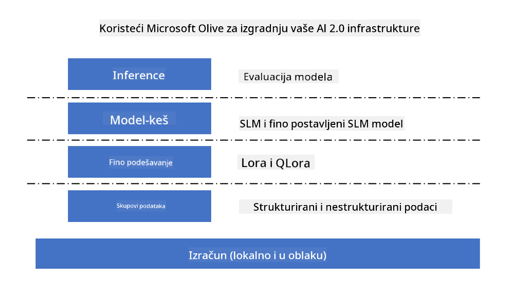
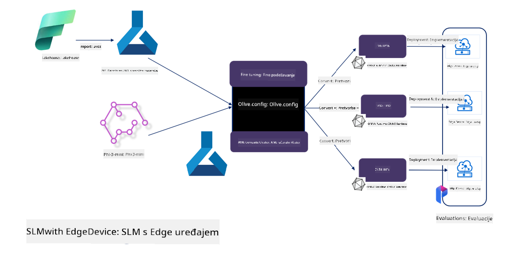

<!--
CO_OP_TRANSLATOR_METADATA:
{
  "original_hash": "5764be88ad2eb4f341e742eb8f14fab1",
  "translation_date": "2025-05-09T20:55:55+00:00",
  "source_file": "md/03.FineTuning/FineTuning_MicrosoftOlive.md",
  "language_code": "hr"
}
-->
# **Fino podešavanje Phi-3 s Microsoft Olive**

[Olive](https://github.com/microsoft/OLive?WT.mc_id=aiml-138114-kinfeylo) je jednostavan alat za optimizaciju modela prilagođen hardveru, koji objedinjuje vodeće industrijske tehnike kompresije, optimizacije i kompajliranja modela.

Dizajniran je da pojednostavi proces optimizacije modela strojnog učenja, osiguravajući njihovu maksimalnu učinkovitost na određenim hardverskim arhitekturama.

Bilo da radite na aplikacijama u oblaku ili na uređajima na rubu mreže, Olive vam omogućuje jednostavnu i učinkovitu optimizaciju modela.

## Ključne značajke:
- Olive objedinjuje i automatizira tehnike optimizacije za željene hardverske ciljeve.
- Niti jedna tehnika optimizacije ne odgovara svim scenarijima, stoga Olive omogućuje proširivost tako da stručnjaci iz industrije mogu integrirati svoje inovacije u optimizaciji.

## Smanjite inženjerski napor:
- Programeri često moraju učiti i koristiti više alatnih lanaca specifičnih za različite proizvođače hardvera kako bi pripremili i optimizirali trenirane modele za implementaciju.
- Olive pojednostavljuje ovaj proces automatiziranjem tehnika optimizacije za željeni hardver.

## Spremno za upotrebu E2E rješenje za optimizaciju:

Kombiniranjem i podešavanjem integriranih tehnika, Olive nudi jedinstveno rješenje za end-to-end optimizaciju.
Uzimaju se u obzir ograničenja poput točnosti i latencije tijekom optimizacije modela.

## Korištenje Microsoft Olive za fino podešavanje

Microsoft Olive je vrlo jednostavan alat otvorenog koda za optimizaciju modela koji pokriva i fino podešavanje i referencu u području generativne umjetne inteligencije. Potrebna je samo jednostavna konfiguracija, a u kombinaciji s korištenjem otvorenih malih jezičnih modela i pripadajućih runtime okruženja (AzureML / lokalni GPU, CPU, DirectML), moguće je automatskom optimizacijom dovršiti fino podešavanje ili referencu modela te pronaći najbolji model za implementaciju u oblak ili na uređaje na rubu mreže. Omogućuje tvrtkama da izgrade vlastite vertikalne industrijske modele lokalno i u oblaku.



## Fino podešavanje Phi-3 s Microsoft Olive



## Primjer koda i primjer za Phi-3 Olive
U ovom primjeru koristit ćete Olive za:

- Fino podešavanje LoRA adaptera za klasifikaciju fraza u Sad, Joy, Fear, Surprise.
- Spajanje težina adaptera u osnovni model.
- Optimizaciju i kvantizaciju modela u int4.

[Sample Code](../../code/03.Finetuning/olive-ort-example/README.md)

### Postavljanje Microsoft Olive

Instalacija Microsoft Olive je vrlo jednostavna, može se instalirati za CPU, GPU, DirectML i Azure ML

```bash
pip install olive-ai
```

Ako želite pokrenuti ONNX model na CPU-u, možete koristiti

```bash
pip install olive-ai[cpu]
```

Ako želite pokrenuti ONNX model na GPU-u, možete koristiti

```python
pip install olive-ai[gpu]
```

Ako želite koristiti Azure ML, koristite

```python
pip install git+https://github.com/microsoft/Olive#egg=olive-ai[azureml]
```

**Napomena**
Zahtjev za OS: Ubuntu 20.04 / 22.04

### **Microsoft Olive Config.json**

Nakon instalacije, različite postavke specifične za model možete konfigurirati kroz Config datoteku, uključujući podatke, računalne resurse, trening, implementaciju i generiranje modela.

**1. Podaci**

Microsoft Olive podržava treniranje na lokalnim i cloud podacima, što se može konfigurirati u postavkama.

*Postavke lokalnih podataka*

Jednostavno možete postaviti skup podataka za fino podešavanje, obično u json formatu, i prilagoditi ga predlošku podataka. Ovo treba prilagoditi zahtjevima modela (na primjer, prilagoditi formatu koji zahtijeva Microsoft Phi-3-mini. Ako koristite druge modele, molimo pogledajte potrebne formate za fino podešavanje tih modela)

```json

    "data_configs": [
        {
            "name": "dataset_default_train",
            "type": "HuggingfaceContainer",
            "load_dataset_config": {
                "params": {
                    "data_name": "json", 
                    "data_files":"dataset/dataset-classification.json",
                    "split": "train"
                }
            },
            "pre_process_data_config": {
                "params": {
                    "dataset_type": "corpus",
                    "text_cols": [
                            "phrase",
                            "tone"
                    ],
                    "text_template": "### Text: {phrase}\n### The tone is:\n{tone}",
                    "corpus_strategy": "join",
                    "source_max_len": 2048,
                    "pad_to_max_len": false,
                    "use_attention_mask": false
                }
            }
        }
    ],
```

**Postavke izvora podataka u oblaku**

Povezivanjem datastore-a Azure AI Studija/Azure Machine Learning Servisa za pristup podacima u oblaku, možete uvesti različite izvore podataka u Azure AI Studio/Azure Machine Learning Service putem Microsoft Fabric i Azure Data kao podršku za fino podešavanje podataka.

```json

    "data_configs": [
        {
            "name": "dataset_default_train",
            "type": "HuggingfaceContainer",
            "load_dataset_config": {
                "params": {
                    "data_name": "json", 
                    "data_files": {
                        "type": "azureml_datastore",
                        "config": {
                            "azureml_client": {
                                "subscription_id": "Your Azure Subscrition ID",
                                "resource_group": "Your Azure Resource Group",
                                "workspace_name": "Your Azure ML Workspaces name"
                            },
                            "datastore_name": "workspaceblobstore",
                            "relative_path": "Your train_data.json Azure ML Location"
                        }
                    },
                    "split": "train"
                }
            },
            "pre_process_data_config": {
                "params": {
                    "dataset_type": "corpus",
                    "text_cols": [
                            "Question",
                            "Best Answer"
                    ],
                    "text_template": "<|user|>\n{Question}<|end|>\n<|assistant|>\n{Best Answer}\n<|end|>",
                    "corpus_strategy": "join",
                    "source_max_len": 2048,
                    "pad_to_max_len": false,
                    "use_attention_mask": false
                }
            }
        }
    ],
    
```

**2. Konfiguracija računanja**

Ako radite lokalno, možete koristiti lokalne podatkovne resurse. Ako trebate koristiti resurse Azure AI Studija / Azure Machine Learning Servisa, potrebno je konfigurirati relevantne Azure parametre, ime računalnih resursa i slično.

```json

    "systems": {
        "aml": {
            "type": "AzureML",
            "config": {
                "accelerators": ["gpu"],
                "hf_token": true,
                "aml_compute": "Your Azure AI Studio / Azure Machine Learning Service Compute Name",
                "aml_docker_config": {
                    "base_image": "Your Azure AI Studio / Azure Machine Learning Service docker",
                    "conda_file_path": "conda.yaml"
                }
            }
        },
        "azure_arc": {
            "type": "AzureML",
            "config": {
                "accelerators": ["gpu"],
                "aml_compute": "Your Azure AI Studio / Azure Machine Learning Service Compute Name",
                "aml_docker_config": {
                    "base_image": "Your Azure AI Studio / Azure Machine Learning Service docker",
                    "conda_file_path": "conda.yaml"
                }
            }
        }
    },
```

***Napomena***

Budući da se izvršava unutar kontejnera na Azure AI Studiju/Azure Machine Learning Servisu, potrebno je konfigurirati okruženje. To se postavlja u conda.yaml datoteci.

```yaml

name: project_environment
channels:
  - defaults
dependencies:
  - python=3.8.13
  - pip=22.3.1
  - pip:
      - einops
      - accelerate
      - azure-keyvault-secrets
      - azure-identity
      - bitsandbytes
      - datasets
      - huggingface_hub
      - peft
      - scipy
      - sentencepiece
      - torch>=2.2.0
      - transformers
      - git+https://github.com/microsoft/Olive@jiapli/mlflow_loading_fix#egg=olive-ai[gpu]
      - --extra-index-url https://aiinfra.pkgs.visualstudio.com/PublicPackages/_packaging/ORT-Nightly/pypi/simple/ 
      - ort-nightly-gpu==1.18.0.dev20240307004
      - --extra-index-url https://aiinfra.pkgs.visualstudio.com/PublicPackages/_packaging/onnxruntime-genai/pypi/simple/
      - onnxruntime-genai-cuda

    

```

**3. Izbor SLM-a**

Model možete koristiti izravno s Hugging face-a ili ga možete kombinirati s Model Catalogom Azure AI Studija / Azure Machine Learning Servisa za odabir modela. U donjem primjeru koristimo Microsoft Phi-3-mini kao primjer.

Ako imate model lokalno, možete koristiti ovaj način

```json

    "input_model":{
        "type": "PyTorchModel",
        "config": {
            "hf_config": {
                "model_name": "model-cache/microsoft/phi-3-mini",
                "task": "text-generation",
                "model_loading_args": {
                    "trust_remote_code": true
                }
            }
        }
    },
```

Ako želite koristiti model iz Azure AI Studija / Azure Machine Learning Servisa, koristite ovaj način

```json

    "input_model":{
        "type": "PyTorchModel",
        "config": {
            "model_path": {
                "type": "azureml_registry_model",
                "config": {
                    "name": "microsoft/Phi-3-mini-4k-instruct",
                    "registry_name": "azureml-msr",
                    "version": "11"
                }
            },
             "model_file_format": "PyTorch.MLflow",
             "hf_config": {
                "model_name": "microsoft/Phi-3-mini-4k-instruct",
                "task": "text-generation",
                "from_pretrained_args": {
                    "trust_remote_code": true
                }
            }
        }
    },
```

**Napomena:**
Potrebna je integracija s Azure AI Studiom / Azure Machine Learning Servisom, stoga pri postavljanju modela obratite pažnju na verziju i povezane nazive.

Svi modeli na Azureu moraju biti postavljeni kao PyTorch.MLflow

Potrebno je imati Hugging face račun i povezati ključ s vrijednošću ključa u Azure AI Studiu / Azure Machine Learningu

**4. Algoritam**

Microsoft Olive vrlo dobro enkapsulira Lora i QLora algoritme za fino podešavanje. Potrebno je konfigurirati samo neke relevantne parametre. Ovdje koristim QLora kao primjer.

```json
        "lora": {
            "type": "LoRA",
            "config": {
                "target_modules": [
                    "o_proj",
                    "qkv_proj"
                ],
                "double_quant": true,
                "lora_r": 64,
                "lora_alpha": 64,
                "lora_dropout": 0.1,
                "train_data_config": "dataset_default_train",
                "eval_dataset_size": 0.3,
                "training_args": {
                    "seed": 0,
                    "data_seed": 42,
                    "per_device_train_batch_size": 1,
                    "per_device_eval_batch_size": 1,
                    "gradient_accumulation_steps": 4,
                    "gradient_checkpointing": false,
                    "learning_rate": 0.0001,
                    "num_train_epochs": 3,
                    "max_steps": 10,
                    "logging_steps": 10,
                    "evaluation_strategy": "steps",
                    "eval_steps": 187,
                    "group_by_length": true,
                    "adam_beta2": 0.999,
                    "max_grad_norm": 0.3
                }
            }
        },
```

Ako želite kvantizaciju, glavna grana Microsoft Olive već podržava onnxruntime-genai metodu. Možete postaviti prema svojim potrebama:

1. spojiti težine adaptera u osnovni model  
2. pretvoriti model u onnx model s potrebnom preciznošću pomoću ModelBuildera

na primjer, pretvaranje u kvantizirani INT4

```json

        "merge_adapter_weights": {
            "type": "MergeAdapterWeights"
        },
        "builder": {
            "type": "ModelBuilder",
            "config": {
                "precision": "int4"
            }
        }
```

**Napomena**  
- Ako koristite QLoRA, kvantizacija putem ONNXRuntime-genai trenutno nije podržana.

- Važno je naglasiti da gore navedene korake možete prilagoditi prema vlastitim potrebama. Nije nužno konfigurirati sve korake u potpunosti. Ovisno o vašim potrebama, možete izravno koristiti korake algoritma bez finog podešavanja. Na kraju je potrebno konfigurirati odgovarajuće engine-e.

```json

    "engine": {
        "log_severity_level": 0,
        "host": "aml",
        "target": "aml",
        "search_strategy": false,
        "execution_providers": ["CUDAExecutionProvider"],
        "cache_dir": "../model-cache/models/phi3-finetuned/cache",
        "output_dir" : "../model-cache/models/phi3-finetuned"
    }
```

**5. Završetak finog podešavanja**

Na komandnoj liniji izvršite u direktoriju olive-config.json

```bash
olive run --config olive-config.json  
```

**Odricanje od odgovornosti**:  
Ovaj dokument je preveden korištenjem AI prevoditeljskog servisa [Co-op Translator](https://github.com/Azure/co-op-translator). Iako težimo točnosti, imajte na umu da automatski prijevodi mogu sadržavati pogreške ili netočnosti. Izvorni dokument na izvornom jeziku treba smatrati službenim i autoritativnim izvorom. Za kritične informacije preporučuje se profesionalni ljudski prijevod. Ne snosimo odgovornost za bilo kakva nesporazumevanja ili pogrešna tumačenja proizašla iz korištenja ovog prijevoda.