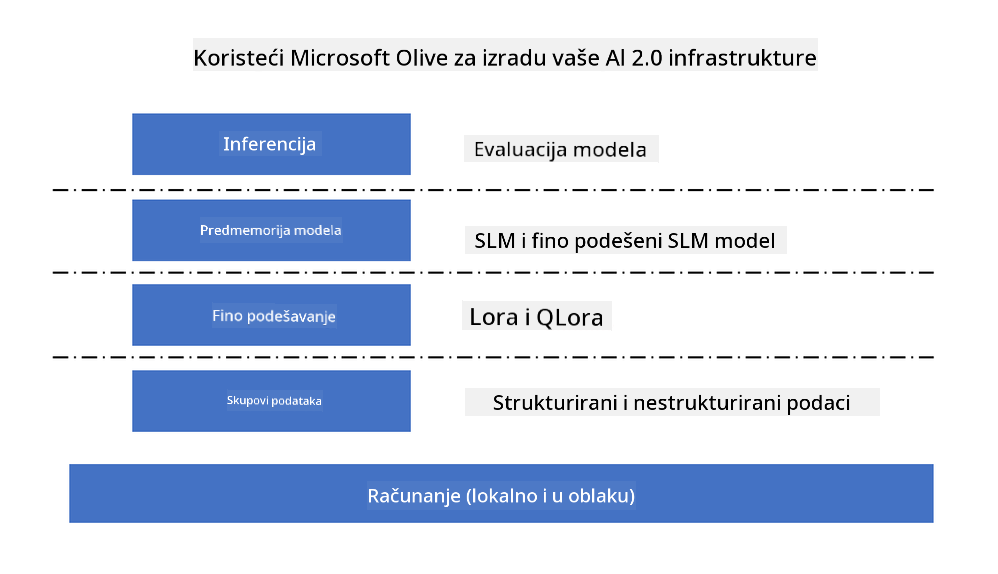

<!--
CO_OP_TRANSLATOR_METADATA:
{
  "original_hash": "5764be88ad2eb4f341e742eb8f14fab1",
  "translation_date": "2025-07-17T06:51:52+00:00",
  "source_file": "md/03.FineTuning/FineTuning_MicrosoftOlive.md",
  "language_code": "hr"
}
-->
# **Fino podešavanje Phi-3 s Microsoft Olive**

[Olive](https://github.com/microsoft/OLive?WT.mc_id=aiml-138114-kinfeylo) je jednostavan alat za optimizaciju modela svjestan hardvera koji objedinjuje vodeće industrijske tehnike kompresije, optimizacije i kompajliranja modela.

Dizajniran je da pojednostavi proces optimizacije modela strojnog učenja, osiguravajući njihovu maksimalnu učinkovitost na specifičnim hardverskim arhitekturama.

Bilo da radite na aplikacijama u oblaku ili na edge uređajima, Olive vam omogućuje da svoje modele optimizirate lako i učinkovito.

## Ključne značajke:
- Olive objedinjuje i automatizira tehnike optimizacije za željene hardverske ciljeve.
- Niti jedna tehnika optimizacije ne odgovara svim scenarijima, stoga Olive omogućuje proširivost tako da stručnjaci iz industrije mogu integrirati svoje inovacije u optimizaciji.

## Smanjite inženjerski napor:
- Programeri često moraju učiti i koristiti više alatnih lanaca specifičnih za različite proizvođače hardvera kako bi pripremili i optimizirali trenirane modele za implementaciju.
- Olive pojednostavljuje ovaj proces automatiziranjem tehnika optimizacije za željeni hardver.

## Spremno za korištenje E2E rješenje za optimizaciju:

Kombiniranjem i podešavanjem integriranih tehnika, Olive nudi jedinstveno rješenje za end-to-end optimizaciju.
Uzimaju se u obzir ograničenja poput točnosti i latencije tijekom optimizacije modela.

## Korištenje Microsoft Olive za fino podešavanje

Microsoft Olive je vrlo jednostavan za korištenje open source alat za optimizaciju modela koji može pokriti i fino podešavanje i referencu u području generativne umjetne inteligencije. Potrebna je samo jednostavna konfiguracija, u kombinaciji s korištenjem open source malih jezičnih modela i pripadajućih runtime okruženja (AzureML / lokalni GPU, CPU, DirectML), možete završiti fino podešavanje ili referencu modela kroz automatsku optimizaciju i pronaći najbolji model za implementaciju u oblak ili na edge uređaje. Omogućuje poduzećima da izgrade vlastite vertikalne industrijske modele lokalno i u oblaku.



## Phi-3 fino podešavanje s Microsoft Olive


## Phi-3 Olive Primjer koda i primjer
U ovom primjeru koristit ćete Olive za:

- Fino podešavanje LoRA adaptera za klasifikaciju fraza u kategorije Tužan, Radost, Strah, Iznenađenje.
- Spajanje težina adaptera u osnovni model.
- Optimizaciju i kvantizaciju modela u int4.

[Primjer koda](../../code/03.Finetuning/olive-ort-example/README.md)

### Postavljanje Microsoft Olive

Instalacija Microsoft Olive je vrlo jednostavna, a može se instalirati za CPU, GPU, DirectML i Azure ML

```bash
pip install olive-ai
```

Ako želite pokrenuti ONNX model na CPU-u, možete koristiti

```bash
pip install olive-ai[cpu]
```

Ako želite pokrenuti ONNX model na GPU-u, možete koristiti

```python
pip install olive-ai[gpu]
```

Ako želite koristiti Azure ML, koristite

```python
pip install git+https://github.com/microsoft/Olive#egg=olive-ai[azureml]
```

**Napomena**
Zahtjev za OS: Ubuntu 20.04 / 22.04

### **Microsoft Olive Config.json**

Nakon instalacije, možete konfigurirati različite postavke specifične za model kroz Config datoteku, uključujući podatke, računalne resurse, treniranje, implementaciju i generiranje modela.

**1. Podaci**

Na Microsoft Olive moguće je trenirati na lokalnim i cloud podacima, što se može konfigurirati u postavkama.

*Postavke lokalnih podataka*

Jednostavno možete postaviti skup podataka za treniranje za fino podešavanje, obično u json formatu, i prilagoditi ga prema predlošku podataka. Ovo treba prilagoditi prema zahtjevima modela (na primjer, prilagoditi formatu koji zahtijeva Microsoft Phi-3-mini. Ako imate druge modele, molimo pogledajte potrebne formate za fino podešavanje drugih modela).

```json

    "data_configs": [
        {
            "name": "dataset_default_train",
            "type": "HuggingfaceContainer",
            "load_dataset_config": {
                "params": {
                    "data_name": "json", 
                    "data_files":"dataset/dataset-classification.json",
                    "split": "train"
                }
            },
            "pre_process_data_config": {
                "params": {
                    "dataset_type": "corpus",
                    "text_cols": [
                            "phrase",
                            "tone"
                    ],
                    "text_template": "### Text: {phrase}\n### The tone is:\n{tone}",
                    "corpus_strategy": "join",
                    "source_max_len": 2048,
                    "pad_to_max_len": false,
                    "use_attention_mask": false
                }
            }
        }
    ],
```

**Postavke izvora podataka u oblaku**

Povezivanjem spremišta podataka Azure AI Studija/Azure Machine Learning Servisa za pristup podacima u oblaku, možete uvesti različite izvore podataka u Azure AI Studio/Azure Machine Learning Service putem Microsoft Fabrica i Azure Data kao podršku za fino podešavanje podataka.

```json

    "data_configs": [
        {
            "name": "dataset_default_train",
            "type": "HuggingfaceContainer",
            "load_dataset_config": {
                "params": {
                    "data_name": "json", 
                    "data_files": {
                        "type": "azureml_datastore",
                        "config": {
                            "azureml_client": {
                                "subscription_id": "Your Azure Subscrition ID",
                                "resource_group": "Your Azure Resource Group",
                                "workspace_name": "Your Azure ML Workspaces name"
                            },
                            "datastore_name": "workspaceblobstore",
                            "relative_path": "Your train_data.json Azure ML Location"
                        }
                    },
                    "split": "train"
                }
            },
            "pre_process_data_config": {
                "params": {
                    "dataset_type": "corpus",
                    "text_cols": [
                            "Question",
                            "Best Answer"
                    ],
                    "text_template": "<|user|>\n{Question}<|end|>\n<|assistant|>\n{Best Answer}\n<|end|>",
                    "corpus_strategy": "join",
                    "source_max_len": 2048,
                    "pad_to_max_len": false,
                    "use_attention_mask": false
                }
            }
        }
    ],
    
```

**2. Konfiguracija računalnih resursa**

Ako želite raditi lokalno, možete koristiti lokalne podatkovne resurse. Ako želite koristiti resurse Azure AI Studija / Azure Machine Learning Servisa, potrebno je konfigurirati relevantne Azure parametre, naziv računalne snage i slično.

```json

    "systems": {
        "aml": {
            "type": "AzureML",
            "config": {
                "accelerators": ["gpu"],
                "hf_token": true,
                "aml_compute": "Your Azure AI Studio / Azure Machine Learning Service Compute Name",
                "aml_docker_config": {
                    "base_image": "Your Azure AI Studio / Azure Machine Learning Service docker",
                    "conda_file_path": "conda.yaml"
                }
            }
        },
        "azure_arc": {
            "type": "AzureML",
            "config": {
                "accelerators": ["gpu"],
                "aml_compute": "Your Azure AI Studio / Azure Machine Learning Service Compute Name",
                "aml_docker_config": {
                    "base_image": "Your Azure AI Studio / Azure Machine Learning Service docker",
                    "conda_file_path": "conda.yaml"
                }
            }
        }
    },
```

***Napomena***

Budući da se izvršava kroz kontejner na Azure AI Studio/Azure Machine Learning Servisu, potrebno je konfigurirati odgovarajuće okruženje. To se radi u conda.yaml datoteci.

```yaml

name: project_environment
channels:
  - defaults
dependencies:
  - python=3.8.13
  - pip=22.3.1
  - pip:
      - einops
      - accelerate
      - azure-keyvault-secrets
      - azure-identity
      - bitsandbytes
      - datasets
      - huggingface_hub
      - peft
      - scipy
      - sentencepiece
      - torch>=2.2.0
      - transformers
      - git+https://github.com/microsoft/Olive@jiapli/mlflow_loading_fix#egg=olive-ai[gpu]
      - --extra-index-url https://aiinfra.pkgs.visualstudio.com/PublicPackages/_packaging/ORT-Nightly/pypi/simple/ 
      - ort-nightly-gpu==1.18.0.dev20240307004
      - --extra-index-url https://aiinfra.pkgs.visualstudio.com/PublicPackages/_packaging/onnxruntime-genai/pypi/simple/
      - onnxruntime-genai-cuda

    

```

**3. Odaberite svoj SLM**

Možete koristiti model direktno s Hugging Facea ili ga povezati s katalogom modela Azure AI Studija / Azure Machine Learninga za odabir modela. U donjem primjeru koristit ćemo Microsoft Phi-3-mini kao primjer.

Ako imate model lokalno, možete koristiti ovaj način

```json

    "input_model":{
        "type": "PyTorchModel",
        "config": {
            "hf_config": {
                "model_name": "model-cache/microsoft/phi-3-mini",
                "task": "text-generation",
                "model_loading_args": {
                    "trust_remote_code": true
                }
            }
        }
    },
```

Ako želite koristiti model iz Azure AI Studija / Azure Machine Learning Servisa, možete koristiti ovaj način

```json

    "input_model":{
        "type": "PyTorchModel",
        "config": {
            "model_path": {
                "type": "azureml_registry_model",
                "config": {
                    "name": "microsoft/Phi-3-mini-4k-instruct",
                    "registry_name": "azureml-msr",
                    "version": "11"
                }
            },
             "model_file_format": "PyTorch.MLflow",
             "hf_config": {
                "model_name": "microsoft/Phi-3-mini-4k-instruct",
                "task": "text-generation",
                "from_pretrained_args": {
                    "trust_remote_code": true
                }
            }
        }
    },
```

**Napomena:**
Potrebna je integracija s Azure AI Studio / Azure Machine Learning Servisom, stoga prilikom postavljanja modela obratite pažnju na verziju i povezane nazive.

Svi modeli na Azureu trebaju biti postavljeni kao PyTorch.MLflow

Potrebno je imati Hugging Face račun i povezati ključ s vrijednošću ključa u Azure AI Studio / Azure Machine Learning

**4. Algoritam**

Microsoft Olive vrlo dobro enkapsulira Lora i QLora algoritme za fino podešavanje. Potrebno je konfigurirati samo neke relevantne parametre. Ovdje uzimam QLora kao primjer.

```json
        "lora": {
            "type": "LoRA",
            "config": {
                "target_modules": [
                    "o_proj",
                    "qkv_proj"
                ],
                "double_quant": true,
                "lora_r": 64,
                "lora_alpha": 64,
                "lora_dropout": 0.1,
                "train_data_config": "dataset_default_train",
                "eval_dataset_size": 0.3,
                "training_args": {
                    "seed": 0,
                    "data_seed": 42,
                    "per_device_train_batch_size": 1,
                    "per_device_eval_batch_size": 1,
                    "gradient_accumulation_steps": 4,
                    "gradient_checkpointing": false,
                    "learning_rate": 0.0001,
                    "num_train_epochs": 3,
                    "max_steps": 10,
                    "logging_steps": 10,
                    "evaluation_strategy": "steps",
                    "eval_steps": 187,
                    "group_by_length": true,
                    "adam_beta2": 0.999,
                    "max_grad_norm": 0.3
                }
            }
        },
```

Ako želite kvantizacijsku konverziju, glavna grana Microsoft Olive već podržava onnxruntime-genai metodu. Možete je postaviti prema svojim potrebama:

1. spojiti težine adaptera u osnovni model  
2. pretvoriti model u onnx model s potrebnom preciznošću pomoću ModelBuildera

na primjer, pretvaranje u kvantizirani INT4

```json

        "merge_adapter_weights": {
            "type": "MergeAdapterWeights"
        },
        "builder": {
            "type": "ModelBuilder",
            "config": {
                "precision": "int4"
            }
        }
```

**Napomena**  
- Ako koristite QLoRA, kvantizacijska konverzija ONNXRuntime-genai trenutno nije podržana.

- Važno je napomenuti da gore navedene korake možete prilagoditi prema vlastitim potrebama. Nije nužno konfigurirati sve korake u potpunosti. Ovisno o potrebama, možete koristiti samo korake algoritma bez fino podešavanja. Na kraju je potrebno konfigurirati relevantne engine-e.

```json

    "engine": {
        "log_severity_level": 0,
        "host": "aml",
        "target": "aml",
        "search_strategy": false,
        "execution_providers": ["CUDAExecutionProvider"],
        "cache_dir": "../model-cache/models/phi3-finetuned/cache",
        "output_dir" : "../model-cache/models/phi3-finetuned"
    }
```

**5. Završetak fino podešavanja**

Na komandnoj liniji izvršite u direktoriju s olive-config.json

```bash
olive run --config olive-config.json  
```

**Odricanje od odgovornosti**:  
Ovaj dokument je preveden korištenjem AI usluge za prevođenje [Co-op Translator](https://github.com/Azure/co-op-translator). Iako težimo točnosti, imajte na umu da automatski prijevodi mogu sadržavati pogreške ili netočnosti. Izvorni dokument na izvornom jeziku treba smatrati autoritativnim izvorom. Za kritične informacije preporučuje se profesionalni ljudski prijevod. Ne snosimo odgovornost za bilo kakva nesporazuma ili pogrešna tumačenja koja proizlaze iz korištenja ovog prijevoda.