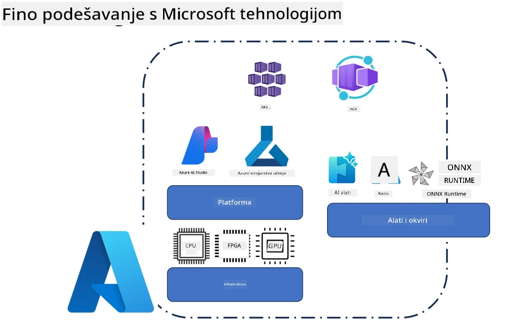
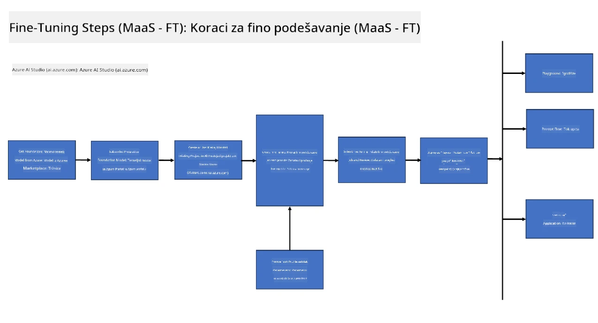
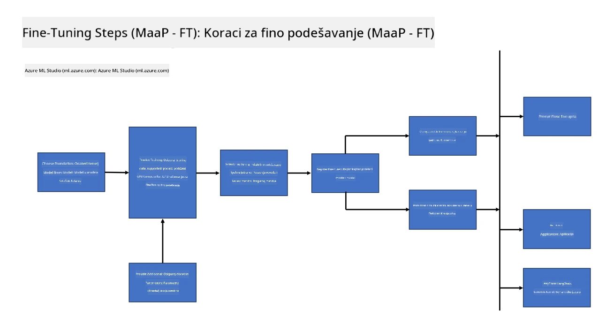

<!--
CO_OP_TRANSLATOR_METADATA:
{
  "original_hash": "cb5648935f63edc17e95ce38f23adc32",
  "translation_date": "2025-07-17T08:31:00+00:00",
  "source_file": "md/03.FineTuning/FineTuning_Scenarios.md",
  "language_code": "hr"
}
-->
## Scenariji fino podešavanja

**Platforma** Obuhvaća različite tehnologije poput Azure AI Foundry, Azure Machine Learning, AI Tools, Kaito i ONNX Runtime.

**Infrastruktura** Uključuje CPU i FPGA, koji su ključni za proces fino podešavanja. Dopustite da vam pokažem ikone za svaku od ovih tehnologija.

**Alati i okviri** Obuhvaća ONNX Runtime i ONNX Runtime. Dopustite da vam pokažem ikone za svaku od ovih tehnologija.  
[Umetnite ikone za ONNX Runtime i ONNX Runtime]

Proces fino podešavanja s Microsoft tehnologijama uključuje različite komponente i alate. Razumijevanjem i korištenjem ovih tehnologija možemo učinkovito fino podesiti naše aplikacije i stvoriti bolje rješenja.

## Model kao usluga

Fino podesite model koristeći hostano fino podešavanje, bez potrebe za kreiranjem i upravljanjem računalnim resursima.

Serverless fino podešavanje dostupno je za modele Phi-3-mini i Phi-3-medium, omogućujući developerima brzo i jednostavno prilagođavanje modela za cloud i edge scenarije bez potrebe za organiziranjem računalnih resursa. Također smo najavili da je Phi-3-small sada dostupan kroz našu ponudu Models-as-a-Service, pa developeri mogu brzo i lako započeti s AI razvojem bez upravljanja osnovnom infrastrukturom.

## Model kao platforma

Korisnici sami upravljaju svojim računalnim resursima kako bi fino podesili svoje modele.

[Primjer fino podešavanja](https://github.com/Azure/azureml-examples/blob/main/sdk/python/foundation-models/system/finetune/chat-completion/chat-completion.ipynb)

## Scenariji fino podešavanja

| | | | | | | |
|-|-|-|-|-|-|-|
|Scenarij|LoRA|QLoRA|PEFT|DeepSpeed|ZeRO|DORA|
|Prilagodba unaprijed treniranih LLM-ova za specifične zadatke ili domene|Da|Da|Da|Da|Da|Da|
|Fino podešavanje za NLP zadatke poput klasifikacije teksta, prepoznavanja imenovanih entiteta i strojno prevođenje|Da|Da|Da|Da|Da|Da|
|Fino podešavanje za QA zadatke|Da|Da|Da|Da|Da|Da|
|Fino podešavanje za generiranje odgovora nalik ljudskim u chatbotovima|Da|Da|Da|Da|Da|Da|
|Fino podešavanje za generiranje glazbe, umjetnosti ili drugih oblika kreativnosti|Da|Da|Da|Da|Da|Da|
|Smanjenje računalnih i financijskih troškova|Da|Da|Ne|Da|Da|Ne|
|Smanjenje potrošnje memorije|Ne|Da|Ne|Da|Da|Da|
|Korištenje manjeg broja parametara za učinkovito fino podešavanje|Ne|Da|Da|Ne|Ne|Da|
|Memorijski učinkovit oblik paralelizma podataka koji omogućuje pristup ukupnoj GPU memoriji svih dostupnih GPU uređaja|Ne|Ne|Ne|Da|Da|Da|

## Primjeri performansi fino podešavanja

**Odricanje od odgovornosti**:  
Ovaj dokument je preveden korištenjem AI usluge za prevođenje [Co-op Translator](https://github.com/Azure/co-op-translator). Iako težimo točnosti, imajte na umu da automatski prijevodi mogu sadržavati pogreške ili netočnosti. Izvorni dokument na izvornom jeziku treba smatrati službenim i autoritativnim izvorom. Za kritične informacije preporučuje se profesionalni ljudski prijevod. Ne snosimo odgovornost za bilo kakva nesporazuma ili pogrešna tumačenja koja proizlaze iz korištenja ovog prijevoda.