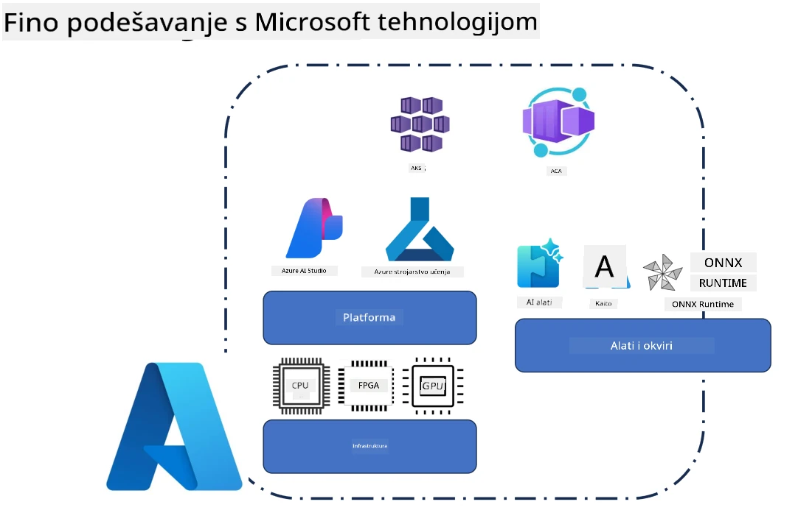
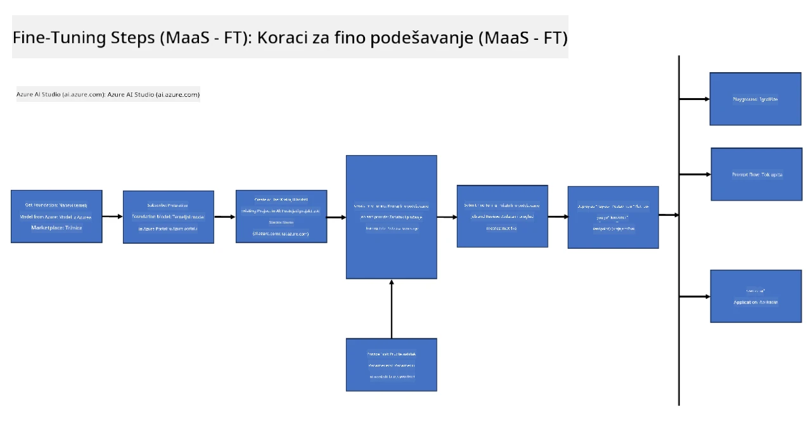
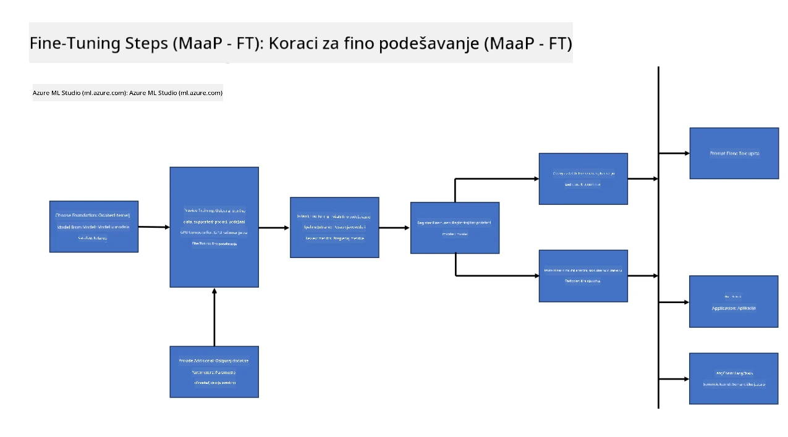
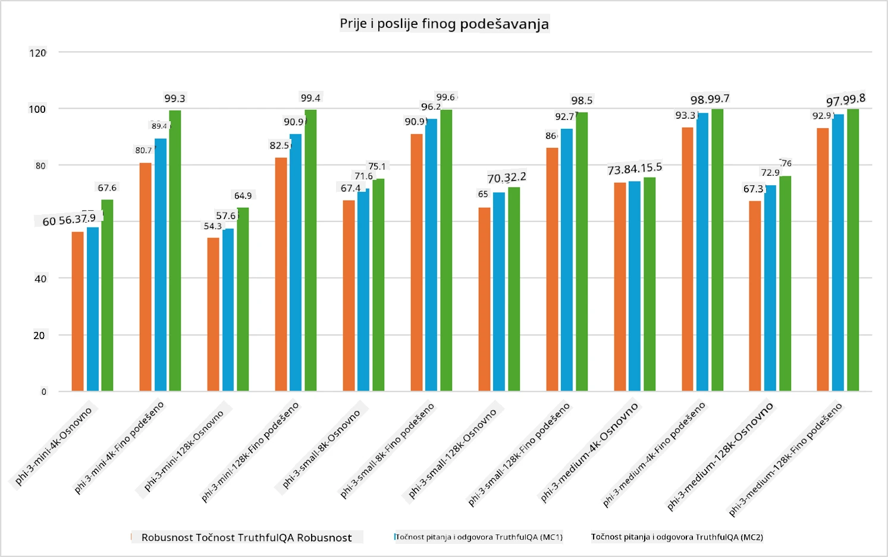

## Scenariji finog podešavanja

Ovaj odjeljak pruža pregled scenarija finog podešavanja u Microsoft Foundry i Azure okruženjima, uključujući modele implementacije, slojeve infrastrukture i često korištene tehnike optimizacije.

**Platforma**  
Obuhvaća upravljane usluge poput Microsoft Foundry (ranije Azure AI Foundry) i Azure Machine Learning, koje pružaju upravljanje modelima, orkestraciju, praćenje eksperimenata i tokove rada implementacije.

**Infrastruktura**  
Fino podešavanje zahtijeva skalabilne računalne resurse. U Azure okruženjima to obično uključuje virtualne strojeve s GPU-om i CPU resurse za lakša opterećenja, zajedno sa skalabilnom pohranom za skupove podataka i točke kontrole.

**Alati i okviri**  
Tokovi rada finog podešavanja često se oslanjaju na okvire i biblioteke za optimizaciju kao što su Hugging Face Transformers, DeepSpeed i PEFT (Parameter-Efficient Fine-Tuning).

Proces finog podešavanja s Microsoft tehnologijama obuhvaća usluge platforme, računalnu infrastrukturu i okvire za treniranje. Razumijevanjem kako ti dijelovi međusobno djeluju, programeri mogu učinkovito prilagoditi osnovne modele za specifične zadatke i proizvodne scenarije.

## Model kao usluga

Fino podesite model koristeći hostano fino podešavanje, bez potrebe za kreiranjem i upravljanjem računalnim resursima.

Serverless fino podešavanje sada je dostupno za obitelji modela Phi-3, Phi-3.5 i Phi-4, omogućujući programerima brzo i lako prilagođavanje modela za cloud i edge scenarije bez potrebe za organizacijom računalnih resursa.

## Model kao platforma

Korisnici upravljaju vlastitim računalnim resursima kako bi fino podesili svoje modele.

[Primjer finog podešavanja](https://github.com/Azure/azureml-examples/blob/main/sdk/python/foundation-models/system/finetune/chat-completion/chat-completion.ipynb)

## Usporedba tehnika finog podešavanja

|Scenarij|LoRA|QLoRA|PEFT|DeepSpeed|ZeRO|DoRA|
|---|---|---|---|---|---|---|
|Prilagodba prethodno istreniranih LLM modela specifičnim zadacima ili domenama|Da|Da|Da|Da|Da|Da|
|Fino podešavanje za NLP zadatke poput klasifikacije teksta, prepoznavanja imenovanih entiteta i strojno prevođenje|Da|Da|Da|Da|Da|Da|
|Fino podešavanje za QA zadatke|Da|Da|Da|Da|Da|Da|
|Fino podešavanje za generiranje odgovora nalik ljudskim u chatbotovima|Da|Da|Da|Da|Da|Da|
|Fino podešavanje za generiranje glazbe, umjetnosti ili drugih oblika kreativnosti|Da|Da|Da|Da|Da|Da|
|Smanjenje računalnih i financijskih troškova|Da|Da|Da|Da|Da|Da|
|Smanjenje potrošnje memorije|Da|Da|Da|Da|Da|Da|
|Korištenje manjeg broja parametara za učinkovito fino podešavanje|Da|Da|Da|Ne|Ne|Da|
|Memorijski učinkovita forma paralelizma podataka koja omogućuje pristup ukupnoj GPU memoriji svih dostupnih GPU uređaja|Ne|Ne|Ne|Da|Da|Ne|

> [!NOTE]
> LoRA, QLoRA, PEFT i DoRA su metode finog podešavanja efikasne po parametrima, dok se DeepSpeed i ZeRO fokusiraju na distribuirano treniranje i optimizaciju memorije.

## Primjeri performansi finog podešavanja

---

<!-- CO-OP TRANSLATOR DISCLAIMER START -->
**Odricanje od odgovornosti**:
Ovaj dokument je preveden koristeći AI uslugu za prijevod [Co-op Translator](https://github.com/Azure/co-op-translator). Iako nastojimo biti točni, imajte na umu da automatski prijevodi mogu sadržavati pogreške ili netočnosti. Izvorni dokument na izvornom jeziku smatra se autoritativnim izvorom. Za kritične informacije preporučuje se profesionalni ljudski prijevod. Ne snosimo odgovornost za bilo kakva nesporazuma ili kriva tumačenja koja proizlaze iz uporabe ovog prijevoda.
<!-- CO-OP TRANSLATOR DISCLAIMER END -->