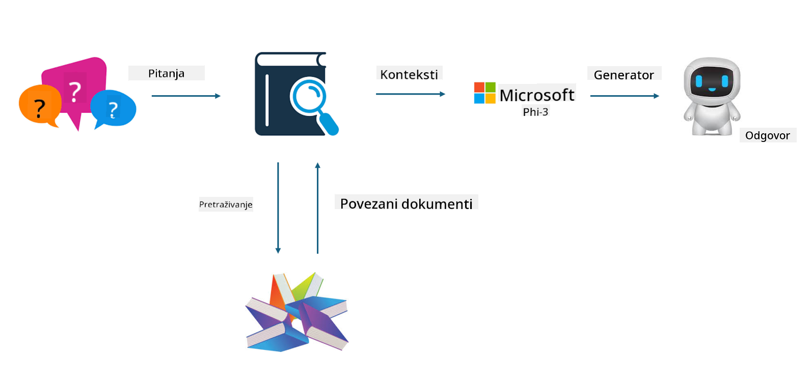

<!--
CO_OP_TRANSLATOR_METADATA:
{
  "original_hash": "e4e010400c2918557b36bb932a14004c",
  "translation_date": "2025-05-09T22:17:37+00:00",
  "source_file": "md/03.FineTuning/FineTuning_vs_RAG.md",
  "language_code": "hr"
}
-->
## Finetuning vs RAG

## Retrieval Augmented Generation

RAG je kombinacija dohvaćanja podataka i generiranja teksta. Strukturirani i nestrukturirani podaci poduzeća pohranjuju se u vektorsku bazu podataka. Prilikom pretraživanja relevantnog sadržaja pronalazi se odgovarajući sažetak i sadržaj koji čine kontekst, a zatim se koristi sposobnost dovršetka teksta LLM/SLM modela za generiranje sadržaja.

## RAG Process

## Fine-tuning
Fine-tuning se temelji na poboljšanju određenog modela. Nije potrebno počinjati od algoritma modela, ali podaci se moraju kontinuirano prikupljati. Ako želite precizniju terminologiju i izražavanje u industrijskim primjenama, fine-tuning je bolji izbor. No, ako se vaši podaci često mijenjaju, fine-tuning može postati kompliciran.

## How to choose
Ako naš odgovor zahtijeva uključivanje vanjskih podataka, RAG je najbolji izbor.

Ako trebate stabilan i precizan izlaz industrijskog znanja, fine-tuning će biti dobar izbor. RAG daje prednost pronalasku relevantnog sadržaja, ali možda neće uvijek pogoditi specifične nijanse.

Fine-tuning zahtijeva kvalitetan skup podataka, a ako se radi o malom opsegu podataka, neće donijeti veliku razliku. RAG je fleksibilniji.  
Fine-tuning je crna kutija, metafizika, i teško je razumjeti unutarnji mehanizam. No, RAG olakšava pronalaženje izvora podataka, što učinkovito pomaže u ispravljanju halucinacija ili pogrešaka u sadržaju te pruža veću transparentnost.

**Izjava o odricanju odgovornosti**:  
Ovaj dokument preveden je pomoću AI usluge za prijevod [Co-op Translator](https://github.com/Azure/co-op-translator). Iako težimo točnosti, imajte na umu da automatski prijevodi mogu sadržavati pogreške ili netočnosti. Izvorni dokument na izvornom jeziku treba smatrati službenim i autoritativnim izvorom. Za važne informacije preporučuje se profesionalni ljudski prijevod. Nismo odgovorni za bilo kakve nesporazume ili pogrešne interpretacije koje proizlaze iz korištenja ovog prijevoda.