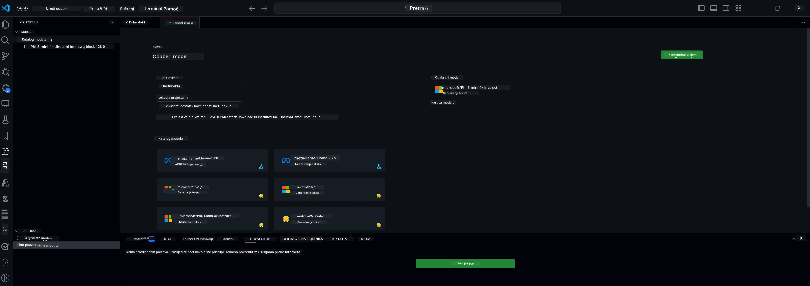

<!--
CO_OP_TRANSLATOR_METADATA:
{
  "original_hash": "c2bc0950f44919ac75a88c1a871680c2",
  "translation_date": "2025-07-17T09:22:55+00:00",
  "source_file": "md/03.FineTuning/Finetuning_VSCodeaitoolkit.md",
  "language_code": "hr"
}
-->
## Dobrodošli u AI Toolkit za VS Code

[AI Toolkit za VS Code](https://github.com/microsoft/vscode-ai-toolkit/tree/main) okuplja različite modele iz Azure AI Studio kataloga i drugih kataloga poput Hugging Face. Toolkit pojednostavljuje uobičajene razvojne zadatke za izradu AI aplikacija s generativnim AI alatima i modelima kroz:
- Početak rada s otkrivanjem modela i playgroundom.
- Fino podešavanje modela i izvođenje zaključivanja koristeći lokalne računalne resurse.
- Daljinsko fino podešavanje i izvođenje zaključivanja koristeći Azure resurse.

[Instalirajte AI Toolkit za VSCode](https://marketplace.visualstudio.com/items?itemName=ms-windows-ai-studio.windows-ai-studio)



**[Private Preview]** Jednim klikom omogućite Azure Container Apps za pokretanje fino podešavanja i izvođenja zaključivanja modela u oblaku.

Sada krenimo s razvojem vaše AI aplikacije:

- [Dobrodošli u AI Toolkit za VS Code](../../../../md/03.FineTuning)
- [Lokalni razvoj](../../../../md/03.FineTuning)
  - [Pripreme](../../../../md/03.FineTuning)
  - [Aktivacija Condu](../../../../md/03.FineTuning)
  - [Samo fino podešavanje osnovnog modela](../../../../md/03.FineTuning)
  - [Fino podešavanje modela i izvođenje zaključivanja](../../../../md/03.FineTuning)
  - [Fino podešavanje modela](../../../../md/03.FineTuning)
  - [Microsoft Olive](../../../../md/03.FineTuning)
  - [Primjeri i resursi za fino podešavanje](../../../../md/03.FineTuning)
- [**\[Private Preview\]** Daljinski razvoj](../../../../md/03.FineTuning)
  - [Preduvjeti](../../../../md/03.FineTuning)
  - [Postavljanje daljinskog razvojog projekta](../../../../md/03.FineTuning)
  - [Provision Azure resursa](../../../../md/03.FineTuning)
  - [\[Opcionalno\] Dodavanje Huggingface tokena u Azure Container App Secret](../../../../md/03.FineTuning)
  - [Pokretanje fino podešavanja](../../../../md/03.FineTuning)
  - [Provision inference endpointa](../../../../md/03.FineTuning)
  - [Deploy inference endpointa](../../../../md/03.FineTuning)
  - [Napredna upotreba](../../../../md/03.FineTuning)

## Lokalni razvoj
### Pripreme

1. Provjerite je li NVIDIA driver instaliran na hostu.
2. Pokrenite `huggingface-cli login` ako koristite HF za korištenje datasetova.
3. Objašnjenja postavki ključa `Olive` za sve što mijenja korištenje memorije.

### Aktivacija Conda
Budući da koristimo WSL okruženje koje je zajedničko, potrebno je ručno aktivirati conda okruženje. Nakon ovog koraka možete pokrenuti fino podešavanje ili izvođenje zaključivanja.

```bash
conda activate [conda-env-name] 
```

### Samo fino podešavanje osnovnog modela
Ako želite samo isprobati osnovni model bez fino podešavanja, nakon aktivacije conde pokrenite ovu naredbu.

```bash
cd inference

# Web browser interface allows to adjust a few parameters like max new token length, temperature and so on.
# User has to manually open the link (e.g. http://0.0.0.0:7860) in a browser after gradio initiates the connections.
python gradio_chat.py --baseonly
```

### Fino podešavanje modela i izvođenje zaključivanja

Kada je radni prostor otvoren u dev containeru, otvorite terminal (zadana putanja je korijen projekta), zatim pokrenite naredbu ispod za fino podešavanje LLM-a na odabranom datasetu.

```bash
python finetuning/invoke_olive.py 
```

Checkpoints i konačni model bit će spremljeni u mapu `models`.

Zatim pokrenite izvođenje zaključivanja s fino podešenim modelom kroz chatove u `console`, `web browser` ili `prompt flow`.

```bash
cd inference

# Console interface.
python console_chat.py

# Web browser interface allows to adjust a few parameters like max new token length, temperature and so on.
# User has to manually open the link (e.g. http://127.0.0.1:7860) in a browser after gradio initiates the connections.
python gradio_chat.py
```

Za korištenje `prompt flow` u VS Code-u, pogledajte ovaj [Quick Start](https://microsoft.github.io/promptflow/how-to-guides/quick-start.html).

### Fino podešavanje modela

Zatim preuzmite sljedeći model ovisno o dostupnosti GPU-a na vašem uređaju.

Za pokretanje lokalne sesije fino podešavanja koristeći QLoRA, odaberite model koji želite fino podesiti iz našeg kataloga.
| Platforma(e) | Dostupnost GPU-a | Naziv modela | Veličina (GB) |
|---------|---------|--------|--------|
| Windows | Da | Phi-3-mini-4k-**directml**-int4-awq-block-128-onnx | 2.13GB |
| Linux | Da | Phi-3-mini-4k-**cuda**-int4-onnx | 2.30GB |
| Windows<br>Linux | Ne | Phi-3-mini-4k-**cpu**-int4-rtn-block-32-acc-level-4-onnx | 2.72GB |

**_Napomena_** Nije vam potreban Azure račun za preuzimanje modela.

Phi3-mini (int4) model je veličine otprilike 2GB-3GB. Ovisno o brzini vaše mreže, preuzimanje može potrajati nekoliko minuta.

Počnite odabirom imena projekta i lokacije.
Zatim odaberite model iz kataloga modela. Bit ćete upitani da preuzmete predložak projekta. Nakon toga možete kliknuti "Configure Project" za podešavanje različitih postavki.

### Microsoft Olive

Koristimo [Olive](https://microsoft.github.io/Olive/why-olive.html) za pokretanje QLoRA fino podešavanja na PyTorch modelu iz našeg kataloga. Sve postavke su unaprijed zadane s default vrijednostima kako bi se optimizirao lokalni proces fino podešavanja s optimiziranim korištenjem memorije, ali se mogu prilagoditi vašem scenariju.

### Primjeri i resursi za fino podešavanje

- [Vodič za početak fino podešavanja](https://learn.microsoft.com/windows/ai/toolkit/toolkit-fine-tune)
- [Fino podešavanje s HuggingFace datasetom](https://github.com/microsoft/vscode-ai-toolkit/blob/main/archive/walkthrough-hf-dataset.md)
- [Fino podešavanje sa Simple DataSet](https://github.com/microsoft/vscode-ai-toolkit/blob/main/archive/walkthrough-simple-dataset.md)

## **[Private Preview]** Daljinski razvoj

### Preduvjeti

1. Za pokretanje fino podešavanja modela u vašem daljinskom Azure Container App okruženju, provjerite ima li vaša pretplata dovoljno GPU kapaciteta. Podnesite [support ticket](https://azure.microsoft.com/support/create-ticket/) za zahtjev potrebnog kapaciteta za vašu aplikaciju. [Više informacija o GPU kapacitetu](https://learn.microsoft.com/azure/container-apps/workload-profiles-overview)
2. Ako koristite privatni dataset na HuggingFace, provjerite imate li [HuggingFace račun](https://huggingface.co/?WT.mc_id=aiml-137032-kinfeylo) i [generirajte pristupni token](https://huggingface.co/docs/hub/security-tokens?WT.mc_id=aiml-137032-kinfeylo)
3. Omogućite značajku Remote Fine-tuning and Inference u AI Toolkit za VS Code
   1. Otvorite VS Code postavke odabirom *File -> Preferences -> Settings*.
   2. Idite na *Extensions* i odaberite *AI Toolkit*.
   3. Označite opciju *"Enable Remote Fine-tuning And Inference"*.
   4. Ponovno pokrenite VS Code da bi promjene stupile na snagu.

- [Daljinsko fino podešavanje](https://github.com/microsoft/vscode-ai-toolkit/blob/main/archive/remote-finetuning.md)

### Postavljanje daljinskog razvojog projekta
1. Pokrenite paletu naredbi `AI Toolkit: Focus on Resource View`.
2. Idite na *Model Fine-tuning* za pristup katalogu modela. Dodijelite ime projektu i odaberite lokaciju na vašem računalu. Zatim kliknite na *"Configure Project"*.
3. Konfiguracija projekta
    1. Nemojte uključivati opciju *"Fine-tune locally"*.
    2. Pojavit će se postavke konfiguracije Olive s unaprijed zadanim vrijednostima. Prilagodite i ispunite ove postavke prema potrebi.
    3. Nastavite na *Generate Project*. Ovaj korak koristi WSL i uključuje postavljanje novog Conda okruženja, pripremajući se za buduće nadogradnje koje uključuju Dev Containere.
4. Kliknite na *"Relaunch Window In Workspace"* za otvaranje vašeg daljinskog razvojog projekta.

> **Napomena:** Projekt trenutno radi ili lokalno ili daljinski unutar AI Toolkit za VS Code. Ako tijekom kreiranja projekta odaberete *"Fine-tune locally"*, radit će isključivo u WSL-u bez mogućnosti daljinskog razvoja. S druge strane, ako ne uključite *"Fine-tune locally"*, projekt će biti ograničen na daljinsko Azure Container App okruženje.

### Provision Azure resursa
Za početak, potrebno je provisionati Azure resurs za daljinsko fino podešavanje. To učinite pokretanjem naredbe `AI Toolkit: Provision Azure Container Apps job for fine-tuning` iz palete naredbi.

Pratite napredak provisioniranja putem linka prikazanog u izlaznom kanalu.

### [Opcionalno] Dodavanje Huggingface tokena u Azure Container App Secret
Ako koristite privatni HuggingFace dataset, postavite svoj HuggingFace token kao varijablu okruženja kako biste izbjegli ručni login na Hugging Face Hub.
To možete napraviti pomoću naredbe `AI Toolkit: Add Azure Container Apps Job secret for fine-tuning`. Ovom naredbom možete postaviti ime tajne kao [`HF_TOKEN`](https://huggingface.co/docs/huggingface_hub/package_reference/environment_variables#hftoken) i koristiti svoj Hugging Face token kao vrijednost tajne.

### Pokretanje fino podešavanja
Za pokretanje daljinskog posla fino podešavanja, izvršite naredbu `AI Toolkit: Run fine-tuning`.

Za pregled sustavnih i konzolnih logova, možete posjetiti Azure portal koristeći link u izlaznom panelu (više koraka na [Pregled i upit logova na Azure](https://aka.ms/ai-toolkit/remote-provision#view-and-query-logs-on-azure)). Također, konzolne logove možete vidjeti direktno u VSCode izlaznom panelu pokretanjem naredbe `AI Toolkit: Show the running fine-tuning job streaming logs`.
> **Napomena:** Posao može biti u redu čekanja zbog nedostatka resursa. Ako se log ne prikazuje, pokrenite naredbu `AI Toolkit: Show the running fine-tuning job streaming logs`, pričekajte malo i ponovno pokrenite naredbu za ponovno povezivanje na streaming log.

Tijekom ovog procesa, QLoRA će se koristiti za fino podešavanje i kreirat će LoRA adaptere za model koji će se koristiti tijekom izvođenja zaključivanja.
Rezultati fino podešavanja bit će pohranjeni u Azure Files.

### Provision inference endpointa
Nakon što su adapteri trenirani u daljinskom okruženju, koristite jednostavnu Gradio aplikaciju za interakciju s modelom.
Slično kao i kod procesa fino podešavanja, potrebno je postaviti Azure resurse za daljinsko izvođenje zaključivanja pokretanjem naredbe `AI Toolkit: Provision Azure Container Apps for inference` iz palete naredbi.

Po defaultu, pretplata i resource group za izvođenje zaključivanja trebaju biti iste kao one korištene za fino podešavanje. Izvođenje će koristiti isto Azure Container App okruženje i pristupiti modelu i adapteru modela pohranjenim u Azure Files, koji su generirani tijekom koraka fino podešavanja.

### Deploy inference endpointa
Ako želite izmijeniti kod za izvođenje zaključivanja ili ponovno učitati model za izvođenje, pokrenite naredbu `AI Toolkit: Deploy for inference`. Time ćete sinkronizirati najnoviji kod s Azure Container App i restartati repliku.

Nakon uspješnog deploya, možete pristupiti inference API-ju klikom na gumb "*Go to Inference Endpoint*" koji se prikazuje u VSCode notifikaciji. Također, web API endpoint možete pronaći pod `ACA_APP_ENDPOINT` u `./infra/inference.config.json` i u izlaznom panelu. Sada ste spremni za evaluaciju modela koristeći ovaj endpoint.

### Napredna upotreba
Za više informacija o daljinskom razvoju s AI Toolkit, pogledajte dokumentaciju o [Fino podešavanje modela na daljinu](https://aka.ms/ai-toolkit/remote-provision) i [Izvođenje zaključivanja s fino podešenim modelom](https://aka.ms/ai-toolkit/remote-inference).

**Odricanje od odgovornosti**:  
Ovaj dokument je preveden korištenjem AI usluge za prevođenje [Co-op Translator](https://github.com/Azure/co-op-translator). Iako težimo točnosti, imajte na umu da automatski prijevodi mogu sadržavati pogreške ili netočnosti. Izvorni dokument na izvornom jeziku treba smatrati autoritativnim izvorom. Za kritične informacije preporučuje se profesionalni ljudski prijevod. Ne snosimo odgovornost za bilo kakva nesporazume ili pogrešna tumačenja koja proizlaze iz korištenja ovog prijevoda.